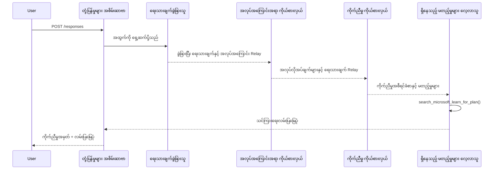

# Module 3 - တိုက်ရိုက်ညွှန်ကြားချက်များ၊ ပတ်ဝန်းကျင် & ဆော့ဝဲ အညွှန်းများ တပ်ဆင်ခြင်း

⏱️ ~15 မိနစ်

ဒီမော်ဂျူးထဲမှာ မင်းအတွက် ဖွဲ့စည်းထားတဲ့ stub ကို ပြောင်းလဲပြီး သင့်ရဲ့ multi-agent workflow ကို ဖန်တီးမှာဖြစ်တယ် - စနစ်ပတ်ဝန်းကျင် အပြောင်းအလဲ ဆက်တင်ခြင်း၊ အေးဂျင့်ညွှန်ကြားချက်များရေးသားခြင်း၊ MCP ကိရိယာထည့်ခြင်း၊ workflow graph ကို ချိတ်ဆက်ခြင်း နှင့် လိုအပ်သောဆော့ဝဲအညွှန်းများကို တပ်ဆင်ခြင်းတို့ဖြစ်ပါတယ်။

> **ရည်ညွှန်းချက်:** ကျိုးကြောင်းဆက်မှုရှိသော အလုပ်လုပ်တဲ့ကုဒ်ကို [`PersonalCareerCopilot/main.py`](../../../../../workshop/lab02-multi-agent/PersonalCareerCopilot/main.py) မှာ တွေ့နိုင်ပါတယ်။ သင့် workflow graph နှင့် prompt blocks ကို တည်ဆောက်စဉ် အညွှန်းအနေဖြင့် အသုံးပြုပါ။

---

## အေးဂျင့်လေးယောက် ဘယ်လိုပေါင်းစည်းထားသလဲ


```mermaid
sequenceDiagram
    participant User
    participant Server as တုံ့ပြန်မှုများ အစိမ်းဆာဗာ
    participant RP as ရေးသားချက်ခွဲခြားသူ
    participant JD as အလုပ်အကြောင်းအရာ ကိုယ်စားလှယ်
    participant MA as ကိုက်ညီမှု ကိုယ်စားလှယ်
    participant GA as ရှိနေသည့် မတည့်မှုများ လေ့လာသူ

    User->>Server: POST /responses
    Server->>RP: အထွက်ကို ရှေ့ဆက်ပို့သည်
    RP-->>JD: ခွဲခြားပြီး ရေးသားချက်နှင့် အလုပ်အကြောင်း Relay
    JD-->>MA: အလုပ်လိုအပ်ချက်များနှင့် ရေးသားချက် Relay
    MA-->>GA: ကိုက်ညီမှုအစီရင်ခံစာနှင့် မတည့်မှုများ
    GA->>GA: search_microsoft_learn_for_plan()
    GA-->>Server: သင်ကြားရေးလမ်းပြမြေပုံ
    Server-->>User: ကိုက်ညီမှုအမှတ် + လမ်းပြမြေပုံ
```

---

## အဆင့် ၁: ပတ်ဝန်းကျင် ပြောင်းလဲမည့်တန်ဖိုးများ စီမံခြင်း

၁။ သင့် project ရဲ့ root ဖိုလ်ဒါအတွင်းရှိ **`.env`** ဖိုင်ကို ဖွင့်ပါ (scaffold wizard မှ ဖန်တီးထားပါတယ်)။
၂။ Lab 01 မှ မတည့်ဘဲထားသော နေရာများကို သုံးစွဲသူရဲ့ တန်ဖိုးများနဲ့ ပြောင်းလဲရေးပါ။

<details open>
<summary><strong>🅰️ လမ်းကြောင်း A - Foundry subscription</strong></summary>

```env
FOUNDRY_PROJECT_ENDPOINT=https://<your-account>.services.ai.azure.com/api/projects/<your-project>
AZURE_AI_MODEL_DEPLOYMENT_NAME=gpt-4.1-mini
```

> **တန်ဖိုးတွေ ဘယ်မှာရှာမလဲ:** [Lab 01, Module 1](../../lab01-single-agent/docs/01-setup.md#deploy-a-model--assign-rbac) ကိုကြည့်ရှုပါ။

</details>

<details open>
<summary><strong>🅱️ လမ်းကြောင်း B - Foundry အိမ်ရှေ့</strong></summary>

```env
FOUNDRY_PROJECT_ENDPOINT=http://localhost:5273/v1
AZURE_AI_MODEL_DEPLOYMENT_NAME=phi-4-mini
```

> မင်းရဲ့ စက်ပေါ်မှာ အခြေခံပြီး inference သွားတဲ့အကုန် - မည်သည့်ဒေတာမျှ မထွက်ဖို့အာမခံပါတယ်။ `foundry model list` ကို အတည်ပြုရန် အသုံးပြုပါ။ MCP tool ကိုတင်ပြောဆိုမယ့် တစ်ခုတည်းသော အပြင်လမ်းမြောက်တောင်းဆိုချက်က `https://learn.microsoft.com/api/mcp` ဖြစ်ပါတယ်။

> **တန်ဖိုးတွေ ဘယ်မှာရှာမလဲ:** [Lab 01, Module 1 - local path](../../lab01-single-agent/docs/01-setup.md#step-2-set-up-based-on-your-access) ကိုကြည့်ပါ။

</details>

> **လုံခြုံရေး:** `.env` ကို version control မှာ ဘယ်အချိန်မှ commit မလုပ်ပါနဲ့။ ဒါက `.gitignore` ထဲမှာတင်ထားရပါပြီ။

---

## အဆင့် ၂: အေးဂျင့်ညွှန်ကြားချက်ရေးသားခြင်း

ညွှန်ကြားချက်တွေက အဲဂျင့်တစ်ခုချင်းစီရဲ့ တာဝန်၊ ထုတ်ပေးမယ့်ပုံစံနဲ့ စည်းမျဉ်းစည်းကမ်းတွေကို သတ်မှတ်ပါတယ်။ `main.py` ဖိုင်ကို ဖွင့်၍ အညွှန်ကြားချက် constants လေးခုကို သတ်မှတ် (သို့မဟုတ် ပြောင်းလဲ) ပြုလုပ်ပါ - လုံးဝဂျာနယ်တည်းရာ strings ကို [`PersonalCareerCopilot/main.py`](../../../../../workshop/lab02-multi-agent/PersonalCareerCopilot/main.py) တွင် တွေ့ရပါမယ်။

### 2.1 `RESUME_PARSER_INSTRUCTIONS`
ရာဇဝင်ကို ဖော်ပြပြီး candidate profile အရည်အချင်းမြှင့်ပြီး ကြော်ငြာလုပ်ငန်းဖော်ပြချက်ကို verbatim အတိုင်း `[JOB DESCRIPTION PASS-THROUGH]`ထဲကူးယူထားပါတယ်။ ၂ ခုစလုံး output ထဲမှာ တွေ့ရဖို့ လိုအပ်သည်။

> **ဘာကြောင့် pass-through လုပ်တာလဲ?** `context_mode="last_agent"` နဲ့ ResumeParser က ပဲ မူလ user message ကို မြင်ရတဲ့ အေးဂျင့်တစ်ခုဖြစ်တယ်။ JD ကူးပြောင်းမထားရင် နောက်ထပ် အေးဂျင့်တွေ မမြင်နိုင်ပါ။

### 2.2 `JOB_DESCRIPTION_INSTRUCTIONS`
ResumeParser output ထဲမှ `[PARSED RESUME]` နှင့် `[JOB DESCRIPTION PASS-THROUGH]` ဖတ်ပြီး `[JD REQUIREMENTS]` (ဖွဲ့စည်းထားတဲ့ လိုအပ်ချက်များ) နဲ့ `[PARSED RESUME PASS-THROUGH]` (MatchingAgent အတွက် resume verbatim copy) ထုတ်ပေးပါတယ်။

### 2.3 `MATCHING_AGENT_INSTRUCTIONS`
`[JD REQUIREMENTS]` နဲ့ `[PARSED RESUME PASS-THROUGH]` ကို ဖတ်သည်။ 0-100 အတွင်း Rating နှင့် ဟိုက်လိုက်တံဆိပ်ရှင်းချကိန်းများ၊ ကျန်သေးတဲ့အတတ်ပညာများ၊ skill များနှင့် အတွေ့အကြုံကို သဘောတူညီမှုပါရှိမှု အစီရင်ခံစာကို ထုတ်ပေးသည်။

### 2.4 `GAP_ANALYZER_INSTRUCTIONS`
အဆိုပါ rating report ကိုဖတ်ပြီး ကျန်သေးသမျှ skill အတွက် `search_microsoft_learn_for_plan` ကို ခေါ်ယူသည်။ Microsoft Learn အရင်းအမြစ်များကို စုစည်းပြီး skill တစ်ခုချင်းစီအတွက် အသေးစိတ် gap card နှင့် တစ်ပတ်ချိန် learning roadmap ကို ဖန်တီးပါသည်။

---

## အဆင့် ၃: MCP ကိရိယာ ထည့်သွင်းခြင်း

GapAnalyzer က [Microsoft Learn MCP server](https://learn.microsoft.com/azure/foundry/agents/how-to/tools/model-context-protocol) ကို ခေါ်ယူကာ ကျန်သေးသည့် skill gap များအတွက် နက်ရှိုင်းသော သင်ယူရေးရင်းမြစ်များ ရယူပါသည်။ `search_microsoft_learn_for_plan` လုပ်ဆောင်ချက်လုံးဝကို [`PersonalCareerCopilot/main.py`](../../../../../workshop/lab02-multi-agent/PersonalCareerCopilot/main.py) မှာ တွေ့နိုင်ပါတယ်။

အေးဂျင့် ဖန်တီးစဉ် GapAnalyzer ပေါ်မှာ ကိရိယာကို မှတ်ပုံတင်ပါ။

```python
gap_analyzer = Agent(
    client=client,
    instructions=GAP_ANALYZER_INSTRUCTIONS,
    name="GapAnalyzer",
    tools=[search_microsoft_learn_for_plan],
)
```

> `FoundryChatClient`, `AgentExecutor` နှင့် `add_edge()` ခေါ်ဆိုမှုများ လုံးဝပါဝင်သည့် `WorkflowBuilder` graph ကို [`PersonalCareerCopilot/main.py`](../../../../../workshop/lab02-multi-agent/PersonalCareerCopilot/main.py) မှာ ကြည့်ရှုနိုင်သည်။

---

## အဆင့် ၄: virtual environment ဖန်တီးပြီး ဆော့ဝဲအညွှန်းများ တပ်ဆင်ခြင်း

> ⚠️ **ဒီအဆင့်ကို မလွဲချော်ပါနဲ့။** ဆော့ဝဲအညွှန်း မတပ်ဆင်ထားရင် F5 debugging မအောင်မြင်ပါ။

### 4.1 virtual environment ဖန်တီးခြင်း

```powershell
python -m venv .venv
```

### 4.2 ဖွင့်ရန်

| OS | Command |
|----|---------|
| **Windows (PowerShell)** | `.\.venv\Scripts\Activate.ps1` |
| **Windows (CMD)** | `.venv\Scripts\activate.bat` |
| **macOS / Linux** | `source .venv/bin/activate` |

Terminal prompt မှာ `(.venv)` ကို မြင်ရမယ်။

### 4.3 ဆော့ဝဲအညွှန်း တပ်ဆင်ခြင်း

```powershell
pip install -r requirements.txt
```

### 4.4 အတည်ပြုခြင်း

```powershell
pip list | Select-String "agent-framework|mcp|debugpy"
```

မျှော်မှန်းချက်: `agent-framework-foundry`, `agent-framework-foundry-hosting`, `mcp`, နှင့် `debugpy` များ ဖော်ပြထားသည်။

---

## အဆင့် ၅: အတည်ပြုခြင်း စစ်ဆေးခြင်း

<details open>
<summary><strong>🅰️ လမ်းကြောင်း A - Azure အတည်ပြုချက်</strong></summary>

```powershell
az account show --query "{name:name, id:id}" --output table
```

မအောင်မြင်ရင် [`az login`](https://learn.microsoft.com/cli/azure/authenticate-azure-cli-interactively) ကို 실행ပါ။

အေးဂျင့်လေးလုံးက `FoundryChatClient` တစ်ခုနဲ့ `DefaultAzureCredential` တစ်ခုတည်းကိုမျှဝေပါတယ်။ တစ်ခုအောင်မြင်ရင် အားလုံး အောင်မြင်သွားပါတယ်။

</details>

<details open>
<summary><strong>🅱️ လမ်းကြောင်း B - Foundry အိမ်ရှေ့</strong></summary>

ဒေသတွင်း စမ်းသပ်မှုအတွက် အတည်ပြုချက် မလိုအပ်ပါ။

</details>

---

### ✅ စစ်ဆေးခြင်း အချက်အလက်

> Module 04 ကို ဆက်ပြောရန် မဖြစ်မနေရပါ: **(1)** `(.venv)` ကို prompt မှာ မြင်ရပြီး **(2)** `pip install -r requirements.txt` အောင်မြင်စွာ ပြီးမြောက်သည်။

- [ ] `.env` ထဲမှာ မှန်ကန်သော endpoint နဲ့ model deployment နာမည်ရှိ (placeholder မဟုတ်)
- [ ] အေးဂျင့် ၄ ဦးရဲ့ instruction constants အားလုံးကို `main.py` မှာ သတ်မှတ်ထားသည် (ResumeParser, JD Agent, MatchingAgent, GapAnalyzer)
- [ ] `search_microsoft_learn_for_plan` MCP ကိရိယာ သတ်မှတ်ပြီး GapAnalyzer မှာ မှတ်ပုံတင်ထားသည်
- [ ] `FoundryChatClient` + 4 `Agent` + 4 `AgentExecutor` objects `main()` မှာ ဖန်တီးထားသည်
- [ ] `WorkflowBuilder` က 3 ခုသော `add_edge()` ခေါ်စာများနှင့် ပြည့်စုံတဲ့ အချိုးအစား graph ကို တည်ဆောက်ထားသည်
- [ ] Virtual environment ဖန်တီးပြီး ဖွင့်ထားသည် (`(.venv)` မြင်နေရသည်)
- [ ] `pip install -r requirements.txt` အမှားမရှိပါဘဲ ရွေးစရာပြီးစီးသည်
- [ ] **လမ်းကြောင်း A:** `az account show` အောင်မြင်ခြင်း သို့မဟုတ် VS Code Accounts ပုံတွင် အသုံးပြုသူအကောင့် သက်သေပြခြင်း

---

**ရှေ့ပြေး:** [02 - Scaffold Multi-Agent Project](02-scaffold-multi-agent.md) · **နောက်တစ်ခု:** [04 - Orchestration Patterns →](04-orchestration-patterns.md)

---

<!-- CO-OP TRANSLATOR DISCLAIMER START -->
**ပြောကြားချက်**
ဤစာတမ်းကို AI ဘာသာပြန်ဝန်ဆောင်မှု [Co-op Translator](https://github.com/Azure/co-op-translator) အသုံးပြု၍ ဘာသာပြန်ထားပါသည်။ ကျွန်ုပ်တို့သည် တိကျမှန်ကန်မှုအတွက် ကြိုးပမ်းနေသော်လည်း၊ စက်ကိရိယာဘာသာပြန်ခြင်းများတွင် အမှားများ သို့မဟုတ် မှားယွင်းချက်များ ပါဝင်နိုင်ကြောင်း သတိပြုပါရန် လိုအပ်ပါသည်။ မူလစာတမ်းကို မူရင်းဘာသာဖြင့်သာ ယုံကြည်စိတ်ချရသော အချက်အလက်အဖြစ် သတ်မှတ်သင့်သည်။ အရေးကြီးသည့် သတင်းအချက်အလက်များအတွက် ပရော်ဖက်ရှင်နယ် လူသားဘာသာပြန်သူဝန်ဆောင်မှုကို အကြံပြုပါသည်။ ဤဘာသာပြန်ချက်ကို အသုံးပြုခြင်းမှ ဖြစ်ပေါ်လာသော နားလည်မှုကွာခြားမှုများ သို့မဟုတ် မမှန်ကန်သော အသုံးပြုမှုများအတွက် ကျွန်ုပ်တို့ တာဝန်မခံပါ။
<!-- CO-OP TRANSLATOR DISCLAIMER END -->