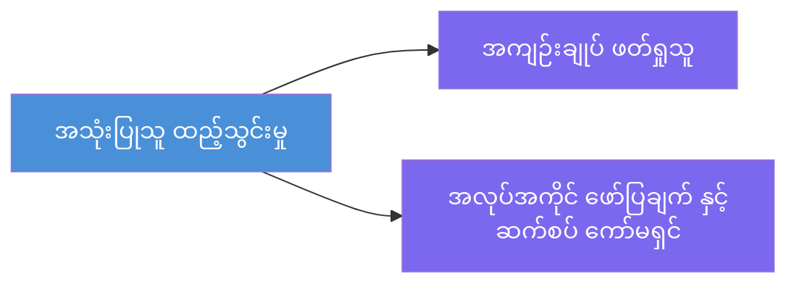
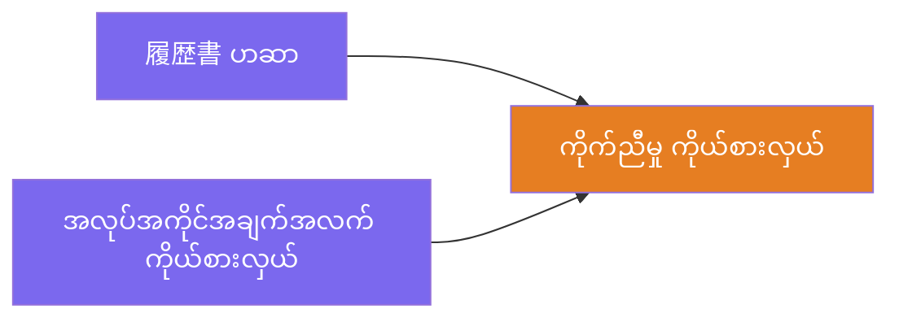
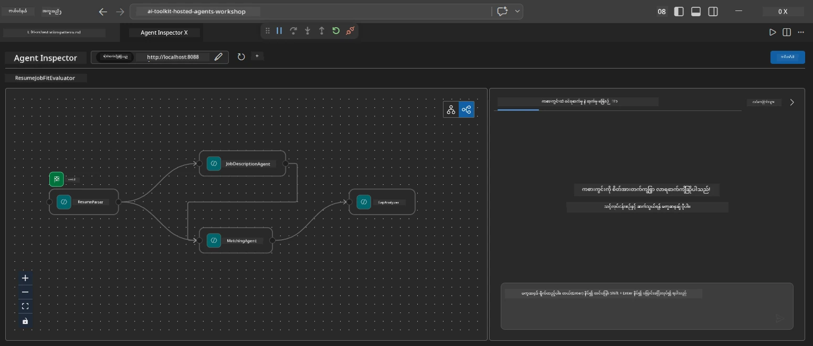
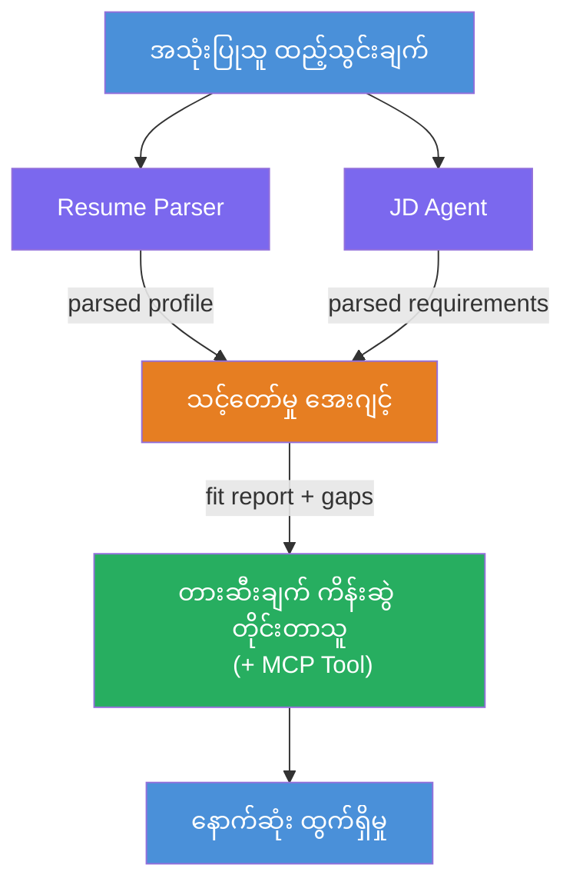
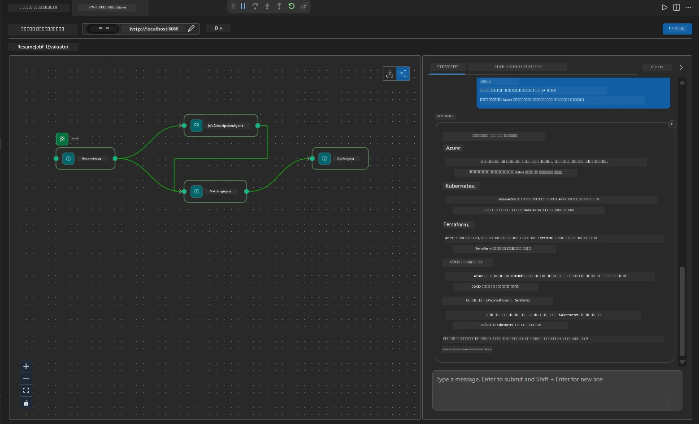

# Module 4 - အော်ကက်စထရေးရှင်း ပုံစံများ

ဤမော်ဂျူးတွင် သင်သည် Resume Job Fit Evaluator တွင် အသုံးပြုသော အော်ကက်စထရေးရှင်း ပုံစံများကို ရှာဖွေပြီး workflow graph ကို အထက်ပါပုံစံများအတိုင်း ဖတ်ရှု၊ ပြင်ဆင်၊နှင့် တိုးချဲ့နည်းကို လေ့လာရမည် ဖြစ်ပါသည်။ ဤပုံစံများကို နားလည်ခြင်းမှာ ဒေတာလည်ပတ်မှု ပြဿနာများ ကို ဖြေရှင်းရန် နှင့် သင်၏ မဟာဗျူဟာ multi-agent workflows များတည်ဆောက်ရန် အလွန်အရေးကြီးပါသည်။

---

## ပုံစံ ၁ - Fan-out (တန်းတူခွဲခြားမှု)

Workflow ၏ ပထမပုံစံမှာ **fan-out** ဖြစ်ပြီး၊ တစ်ခုသော input ကို agent အများစုသို့ တပြိုင်နက်ပို့ပေးသည်။


ကုဒ်အတွင်း၊ `resume_parser` သည် `start_executor` ဖြစ်သောကြောင့် ပထမဆုံး user message ကို လက်ခံသည်။ ထို့နောက်၊ `jd_agent` နှင့် `matching_agent` နှစ်ခုလုံးမှာ `resume_parser` မှတဆင့် ချိတ်ဆက်ချက်ရှိသောကြောင့်၊ framework သည် `resume_parser` ၏ output ကို နှစ်ခုလုံးသို့ ပို့ပေးသည်။

```python
.add_edge(resume_parser, jd_agent)         # ResumeParser ထုတ်လွှင့်ချက် → JD Agent
.add_edge(resume_parser, matching_agent)   # ResumeParser ထုတ်လွှင့်ချက် → MatchingAgent
```

**ဤအကြောင်းရင်း:** ResumeParser နှင့် JD Agent တွင် တူညီသော input ၏ ကွဲပြားချက်များကို ကိုင်တွယ်တယ်။ ထိုတန်းတူပြေးဆွဲမှုကြောင့် ထိရောက်ရှိရှိ မြန်နှုန်း ကျဆင်းမှု လျှော့နည်းသည်။

### fan-out ကို အသုံးပြုရန် အချိန်

| အသုံးပြုမှု | ဥပမာ |
|----------|---------|
| လွတ်လပ်သော subtasks | Resume ကို ကောက်နှုတ်ခြင်းနှင့် JD ကို ကောက်နှုတ်ခြင်း |
| ကူးယူ redundency / ဆန္ဒချက် | Agent နှစ်ယောက်သည် တူညီသောဒေတာကို စိစစ်ပြီး တတိယ agent သည် အကောင်းဆုံးဖြေရှင်းချက်ကို ရွေးချယ်သည် |
| မျိုးစုံ output | Agent တစ်ယောက်သည် စာသားထုတ်လုပ်ပြီး၊ အခြား agent သည် ဖွဲ့စည်းထားသော JSON ထုတ်လုပ်သည် |

---

## ပုံစံ ၂ - Fan-in (စုစုပေါင်း)

ဒုတိယပုံစံသည် **fan-in** ဖြစ်ပြီး၊ agent output များကို တစ်ခုတည်း downstream agent သို့ စုစည်းပေးသည်။


ကုဒ်အတွင်း:

```python
.add_edge(resume_parser, matching_agent)   # ResumeParser အထွက် → MatchingAgent
.add_edge(jd_agent, matching_agent)        # JD Agent အထွက် → MatchingAgent
```

**အဓိကအပြုအမှု:** Agent တစ်ခုတွင် **နည်းနည်းသည် နှစ်ခုနှင့်အထက်သော ဝင်ရိုးများ (incoming edges)** ရှိပါက framework သည် အော်တိုမက်တစ်ခါလ် upstream agent များအားလုံး ပြီးစီးလိုက်မှ downstream agent ကို စတင်စေသည်။ MatchingAgent သည် ResumeParser နှင့် JD Agent နှစ်ခုလုံး ပြီးဆုံးမှစတင်သည်။

### MatchingAgent ရရှိသော အရာ

Framework သည် upstream agent များ၏ output များအားလုံးကို တွဲဆက်ပေးသည်။ MatchingAgent ၏ input ကို အောက်ပါအတိုင်း မြင်နိုင်သည်-

```
[ResumeParser output]
---
Candidate Profile:
  Name: Jane Doe
  Technical Skills: Python, Azure, Kubernetes, ...
  ...

[JobDescriptionAgent output]
---
Role Overview: Senior Cloud Engineer
Required Skills: Python, Azure, Terraform, ...
...
```

> **မှတ်ချက်:** သေချာခြင်း format သည် framework ဗားရှင်းပေါ်မူတည်သည်။ agent ၏ညွှန်ကြားချက်များကို ဖွဲ့စည်းဖြတ်ထားသော လုပ်ဆောင်ချက် များနှင့် မဖွဲ့စည်းထားသော output များနှစ်မျိုးစလုံးကို ကိုင်တွယ်နိုင်ရန် ရေးသားထားရန်လိုသည်။



---

## ပုံစံ ၃ - သရေတွက်နောက်တန်းချိတ်ဆက်မှု

တတိယပုံစံမှာ **နောက်တန်းအစဉ်လိုက်ချိတ်ဆက်မှု (sequential chaining)** ဖြစ်ပြီး၊ agent တစ်ခု၏ output ကို တိုက်ရိုက်နောက်ထပ် agent ကို ပို့သည်။


ကုဒ်အတွင်း:

```python
.add_edge(matching_agent, gap_analyzer)    # MatchingAgent အထွက် → GapAnalyzer
```

ဤပုံစံသည် ရိုးရှင်းဆုံးဖြစ်သည်။ GapAnalyzer သည် MatchingAgent ၏ fit rating၊ ကိုက်ညီမှု/မရှိသော ကျွမ်းကျင်မှုများနှင့် gap များကို လက်ခံပြီး၊ အနာဂတ် MCP tool ကို တစ်ခုချင်းစီသော gap များအတွက် ပြေးဆွဲကာ Microsoft Learn အသုံးအဆောင်များ ဖော်ထုတ်ပါသည်။

---

## အပြည့်အစုံ graph

သုံးခုပုံစံလုံးစုံကို ပေါင်းစပ်သော workflow ဖွဲ့စည်းမှု-


### အလုပ်ဆောင်သည့် အချိန်ဇယား

```mermaid
gantt
    title ကိုယ်စားလှယ် အကောင်အထည်ဖော်ချိန်ဇယား
    dateFormat X
    axisFormat %s

    section အပြင်အဆင်
    Resume Parser       :rp, 0, 3
    JD Agent            :jd, 0, 2

    section အဆက်မပြတ်
    Matching Agent      :ma, 3, 5
    Gap Analyzer        :ga, 5, 9
```


> စုစုပေါင်း ကာလသည် `max(ResumeParser, JD Agent) + MatchingAgent + GapAnalyzer` ခန့်မှန်းနိုင်သည်။ GapAnalyzer သည် MCP tool ကို များစွာခေါ်ဆောင်သောကြောင့် (တစ်ခုချင်းစီ gap အတွက်) အမြန်ဆုံးမဟုတ်ပါ။

---

## WorkflowBuilder ကိုဖြတ်သန်းဖတ်ရှုခြင်း

`main.py` မှ အပြည့်အစုံ `create_workflow()` function ကို အောက်ပါအတိုင်း မှတ်ချက်များထည့်ထားသည်-

```python
def create_workflow(resume_parser, jd_agent, matching_agent, gap_analyzer):
    workflow = (
        WorkflowBuilder(
            name="ResumeJobFitEvaluator",

            # အသုံးပြုသူ၏ ကိုးကားချက်ကို ပထမဆုံး လက်ခံသော အေးဂျင့်
            start_executor=resume_parser,

            # ထွက်ရှိမှုသည် နောက်ဆုံးဖြေရှင်းချက်ဖြစ်သော အေးဂျင့်(များ)
            output_executors=[gap_analyzer],
        )
        # ခွဲနှင့်ဖြန့်ခြင်း: ResumeParser ထွက်ကုန်သည် JD Agent နှင့် MatchingAgent နှစ်ခုလုံးသို့ သွားပေးသည်
        .add_edge(resume_parser, jd_agent)
        .add_edge(resume_parser, matching_agent)

        # ချိတ်ဆက်ခြင်း: MatchingAgent သည် ResumeParser နှင့် JD Agent နှစ်ခုလုံးကို စောင့်နေရသည်
        .add_edge(jd_agent, matching_agent)

        # တန်းစီမှု: MatchingAgent ထွက်ကုန်သည် GapAnalyzer သို့ ထည့်ပေးသည်
        .add_edge(matching_agent, gap_analyzer)

        .build()
    )
    return workflow.as_agent()
```

### Edge အကျဉ်းချုပ်ဇယား

| # | Edge | ပုံစံ | အကျိုးသက်ရောက်မှု |
|---|------|---------|--------|
| 1 | `resume_parser → jd_agent` | Fan-out | JD Agent သည် ResumeParser ၏ output (နဲ့ မူလ user input) ကို လက်ခံသည် |
| 2 | `resume_parser → matching_agent` | Fan-out | MatchingAgent သည် ResumeParser ၏ output ကို လက်ခံသည် |
| 3 | `jd_agent → matching_agent` | Fan-in | MatchingAgent သည် JD Agent ၏ output ကိုလည်း လက်ခံသည် (နှစ်ခုလုံး ပြီးမှုအထိ စောင့်ဆိုင်း) |
| 4 | `matching_agent → gap_analyzer` | Sequential | GapAnalyzer သည် fit report နှင့် gap အချက်အလက်များ လက်ခံသည် |

---

## Graph ပြောင်းလဲခြင်း

### Agent အသစ်ထည့်သွင်းခြင်း

ပဋိညာဉ်ခွဲခြားမှုအတွက် gap analysis အပေါ် အခြေခံပြီး မေးခွန်းများထုတ်လုပ်သည့် **InterviewPrepAgent** ဆိုသည့် agent အသစ်ထည့်မည်ဆိုလျှင်-

```python
# ၁။ ညွှန်ကြားချက်များသတ်မှတ်ပါ
INTERVIEW_PREP_INSTRUCTIONS = """\
You are the Interview Prep Agent.
Given a gap analysis and fit report, generate 10 targeted interview questions
the candidate should prepare for.
"""

# ၂။ အေးဂျင့်ကို ဖန်တီးပါ (async with block အတွင်း)
AzureAIAgentClient(
    project_endpoint=PROJECT_ENDPOINT,
    model_deployment_name=MODEL_DEPLOYMENT_NAME,
    credential=credential,
).as_agent(
    name="InterviewPrepAgent",
    instructions=INTERVIEW_PREP_INSTRUCTIONS,
) as interview_prep,

# ၃။ create_workflow() တွင် ချိတ်ဆက်ချက်များထည့်ပါ
.add_edge(matching_agent, interview_prep)   # fit report ကို လက်ခံသည်
.add_edge(gap_analyzer, interview_prep)     # gap ကတ်များကိုလည်း လက်ခံသည်

# ၄။ output_executors ကို 갱신ပါ
output_executors=[interview_prep],  # ယခု နောက်ဆုံးအေးဂျင့်ဖြစ်သည်
```

### အလုပ်ဆောင်မှု အစဉ်လိုက်တိုးပွားမှု ပြောင်းလဲခြင်း

JD Agent ကို ResumeParser ၏နောက်တွင်သာ လည်ပတ်စေလိုလျှင် (တန်းတူမဟုတ်ဘဲ နောက်တန်းစဉ်လိုက်ဖြစ်အောင်):

```python
# ဖျက်ပါ: .add_edge(resume_parser, jd_agent)  ← ရှိပြီးသားဖြစ်သောကြောင့် ထားပါ
# jd_agent ကို အသုံးပြုသူအချက်အလက်ကို တိုက်ရိုက် လက်ခံမရရှိစေခြင်းဖြင့် အဓိပ္ပာယ်ရှိသော 병렬နှင့် ဆက်သွယ်မှုကို ဖယ်ရှားပါ
# start_executor သည် ရှေ့ဆုံး resume_parser သို့ပို့ပြီး၊ jd_agent သည်သာလျှင်
# resume_parser ၏ output ကို edge မှတစ်ဆင့် လက်ခံသည်။ ၎င်းတို့အား စဉ်လိုက်စနစ်ဖြင့် ဖြစ်စေသည်။
```

> **အရေးကြီးချက်:** `start_executor` သည် မူလ raw user input ကို လက်ခံသော唯一 agent ဖြစ်သည်။ အခြား agent များသည် upstream edge များထံမှ output ကိုသာ လက်ခံသည်။ agent တစ်ခုသည် raw user input ကိုလည်း လက်ခံရန် ဆိုပါက၊ `start_executor` မှ edge တစ်ခု ရှိရမည်။

---

## ရှေ့ဆက်ရေး graph မှားယွင်းချက်များ

| မှားယွင်းချက် | အချို့လက္ခဏာများ | ဖြေရှင်းနည်း |
|---------|---------|-----|
| `output_executors` သို့ edge မရှိခြင်း | Agent လည်ပတ်သော် output ကွက်လပ် | `start_executor` မှ output_executors အတွက် agent တစ်ဦးချင်းစီသို့ လမ်းကြောင်းရှိရန် သေချာစေပါ |
| စက်ဝိုင်းဆက်စပ်မှု (Circular dependency) | ကန့်သတ်မဲ့ loop သို့မဟုတ် တိုက်တွန်းမှုပြတ်တောက်ခြင်း | Agent တစ်ခုသည် upstream agent အထပ်က Agent ကို ပြန်ပေးစားခြင်း မရှိစေရန် စစ်ဆေးပါ |
| `output_executors` ထဲတွင် ဝင်ရိုးမရှိသော agent | output အလွတ် | `add_edge(source, that_agent)`  အနည်းဆုံး တစ်ခု ထည့်ပါ |
| fan-in မဖြစ်သော `output_executors` များ များ | Output တွင် agent response တစ်ခုသာ ပါဝင်သည် | ယခင်တစ်ခုတည်း output agent များကိုအသုံးပြုရန် (စုစည်းသော) သို့မဟုတ် output များအများအပြားကို လက်ခံရန် |
| `start_executor` မပြုလုပ်ခြင်း | ထပ်တူတန်ဖိုးပြဿနာ (ValueError) ဖြစ်ပေါ်ခြင်း | `WorkflowBuilder()` တွင် `start_executor` ကို အမြဲသတ်မှတ်ပါ |

---

## Graph အမှားရှာဖွေရေး

### Agent Inspector ကို အသုံးပြုခြင်း

1. Agent ကို ဒေသခံတွင် စတင်ပါ (F5 သို့ terminal မှ - [Module 5](05-test-locally.md) ကို ကြည့်ပါ)။
2. Agent Inspector ကို ဖွင့်ပါ (`Ctrl+Shift+P` → **Foundry Toolkit: Open Agent Inspector**)။
3. စမ်းသပ်မက်ဆေ့ချ်တစ်ခု ပို့ပါ။
4. Inspector ၏ အဖြေ panel တွင် **streaming output** ကို ရှာဖွေပါ-  agent တစ်ဦးချင်း ထောက်ပံ့ချက် နှင့် အစဉ်အဆက်ကို ပြသည်။



### logging ကို အသုံးပြုခြင်း

main.py တွင် logging ထည့်၍ ဒေတာစီးဆင်းမှုကို စနစ်တကျ နိုင်ငံ့လိုက်နာလမ်းကြောင်းချခြင်း-

```python
import logging
logger = logging.getLogger("resume-job-fit")

# create_workflow() ထဲမှာ၊ ဖန်တီးပြီးနောက်တွင်။
logger.info("Workflow graph built with edges: RP→JD, RP→MA, JD→MA, MA→GA")
```

Server logs တွင် agent အလုပ်ဆောင်မှု စဉ်လိုက်နှင့် MCP tool ခေါ်ဆိုမှုများကို ပြသသည်-

```
INFO:resume-job-fit:Starting Resume -> Job Fit Evaluator HTTP server...
INFO:resume-job-fit:Server running on http://localhost:8088
INFO:agent_framework:Executing agent: ResumeParser
INFO:agent_framework:Executing agent: JobDescriptionAgent
INFO:agent_framework:Waiting for upstream agents: ResumeParser, JobDescriptionAgent
INFO:agent_framework:Executing agent: MatchingAgent
INFO:agent_framework:Executing agent: GapAnalyzer
INFO:agent_framework:Tool call: search_microsoft_learn_for_plan(skill="Kubernetes")
POST https://learn.microsoft.com/api/mcp → 200
INFO:agent_framework:Tool call: search_microsoft_learn_for_plan(skill="Terraform")
POST https://learn.microsoft.com/api/mcp → 200
```

---

### စစ်ဆေးချက်

- [ ] workflow အတွင်းရှိ အော်ကက်စထရေးရှင်း ပုံစံ ၃မျိုး- fan-out, fan-in, နှင့် sequential chain- များကို ဖော်ထွက်နိုင်သည်။
- [ ] ဝင်ရိုးစုံရှိသော agent များသည် upstream agent များ ပြီးစီးရန် စောင့်ဆိုင်းကြောင်း နားလည်သည်။
- [ ] WorkflowBuilder ကုဒ်ဖတ်ရှုနိုင်ပြီး add_edge() အား visual graph နှင့် တွဲညှိပြနိုင်သည်။
- [ ] အလုပ်ဆောင်အချိန်ဇယားအား နားလည်သည်- parallel agent များ အရင် run, ထို့နောက် aggregation, အပြီး sequential
- [ ] graph တွင် agent အသစ် ထည့်သွင်းနည်းကို သိရှိသည် (ညွှန်ကြားချက်မှတ်သားခြင်း, agent ဖန်တီးခြင်း, edge များထည့်ခြင်း, output ကို အသစ်လုပ်ခြင်း)
- [ ] graph မှားယွင်းချက်များနှင့် ၎င်း၏လက္ခဏာများကို သတိပြုနိုင်သည်။

---

**ယခင်:** [03 - Configure Agents & Environment](03-configure-agents.md) · **နောက်တည့်:** [05 - Test Locally →](05-test-locally.md)

---

<!-- CO-OP TRANSLATOR DISCLAIMER START -->
**ခြိမ်းခြောက်ချက်**:  
ဤစာတမ်းကို AI အပြန်အလှန် ဘာသာပြန်ဝန်ဆောင်မှုဖြစ်သော [Co-op Translator](https://github.com/Azure/co-op-translator) ကို အသုံးပြု၍ ဘာသာပြန်ထားပါသည်။ တိကျမှန်ကန်မှုအတွက် ကြိုးစားကြပါသော်လည်း အော်တိုမက်တစ်ဘာသာပြန်မှုသည် အမှားအယွင်းများ သို့မဟုတ် မှန်ကန်မှု လျော့ပါးသည့်နေရာများရှိနိုင်ပါသည်။ မူလစာတမ်းကို မူရင်းဘာသာစကားဖြင့်သာ အတည်ပြုရမည့် အရင်းခံစာရွက်လက်ခံပါ။ အရေးကြီးသော အချက်အလက်များအတွက် မူပိုင်သူ လူသား အတည်ပြုဘာသာပြန်မှုကို အကြံပြုပါသည်။ ဤဘာသာပြန်မှုမှ ဖြစ်ပေါ်လာမည့် နားလည်မှုမှားယွင်းမှုများအတွက် ကျွန်ုပ်တို့မှာ တာဝန်မရှိပါ။
<!-- CO-OP TRANSLATOR DISCLAIMER END -->