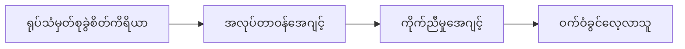
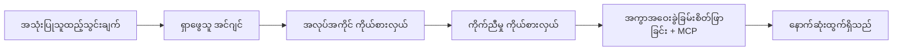

# မော်ဂျူး ၄ - စုပေါင်း pattern များ

⏱️ ~၁၀ မိနစ်

ဒီမော်ဂျူးမှာတော့ Resume Job Fit Evaluator မှ အသုံးပြုထားတဲ့ စုပေါင်း pattern များကို ရှာဖွေကြည့်ရှုလေ့လာပြီး workflow graph ကို ဘယ်လိုဖတ်ရမယ်၊ ပြင်ဆင်ရမယ်၊ နှင့် တိုးချဲ့ရမယ် ဆိုတာကို သင်ယူပါမယ်။ ဒီ pattern များကိုနားလည်ခြင်းသည် ဒေတာလည်ပတ်မှု ပြဿနာများကို ရှာဖွေရှင်းလင်းရာတွင်နားလည်မှုကောင်းစေရန်၊ သင့်ရဲ့ကိုယ်ပိုင် [multi-agent workflows](https://learn.microsoft.com/agent-framework/workflows/) များကို ဖန်တီးရာတွင် အဓိကဖြစ်ပါသည်။

---

## Pattern ၁: အဆင့်လိုက် ဆက်စပ်မှု(Sequential chain)

workflow မှာ အခြေခံ pattern ကတော့ **အဆင့်လိုက် ဆက်စပ်မှု** ဖြစ်ပြီး၊ agent တစ်ခုရဲ့ output သည် နောက်တစ်ခုကို တိုက်ရိုက် ထည့်သွင်းပေးသည်။


```mermaid
flowchart LR
    RP[ရုပ်သံမှတ်စုခွဲစိတ်ကိရိယာ] --> JD[အလုပ်တာဝန်အေဂျင့်]
    JD --> MA[ကိုက်ညီမှုအေဂျင့်]
    MA --> GA[ဝက်ဝံခွင်လေ့လာသူ]
```

ကုဒ်အရ `add_edge()` နေရာတိုင်းက ဒီ ဆက်စပ်မှုလမ်းကြောင်းတစ်ခုကို ဖန်တီးပေးနေပါတယ်။

```python
.add_edge(resume_executor, jd_executor)       # ResumeParser ရလဒ် → JD Agent
.add_edge(jd_executor, matching_executor)     # JD Agent ရလဒ် → MatchingAgent
.add_edge(matching_executor, gap_executor)    # MatchingAgent ရလဒ် → GapAnalyzer
```

> **ဘာကြောင့်အဆင့်လိုက်ဆိုပြီး fan-out/fan-in မဟုတ်တာလဲ?** `WorkflowBuilder` သည် စတင်လေ့လာသည့်ခြယ်လှယ်မှုအတွက် **OR-semantics** ကို သုံးပါတယ်။ downstream executor သည် မည်သည့် သဘောတူသူတစ်ယောက်ပြီးဆုံးသွားတာမှ စတင်လုပ်ဆောင်ပါသည်။ `matching_executor` ဟာ `resume_executor` နဲ့ `jd_executor` ကနေ ၂ ခု အဝင်ရောက်နေခဲ့ရင်၊ ResumeParser နောက် JD Agent ပြီးဆုံးတယ်ဆိုပြီး နှစ်ကြိမ် တက်ကြွမှာဖြစ်ပါတယ်။ ဒီလိုရင် GapAnalyzer နှစ်ကြိမ်တက်ပြီး output နှစ်ကြိမ် ရွေ့တွေ့မယ်။ အဆင့်လိုက် pipe line က ဒီပြဿနာတွေကို ရှောင်ရှားပေးပါတယ်။

## Pattern ၂: အကြောင်းအရာ လက်ခံပို့ဆောင်မှု(Content Relay)

`context_mode="last_agent"` ဆိုတာက executor တစ်နေ့ချင်းသာ သူ့နောက်မှသာမန် အစီအစဉ်ရဲ့ output ကို ထည့်သွင်းကြည့်ရှုနိုင်တယ်နဲ့ဆိုလိုတာဖြစ်တဲ့အတွက်၊ အဆင့်လိုက် လမ်းကြောင်းထဲက agent တွေဟာ downstream agent တွေလိုချင်တဲ့ data ကို စဉ်ဆက်မှာ သေချာ လှမ်းထုတ်ပေးရပါမယ်။

ဒီ workflow မှာ:
- **ResumeParser** က JD ကို တစ်ခြားမပြောဘဲ `[JOB DESCRIPTION PASS-THROUGH]` မှာ ထည့်သွင်းပါတယ် (ဒါနဲ့ JD Agent က ရှာနိုင်ပါတယ်)။
- **JD Agent** က `[PARSED RESUME]` ကို တစ်ခြားမပြောဘဲ `[PARSED RESUME PASS-THROUGH]` မှာ ထည့်သွင်းပါတယ် (ဒါနဲ့ MatchingAgent က နှိုင်းယှဉ်နိုင်ပါတယ်)။

```
ResumeParser output
└─ [PARSED RESUME]               ← extracted by JD Agent
└─ [JOB DESCRIPTION PASS-THROUGH] ← extracted by JD Agent

JD Agent output
└─ [JD REQUIREMENTS]             ← extracted by MatchingAgent
└─ [PARSED RESUME PASS-THROUGH]  ← extracted by MatchingAgent
```

relay အပိုင်းတိုင်းကို **တိတိကျကျ** မိမိတွင် ထပ်မံတင်ပေးရမည်၊ ဇယားအဓိပ္ပါယ်သုံးသပ်သော်လည်း downstream agent အတွက် မလုပ်နိုင်ပါ။

---

## စုစုံ workflow graph

အဆင့်လိုက် ဆက်စပ်မှုနဲ့ အကြောင်းအရာ relay pattern တို့ကို ပေါင်းစပ်သုံးစွဲတာဖြစ်ပါတယ်။


```mermaid
flowchart LR
    U[အသုံးပြုသူထည့်သွင်းချက်] --> RP[ရှာဖွေသူ အင်ဂျင်]
    RP --> JD[အလုပ်အကိုင် ကိုယ်စားလှယ်]
    JD --> MA[ကိုက်ညီမှု ကိုယ်စားလှယ်]
    MA --> GA[အကွာအဝေးခွဲခြမ်းစိတ်ဖြာခြင်း + MCP]
    GA --> O[နောက်ဆုံးထွက်ရှိသည်]
```

Agent Inspector က agent ကို လိုကယ် ဆော့သောအချိန်မှာ ဒီလို အစီအစဉ် အစွမ်းထက် graph ပုံစံကို ပြသပေးပါသည်။ [Module 5 - Test Locally](05-test-locally.md) မှား screenshot တွေအတွက် ရည်ညွှန်းပါ။

---

## WorkflowBuilder ကုဒ် ဖတ်ခြင်း

အပြည့်အစုံ `create_workflow()` function က [`PersonalCareerCopilot/main.py`](../../../../../workshop/lab02-multi-agent/PersonalCareerCopilot/main.py) မှာ ရှိပြီး `add_edge()` နောက်ဆုံးသုံးချက်နဲ့ အဆင့်လိုက် pipeline တည်ဆောက်ထားသည်။

| # | Edge | အသက်ဝင်မှု |
|---|------|--------|
| 1 | `resume_executor → jd_executor` | JD Agent အနေနဲ့ `[PARSED RESUME]` + `[JOB DESCRIPTION PASS-THROUGH]` ကို လက်ခံသည် |
| 2 | `jd_executor → matching_executor` | MatchingAgent အနေနဲ့ `[JD REQUIREMENTS]` + `[PARSED RESUME PASS-THROUGH]` ကို လက်ခံသည် |
| 3 | `matching_executor → gap_executor` | GapAnalyzer အနေနဲ့ fit report + gap list ကို လက်ခံသည် |

---

## graph ကို ပြင်ဆင်ခြင်း

### Agent အသစ် ထည့်သွင်းခြင်း

GapAnalyzer ပြီးရင် ဥပမာ၊ **InterviewPrepAgent** တစ်ခု ထည့်မယ့်အခါမှာ:

၁။ `INTERVIEW_PREP_INSTRUCTIONS` အတည်ပြုချက်ကို ရေးဆွဲပါ။
၂။ `Agent` + `AgentExecutor` object တွေ ဖန်တီးပါ (လက်ရှိ ၄ ခုနဲ့ တူညီတဲ့ pattern)။
၃။ `WorkflowBuilder` ထဲမှာ `.add_edge(gap_executor, interview_exec)` ထည့်ပါ။
၄။ `output_executors=[interview_exec]` ကို အပ်ဒိတ်လုပ်ပါ။

> **အရေးကြီးချက်:** `start_executor` သာ အသုံးပြုသူရဲ့ ပထမဦးဆုံး input ကို လက်ခံတဲ့ agent ဖြစ်တဲ့အတွက်၊ အခြား agent အားလုံးက upstream edge ကနေ output ကိုလက်ခံပါတယ်။

---

## စုပေါင်း graph မှားယွင်းချက်များ

| မှားယွင်းချက် | လက္ခဏာ | ဖြေရှင်းနည်း |
|---------|---------|-----|
| `output_executors` ထံသို့ edge ပျောက် | Agent လုပ်ဆောင်မှုရှိသော် output ဗလာ | `start_executor` ကနေ `output_executors` ရဲ့ agent တစ်ခုချင်းစီထိ လမ်းကြောင်း ရှိစေရန် စစ်ဆေးပါ |
| ဆက်စပ်မှု လမ်းကြောင်း စက်ဝိုင်း | အကန့်အသတ် ကွင်းကျော် မည်သို့မဟုတ် အချိန်ကုန် | agent တစ်ခုက upstream agent ကို နောက်ပြန် မဝင်ရောက်အောင် စစ်ဆေးပါ |
| `output_executors` မှာ agent တစ်ခုရှိသော် နောက်ထပ် edge မရှိ | output ဗလာ | အနည်းဆုံး `add_edge(source, that_agent)` တစ်ခု ထည့်ပါ |
| fan-in မထောက်ပံ့တဲ့ အမျိုးမျိုး output_executors များ | output မှာ agent တစ်ခုရဲ့ လှုပ်ရှားမှုတစ်ခုသာ ပါရှိ | aggregation လုပ်တဲ့ output agent တစ်ခု သုံးပါ၊ ဒါမှမဟုတ် output များအတော်များများ လက်ခံပါ |
| `start_executor` မထည့်ထားခြင်း | build အချိန်မှာ `ValueError` ဖြစ် | `WorkflowBuilder()` ထဲမှာ `start_executor` ကို အမြဲပြောပါ |

---

## graph ကို debugging လုပ်ခြင်း

### Agent Inspector ကိုအသုံးပြုခြင်း

၁။ Agent ကို ကိုယ်ပိုင်စက်မှာ F5 နှိပ်ပြီး စတင်ပါ။
၂။ Agent Inspector ကိုဖွင့်ပါ (`Ctrl+Shift+P` → **Foundry Toolkit: Open Agent Inspector**)။
၃။ စစ်ဆေးမှု message တစ်ခု ပို့ပါ။
၄။ Inspector ရဲ့ response panel မှာ **streaming output** ကို ကြည့်ရှုပါ - agent တစ်ခုချင်းဆီရဲ့ အထောက်အကူဖြစ်မှုကို အဆင့်လိုက် ပြသပါသည်။


### logging ကို အသုံးပြုခြင်း

data flow ကို ခြေရာခံဖို့ `main.py` မှာ logging ထည့်ပါ။

```python
import logging
logger = logging.getLogger("resume-job-fit")

# main() တွင်၊ workflow ကို တည်ဆောက်ပြီးနောက်။
logger.info("Workflow graph built with edges: RP→JD, JD→MA, MA→GA")
```

server logs တွေက agent ပြုလုပ်အဆင့်နဲ့ MCP tool call တွေကို ပြသပေးပါတယ်။

```
INFO:agent_framework:Executing agent: ResumeParser
INFO:agent_framework:Executing agent: JobDescriptionAgent
INFO:agent_framework:Executing agent: MatchingAgent
INFO:agent_framework:Executing agent: GapAnalyzer
INFO:agent_framework:Tool call: search_microsoft_learn_for_plan(skill="Kubernetes")
POST https://learn.microsoft.com/api/mcp → 200
INFO:agent_framework:Tool call: search_microsoft_learn_for_plan(skill="Terraform")
POST https://learn.microsoft.com/api/mcp → 200
```

---

### checkpoint

- [ ] workflow ထဲရှိ orchestration pattern ၂ မျိုး (အဆင့်လိုက် ဆက်စပ်မှုနဲ့ အကြောင်းအရာ relay) ကို သဘောပေါက်နိုင်သည်။
- [ ] `context_mode="last_agent"` သည် agent တွေကြား data relay ကို သေချာချင်တာကို နားလည်နိုင်သည်။
- [ ] `WorkflowBuilder` ကုဒ်ကို ဖတ်ပြီး `add_edge()` တစ်ချက်ချင်းစီကို graph ပုံစံတွေနဲ့ချိတ်ဆက်ဖတ်နိုင်သည်။
- [ ] pipeline အဆုံးမှာ agent အသစ် ထည့်နည်းကို အသိအမြင် ရှိသည်။
- [ ] graph မှားယွင်းချက်တွေနဲ့ လက္ခဏာတွေကို ဖော်ထုတ်နိုင်သည်။

---

**အရင်:** [03 - Configure Agents & Environment](03-configure-agents.md) · **နောက်တစ်ခု:** [05 - Test Locally →](05-test-locally.md)

---

<!-- CO-OP TRANSLATOR DISCLAIMER START -->
**ပြောကြားချက်**
ဤစာတမ်းကို AI ဘာသာပြန်ဝန်ဆောင်မှု [Co-op Translator](https://github.com/Azure/co-op-translator) အသုံးပြု၍ ဘာသာပြန်ထားပါသည်။ ကျွန်ုပ်တို့သည် တိကျမှန်ကန်မှုအတွက် ကြိုးပမ်းနေသော်လည်း၊ စက်ကိရိယာဘာသာပြန်ခြင်းများတွင် အမှားများ သို့မဟုတ် မှားယွင်းချက်များ ပါဝင်နိုင်ကြောင်း သတိပြုပါရန် လိုအပ်ပါသည်။ မူလစာတမ်းကို မူရင်းဘာသာဖြင့်သာ ယုံကြည်စိတ်ချရသော အချက်အလက်အဖြစ် သတ်မှတ်သင့်သည်။ အရေးကြီးသည့် သတင်းအချက်အလက်များအတွက် ပရော်ဖက်ရှင်နယ် လူသားဘာသာပြန်သူဝန်ဆောင်မှုကို အကြံပြုပါသည်။ ဤဘာသာပြန်ချက်ကို အသုံးပြုခြင်းမှ ဖြစ်ပေါ်လာသော နားလည်မှုကွာခြားမှုများ သို့မဟုတ် မမှန်ကန်သော အသုံးပြုမှုများအတွက် ကျွန်ုပ်တို့ တာဝန်မခံပါ။
<!-- CO-OP TRANSLATOR DISCLAIMER END -->