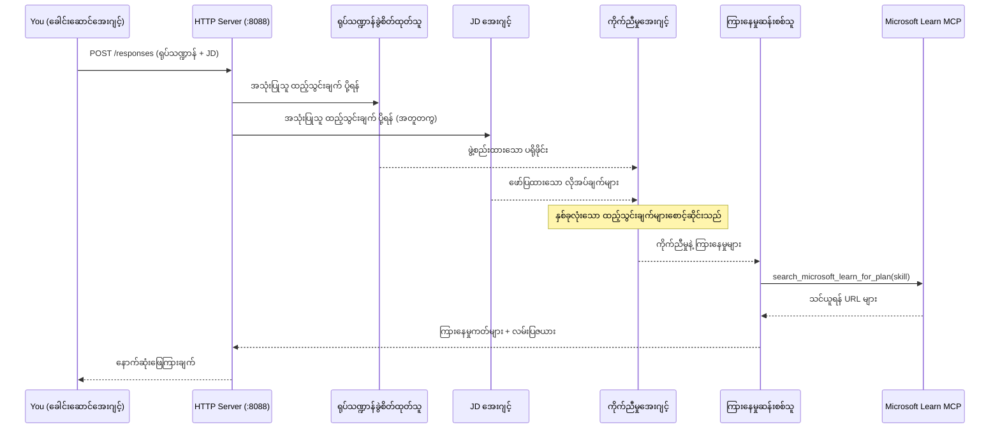
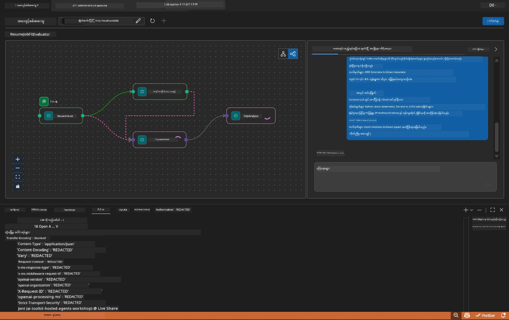

# Module 5 - ဒေသဆိုင်ရာ စမ်းသပ်ခြင်း (Multi-Agent)

ဤ module တွင် သင်သည် multi-agent workflow ကို ဒေသတွင်းမှာ တည်ဆောက်ကာ Agent Inspector ဖြင့် စမ်းသပ်ပြီး agent လေးယောက်နှင့် MCP ကိရိယာအားလုံးသည် Foundry သို့ သွားရန်မပြုမီ မှန်ကန်စွာ လည်ပတ်နေကြောင်း စစ်ဆေးပါသည်။

### ဒေသတွင်း စမ်းသပ်ရာတွင် ဖြစ်ပေါ်သည့်အရာများ


---

## အဆင့် ၁ - agent server စတင်ခြင်း

### ရွေးချယ်စရာ A - VS Code task ကို အသုံးပြုခြင်း (အကြံပြုသည်)

1. `Ctrl+Shift+P` နှိပ် → **Tasks: Run Task** ဟူ၍ ရိုက်ထည့် → **Run Lab02 HTTP Server** ကို ရွေးချယ်ပါ။
2. task သည် debugpy ကို port `5679` တွင် အတည်ပြုထားပြီး agent ကို port `8088` တွင် သက်ဆောင် server ကို စတင်ပါသည်။
3. အောက်ပါ output ပြသရန် စောင့်ဆိုင်းပါ။

```
INFO:resume-job-fit:Starting Resume -> Job Fit Evaluator HTTP server...
INFO:resume-job-fit:Server running on http://localhost:8088
```

### ရွေးချယ်စရာ B - terminal ကို လက်တွေ့ အသုံးပြုခြင်း

```powershell
cd workshop\lab02-multi-agent\PersonalCareerCopilot
```

virtual environment ကို ဖွင့်ပါ -

**PowerShell (Windows):**
```powershell
.\.venv\Scripts\Activate.ps1
```

**macOS/Linux:**
```bash
source .venv/bin/activate
```

server ကို စတင်ပါ -

```powershell
python -m debugpy --listen 127.0.0.1:5679 -m agentdev run main.py --verbose --port 8088
```

### ရွေးချယ်စရာ C - F5 အသုံးပြုခြင်း (debug mode)

1. `F5` ကို နှိပ်သော်လည်း ပြီးလျှင် **Run and Debug** (`Ctrl+Shift+D`) သို့ သွားပါ။
2. dropdown မှ **Lab02 - Multi-Agent** launch configuration ကို ရွေးချယ်ပါ။
3. server သည် breakpoint ကောင်းကောင်းဖြင့် စတင်ပါမည်။

> **အကြံပြုချက်။** Debug mode မှာ `search_microsoft_learn_for_plan()` အတွင်းတွင် breakpoint များထားပြီး MCP က ပြန်လာသော အစိတ်အပိုင်းများကို စစ်ဆေးနိုင်ရန် သို့မဟုတ် agent အတွက် instruction string အတွင်းတွင် မည်သူ agent တစ်ယောက်ရရှိသည်ကို ကြည့်ရှုနိုင်သည်။

---

## အဆင့် ၂ - Agent Inspector ဖွင့်ခြင်း

1. `Ctrl+Shift+P` နှိပ် → **Foundry Toolkit: Open Agent Inspector** ဟူ၍ ရိုက်ထည့်ပါ။
2. Agent Inspector သည် browser tab တစ်ခုတွင် `http://localhost:5679` တွင် ဖွင့်ပါမည်။
3. သင်သည် agent interface ကို စကားလေးများ လက်ခံရန် ပြင်ဆင်ထားကြောင်း မြင်ရပါမည်။

> **Agent Inspector ဖွင့်မရပါက။** server သည် ပြီးပြည့်စုံစွာ စတင်ထားသည်ကို သေချာစေပါ ("Server running" လိုဂ်ကို မြင်ရပါမည်)။ port 5679 တွင် မည်သည့် service မှလည်း မရုတ်တရက် အသုံးပြုမိရင် [Module 8 - Troubleshooting](08-troubleshooting.md) ကို ကြည့်ပါ။

---

## အဆင့် ၃ - smoke tests များ လုပ်ဆောင်ခြင်း

မိမိစမ်းသပ်ချက်သုံးခုကို အကြိမ်လိုက် လုပ်ဆောင်ပါ။ အသေးစိတ်ပိုမို စမ်းသပ်မှုများဖြစ်သည်။

### စမ်းသပ်မှု ၁ - မူရင်း resume + အလုပ်အကြောင်းအရာ

အောက်ပါနေရာတွင် Agent Inspector ထဲသို့ ကူးပြောင်းထည့်ပါ -

```
Resume:
Jane Doe
Senior Software Engineer with 5 years of experience in Python, Django, and AWS.
Built microservices handling 10K+ requests/second. Led a team of 4 developers.
Certifications: AWS Solutions Architect Associate.
Education: B.S. Computer Science, State University.

Job Description:
Senior Cloud Engineer at Contoso Ltd.
Required: Python, Azure, Kubernetes, Terraform, CI/CD pipelines.
Preferred: Go, monitoring (Prometheus/Grafana), cost optimization.
Experience: 5+ years in cloud infrastructure.
Certifications: Azure Solutions Architect Expert preferred.
```

**မျှော်မှန်းသည့် output ဖွဲ့စည်းပုံ:**

တုန့်ပြန်ချက်တွင် agent လေးယောက်မှ output အားလုံးကို အဆက်လိုက် ပါဝင်သင့်သည် -

1. **Resume Parser output** - အမျိုးအစားအလိုက် အတူတကွ စီစဉ်ထားသော လျှောက်လွှာပရိုဖိုင်
2. **JD Agent output** - လိုအပ်ချက်များအား လိုအပ်ချက်နှင့် နှစ်သက်သော ကျွမ်းကျင်မှုများ ခွဲခြားစာရင်း
3. **Matching Agent output** - fit score (0-100) နှင့် အသေးစိတ်ပေါ်လွင်ချက်၊ ကိုက်ညီသော ကျွမ်းကျင်မှုများ၊ မှန်ကန်မှုမရှိသောကျွမ်းကျင်မှုများ၊ အားနည်းချက်များ
4. **Gap Analyzer output** - ကျွမ်းကျင်မှုမရှိသော အချက်အလက်များအတွက် Microsoft Learn URLs ပါရှိသော gap ကတ်များ ပေးပို့မှု



### စမ်းသပ်မှု ၁ မှာ စစ်ဆေးဖို့

| စစ်ဆေးချက် | မျှော်မှန်းသည် | ဖြတ်သန်းပါသလား? |
|-------------|---------------|-------------------|
| တုန့်ပြန်ချက်တွင် fit score ပါရှိ | 0-100 ၁နံပါတ်အတွင်း ဖြန့်ချိမှု အပြည့်အစုံ | |
| ကိုက်ညီသော ကျွမ်းကျင်မှုများစာရင်း | Python, CI/CD (အနည်းငယ်), စသည် | |
| မပါသော ကျွမ်းကျင်မှုများစာရင်း | Azure, Kubernetes, Terraform စသဖြင့် | |
| ကျွမ်းကျင်မှု မပါသောတစ်ခုစီအတွက် gap ကတ် ကျင့် | တစ်ခုစီ | |
| Microsoft Learn URLs သည် ရှိသည် | အသစ်သော `learn.microsoft.com` လင့်များ | |
| တုန့်ပြန်ချက်တွင် အမှားမရှိ | သန့်ရှင်းသော ဖွဲ့စည်းထားသော output | |

### စမ်းသပ်မှု ၂ - MCP ကိရိယာ အကောင်းပြုမှု စစ်ဆေးခြင်း

စမ်းသပ်မှု ၁ လုပ်နေစဉ် server terminal မှာ MCP လိုဂ်များကို စစ်ဆေးပါ -

```
GET https://learn.microsoft.com/api/mcp → 405 (Method Not Allowed)
POST https://learn.microsoft.com/api/mcp → 200
DELETE https://learn.microsoft.com/api/mcp → 405 (Method Not Allowed)
```

| Log entry | အဓိပ္ပါယ် | မျှော်မှန်းပါသလား? |
|-----------|------------|-----------------------|
| `GET ... → 405` | MCP client သည် initialization အတွင်း GET ဖြင့် စစ်ဆေးသည် | ဟုတ်သည် - ပုံမှန် |
| `POST ... → 200` | Microsoft Learn MCP server သို့ တိုက်ရိုက်ခေါ်ဆိုမှု | ဟုတ်သည် - ၎င်းသည် တကယ့်ခေါ်ဆိုမှုဖြစ်သည် |
| `DELETE ... → 405` | MCP client သည် cleanup အတွင်း DELETE ဖြင့် စစ်ဆေးသည် | ဟုတ်သည် - ပုံမှန် |
| `POST ... → 4xx/5xx` | ကိရိယာ ခေါ်ဆိုမှု မအောင်မြင် | မဟုတ် - [Troubleshooting](08-troubleshooting.md) တွင် ကြည့်ရှုပါ |

> **အဓိကချက်** - `GET 405` နှင့် `DELETE 405` များသည် **မျှော်မှန်းရသော ပြုမူမှု** ဖြစ်ပါသည်။ `POST` ခေါ်ဆိုမှုများသည် 200 မဟုတ်ပါကသာ စိုးရိမ်ရပါမည်။

### စမ်းသပ်မှု ၃ - အထက်တန်း fit candidate အတွက် အကဲဖြတ်ခြင်း

JD နှင့် များစွာ ကိုက်ညီသော resume ကိုကူးထည့်ကာ GapAnalyzer သည် ထိုအခြေအနေနှင့် ညီညွတ်မှု အထူးစစ်ဆေးမှုအား စစ်ဆေးရန် -

```
Resume:
Alex Chen
Senior Cloud Engineer with 7 years of experience.
Skills: Python, Azure (AKS, Functions, DevOps), Kubernetes, Terraform, CI/CD (GitHub Actions, Azure Pipelines), Go, Prometheus, Grafana, cost optimization.
Certifications: Azure Solutions Architect Expert, Azure DevOps Engineer Expert.
Led infrastructure migration to Azure for 3 enterprise clients.
Education: M.S. Computer Science, Tech University.

Job Description:
Senior Cloud Engineer at Contoso Ltd.
Required: Python, Azure, Kubernetes, Terraform, CI/CD pipelines.
Preferred: Go, monitoring (Prometheus/Grafana), cost optimization.
Experience: 5+ years in cloud infrastructure.
Certifications: Azure Solutions Architect Expert preferred.
```

**မျှော်မှန်းရသော အပြုအမူ:**
- Fit score သည် **80+** ဖြစ်ရမည် (ကျွမ်းကျင်မှုအများစု ကိုက်ညီသည်)
- Gap ကတ်များသည် အခြေခံသင်ယူမှုထက် polish/interview လက်တွေ့စိတ်ကူးများအား ဦးတည်သင့်သည်
- GapAnalyzer မူဝါဒသည် "If fit >= 80, focus on polish/interview readiness" ဟု ပြောသည်

---

## အဆင့် ၄ - output ပြည့်စုံမှု စစ်ဆေးခြင်း

စမ်းသပ်မှုများပြီးဆံုးသည့်နောက် output သည် အောက်ပါလိုက်နာချက်များဖြစ်ရမည် -

### Output ဖွဲ့စည်းပုံ စစ်ဆေးစာရင်း

| အပိုင်း | Agent | ရှိပါသလား? |
|---------|-------|--------------|
| လျှောက်လွှာပရိုဖိုင် | Resume Parser | |
| နည်းပညာကျွမ်းကျင်မှု (အုပ်စုစုပြု) | Resume Parser | |
| အလုပ်တာဝန် ရှင်းလင်းချက် | JD Agent | |
| လိုအပ်ချက်နှင့် နှစ်သက်ချက် ကျွမ်းကျင်မှုများ | JD Agent | |
| Fit Score နှင့် အသေးစိတ် ဖွဲ့စည်းချက် | Matching Agent | |
| ကိုက်ညီသော/မရှိသော/အနည်းငယ် ရှိသော ကျွမ်းကျင်မှုများ | Matching Agent | |
| မရှိသော တစ်ခုစီအတွက် gap ကတ် | Gap Analyzer | |
| Microsoft Learn URLs gap ကတ်များတွင် | Gap Analyzer (MCP) | |
| သင်ယူမှု အစဉ်လိုက် (နံပါတ်ခွဲထား) | Gap Analyzer | |
| အချိန်ဇယား အနှစ်ချုပ် | Gap Analyzer | |

### ယခုအဆင့်တွင် စိုးရိမ်စရာ သို့မဟုတ် ပြဿနာများ

| ပြဿနာ | အကြောင်းအရင်း | ဖြေရှင်းရန် |
|---------|----------------|--------------|
| ဂျပ်ကတ် တစ်ခုသာ ရှိသည် (နောက်ထပ်များ ပိတ်ပင်) | GapAnalyzer instruction တွင် CRITICAL block လက်လွတ် | `GAP_ANALYZER_INSTRUCTIONS` ထဲတွင် `CRITICAL:` paragraph ထည့်ပါ - [Module 3](03-configure-agents.md) ကို ကြည့်ပါ |
| Microsoft Learn URLs မရှိ | MCP endpoint သို့ မရောက်ရှိနိုင် | အင်တာနက် ချိတ်ဆက်မှု စစ်ဆေးပါ။ `.env` တွင် `MICROSOFT_LEARN_MCP_ENDPOINT` ကို `https://learn.microsoft.com/api/mcp` ဖြစ်စေပါ |
| တုန့်ပြန်ချက် ဗလာ | `PROJECT_ENDPOINT` သို့မဟုတ် `MODEL_DEPLOYMENT_NAME` မသတ်မှတ်ထား | `.env` ဖိုင်ရှိ အချက်အလက်ကို စစ်ဆေးပါ။ terminal တွင် `echo $env:PROJECT_ENDPOINT` ရိုက်ထည့်၍ စစ်ဆေးပါ |
| Fit score 0 သို့မဟုတ် မပါ | MatchingAgent သို့ upstream data မရရှိ | `create_workflow()` တွင် `add_edge(resume_parser, matching_agent)` နှင့် `add_edge(jd_agent, matching_agent)` ရှိရန် စစ်ဆေးပါ |
| Agent စတင်ပြီး ပြီးနောက် အမြန်ထွက်သွားသည် | Import error သို့ မလိုအပ်သော library မရှိခြင်း | `pip install -r requirements.txt` ကို ပြန်လည်ပြေးပါ။ terminal ြဖင့် အမှားများကို စစ်ဆေးပါ |
| `validate_configuration`အမှား | env variable မလုံလောက်ခြင်း | `.env` ဖိုင်၌ `PROJECT_ENDPOINT=<your-endpoint>` နှင့် `MODEL_DEPLOYMENT_NAME=<your-model>` ထည့်ပါ |

---

## အဆင့် ၅ - ကိုယ်ပိုင်ဒေတာဖြင့် စမ်းသပ်ခြင်း (ရွေးချယ်လို့ရသည်)

ကိုယ်ပိုင် resume နှင့် တကယ့် အလုပ်အကြောင်းအရာကို ကူးထည့်၍ စမ်းသပ်ကြည့်ပါ။ ၎င်းသည် ဖော်ပြချက်များကို အတည်ပြုရန် အကူအညီဖြစ်ပါသည် -

- agent များသည် မတူညီသော resume အမျိုးအစားများ (စာရင်းဇယားအတိုင်း, လုပ်ငန်းခွဲအမျိုးအစား, သုံးစွဲမှု ပေါင်းစပ်) ကို ကိုင်တွယ်နိုင်တယ်
- JD Agent သည် မတူညီသော JD ပုံစံများ (အချက်အလက် သတ်မှတ်ချက်များ, စာပိုဒ်များ, ဖွဲ့စည်းထားသော) ကို ကိုင်တွယ်နိုင်တယ်
- MCP ကိရိယာသည် တကယ့် ကျွမ်းကျင်မှုများအတွက် သက်ဆိုင်ရာ အရင်းအမြစ်များ ပြန်ပေးတယ်
- gap ကတ်များသည် သင့်ပုဂ္ဂိုလ်ရေး နောက်ခံအချက်အလက် ပေါ်မူတည်ပြီး ကိုယ်ပိုင်ထားရှိတယ်

> **ပုဂ္ဂိုလ်ရေးလုံခြုံရေး မှတ်ချက်။** ဒေသတွင်း စမ်းသပ်မှု ဖြင့် သင်၏ဒေတာသည် သင့်စက်ကိုသာ ရောက်ရှိပြီး သင်၏ Azure OpenAI deployment ကိုသာ ပို့ဆောင်ပါသည်။ workshop အဆောက်အအုံက ရှောင်ရှားထားသည်။ သင်နှစ်သက်ပါက နာမည်များ အစားထိုး အသုံးပြုပါ (ဥပမာ - "Jane Doe" ကို သင့်အမည်အစားသုံးရန်)။

---

### စစ်တမ်းငွေ့

- [ ] Server သည် port `8088` တွင် အောင်မြင်စွာ စတင်ပြီး ("Server running" log ပြသော) အသိမှတ်ပြုကြသည်
- [ ] Agent Inspector သည် ဖွင့်၍ agent နှင့် ချိတ်ဆက်ပြီး
- [ ] စမ်းသပ်မှု ၁ - fit score, ကိုက်ညီ/မရှိသော ကျွမ်းကျင်မှုများ, gap ကတ်များနှင့် Microsoft Learn URLs ပြည့်စုံသော တုန့်ပြန်ချက်
- [ ] စမ်းသပ်မှု ၂ - MCP log တွင် `POST ... → 200` ရှိ (ကိရိယာ ခေါ်ဆိုမှု အောင်မြင်)
- [ ] စမ်းသပ်မှု ၃ - အဆင့်မြင့် fit candidate သည် 80+ score ရရှိပြီး polish ရည်ရွယ်ချက်များရှိ
- [ ] gap ကတ် အားလုံး ရှိသည် (မရှိသော ကျွမ်းကျင်မှု တစ်ခုစီကို တစ်ကတ်စာ၊ ခုနစ်ပိတ်ဆို့မှု မရှိ)
- [ ] Server terminal တွင် အမှားများ သို့မဟုတ် stack trace မရှိ

---

**လွန်ခဲ့သော:** [04 - Orchestration Patterns](04-orchestration-patterns.md) · **ပြီးနောက်:** [06 - Deploy to Foundry →](06-deploy-to-foundry.md)

---

<!-- CO-OP TRANSLATOR DISCLAIMER START -->
**သတိပေးချက်**  
ဤစာရွက်ကို AI ဘာသာပြန်ဝန်ဆောင်မှု [Co-op Translator](https://github.com/Azure/co-op-translator) အသုံးပြု၍ ဘာသာပြန်ထားပါသည်။ တိကျမှန်ကန်မှုအတွက် ကြိုးစားထားသော်လည်း ခွန်ဖြင့်ပြုလုပ်သော ဘာသာပြန်ချက်များတွင် တစ်ချို့အမှားများ သို့မဟုတ် မှားယွင်းချက်များ ပါရှိနိုင်ကြောင်း သတိပြုရန် လိုအပ်ပါသည်။ မူလစာရွက်ကို မိမိတို့အသုံးပြုသော ဘာသာစကားဖြင့် အာဏာပိုင်အရင်းအမြစ်အဖြစ် သတ်မှတ်စဉ်းစားသင့်ပါသည်။ အရေးကြီးသောအချက်အလက်များအတွက် ပရော်ဖက်ရှင်နယ်လူမှုဘာသာပြန်ကို အကြံပြုပါသည်။ ဤဘာသာပြန်ချက်အသုံးပြုမှုကြောင့် ဖြစ်ပေါ်လာနိုင်သည့် မမှန်မှန်လွဲမှားခြင်းများအတွက် ကျွန်ုပ်တို့သည် တာဝန်မခံပါ။
<!-- CO-OP TRANSLATOR DISCLAIMER END -->