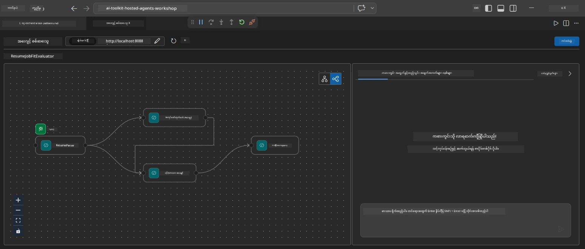
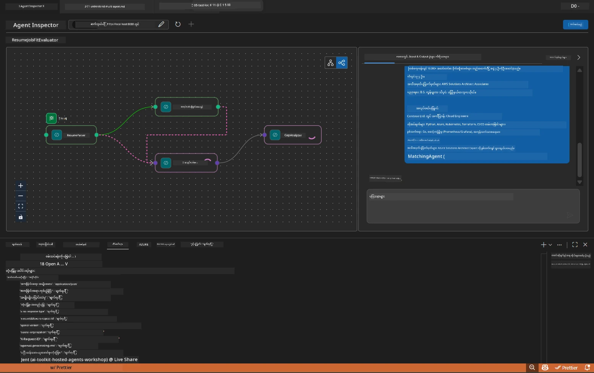
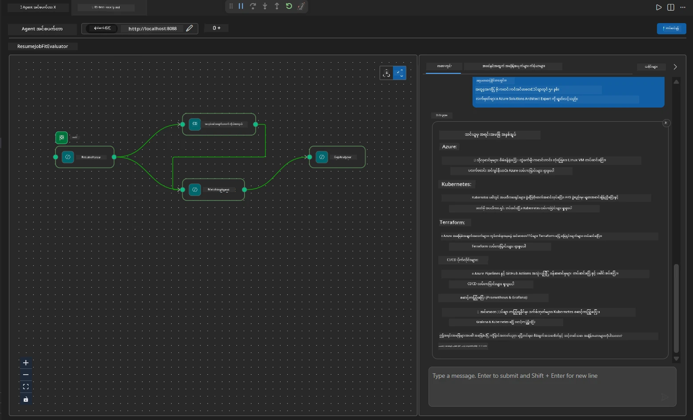

# Module 5 - ဒေသတွင်းစမ်းသပ်ခြင်း

⏱️ ~15 မိနစ်

ဤမော်ဂျူးတွင်၊ သင်သည် multi-agent workflow ကို ဒေသတွင်းတွင်ခုတင်ပြီး Agent Inspector ဖြင့် စမ်းသပ်ကာ လေးဦးသော အေးဂျင့်များနှင့် MCP ကိရိယာအား မှန်ကန်စွာ လုပ်ဆောင်သောကြောင်း စစ်ဆေးပါမည်။

---

## အဆင့် ၁: အေးဂျင့်ဆာဗာကို စတင်ပါ

### ရွေးချယ်မှု A: VS Code task ကို အသုံးပြုခြင်း (အကြံပြု)

1. `workshop/lab02-multi-agent/PersonalCareerCopilot/` ကို သင့် VS Code ဖိုင်းဒါအဖြစ် ဖွင့်ပါ။
2. `Ctrl+Shift+P` ကို နှိပ်ပါ → **Tasks: Run Task** ရိုက်ထည့်ပြီး → **Run Agent HTTP Server** ကို ရွေးချယ်ပါ။
3. task သည် port `5679` တွင် debugpy ကို ပူးတွဲပြီး ဆာဗာတက်စတင်ပြီး port `8088` တွင် အေးဂျင့်ကို စတင်ပါသည်။
4. အောက်ပါ output ပေါ်လာသည်အထိ ချိန်းဆိုပါ။

```
INFO:resume-job-fit:Starting Resume -> Job Fit Evaluator HTTP server...
INFO:resume-job-fit:Server running on http://localhost:8088
```

### ရွေးချယ်မှု B: F5 သုံးပြီး (debug အနေအထား)

1. `F5` ကို နှိပ်ပြီး → **Debug Local Agent HTTP Server** ကို ရွေးချယ်ပါ။
2. ဆာဗာသည် အပြည့်အဝ breakpoint ပံ့ပိုးမှုဖြင့် စတင်ပါသည် - MCP တုံ့ပြန်မှုများ သို့မဟုတ် အေးဂျင့်ထွက်များ ကို စစ်ဆေးရန် အထောက်အကူဖြစ်သည်။

---

## အဆင့် ၂: Agent Inspector ကိုဖွင့်ပါ

1. `Ctrl+Shift+P` ကို နှိပ်ပြီး → **Foundry Toolkit: Open Agent Inspector** ရိုက်ထည့်ပါ။
2. Agent Inspector သည် `http://localhost:8088` သို့ ချိတ်ဆက်သော VS Code panel အဖြစ် ဖွင့်ပါသည်။
3. သင်သည် စာတိုက်စာတင်လက်ခံရန် အေးဂျင့် အင်တာဖေ့စ်ကို ကြည့်ရပါမည်။



> **Agent Inspector မဖွင့်ပါက:** ဆာဗာအပြည့်စုံစတင်ထားသည်ကို (သင်သည် "Server running" မှတ်တမ်းကို မြင်သည်) သေချာစေပါ။ port 5679 ပြင်းပြမှုရှိပါက [Module 8 - Troubleshooting](08-troubleshooting.md) ကို ကြည့်ပါ။

---

## အဆင့် ၂b: (ရွေးချယ်စရာ) Workflow Visualizer ကိုဖွင့်ပါ

Foundry Toolkit တွင် agents များမည်သို့ ဆက်သွယ် လည်ပတ်သည်ကို real-time **Workflow Visualizer** ဖြင့် ပြသပါသည်။ ၎င်းသည် multi-agent debugging အတွက် အထူး အသုံးဝင်သည်။

1. `Ctrl+Shift+P` ကို နှိပ်ပြီး → **Foundry Toolkit: Open Visualizer for Hosted Agents** ကို ရိုက်ထည့်ပါ။
2. VS Code tab အသစ်တစ်ခု ဖွင့်ကာ live execution graph ကို ပြပါမည်။
3. သင်သည် Agent Inspector တွင် မက်ဆေ့ချ်ပို့သည့်အခါ visualizer သည် အလိုအလျောက် update လုပ်ပါသည် - အစိမ်းရောင် node များသည် အောင်မြင်စွာ ပြီးစီးသောအေးဂျင့်များဖြစ်ပြီး အနေနှင့်လမ်းကြောင်းများသည် ဒေတာသယ်ယူမှုကို ပြသသည်။

> **Port ပြိုင်ဘက်မှု:** visualizer port အသုံးပြုသူ ရှိပါက VS Code Settings → **Extensions** → **Microsoft Foundry Configuration** → **Hosted Agents: Visualizer Port** တွင် ပြောင်းလဲနိုင်သည်။

---

## အဆင့် ၃: Smoke tests များ အပြေး

ဤစာရင်းသုံးခုကို အစဉ်လိုက် ပြေးဆွဲပါ။ တစ်ခုချင်းစီသည် workflow ၏ ပိုမို ဆန်းစစ်မှုများ ပါဝင်သည်။

### စမ်းသပ်မှု ၁: အခြေခံ resume + အလုပ်ဖော်ပြချက်

အောက်ပါအချက်အလက်များကို Agent Inspector ထဲတွင် ကူးထည့်ပါ။

```
Resume:
Jane Doe
Senior Software Engineer with 5 years of experience in Python, Django, and AWS.
Built microservices handling 10K+ requests/second. Led a team of 4 developers.
Certifications: AWS Solutions Architect Associate.
Education: B.S. Computer Science, State University.

Job Description:
Senior Cloud Engineer at Contoso Ltd.
Required: Python, Azure, Kubernetes, Terraform, CI/CD pipelines.
Preferred: Go, monitoring (Prometheus/Grafana), cost optimization.
Experience: 5+ years in cloud infrastructure.
Certifications: Azure Solutions Architect Expert preferred.
```

**မျှော်မှန်းထားသော ထွက်ရှိမှု ဖွဲ့စည်းပုံ:**

တုံ့ပြန်ချက်တွင် agent လေးဦးအားတစ်လျှောက် အောက်ပါအတိုင်း စဉ်ဆက်မပြတ် ထွက်ရှိရမည်။

1. **Resume Parser ထွက်ရှိမှု** - အမှတ်အသားနှစ်ခုပါဝင်သည်။ `[PARSED RESUME]` (လျှောက်ထားသူ ကိုယ်ရေးအချက်အလက်နှင့် ကွဲပြားစွာစုစည်းထားသော ကျွမ်းကျင်မှုများ) နှင့် `[JOB DESCRIPTION PASS-THROUGH]` (JD Agent အတွက် verbatim JD စာသား)
2. **JD Agent ထွက်ရှိမှု** - လိုအပ်ချက်များကို အတိအကျစီစဉ်ပြီး လိုအပ်သောနှင့် စိတ်ကြိုက်ကျွမ်းကျင်မှုများ ခြားနားစွာ ဖော်ပြသည်။
3. **Matching Agent ထွက်ရှိမှု** - သင့်လျော်မှုအမှတ် (0-100) နှင့် ခွဲခြမ်းစိတ်ဖြာမှု၊ ကိုက်ညီသောကျွမ်းကျင်မှုများ၊ חסרကျွမ်းကျင်မှုများ၊ gap များ
4. **Gap Analyzer ထွက်ရှိမှု** - မရှိသေးသော ကျွမ်းကျင်မှု တစ်ခုချင်းစီအတွက် gap ကတ်များ၊ တစ်ခုချင်းစီတွင် Microsoft Learn URL များပါဝင်သည်။





### စမ်းသပ်မှု ၁ တွင် စစ်ဆေးရန်အချက်များ

| စစ်ဆေးရန် | မျှော်မှန်းထားချက် | ဖြတ်တောက်နိုင်ပါသလား? |
|-------|----------|-------|
| တုံ့ပြန်ချက်တွင် သင့်လျော်မှုအမှတ်ပါဝင်သည် | 0-100 နေရာအတွင်း အမှတ်နှင့် ခွဲခြမ်းစိတ်ဖြာမှု | |
| ကိုက်ညီသော ကျွမ်းကျင်မှုများဖော်ပြသည် | Python, CI/CD (အပိုင်းအစ), စသည်ဖြင့် | |
| မရှိသေးသောကျွမ်းကျင်မှုများ ဖော်ပြသည် | Azure, Kubernetes, Terraform, စသည်ဖြင့် | |
| မရှိသေးသော ကျွမ်းကျင်မှု အတွက် gap ကတ်များ ရှိသည် | ကျွမ်းကျင်မှုတစ်ခုစီအတွက် ကတ်တစ်ခု | |
| Microsoft Learn URL များ ရှိသည် | တကယ့် `learn.microsoft.com` လင့်ခ်များ | |
| တုံ့ပြန်ချက်တွင် အမှားစာမက်များ မရှိပါ | ပုံမှန် ဖွဲ့စည်းမှုရှိသော output | |

### စမ်းသပ်မှု ၂: အထူးကိစ္စ - သင့်လျော်မှုမြင့် လျှောက်လွှာ

JD ကို အလယ်အလတ်နီးပါး ကိုက်ညီသော resume တစ်ခုကို ကူးထည့်၍ GapAnalyzer သည် သင့်လျော်မှုမြင့် အခြေအနေများကို မှန်ကန်စွာ ကိုင်တွယ်နိုင်ကြောင်း စစ်ဆေးပါ။

```
Resume:
Alex Chen
Senior Cloud Engineer with 7 years of experience.
Skills: Python, Azure (AKS, Functions, DevOps), Kubernetes, Terraform, CI/CD (GitHub Actions, Azure Pipelines), Go, Prometheus, Grafana, cost optimization.
Certifications: Azure Solutions Architect Expert, Azure DevOps Engineer Expert.
Led infrastructure migration to Azure for 3 enterprise clients.
Education: M.S. Computer Science, Tech University.

Job Description:
Senior Cloud Engineer at Contoso Ltd.
Required: Python, Azure, Kubernetes, Terraform, CI/CD pipelines.
Preferred: Go, monitoring (Prometheus/Grafana), cost optimization.
Experience: 5+ years in cloud infrastructure.
Certifications: Azure Solutions Architect Expert preferred.
```

**မျှော်မှန်းထားသော လုပ်ဆောင်ချက်များ:**
- သင့်လျော်မှုအမှတ်သည် **80+** ဖြစ်ရမည် (ကျွမ်းကျင်မှုများအများစုကို ကိုက်ညီသည်)
- Gap ကတ်များသည် အခြေခံသင်ကြားမှု မဟုတ်ဘဲ polish/interview ပြင်ဆင်မှုတို့ကို အာရုံစိုက်သည်
- GapAnalyzer အညွှန်းတွင် "fit >= 80 ဖြစ်လျှင် polish/interview ပြင်ဆင်မှု အာရုံစိုက်ရန်" ဟူ၍ ပြောထားသည်

---

## အဆင့် ၄: သင့်ကိုယ်ပိုင်ဒေတာဖြင့် စမ်းသပ်ပါ (ရွေးချယ်စရာ)

သင်၏ကိုယ်ပိုင် resume နှင့် တကယ့်အလုပ်ဖော်ပြချက်ကို ကူးထည့်ကြည့်ပါ။ ၎င်းသည် အာမခံပေးသည်-

- အေးဂျင့်များသည် အမျိုးမျိုးသော resume ပုံစံများ (chronological, functional, hybrid) ကို ကိုင်တွယ်နိုင်သည်
- JD Agent သည် အမျိုးမျိုးသော JD စတိုင်များ (bullet points, paragraphs, structured) ကို ကိုင်တွယ်နိုင်သည်
- MCP ကိရိယာသည် တကယ့်ကျွမ်းကျင်မှုများအတွက် သက်ဆိုင်ရာ အသုံးစရိတ်များ ပြန်လည်ပေးပို့သည်
- gap ကတ်များသည် သင့်အတိတ်အခြေအနေကို အခြေခံ၍ ကိုယ်ပိုင်ပြုလုပ်ထားသည်

> **Privacy - Path A (Foundry cloud):** Resume နှင့် JD စာသားကို သင်၏ Azure OpenAI deployment သို့ inference အတွက် ပို့သည်။ workshop အင်ဖရာစတ့်ရွပ်ချာမှ မှတ်တမ်းမတင်ဘဲ သိုလှောင်လွှဲမထားပါ။ ပြောင်းလဲမည့် နာမည်များ (ဥပမာ-“Jane Doe”) ကို အသုံးပြုပါက ပိုမိုကောင်းမွန်ပါသည်။
>
> **Privacy - Path B (Foundry Local):** အေးဂျင့်လေးဦး၏ inference များအားလုံး သင့်စက်ပေါ်မှ အပြည့်အဝ မဟာဗျူဟာဖြင့် ဆောင်ရွက်သည်။ သင့် resume နှင့် အလုပ်ဖော်ပြချက်စာသားသည် **သင့်စက်မှ ဘာမှ မထွက်ပါ။** MCP tool သာ `https://learn.microsoft.com/api/mcp` မှ အသုံးအဆောင်များ ရယူသည်။ ၎င်းမှ မေးခွန်းတွင် ကျွမ်းကျင်မှုအမည်သာ ပါဝင်ပြီး သင့်ကိုယ်ရေးအချက်အလက် မပါဝင်ပါ။

---

### စစ်ဆေးချက်

- [ ] ဆာဗာကို port `8088` တွင် အောင်မြင်စွာ စတင်ထားသည် (log တွင် "Server running" မြင်ရသည်)
- [ ] Agent Inspector ဖွင့်ပြီး အေးဂျင့်နှင့် ချိတ်ဆက်ထားသည်
- [ ] စမ်းသပ်မှု ၁: သင့်လျော်မှုအမှတ်၊ ကိုက်ညီ/မရှိသော ကျွမ်းကျင်မှုများ၊ gap ကတ်များနှင့် Microsoft Learn URL များ ပါဝင်သည့် ပြည့်စုံသော တုံ့ပြန်ချက်
- [ ] စမ်းသပ်မှု ၂: သင့်လျော်မှုမြင့်လျှောက်ထားသူသည် 80+ အမှတ်ဖြင့် polish ဦးတည်ချက်များပါရှိသော ညွှန်ကြားချက်များ ရရှိသည်
- [ ] ကိုက်ညီသော gap ကတ် အားလုံး ပါဝင် (မရှိသေးသော ကျွမ်းကျင်မှုတစ်ခုစီအတွက် ကတ်တစ်ခု၊ မဖြတ်တောက်)
- [ ] ဆာဗာ terminal တွင် အမှားများ သို့မဟုတ် stack trace မရှိပါ

---

**ယခင်:** [04 - Orchestration Patterns](04-orchestration-patterns.md) · **နောက်တစ်ခါ:** [06 - Deploy to Foundry →](06-deploy-to-foundry.md)

---

<!-- CO-OP TRANSLATOR DISCLAIMER START -->
**ပြောကြားချက်**
ဤစာတမ်းကို AI ဘာသာပြန်ဝန်ဆောင်မှု [Co-op Translator](https://github.com/Azure/co-op-translator) အသုံးပြု၍ ဘာသာပြန်ထားပါသည်။ ကျွန်ုပ်တို့သည် တိကျမှန်ကန်မှုအတွက် ကြိုးပမ်းနေသော်လည်း၊ စက်ကိရိယာဘာသာပြန်ခြင်းများတွင် အမှားများ သို့မဟုတ် မှားယွင်းချက်များ ပါဝင်နိုင်ကြောင်း သတိပြုပါရန် လိုအပ်ပါသည်။ မူလစာတမ်းကို မူရင်းဘာသာဖြင့်သာ ယုံကြည်စိတ်ချရသော အချက်အလက်အဖြစ် သတ်မှတ်သင့်သည်။ အရေးကြီးသည့် သတင်းအချက်အလက်များအတွက် ပရော်ဖက်ရှင်နယ် လူသားဘာသာပြန်သူဝန်ဆောင်မှုကို အကြံပြုပါသည်။ ဤဘာသာပြန်ချက်ကို အသုံးပြုခြင်းမှ ဖြစ်ပေါ်လာသော နားလည်မှုကွာခြားမှုများ သို့မဟုတ် မမှန်ကန်သော အသုံးပြုမှုများအတွက် ကျွန်ုပ်တို့ တာဝန်မခံပါ။
<!-- CO-OP TRANSLATOR DISCLAIMER END -->