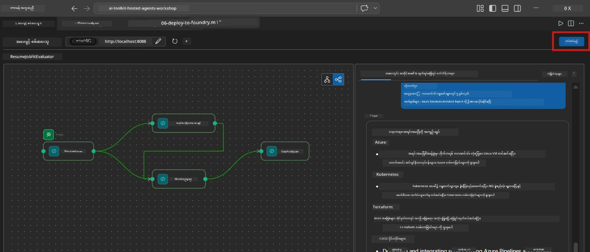
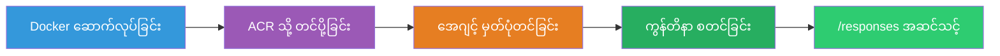
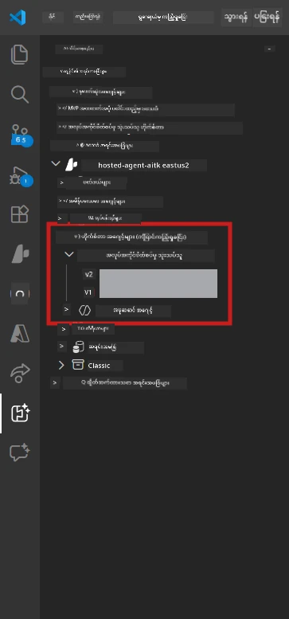

# Module 6 - Foundry Agent Service သို့ တင်သွင်းခြင်း

ဤ module တွင် သင်၏ ဒေသတွင် စမ်းသပ်ပြီးသော multi-agent workflow ကို [Microsoft Foundry](https://learn.microsoft.com/azure/foundry/agents/concepts/hosted-agents) တွင် **Hosted Agent** အဖြစ် တင်သွင်းပါသည်။ တင်သွင်းမှုလုပ်ငန်းစဉ်သည် Docker container image တစ်ခုကို ဖန်တီး၍ [Azure Container Registry (ACR)](https://learn.microsoft.com/azure/container-registry/container-registry-intro) တွင် ပို့ဆောင်ပြီး၊ [Foundry Agent Service](https://learn.microsoft.com/azure/foundry/agents/how-to/publish-agent) တွင် hosted agent ဗားရှင်းတစ်ခုဖန်တီးသည်။

> **Lab 01 မှ မတူသော အဓိက ကွာခြားချက်:** တင်သွင်းမှုလုပ်ငန်းစဉ်သည် တူညီသည်။ Foundry သည် သင့် multi-agent workflow ကို hosted agent တစ်ခုအဖြစ် ကြည့်သည် - ရိုးရာတွင် container အတွင်း၌ ရှုပ်ထွေးမှုရှိသော်လည်း တင်သွင်းမှု မျက်နှာပြင်သည် အတူတူသော `/responses` endpoint ဖြစ်သည်။

---

## မတိုင်မီ စစ်ဆေးရန် လိုအပ်ချက်များ

တင်သွင်းခိုင်းခင် အောက်ပါ အချက်အားလုံးကို စစ်ဆေးပါ။

1. **Agent သည် ဒေသတွင် smoke test များ ဖြတ်ကျော်နေသည်။**
   - [Module 5](05-test-locally.md) တွင်ရှိသည့် စမ်းသပ်မှု ၃ ခုကို ပြီးမြောက်ပြီး ရလဒ်အပြည့်အစုံ Microsoft Learn URL များနှင့် gap cards ဖြင့် ထွက်လာကြောင်း သေချာပါ။

2. **သင်မှာ [Azure AI User](https://learn.microsoft.com/azure/foundry/concepts/rbac-foundry) အခန်းကဏ္ဍ ရှိပါသည်။**
   - [Lab 01, Module 2](../../lab01-single-agent/docs/02-create-foundry-project.md) တွင် ပေးအပ်ထားသည်။ အောက်ပါအတိုင်း အတည်ပြုပါ။
   - [Azure Portal](https://portal.azure.com) → သင့် Foundry **project** အရင်းအမြစ် → **Access control (IAM)** → **Role assignments** → သင့်အကောင့်အတွက် **[Azure AI User](https://aka.ms/foundry-ext-project-role)** ပါရှိသည်ဟု အတည်ပြုပါ။

3. **သင်သည် VS Code တွင် Azure သို့ ဝင်ရောက်ထားသည်။**
   - VS Code ၏ ဘယ်ခြမ်းဘက်အောက်ဆုံးရှိ Accounts icon ကို စစ်ဆေးပါ။ သင့်အကောင့်အမည် က ထွက်နေသင့်သည်။

4. **`agent.yaml` တွင် တန်ဖိုးမှန်ကန်သည်။**
   - `PersonalCareerCopilot/agent.yaml` ဖိုင်ကို ဖွင့်ပြီး အောက်ပါအတိုင်း စစ်ဆေးပါ။
     ```yaml
     environment_variables:
       - name: PROJECT_ENDPOINT
         value: ${PROJECT_ENDPOINT}
       - name: MODEL_DEPLOYMENT_NAME
         value: ${MODEL_DEPLOYMENT_NAME}
     ```
   - ၎င်းတို့မှာ သင်၏ `main.py` မှ ဖတ်ရွက်သော env vars နှင့် ကိုက်ညီရမည်။

5. **`requirements.txt` တွင် ဗားရှင်းများမှန်ကန်သည်။**
   ```
   agent-framework-azure-ai==1.0.0rc3
   agent-framework-core==1.0.0rc3
   azure-ai-agentserver-agentframework==1.0.0b16
   azure-ai-agentserver-core==1.0.0b16
   debugpy
   agent-dev-cli --pre
   ```

---

## အဆင့် ၁: တင်သွင်းခြင်း စတင်ခြင်း

### ရွေးချယ်မှု A: Agent Inspector မှ တင်သွင်းခြင်း (အကြံပြု)

Agent သည် F5 နှိပ်၍ အလုပ်လုပ်နေပြီး Agent Inspector ဖွင့်ထားလျှင် -

1. Agent Inspector panel ၏ **အပေါ်ညာဘက်ထောင့်** ကိုကြည့်ပါ။
2. **Deploy** ခလုတ် (အောင်းမြှောင်း ↑ ပါသော cloud icon) ကို နှိပ်ပါ။
3. တင်သွင်းချက်ချမှတ်ရန် မဲ့အသစ်ဖွင့်သည်။



### ရွေးချယ်မှု B: Command Palette မှ တင်သွင်းခြင်း

1. `Ctrl+Shift+P` ကို ဖွင့်၍ **Command Palette** ဖွင့်ပါ။
2. ရိုက်ပါ - **Microsoft Foundry: Deploy Hosted Agent** နှင့်ရွေးချယ်ပါ။
3. တင်သွင်း ပရိုဂရမ်ဖွင့်လှစ်သည်။

---

## အဆင့် ၂: တင်သွင်းမှု ရွေးချယ်ခြင်း

### 2.1 ရည်ရွယ်သည့် project ရွေးချယ်ခြင်း

1. dropdown သည် သင့် Foundry projects များကို ပြသည်။
2. လေ့လာခဲ့သည့် workshop အတွင်းသုံးထားသော project (ဥပမာ - `workshop-agents`) ကို ရွေးချယ်ပါ။

### 2.2 container agent ဖိုင်ရွေးချယ်ခြင်း

1. Agent entry point ရွေးစရာ ရှိသည်။
2. `workshop/lab02-multi-agent/PersonalCareerCopilot/` သို့သွားပြီး **`main.py`** ကို ရွေးချယ်ပါ။

### 2.3 အရင်းအမြစ်များ ချိန်ညှိခြင်း

| စီစဉ်မှု | အကြံပြု တန်ဖိုး | မှတ်စုများ |
|---------|------------------|-------|
| **CPU** | `0.25` | ပုံမှန်။ Multi-agent workflows တွင် မော်ဒယ်ခေါ်ဆိုမှုများမှာ I/O မှတ်တမ်းနည်းဖြင့်ဖြစ်သောကြောင့် CPU မလိုအပ်။ |
| **မှတ်ဉာဏ်** | `0.5Gi` | ပုံမှန်။ အကြီးစား ဒေတာ အလုပ်လုပ်ရန် `1Gi` အထိ မြှင့်နိုင်သည်။ |

---

## အဆင့် ၃: အတည်ပြု၍ တင်သွင်းခြင်း

1. မဲ့အသစ်တွင် တင်သွင်းမှု အကျဉ်းချုပ် ပြပါသည်။
2. သုံးသပ်ပြီး **Confirm and Deploy** ကို နှိပ်ပါ။
3. VS Code တွင် တိုးတက်မှုကြည့်ရှုနိုင်သည်။

### တင်သွင်းစဉ် သွင်းသွားမှုများ

VS Code ရဲ့ **Output** panel (Microsoft Foundry dropdown ရွေးချယ်ထားရန်) ကို ကြည့်ပါ -


1. **Docker build** - သင့် `Dockerfile` အရ container ဖန်တီးခြင်း -
   ```
   Step 1/6 : FROM python:3.14-slim
   Step 2/6 : WORKDIR /app
   ...
   Successfully built abc123def456
   ```

2. **Docker push** - ACR သို့ image ပို့သည် (ပထမဆုံး တင်သွင်းရာတွင် ၁-၃ မိနစ်ကြာသည်)။

3. **Agent မှတ်ပုံတင်ခြင်း** - Foundry သည် `agent.yaml` metadata ဖြင့် hosted agent တစ်ခုဖန်တီးသည်။ Agent အမည်မှာ `resume-job-fit-evaluator` ဖြစ်သည်။

4. **Container စတင်ခြင်း** - Foundry ၏ စီမံခန့်ခွဲထားသော အဆောက်အအုံတွင် container စတင်ခွင့်ရှိပြီး system-managed identity ဖြင့် လည်ပတ်သည်။

> **ပထမဆုံး တင်သွင်းမှုမှာ နှေးကွေးသည်** (Docker မှ အထပ်အားလုံးကို ပို့သည်)။ နောက်ထပ် တင်သွင်းမှုများတွင် cache ထပ်သုံး၍ ပိုမြန်သည်။

### Multi-agent သီးသန့် မှတ်စုများ

- **အေးဂျင့် လေးခုလုံးကို container တစ်ခုအတွင်း ထည့်သည်။** Foundry သည် hosted agent တစ်ခုအဖြစ် မြင်သည်။ WorkflowBuilder ကျစ်လစ်စွာ အတွင်း run ၏။
- **MCP ခေါ်ဆိုမှုများ သွားပို့သည်။** Container သည် `https://learn.microsoft.com/api/mcp` ကို ဝင်ရောက်ရန် အင်တာနက် လက်လွှတ်ခွင့်ရှိရမည်။ Foundry ၏ စီမံခန့်ခွဲထားသော အဆောက်အအုံမှ အလိုအလျောက် ပံ့ပိုးသည်။
- **[Managed Identity](https://learn.microsoft.com/python/api/overview/azure/identity-readme#managed-identity-support)** - Hosted ပတ်ဝန်းကျင်တွင် `main.py` ၏ `get_credential()` သည် `ManagedIdentityCredential()` ကို ပြန်လည်ပေးစနစ်ဖြစ်သည် (MSI_ENDPOINT ဖြစ်နေခြင်းကြောင့်)။ ၎င်းသည် အလိုအလျောက်ဖြစ်သည်။

---

## အဆင့် ၄: တင်သွင်းမှု အခြေအနေ စစ်ဆေးခြင်း

1. **Microsoft Foundry** sidebar ကို ဖွင့်ပါ (Activity Bar မှ Foundry icon ကို နှိပ်ပါ)။
2. သင့် project အောက်မှ **Hosted Agents (Preview)** ကို မျှဝေပါ။
3. **resume-job-fit-evaluator** (သို့) သင့် agent အမည်ကို ရှာပါ။
4. Agent အမည်ကို နှိပ်၍ ဗားရှင်းများ (ဥပမာ `v1`) ကို ဖွင့်ပါ။
5. ဗားရှင်းကို နှိပ်ပြီး **Container Details** → **Status** ကို စစ်ဆေးပါ။



| Status | အဓိပ္ပာယ် |
|--------|---------|
| **Started** / **Running** | Container သည် လည်ပတ်နေပြီး agent သည် ပြင်ဆင်ပြီးဖြစ်သည် |
| **Pending** | Container စတင်နေသည် (၃၀-၆၀ စက္ကန့် ချိန်ဆစီရပါ) |
| **Failed** | Container စတင်မရသေး (Logs ကို စစ်ဆေးပါ - အောက်မြင်နိုင်သည်) |

> **Multi-agent စတင်မှုမှာ single-agent ထက် ကြာမြင့်သည်**။ Container မှ agent အနေဖြင့် ဝက် ၄ ခု ဖန်တီးသည့်အတွက်ဖြစ်သည်။ "Pending" သည် ၂ မိနစ်အထိ ရှိခြင်း သာမန် ဖြစ်သည်။

---

## ပုံမှန် ပျက်ကွက်မှုများနှင့် ဖြေရှင်းနည်း

### အမှား ၁: သတိမလိုက်နာခြင်း - `agents/write`

```
Error: lacks the required data action 
Microsoft.CognitiveServices/accounts/AIServices/agents/write
```

**ဖြေရှင်းနည်း:** **[Azure AI User](https://learn.microsoft.com/azure/foundry/concepts/rbac-foundry)** အခန်းကဏ္ဍကို **project** အဆင့်တွင် ပေးအပ်ပါ။ လုပ်ထုံးလုပ်နည်း အသေးစိတ်အတွက် [Module 8 - Troubleshooting](08-troubleshooting.md) ကို ကြည့်ပါ။

### အမှား ၂: Docker မလည်ပတ်ခြင်း

```
Error: Docker build failed / Cannot connect to Docker daemon
```

**ဖြေရှင်းနည်း:**
1. Docker Desktop ကို စတင်ပါ။
2. "Docker Desktop is running" ဟူသော အခြေအနေကို စောင့်ပါ။
3. `docker info` ဖြင့် စစ်ဆေးပါ။
4. **Windows:** Docker Desktop Setting မှာ WSL 2 backend ဖွင့်ထားခြင်းကို သေချာစေပါ။
5. ထပ်မံ စမ်းသပ်ပါ။

### အမှား ၃: pip install သည် Docker build အတွင်း မအောင်မြင်ခြင်း

```
Error: Could not find a version that satisfies the requirement agent-dev-cli
```

**ဖြေရှင်းနည်း:** `requirements.txt` တွင် `--pre` flag ကို Docker တွင်  ကြားခံမှု မတူပါ။ အောက်ပါအတိုင်း သေချာစေပါ။
```
agent-dev-cli --pre
```

Docker မှ မအောင်မြင်သေးလျှင် `pip.conf` ဖိုင် ဖန်တီးပါ (သို့) build argument ဖြင့် `--pre` ကို ပေးပို့ပါ။ [Module 8](08-troubleshooting.md) တွင် ကြည့်ပါ။

### အမှား ၄: MCP tools သည် hosted agent တွင် မအောင်မြင်ခြင်း

Gap Analyzer မှ Microsoft Learn URL မထုတ်ပြန်တော့ပါက -

**အကြောင်းရင်း:** Container မှ HTTPS outbound ကို Network မူဝါဒ ပိတ်ဆို့ထားနိုင်သည်။

**ဖြေရှင်းနည်း:**
1. ယင်းသည် Foundry ၏ ပုံမှန် သတ်မှတ်ချက်တွင် မဖြစ်ရပါ။
2. ဖြစ်ပါက Foundry project ၏ virtual network တွင် HTTPS outbound ကို ပိတ်ထားသော NSG ရှိနေမရှိ စစ်ဆေးပါ။
3. MCP tools တွင် fallback URLs ပါရှိသဖြင့် agent သည် live URLs မပါပဲ အထွေထွေထုတ်လွှင့်မှု ထုတ်ပေးနိုင်ပါသည်။

---

### စစ်ဆေးရန်

- [ ] VS Code တွင် တင်သွင်းမှု command သည် အမှား မရှိဘဲ ပြီးမြောက်သွားသည်
- [ ] Foundry sidebar ထဲမှ **Hosted Agents (Preview)** အောက်တွင် agent ကို တွေ့ရှိသည်
- [ ] Agent အမည်မှာ `resume-job-fit-evaluator` (သို့) သင်ရွေးထားသော အမည်ဖြစ်သည်
- [ ] Container status သည် **Started** (သို့) **Running** ဖြစ်သည်
- [ ] (Error ရှိပါက) အမှားကို ဖော်ထုတ်ပြီး ဖြေရှင်းပြီး ပြန်တင်သွင်းပြီးပါပြီ

---

**မတိုင်မီ:** [05 - Test Locally](05-test-locally.md) · **နောက်တစ်ခု:** [07 - Verify in Playground →](07-verify-in-playground.md)

---

<!-- CO-OP TRANSLATOR DISCLAIMER START -->
**တားမြစ်ချက်**  
ဤစာတမ်းကို AI ဘာသာပြန်ခြင်းဝန်ဆောင်မှုဖြစ်သည့် [Co-op Translator](https://github.com/Azure/co-op-translator) ကို အသုံးပြု၍ ဘာသာပြန်ထားပါသည်။ ကျွန်ုပ်တို့သည် တိကျမှုကို ကြိုးစားပေမယ့် စက်ကိရိယာဘာသာပြန်မှုများတွင် မှားယွင်းခြင်း သို့မဟုတ် တိကျမှုမရှိခြင်းများ ရှိနိုင်ကြောင်း စောင့်ကြည့်ပေးပါရန် အကြောင်းကြားအပ်ပါသည်။ မူလစာတမ်းကို မိခင်ဘာသာဖြင့်သာ အာမခံရင်းမြစ်အဖြစ် သတ်မှတ်ထားသင့်ပါသည်။ အရေးကြီးသောအချက်အလက်များအတွက် လူကြီးမင်းတို့အား မူရင်း လူ့ဘာသာပြန်သူစွမ်းအင်ဖြင့် ဘာသာပြန်ရန် အကြံပြုပါသည်။ ဤဘာသာပြန်ချက် အသုံးပြုခြင်းကြောင့် ဖြစ်ပေါ်လာနိုင်သည့် ဘယ်လိုနားမလည်မှုများ သို့မဟုတ် မှားယွင်းဖော်ပြချက်များအတွက် ကျွန်ုပ်တို့ တာဝန်မယူပါ။
<!-- CO-OP TRANSLATOR DISCLAIMER END -->