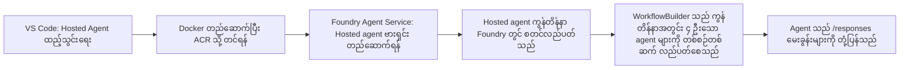
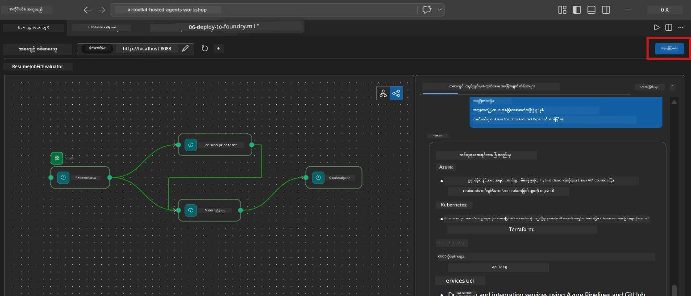

# Module 6 - Foundry Agent Service သို့ တပ်ဆင်ခြင်း

⏱️ ~10 မိနစ်

ဤမော်ဂျူးတွင်၊ သင်၏ တိုင်းပြည်တွင် စမ်းသပ်ပြီးသော multi-agent workflow ကို [Microsoft Foundry](https://learn.microsoft.com/azure/foundry/agents/concepts/hosted-agents)တွင် **Hosted Agent** အဖြစ် တပ်ဆင်မည် ဖြစ်သည်။ တပ်ဆင်ခြင်းလုပ်ငန်းစဉ်သည် Docker container ရုပ်ပုံတည်ဆောက်ခြင်း၊ [Azure Container Registry (ACR)](https://learn.microsoft.com/azure/container-registry/container-registry-intro) သို့ ထုတ်ပို့ခြင်းနှင့် [Foundry Agent Service](https://learn.microsoft.com/azure/foundry/agents/how-to/publish-agent) တွင် hosted agent ဗားရှင်းတစ်ခုဖန်တီးခြင်းတို့ ပါဝင်သည်။

> **Lab 01 နှင့် ကွာခြားချက်အရေးပါသောအချက်:** တပ်ဆင်ခြင်းလုပ်ငန်းစဉ်မှာ တူညီပါသည်။ Foundry သည် သင်၏ multi-agent workflow ကို hosted agent တစ်ခုအဖြစ် ကိုင်တွယ်သည် - အခက်အခဲများမှာ container အတွင်းရှိသော်လည်း တပ်ဆင်မှု စတုရန်းမှာ `/responses` endpoint တစ်ခုတည်းဖြစ်သည်။

### တပ်ဆင်မှု လုပ်ငန်းစဉ်


```mermaid
flowchart LR
    A[VS Code: Hosted Agent ထည့်သွင်းရေး] --> B[Docker တည်ဆောက်ပြီး ACR သို့ တင်ရန်]
    B --> C[Foundry Agent Service: Hosted agent ဗားရှင်း တည်ဆောက်ရန်]
    C --> D[Hosted agent ကွန်တိန်နာ Foundry တွင် စတင်လည်ပတ်သည်]
    D --> E[WorkflowBuilder သည် ကွန်တိန်နာအတွင်း ၄ ဦးသော agent များကို တစ်စဉ်တစ်ဆက် လည်ပတ်စေသည်]
    E --> F[Agent သည် /responses မေးခွန်းများကို တုံ့ပြန်သည်]
```

---

## လိုအပ်ချက်များ စစ်ဆေးခြင်း

တပ်ဆင်မှုမပြုလုပ်ခင် အောက်ပါ အချက်အားလုံးကို အတည်ပြုပါ:

1. **Agent သည် ဒေသန္တရ smoke စမ်းသပ်မှုများ ကျော်လွန်သည်:**
   - အားလုံး [Module 5](05-test-locally.md) တွင်ပါဝင်သည့် စမ်းသပ်မှု ၃ ခုကို ပြီးစီးပြီး၊ workflow သည် ချွတ်ယွင်းနေသောကဒ်များနှင့် Microsoft Learn URL များပါသည့် အပြည့်အစုံ output ပေးသည်။

2. **သင်မှာ [Foundry User](https://learn.microsoft.com/azure/foundry/concepts/rbac-foundry) အခန်းကဏ္ဍ ရှိသည်** (တပ်ဆင်ရန်၊ အနည်းဆုံး **Foundry Project Manager** အခန်းကဏ္ဍသည် project scope တွင် လိုအပ်သည်):

   > **မှတ်ချက်:** Foundry RBAC အခန်းကဏ္ဍများကို မကြာသေးမီက အမည်ပြောင်းထားသည် - **Foundry User**, **Foundry Owner**, နှင့် **Foundry Project Manager** သည် ယခင်တွင် Azure AI User, Azure AI Owner, နှင့် Azure AI Project Manager ဟု အမည်ပေးထားသည်။ အခန်းကဏ္ဍ ID များနှင့် ခွင့်ပြုချက်များ မပြောင်းလဲကြောင်း သေချာပါ။

   - [Azure Portal](https://portal.azure.com) တွင် သင်၏ Foundry **project** အရင်းအမြစ် → **Access control (IAM)** → **Role assignments** → သင်၏အကောင့်အတွက် **Foundry User** (သို့) များသောအားဖြင့် ရှိ/မရှိ အတည်ပြုပါ။

3. **VS Code တွင် Azure သို့ ဝင်ထားပြီဖြစ်သည်:**
   - VS Code ၏ နိမ့်ဆုံး ဘယ်ဘက်ရှိ Accounts အိုင်ਕွန်ကို စစ်ဆေးပါ။ သင့်အကောင့်အမည်ကို မြင်ရမည်။

4. **`agent.yaml` တွင် တိကျသည့် တန်ဖိုးများ ရှိသည်:**
   - `PersonalCareerCopilot/agent.yaml` ဖိုင်ကိုဖွင့်၍ အတည်ပြုပါ:
     ```yaml
     environment_variables:
       - name: AZURE_AI_MODEL_DEPLOYMENT_NAME
         value: ${AZURE_AI_MODEL_DEPLOYMENT_NAME}
     ```
   - `FOUNDRY_PROJECT_ENDPOINT` ကို ဤနေရာတွင် မဖေါ်ပြထားပါ - Foundry သည် runtime တွင် ထည့်သွင်းသည်။ သာမက `AZURE_AI_MODEL_DEPLOYMENT_NAME` ကိုသာ ကြေညာရန် လိုအပ်သည်။

5. **`requirements.txt` တွင် ဗားရှင်းများမှန်ကန်သည်:**
   ```
   agent-framework-foundry
   agent-framework-foundry-hosting
   mcp<2,>=1.24.0
   debugpy
   ```

---

## အဆင့် ၁: တပ်ဆင်မှု စတင်ခြင်း

### ရွေးချယ်စရာ A: Agent Inspector မှ တပ်ဆင်ခြင်း (အကြံပြုချက်)

Agent သည် F5 ဖြင့် အလုပ်လုပ်နေပြီး Agent Inspector ဖြင့် ဖွင့်ထားပါက:

1. Agent Inspector ပန်းရံပေါ် အပေါ်ညာထောင့်ကို ကြည့်ပါ။
2. **Deploy** ခလုတ် (တိမ်ပုံနှင့် မြောက်ပြလျက်ရှိသော ညွှန်ဆောင်အိုင်ကွန်) ကို နှိပ်ပါ။
3. တပ်ဆင်မှု စနစ်တက်ပေါ်ပါမည်။



### ရွေးချယ်စရာ B: Command Palette မှ တပ်ဆင်ခြင်း

1. `Ctrl+Shift+P` ကိုနှိပ်၍ **Command Palette** ကိုဖွင့်ပါ။
2. ပိုင်းရေးပါ: **Foundry Toolkit: Deploy Hosted Agent** သို့မဟုတ် လိုအပ်သလို ရွေးချယ်ပါ။
3. တပ်ဆင်မှု စနစ်ဖွင့်မည်။

---

## အဆင့် ၂: တပ်ဆင်မှု ကို ပြင်ဆင်ခြင်း

### 2.1 ရည်ရွယ်ထားသော စီမံကိန်း ရွေးချယ်ခြင်း

1. Dropdown တွင် သင့် Foundry စီမံကိန်းများကို ပြသသည်။
2. လုပ်ငန်းခွင်အတွင်း အင်အားပေးသည့် စီမံကိန်း (ဥပမာ `workshop-agents`) ကို ရွေးချယ်ပါ။

### 2.2 Container agent ဖိုင် ရွေးချယ်ခြင်း

1. Agent entry point ကို ရွေးချယ်ရန် မေးလေ့ရှိသည်။
2. `workshop/lab02-multi-agent/PersonalCareerCopilot/` သို့ ဖြတ်သန်းပြီး **`main.py`** ကို ရွေးချယ်ပါ။

### 2.3 ရင်းနှီးမြှုပ်နှံမှုများ ပြင်ဆင်ခြင်း

| ဆက်တင် | အကြံပြုပြီးသော တန်ဖိုး | မှတ်ချက်များ |
|---------|------------------|-------|
| **တပ်ဆင်မှု နည်းလမ်း** | **Container** (အကြံပြု) သို့မဟုတ် **Code** | Container သည် Docker ရုပ်ပုံတည်ဆောက်သည်။ Code သည် ZIP အဖြစ်အရင်းအမြစ်များ ရုပ်သိမ်းမှုဖြစ်သည် (preview) |
| **Container Registry** | **Default ACR** | Foundry သည် သင်အတွက် တစ်ခုဖန်တီးပြီး စီမံခန့်ခွဲသည် |
| **CPU** | `0.25` | ပုံမှန်။ Multi-agent workflow များသည် model calls များသည် I/O-ခက်ခဲမှုကိုရောက်ရှိသောကြောင့် CPU လိုအပ်ချက်နည်းသည် |
| **Memory** | `0.5Gi` | ပုံမှန်။ သင့်တင်သွင်းမှုတွင် တစိတ်တပိုင်း ဒေတာဆက်စပ်ကိရိယာကြီးများ ထည့်သွင်းချင်လျှင် `1Gi` သို့ တိုးပါ |

---

## အဆင့် ၃: အတည်ပြု၍ တပ်ဆင်ခြင်း

1. စနစ်တက်သည် တပ်ဆင်မှု အကျဉ်းချုပ်အသေးစိတ်ကို ပြသည်။
2. ပြန်လည်သုံးသပ်ပြီး **Confirm and Deploy** ကို နှိပ်ပါ။
3. VS Code တွင် တပ်ဆင်မှု တိုးတက်မှုကို မျှောမျှော်ကြည့်ပါ။

### တပ်ဆင်မှု အတွင်း ဖြစ်ပေါ်သည့်အမှုများ

VS Code **Output** panel ကိုကြည့်ပါ ("Microsoft Foundry" dropdown ကို ရွေးချယ်ပါ):

1. **Docker build** - သင့် `Dockerfile` ကနေ container တည်ဆောက်သည်
   ```
   Step 1/6 : FROM python:3.12-slim
   Step 2/6 : WORKDIR /app
   ...
   Successfully built abc123def456
   ```

2. **Docker push** - ဓါတ်ပုံကို ACR သို့ ထုတ်ပေးသည် (ပထမဆုံးတပ်ဆင်မှုတွင် ၁-၃ မိနစ်ကြာသည်)။

3. **Agent မှတ်ပုံတင်ခြင်း** - Foundry သည် `agent.yaml` metadata ဖြင့် hosted agent တစ်ခု ဖန်တီးသည်။ Agent အမည်မှာ `resume-job-fit-evaluator` ဖြစ်သည်။

4. **Container စတင်ခြင်း** - Container သည် Foundry ၏ စနစ်စီမံတဲ့ အုတ်မြစ်ပေါ်တွင် စတင်တည်ရှိပါသည်၊ system-managed identity ဖြင့် ဆောင်ရွက်သည်။

> **ပထမ တပ်ဆင်မှုသည် များသောအားဖြင့် နည်းနည်း နှေးကွေးသည်** (Docker သည် အထပ်အလ layers များအားလုံး push လုပ်သည်)။ နောက်တမျိုးမွန်တပ်ဆင်မှုများတွင် cache အလွှာများ အသုံးပြု၍ ပိုမြန်သည်။

### Multi-agent အထူး မှတ်ချက်များ

- **Agent လေးခုလုံးကို Container တစ်ခုထဲတွင် ထည့်သွင်းထားသည်။** Foundry သည် hosted agent တစ်ခုတည်းအဖြစ် ကိုင်တွယ်သည်။ WorkflowBuilder ကတ်ပြားသည် အတွင်းမှာ တည်ရှိသည်။
- **MCP ခေါ်ဆိုမှုများသည် အပြင်ပေါက်သို့ ထွက်သွားသည်။** Container သည် `https://learn.microsoft.com/api/mcp` ကိုဆက်သွယ်ရန် အင်တာနက်လမ်းကြောင်းလိုအပ်သည်။ Foundry ရဲ့ စနစ်စီမံတဲ့ အုတ်မြစ်မှာ ယင်းအား ပံ့ပိုးပေးထားသည်။
- **[Managed Identity](https://learn.microsoft.com/azure/foundry/agents/concepts/agent-identity).** Foundry သည် ဖို့တပ်ဆင်သော hosted agent တစ်ခုချင်းစီအတွက် **စီမံထားသော per-agent Entra identity** ကို အလိုအလျောက် ဖန်တီးပေးသည်။ Hosted ပတ်ဝန်းကျင်တွင် `DefaultAzureCredential` သည် အလိုအလျောက် agent identity သို့ မဖြစ်မနေဖြေရှင်းပေးသည် - managed identity ကို လက်ထောက်ဆက်တင် ပြုလုပ်ဖို့ မလိုအပ်ပါ။

---

## အဆင့် ၄: တပ်ဆင်မှု အခြေအနေကို အတည်ပြုခြင်း

1. **Microsoft Foundry** Sidebar ကိုဖွင့်ပါ (Activity Bar တွင် Foundry အိုင်ကွန်းကို နှိပ်ပါ)။
2. သင်၏ project အောက်မှာ **Hosted Agents (Preview)** ကိုချဲ့ထွင်ပါ။
3. **resume-job-fit-evaluator** (သို့) သင့် agent အမည်ကို ရှာပါ။
4. Agent အမည်ကို နှိပ်ပြီး ဗားရှင်းများ (ဥပမာ `v1`) ကိုချဲ့ထွင်ပါ။
5. ဗားရှင်းကို နှိပ်ပြီး → **Container Details** ကိုကြည့်ပါ → **Status**:


| Status | အဓိပ္ပါယ် |
|--------|---------|
| **active** | Agent သည် အလုပ်လုပ်နေပြီး မေးခွန်းများ လက်ခံရန် ပြင်ဆင် آماده ဖြစ်သည် |
| **creating** | Container သည် စတင်နေသည် (၃၀-၆၀ စက္ကန့် စောင့်ပါ) |
| **failed** | Container သည် စတင်မှု မအောင်မြင်ပါ (log များကြည့်ပါ - အောက်တွင် ကြည့်ရှုရန်) |

> **မှတ်ချက်:** VS Code sidebar သည် "Running" သို့မဟုတ် "Started" လို ဖော်ပြနိုင်သော်လည်း အောက်ခံ API အခြေအနေမှာ `active`/`creating` ဖြစ်သောကြောင့် နှစ်မျိုးစလုံးသည် တူညီသော အခြေအနေကို ပေါ်ပြပါသည်။

> **Multi-agent စတင်ခြင်းသည် စSingle agent ထက် ကြာမြင့်စေသည်** container သည် စတင်ရာတွင် Agent လေးခု ဖန်တီးသည်။ `creating` အခြေအနေ သည် ၂ မိနစ်အထိ ရှိခြင်းသည် သာမန်ဖြစ်သည်။

---

## ရိုးရာ တပ်ဆင်မှု အမွားများနှင့် ဖြေရှင်းနည်းများ

### အမှား ၁: ခွင့်ပြုချက် ပယ်ချခြင်း - `agents/write`

```
Error: lacks the required data action 
Microsoft.CognitiveServices/accounts/AIServices/agents/write
```

**ဖြေရှင်းနည်း:** **[Foundry User](https://learn.microsoft.com/azure/foundry/concepts/rbac-foundry)** အခန်းကဏ္ဍ (ယခင်တွင် **Azure AI User**) ကို **project** အဆင့်တွင် ပေးအပ်ပါ။ ဆက်လက် လမ်းညွှန်များအတွက် [Module 8 - Troubleshooting](08-troubleshooting.md) ကို ကြည့်ပါ။

### အမှား ၂: Docker မသွားနေခြင်း

```
Error: Docker build failed / Cannot connect to Docker daemon
```

**ဖြေရှင်းနည်း:**
1. Docker Desktop ကို စတင်ပါ။
2. "Docker Desktop is running" ဖြစ်သည်ထိ စောင့်ပါ။
3. အတည်ပြုပါ: `docker info`
4. **Windows:** Docker Desktop ဆက်တင်တွင် WSL 2 backend ကို ဖွင့်ထားမှုရှိ/မရှိ စစ်ဆေးပါ။
5. အကြိမ်ကြိမ် ထပ်မံ ကြိုးစားပါ။

### အမှား ၃: Docker build အတွင်း pip install မအောင်မြင်မှု

```
Error: Could not find a version that satisfies the requirement agent-framework-foundry
```

**ဖြေရှင်းနည်း:** `requirements.txt` မှန်ကန်မှုကို အတည်ပြုပါ:
```
agent-framework-foundry
agent-framework-foundry-hosting
mcp<2,>=1.24.0
debugpy
```

မအောင်မြင်မှု ဆက်လက် ဖြစ်ပါက သင့် Docker network သည် PyPI ကိုတားမြစ်နေရန် ဖြစ်နိုင်သည်။ `docker info` ကို proxy ဆက်တင်များအတွက် စစ်ဆေးပါ။

### အမှား ၄: hosted agent တွင် MCP tool မအောင်မြင်မှု

တပ်ဆင်ပြီးနောက် Gap Analyzer သည် Microsoft Learn URL မထုတ်ပေးတော့ပါက:

**အကြောင်းရင်း:** Container မှ HTTPS အပြင်သို့ ထွက်သွားမှုကို network မူဝါဒ တားဆီးထားနိုင်သည်။

**ဖြေရှင်းနည်း:**
1. Foundry ၏ပုံမှန် ဆက်တင်ဖြင့် ယင်းအရာ မဖြစ်ပါ။
2. ဖြစ်ပါက Foundry စီမံကိန်း virtual network တွင် NSG ပြုပြင်ရန် HTTPS အပြင်သို့ထွက်ရန် တားမြစ်မှုရှိ/မရှိ စစ်ဆေးပါ။
3. MCP tool တွင် fallback URLs တွေပါရှိသောကြောင့် agent သည် output ထုတ်ပေးမည်ဖြစ်ပြီး (live URL မပါ)။

---

### စစ်ဆေးချိန်

- [ ] VS Code တွင် တပ်ဆင်မှု အမိန့်ကို အမှားများ အပြုံးမရှိ ပြီးစီးခဲ့သည်
- [ ] Foundry sidebar တွင် **Hosted Agents (Preview)** အောက်တွင် agent မြင်တွေ့ပါသည်
- [ ] Agent အမည်သည် `resume-job-fit-evaluator` (သို့) သင်ရွေးချယ်ထားသော အမည်ဖြစ်သည်
- [ ] Container နေရာအခြေအနေသည် **Started** သို့မဟုတ် **Running** ကို ပြသည်
- [ ] (အမှားများ ရှိပါက) အမှားကို ရှာဖွေသိရှိထားပြီး ဖြေရှင်းချက်ကို လုပ်ဆောင်ပြီး ထပ်မံတပ်ဆင်ခြင်း အောင်မြင်သည်

---

**ပြီးခဲ့သည်:** [05 - Test Locally](05-test-locally.md) · **နောက်တစ်ခု:** [07 - Verify in Playground →](07-verify-in-playground.md)

---

<!-- CO-OP TRANSLATOR DISCLAIMER START -->
**ပြောကြားချက်**
ဤစာတမ်းကို AI ဘာသာပြန်ဝန်ဆောင်မှု [Co-op Translator](https://github.com/Azure/co-op-translator) အသုံးပြု၍ ဘာသာပြန်ထားပါသည်။ ကျွန်ုပ်တို့သည် တိကျမှန်ကန်မှုအတွက် ကြိုးပမ်းနေသော်လည်း၊ စက်ကိရိယာဘာသာပြန်ခြင်းများတွင် အမှားများ သို့မဟုတ် မှားယွင်းချက်များ ပါဝင်နိုင်ကြောင်း သတိပြုပါရန် လိုအပ်ပါသည်။ မူလစာတမ်းကို မူရင်းဘာသာဖြင့်သာ ယုံကြည်စိတ်ချရသော အချက်အလက်အဖြစ် သတ်မှတ်သင့်သည်။ အရေးကြီးသည့် သတင်းအချက်အလက်များအတွက် ပရော်ဖက်ရှင်နယ် လူသားဘာသာပြန်သူဝန်ဆောင်မှုကို အကြံပြုပါသည်။ ဤဘာသာပြန်ချက်ကို အသုံးပြုခြင်းမှ ဖြစ်ပေါ်လာသော နားလည်မှုကွာခြားမှုများ သို့မဟုတ် မမှန်ကန်သော အသုံးပြုမှုများအတွက် ကျွန်ုပ်တို့ တာဝန်မခံပါ။
<!-- CO-OP TRANSLATOR DISCLAIMER END -->