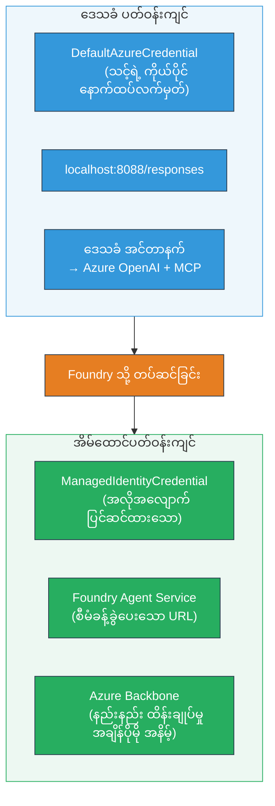

# Module 7 - Playground တွင် စစ်ဆေးခြင်း

ဤ module တွင် သင်၏ deployment ပြုလုပ်ထားသော multi-agent workflow ကို **VS Code** နှင့် **[Foundry Portal](https://ai.azure.com)** တို့တွင် စမ်းသပ်ပြီး agent သည် local စစ်ဆေးမှုနှင့်တူညီစွာ လုပ်ဆောင်နေကြောင်း အတည်ပြုသည်။

---

## Deployment ပြီးနောက် မည်သို့စစ်ဆေးသနည်း?

သင့် multi-agent workflow ကို locally မှတစ်ဆင့် ကျော်လွန်စွာ လည်ပတ်ခဲ့သော်လည်း ပြန်စမ်းသပ်ရန် တကယ်လိုလားရသောအကြောင်းအရင်းများမှာ hosted ပတ်ဝန်းကျင်သည် အောက်တွင်ဖော်ပြထားသည့် နည်းလမ်းများဖြင့် ကြာခြားသည်။


| ကြာခြားချက် | Local | Hosted |
|-----------|-------|--------|
| **မှတ်ပုံတင်** | [`DefaultAzureCredential`](https://learn.microsoft.com/azure/developer/python/sdk/authentication/credential-chains#defaultazurecredential-overview) (သင်၏ ပုဂ္ဂိုလ်ရေးလက်မှတ်ဝင်ခြင်း) | [`ManagedIdentityCredential`](https://learn.microsoft.com/python/api/overview/azure/identity-readme#managed-identity-support) (auto-provisioned) |
| **အဆုံးသတ်ချက်** | `http://localhost:8088/responses` | [Foundry Agent Service](https://learn.microsoft.com/azure/foundry/agents/concepts/hosted-agents) endpoint (managed URL) |
| **ကွန်ရက်** | Local machine → Azure OpenAI + MCP outbound | Azure backbone (service များအကြား latency နည်းနည်း) |
| **MCP ဆက်သွယ်မှု** | Local internet → `learn.microsoft.com/api/mcp` | Container outbound → `learn.microsoft.com/api/mcp` |

ပတ်ဝန်းကျင် variable မတိကျခြင်း၊ RBAC မတူညီခြင်း သို့မဟုတ် MCP outbound ပိတ်ဆိုင်းခြင်းများရှိပါက ဤနေရာတွင် ဖမ်းဆီးနိုင်ပါသည်။

---

## ရွေးချယ်မှု A: VS Code Playground တွင် စမ်းသပ်ခြင်း (ပထမ ဦး စွာ အကြံပြု)

[Foundry extension](https://marketplace.visualstudio.com/items?itemName=TeamsDevApp.vscode-ai-foundry) သည် VS Code ထဲမှ ပြေးဆွဲထားသော Playground အပိုင်းပါရှိပြီး သင်၏ deployed agent နှင့် စကားပြောဆက်ဆံနိုင်သည်။

### ခြေလှမ်း ၁: သင့် Hosted Agent ကို သွားပါ

1. VS Code ၏ **Activity Bar** (ဘယ်ဘက် sidebar) တွင် **Microsoft Foundry** icon ကိုနှိပ်၍ Foundry panel ကိုဖွင့်ပါ။
2. သင့် ချိတ်ဆက်ထားသော project (ဥပမာ `workshop-agents`) ကိုချဲ့ပါ။
3. **Hosted Agents (Preview)** ကိုချဲ့ပါ။
4. သင့် agent အမည် (ဥပမာ `resume-job-fit-evaluator`) ကိုမြင်ရမည်ဖြစ်သည်။

### ခြေလှမ်း ၂: ဗားရှင်းကို ရွေးပါ

1. agent အမည်ကိုနှိပ်၍ ၎င်း၏ဗားရှင်းများကိုချဲ့ပါ။
2. deployed ဖြစ်ပြီးသော ဗားရှင်း (ဥပမာ `v1`) ကိုနှိပ်ပါ။
3. **detail panel** တစ်ခု ဖွင့်ပြီး Container Details ကိုပြသည်။
4. အခြေအနေသည် **Started** သို့မဟုတ် **Running** ဖြစ်ကြောင်း အတည်ပြုပါ။

### ခြေလှမ်း ၃: Playground ကိုဖွင့်ပါ

1. detail panel တွင်ရှိသည့် **Playground** ခလုတ်ကို နှိပ်ပါ (သို့မဟုတ် ဗားရှင်းအားညာနှိပ်၍ → **Open in Playground**)။
2. VS Code ထဲတွင် chat interface တစ်ခု ဖွင့်လှစ်ပါမည်။

### ခြေလှမ်း ၄: သင့် smoke tests များကို ပြေးပါ

[Module 5](05-test-locally.md) အနေဖြင့် အသုံးပြုခဲ့သည့် စမ်းသပ်မှု ၃ ခုကို အတူတူပြုလုပ်ပါ။ Playground input box တွင် အချက်တစ်ခုချင်းစီ ရိုက်ထည့်ပြီး **Send** (သို့မဟုတ် **Enter**) ကိုနှိပ်ပါ။

#### စမ်းသပ်မှု ၁ - အပြည့်အစုံတင်ပြချက် + JD (စံပုံစံ flow)

Module 5, Test 1 မှ တင်ပြထားသော အပြည့်အစုံ resume + JD prompt ကို ကူးထည့်ပါ (Jane Doe + Senior Cloud Engineer at Contoso Ltd)။

**မျှော်မှန်းချက်များ**:
- 100-point scale ဖြင့် Fit score နှင့် ခွဲခြမ်းရေးခြင်း
- Matched Skills အပိုင်း
- Missing Skills အပိုင်း
- နောက် Missing Skill တစ်ခုချင်းစီအတွက် **gap card တစ်ခုစီ** နှင့် Microsoft Learn URLs များ
- သင်ယူရန် Roadmap နှင့် အချိန်ဇယား

#### စမ်းသပ်မှု ၂ - လျှော့ချပြီး စမ်းသပ်မှု (နှစ်ချက်)  

```
RESUME: 3 years Python developer, knows Django and PostgreSQL, no cloud experience.

JOB: Cloud DevOps Engineer requiring AWS, Kubernetes, Terraform, CI/CD. 5 years needed.
```
  
**မျှော်မှန်းချက်များ**:
- Fit score မှနည်းပါး (< 40)
- ရိုးသားသောအကဲဖြတ်ချက်နှင့် အဆင့်ပေးသင်ယူမှု လမ်းကြောင်း
- အတော်များသော gap cards (AWS, Kubernetes, Terraform, CI/CD နှင့် စွမ်းအားလွဲမှားမှု)

#### စမ်းသပ်မှု ၃ - အလွန်တန်ဖိုးမြင့် ကဒ်တင်သူ

```
RESUME:
10 years Azure Cloud Architect. AZ-305 certified. Expert in AKS, Terraform, Azure DevOps, 
Azure Functions, Helm, Prometheus, Grafana, Python, Go. Led platform team of 8.

JOB:
Senior Cloud Engineer. Required: AKS, Terraform, Azure DevOps, Python. Preferred: Helm, Go.
5+ years experience. AZ-305 preferred.
```
  
**မျှော်မှန်းချက်များ**:
- တန်ဖိုးမြင့် Fit score (≥ 80)
- မေးမြန်းမှုအဆင်သင့်နှင့် ပြင်ဆင်မှုတို့အပေါ် အာရုံစိုက်ခြင်း
- gap cards များနည်းပါး သို့မဟုတ် မရှိခြင်း
- လျှော့ချပြီး ပြင်ဆင်မှုအပေါ် အာရုံစူးစိုက်သည့် Timeline

### ခြေလှမ်း ၅: နေရာဒေသခံရလဒ်များနှင့် နှိုင်းယှဉ်ပါ

Module 5 မှာ မှတ်ထားသော notes သို့မဟုတ် browser tab ကိုဖွင့်ပါ။ စမ်းသပ်မှု တစ်ခုချင်းစီအတွက်:

- တုံ့ပြန်ချက်တွင် **တူညီသော ဖွဲ့စည်းပုံ** ရှိပါသလား (fit score, gap cards, roadmap)?
- **တူညီသော ဆင့်ခြားချက် သတ်မှတ်ချက်** ဖြင့် ချမှတ်ထားပါသလား (100-point ခွဲခြမ်းချက်)?
- **Microsoft Learn URLs များ gap cards တွင်ရှိပါသလား**?
- **Missing skill တစ်ခုစီအတွက် gap card တစ်ခုစီ ရှိပါသလား** (ကာစီပြထားခြင်းမရှိမှု)?

> **အသေးစိတ် ဘာသာစကားကွာခြားမှုများ များသည် သာမာန်ဖြစ်သည်** - model သည် non-deterministic ဖြစ်ပါသည်။ ဖွဲ့စည်းပုံ၊ ဆင့်ခြားချက် တည်မြဲမှုနှင့် MCP tools ကိုဦးတည်၍ စစ်ဆေးပါ။

---

## ရွေးချယ်မှု B: Foundry Portal တွင် စမ်းသပ်ခြင်း

[Foundry Portal](https://ai.azure.com) သည် teammate သို့မဟုတ် stakeholder များနှင့် မျှဝေရန် အသုံးဝင်သည့် web-based playground ကို ပေးသည်။

### ခြေလှမ်း ၁: Foundry Portal ကို ဖွင့်ပါ

1. Browser ဖြင့် [https://ai.azure.com](https://ai.azure.com) မှာ သွားပါ။
2. Workshop မှာ သုံးထားသောအတူ Azure account ဖြင့် ဝင်ရောက်ပါ။

### ခြေလှမ်း ၂: သင့် project ကို သွားပါ

1. မူအိမ်စာမျက်နှာတွင် ဘယ်ဘက် sidebar ရှိ **Recent projects** ကို ကြည့်ပါ။
2. သင့် project အမည် (ဥပမာ `workshop-agents`) ကိုနှိပ်ပါ။
3. မမြင်ပါက **All projects** ကိုနှိပ်ပြီး ရှာဖွေပါ။

### ခြေလှမ်း ၃: သင့် deployed agent ကို ရှာဖွေပါ

1. Project ဘယ်ဘက် navigation တွင် **Build** → **Agents** ကိုနှိပ်ပါ (သို့မဟုတ် **Agents** အပိုင်းကို ရှာပါ)။
2. Agent စာရင်းကို မြင်ရမည် ဖြစ်ပြီး သင့် deployed agent (ဥပမာ `resume-job-fit-evaluator`) ကို ရှာဖွေပါ။
3. Agent အမည်ကိုနှိပ်၍ အသေးစိတ်စာမျက်နှာကိုဖွင့်ပါ။

### ခြေလှမ်း ၄: Playground ကိုဖွင့်ပါ

1. Agent အသေးစိတ်စာမျက်နှာတွင် ထိပ်ဆုံး toolbar ကိုကြည့်ပါ။
2. **Open in playground** (သို့မဟုတ် **Try in playground**) ကို နှိပ်ပါ။
3. Chat interface ဖွင့်လှစ်သည်။

### ခြေလှမ်း ၅: ညီမျှသော smoke tests များ ပြေးပါ

VS Code Playground အပိုင်းမှ စမ်းသပ်မှု ၃ ခုကို ထပ်မံပြုလုပ်ပါ။ တုံ့ပြန်ချက်တိုင်းကို local results (Module 5) နှင့် VS Code Playground ရလဒ်များနှင့် နှိုင်းယှဉ်ပါ။

---

## Multi-agent သီးသန့် verification

အခြေခံတရားမျှသာမှသာမက multi-agent သီးသန့် လုပ်ဆောင်ချက်များကိုလည်း အတည်ပြုပါ။

### MCP tool ပြုလုပ်မှု

| စစ်ဆေးချက် | ပြုလုပ်ရန်နည်းလမ်း | ဖြတ်သန်းမှုပြည့်စုံမှု |
|-------|---------------|----------------|
| MCP calls ရှင်းပြီ | Gap cards တွင် `learn.microsoft.com` URLs ရှိပါသလား | အမှန် URL များ ရှိရမည်၊ fallback message မဟုတ်ရ။ |
| MCP calls အများကြီး | High/Medium priority gap တစ်ခုချင်းစီတွင် အရင်းအမြစ်များပါရှိသည် | ပထမ gap card သာမက အခြား gap cards များတွင်ပါရှိရမည် |
| MCP fallback ဖော်ပြချက် | URL မရှိပါက fallback စာသား စစ်ဆေးပြီး | Agent သည် gap cards ဆက်လက်ထုတ်ပေးနေခြင်း (URL မပါ/ပါဖြစ်သော်လည်း) |

### Agent ပူးပေါင်းမှု

| စစ်ဆေးချက် | နည်းလမ်း | ဖြတ်သန်းမှု |
|-------|---------------|----------------|
| Agent ၄ ဦးအားလုံး ပြေးဆွဲ | ထွက်ရှိချက်တွင် fit score နှင့် gap cards ပါရှိသည် | Score ကို MatchingAgent သက်ဆိုင်၍ cards ကို GapAnalyzer မှ ထုတ် |
| ပန်းဖောက် ဖန်တီးမှု | တုံ့ပြန်ချိန် သင့်တင့်မှု (< ၂ မိနစ်) | ၃ မိနစ်ကျော်လျှင် parallel execution ပြဿနာရှိနိုင်သည် |
| ဒေတာလွှဲပြောင်းမှုတည်ငြိမ်မှု | Gap cards များသည် matching report ကျော်မှ ကျွမ်းကျင်မှုများကို ရည်ညွှန်းထားသည် | JD တွင် မပါတဲ့ ကျွမ်းကျင်မှုများ မပါရှိရ |

---

## သတ်မှတ်ချက် ဖြစ်စစ်ခြင်း

သင်၏ multi-agent workflow hosted လုပ်ဆောင်ချက်ကို အောက်ပါ သတ်မှတ်ချက်အတိုင်း စစ်ဆေးပါ။

| # | သတ်မှတ်ချက် | ဖြတ်သန်းမှုပြည့်စုံချက် | ဖြတ်သန်း? |
|---|----------|---------------|-------|
| 1 | **လုပ်ဆောင်ချက်မှန်ကန်မှု** | Agent သည် resume + JD ကို fit score နှင့် gap analysis ဖြင့် တုံ့ပြန်သည် | |
| 2 | **ဆင့်ခြားချက် တည်မြဲမှု** | Fit score သည် 100-point scale နှင့် ခွဲခြမ်းချက် ပါရှိသည် | |
| 3 | **Gap card ပြည့်စုံမှု** | မရှိသောကျွမ်းကျင်မှု တစ်ခုစီ အတွက် gap card တစ်ခုစီ ရှိသည် (တစိတ်တပိုင်း မဖြစ်ရ) | |
| 4 | **MCP tool ပေါင်းစည်းမှုပြည့်စုံ** | Gap cards တွင် Microsoft Learn URL များပါဝင်သည် | |
| 5 | **ဖွဲ့စည်းပုံ တည်မြဲမှု** | local နှင့် hosted run များတွင် output ဖွဲ့စည်းပုံကို ညီညွတ်စွာ ထုတ်သည် | |
| 6 | **တုံ့ပြန်ချိန်** | Hosted agent သည် အချိန် ၂ မိနစ်အတွင်း တုံ့ပြန်တယ် | |
| 7 | **အမှားမရှိခြင်း** | HTTP 500 အမှား၊ timeout မရှိ၊ အလွတ် response မရှိ | |

> "Pass" ဆိုသည်မှာ အထက်ပါ သတ်မှတ်ချက် ၇ ခုစလုံးကို playground တစ်ခု (VS Code သို့မဟုတ် Portal) တွင် smoke test ၃ ခုလုံးဖြင့် ဖြတ်တောက်ရန် ဖြစ်သည်။

---

## Playground ပြဿနာများ အတွက် ဖြေရှင်းနည်း

| သိသာတဲ့ လက္ခဏာ | ဖြစ်စေသည့် အကြောင်း | ဖြေရှင်းခြင်း |
|---------|-------------|-----|
| Playground မဖွင့်နိုင် | Container အခြေအနေ "Started" မဟုတ်ပါ | [Module 6](06-deploy-to-foundry.md)သို့ ပြန်သွားပြီး deployment အခြေအနေ စစ်ဆေးပါ၊ "Pending" ရှိပါက စောင့်ပါ |
| Agent ထံမှအလွတ် response ပြန်လာ | Model deployment နာမည် မှားနေခြင်း | `agent.yaml` → `environment_variables` → `MODEL_DEPLOYMENT_NAME` သင့် deployed model နာမည်နှင့် ကိုက်ညီကြောင်း စစ်ဆေးပါ |
| Agent အမှားစာတမ်း ပြန်လာ | [RBAC](https://learn.microsoft.com/azure/foundry/concepts/rbac-foundry) ခွင့်မရှိခြင်း | Project scope တွင် **[Azure AI User](https://aka.ms/foundry-ext-project-role)** ခွင့်ပေးပါ |
| Gap cards တွင် Microsoft Learn URLs မပါ | MCP outbound ပိတ်ဆိုင်းခြင်း သို့မဟုတ် MCP server မရောက်ပါ | Container က `learn.microsoft.com` အထိ ဆက်သွယ်နိုင်မ 여부စစ်ဆေးပါ။ [Module 8](08-troubleshooting.md) ကိုကြည့်ပါ |
| Gap card တစ်ကဒ်သာရှိ (ကန့်သတ်မှုရှိ) | GapAnalyzer အညွှန်းတွင် "CRITICAL" block မပါရှိ | [Module 3၊ ခြေလှမ်း 2.4](03-configure-agents.md) ကို ပြန်လည်သုံးသပ်ပါ |
| Fit score သင့်တင့်မှု အတော်ကြီး ကွာခြား | မတူညီသော model သို့ instruction များ deployment ပြုလုပ်ခြင်း | `agent.yaml` အတွက် env vars များကို local `.env` နှင့် နှိုင်းယှဉ်ပါ၊ လိုအပ်ပါက 다시 deploy လုပ်ပါ |
| Portal တွင် "Agent not found" | Deployment မကြာသေးဖြစ်ခြင်း သို့မဟုတ် မအောင်မြင်ခြင်း | ၂ မိနစ်စောင့်ပြီး refresh ပေးပါ။ မရရှိပါက [Module 6](06-deploy-to-foundry.md) မှ ပြန်လုပ်ပါ |

---

### စစ်ဆေးချက်များ

- [ ] VS Code Playground တွင် agent ကို စမ်းသပ်ပြီး smoke test ၃ ခုလုံး ဖြတ်တောက်ခဲ့သည်။
- [ ] [Foundry Portal](https://ai.azure.com) Playground တွင် agent ကို စမ်းသပ်ပြီး smoke test ၃ ခုလုံး ဖြတ်တောက်ခဲ့သည်။
- [ ] Responses များသည် local စမ်းသပ်မှုနှင့် ဖွဲ့စည်းပုံအား ညီညွတ်သည် (fit score၊ gap cards၊ roadmap)
- [ ] Microsoft Learn URLs များ gap cards တွင် ရှိသည် (MCP tool hosted ပတ်ဝန်းကျင်တွင် အလုပ်လုပ်သည်)
- [ ] Missing skill တစ်ခုအားလုံးအတွက် gap card တစ်ခုစီ ရှိသည် (ကန့်သတ်ခြင်းမရှိ)
- [ ] စမ်းသပ်ချိန်တွင် အမှား သို့မဟုတ် timeout မရှိ
- [ ] စစ်ဆေးမှုပုဒ်မ (ရလဒ်အတည်ပြုခြင်း) ကို ပြီးမြောက်စွာ ဖြည့်စွက်ခဲ့သည် (သတ်မှတ်ချက် ၇ ခုလုံး ဖြတ်တောက်ရ)

---

**မတိုင်မီ:** [06 - Deploy to Foundry](06-deploy-to-foundry.md) · **နောက်တစ်ခု:** [08 - Troubleshooting →](08-troubleshooting.md)

---

<!-- CO-OP TRANSLATOR DISCLAIMER START -->
**ကြေညာချက်**:
ဤစာတမ်းကို AI ဘာသာပြန်ဝန်ဆောင်မှု [Co-op Translator](https://github.com/Azure/co-op-translator) ဖြင့် ဘာသာပြန်ထားပါသည်။ တိကျမှန်ကန်မှုအတွက် ကြိုးပမ်းထားသော်လည်း အလိုအလျှောက် ဘာသာပြန်ချက်များတွင် မှားယွင်းချက်များ သို့မဟုတ် မမှန်ကန်မှုများ ရှိနိုင်ပါသည်ကို သတိပြုပါရန်။ ဘာသာပြန်မူရင်းစာတမ်းကို အခြေခံအတိုင်း အာဏာသာမကျခြင်းအရင်းခံအဖြစ် သတ်မှတ်သင့်ပါသည်။ အရေးပါသော သတင်းအချက်အလက်များအတွက်တော့ ကျွမ်းကျင်သော လူသားဘာသာပြန်ခြင်းကို အကြံပြုပါသည်။ ဤဘာသာပြန်ချက်ကို အသုံးပြုရာမှ ဖွဲ့စည်းမှုများ သို့မဟုတ် မမှန်ကန်မှုများ ဖြစ်ပေါ်လာခြင်းအတွက် ကျွန်ုပ်တို့ တာဝန်မယူပါ။
<!-- CO-OP TRANSLATOR DISCLAIMER END -->