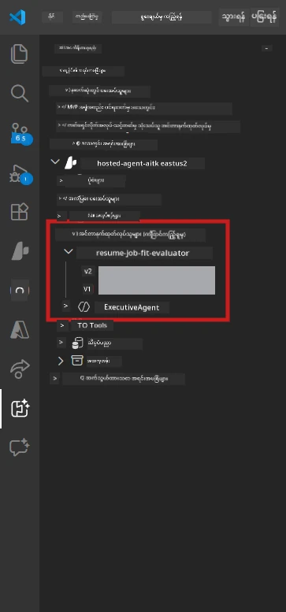

# Module 7 - Playground တွင် စစ်ဆေးခြင်း

⏱️ ~10 မိနစ်

ဤ module တွင် သင်၏ deployed လုပ်ထားသော multi-agent workflow ကို VS Code နှင့် Foundry Portal တွင် စမ်းသပ်ပြီး၊ agent သည် local စမ်းသပ်မှုနှင့် တူညီစေရန် အတည်ပြုသည်။

---

## ထပ်မံ စမ်းသပ်ရသော အကြောင်းရင်း

Hosted ပတ်ဝန်းကျင်သည် local နှင့် အရေးပါတ်သော ကွဲပြားချက်များရှိသည်-

| | Local | Hosted |
|--|-------|--------|
| **သက်မှတ်အချက်အလက်** | သင့် ကိုယ်ပိုင် စာရင်းဝင်ခြင်း (`DefaultAzureCredential`) | တစ်ဦးချင်း agent အလိုက် အသီးသီး ခွဲဝေပေးထားသော Entra ကိုယ်ပိုင် မှတ်ပုံတင် (deploy အချိန်တွင် အလိုအလျောက် provision ဖြစ်သည်) |
| **အဆုံးအထိန်လိပ်စာ** | `http://localhost:8088/responses` | Foundry Agent Service က စီမံထိန်းချုပ်သည့် URL |
| **ကွန်ယက်** | သင့်စက် → Azure OpenAI + MCP | Azure backbone (နုတ် latency နည်း) |

မှားယွင်းစွာ ပြင်ဆင်ထားသော env var၊ RBAC ပြဿနာ၊ သို့မဟုတ် MCP outbound ခေါ်ဆိုမှု ပိတ်ဆို့ခြင်းတို့သည် ဤနေရာတွင် ပထမဦးဆုံး တွေ့ရှိနိုင်သည်။

---

## ရွေးချယ်မှု A: VS Code Playground တွင် စမ်းသပ်ခြင်း (အကြံပြုသော ပထမဦးစွာနည်းလမ်း)

### အဆင့် 1: သင့် hosted agent သို့ သွားရန်

1. Activity Bar တွင် **Foundry Toolkit** ကိုနှိပ်ပါ။
2. သင့် project ကို ဖွင့်ပြီး → **Hosted Agents (Preview)** → သင့် agent ကို ရှာဖွေပါ။



### အဆင့် 2: ဗားရှင်းကို ရွေးချယ်ခြင်း

1. agent ကိုနှိပ်ပြီး ၎င်း၏ ဗားရှင်းများ ဖွင့်ပါ။
2. `v1` ကိုနှိပ်ပြီး အခြေအနေသည် **active** ဖြစ်ကြောင်း အတည်ပြုပါ (sidebar ရှိစာသားမှာ "Running" သို့မဟုတ် "Started" လဲ ဖြစ်နိုင်ပြီး၊ ရရှိသည့် အခြေအနေတူညီသည်)။

### အဆင့် 3: Playground ကို ဖွင့်ပါ

1. **Playground** ကိုနှိပ်ပါ (သို့မဟုတ် ဗားရှင်းကို right-click ပြုလုပ်ပြီး → **Open in Playground** ကိုရွေးချယ်ပါ)။
2. VS Code tab တစ်ခုတွင် စကားပြော ပြတင်းပေါက် ထွက်ပေါ်ပါမည်။

### အဆင့် 4: သင့်အတိုင်ပင်ခံ စမ်းသပ်မှုများကို ပြုလုပ်ပါ

[Module 5](05-test-locally.md) မှ တူညီသော ၃ ချက် စမ်းသပ်မှုများကို အသုံးပြုပါ။ Playground input box တွင် မက်ဆေ့ချ်များကို ရိုက်ထည့်ပြီး **Send** (သို့မဟုတ် **Enter**) ကိုနှိပ်ပါ။

#### စမ်းသပ်မှု ၁ - ပြည့်စုံသော resume + JD (စံနမူနာ သွင်ပြင်)

Module 5, စမ်းသပ်မှု ၁ မှ ပြည့်စုံသော resume + JD prompt ကို ကူးယူ ထည့်ပါ (Jane Doe + Senior Cloud Engineer at Contoso Ltd)။

**မျှော်မှန်းချက်:**
- Fit score နှင့် မှန်ကန်သော စာရင်းပေးခြင်း (၁၀၀ အဆင့်တွက်ချက်ခြင်း)
- ကိုက်ညီသော ကျွမ်းကျင်မှု အပိုင်း
- မရှိသေးသော ကျွမ်းကျင်မှု အပိုင်း
- မရှိသေးသော ကျွမ်းကျင်မှု တစ်ခုစီအတွက် **တစ်ခုချင်း gap card** Microsoft Learn URL များပါရှိသည်
- သင်ယူရေးဆွဲချက် နှင့် အချိန်ဇယား ပါရှိသည်

#### စမ်းသပ်မှု ၂ - အမြန်နှင့် အတိုချုပ် စမ်းသပ်မှု (နည်းဆုံး အချက်အလက်)

```
RESUME: 3 years Python developer, knows Django and PostgreSQL, no cloud experience.

JOB: Cloud DevOps Engineer requiring AWS, Kubernetes, Terraform, CI/CD. 5 years needed.
```

**မျှော်မှန်းချက်:**
- Fit score နိမ့်(< 40)
- တိကျသော အကဲဖြတ်ချက်နှင့် အဆင့်လိုက် သင်ယူခြင်း လမ်းညွှန်ပါရှိသည်
- Gap card များစွာ (AWS, Kubernetes, Terraform, CI/CD, အတွေ့အကြုံအနည်း)

#### စမ်းသပ်မှု ၃ - အမြင့်တက် fit candidate

```
RESUME:
10 years Azure Cloud Architect. AZ-305 certified. Expert in AKS, Terraform, Azure DevOps, 
Azure Functions, Helm, Prometheus, Grafana, Python, Go. Led platform team of 8.

JOB:
Senior Cloud Engineer. Required: AKS, Terraform, Azure DevOps, Python. Preferred: Helm, Go.
5+ years experience. AZ-305 preferred.
```

**မျှော်မှန်းချက်:**
- အမြင့် fit score (≥ 80)
- အင်တာဗျူး ပြင်ဆင်မှုနှင့် တိုးတက်မှု အာရုံစိုက်သည်
- Gap card များ နည်း/မရှိ
- အတိုချုပ် အချိန်ဇယားသည် ပြင်ဆင်မှုကို ဦးတည်သည်

### အဆင့် ၅: ဒေသခံရလဒ်နှင့် နှိုင်းယှဉ်ပါ

Module 5 မှ တည်ဆောက်ထားသော ဒေသခံ တုံ့ပြန်မှုများ ပါရှိသည့် မှတ်တမ်းများ သို့မဟုတ် browser tab ကို ဖွင့်ပါ။ စမ်းသပ်မှု တစ်ခုစီအတွက်-

- တုံ့ပြန်မှုသည် **တူညီသော ဖွဲ့စည်းပုံ** (fit score, gap card များ, သင်ယူရေးဆွဲချက်) ပါရှိနားလည်ပါသလား?
- **တူညီသော အမွေအနှစ်စဉ်သတ်မှတ်ချက်** (၁၀၀ အဆင့် ခွဲခြားချက်) ကို အသုံးပြုသည်လား?
- **Microsoft Learn URL များ** gap card များတွင် များအောင် ရှိနေလား?
- မရှိသေးသော ကျွမ်းကျင်မှုတစ်ခုစီအတွက် **တစ်ခုချင်း gap card** ရှိပါသလား (ပိုင်းဖြတ်ခြင်းမရှိပါ) ?

> **အသုံးအနှုန်း သက်သာ ခြားနားချက်များသည် သဘာဝ တွေ့ရှိမှုဖြစ်သည်** - model သည် အကွဲအချော်ကင်းသော မဟုတ်ပါ။ ဖွဲ့စည်းပုံ၊ အမွေအနှစ်စဉ် မှန်ကန်မှု နှင့် MCP ကိရိယာ အသုံးပြုမှုများတွင် ဦးတည်ပါ။

---

## ရွေးချယ်မှု B: Foundry Portal တွင် စမ်းသပ်ခြင်း

[Foundry Portal](https://ai.azure.com) သည် အဖွဲ့သားများ သို့မဟုတ် စောင့်ကြည့်သူများနှင့် မျှဝေရန် အသုံးဝင်သော web-based playground ကို ပေးဆောင်သည်။

### အဆင့် 1: Foundry Portal ကိုဖွင့်ပါ

1. သင့် browser ကိုဖွင့်ပြီး [https://ai.azure.com](https://ai.azure.com) သို့ သွားပါ။
2. Workshop လုံးလုံးတွင် သုံးနေသော တူညီသည့် Azure account ဖြင့် login ဝင်ပါ။

### အဆင့် 2: သင့် project သို့ သွားပါ

1. home စာမျက်နှာတွင် ဘယ်ဘက် sidebar တွင် **နေ့စဉ် ရောက်ရှိသော project များ** ကို ကြည့်ပါ။
2. သင့် project နာမည် (ဥပမာ- `workshop-agents`) ကို နှိပ်ပါ။
3. မတွေ့လျှင် **All projects** ကို နှိပ်ပြီး ရှာဖွေပါ။

### အဆင့် 3: သင့် deployed agent ကို ရှာဖွေပါ

1. Project ဘယ်ဘက် navigation တွင် **Build** → **Agents** (သို့မဟုတ် **Agents** အပိုင်း) ကို နှိပ်ပါ။
2. agent များစာရင်းကို မြင်ရမည်။ သင့် deployed agent ကို ရှာပါ (ဥပမာ- `resume-job-fit-evaluator`)။
3. agent နာမည်ကို နှိပ်ပါ၊ ၎င်း၏ အသေးစိတ် စာမျက်နှာကို ဖွင့်ပါ။

### အဆင့် 4: Playground ကို ဖွင့်ပါ

1. agent အသေးစိတ် စာမျက်နှာတွင် အပေါ် Tool bar ကို ကြည့်ပါ။
2. **Open in playground** (သို့မဟုတ် **Try in playground**) ကို နှိပ်ပါ။
3. စကားပြော ဆက်သွယ်မှု မျက်နှာပြင် ဖွင့်မည်။

### အဆင့် 5: အတူတူ smoke test များကို ပြုလုပ်ပါ

VS Code Playground အပိုင်း အောက်ပါ ၃ ချက် စမ်းသပ်မှုများအားလုံးကို ထပ်မံ ပြုလုပ်ပါ။ တုံ့ပြန်မှု တစ်ခုပြီး တစ်ခု ဒေသခံရလဒ် (Module 5) နှင့် VS Code Playground ရလဒ် (ရွေးချယ်မှု A အပိုင်း) နှိုင်းယှဉ်ပါ။

---

## Multi-agent အထူး စစ်ဆေးခြင်း

မူလတန်းမှန်ကန်မှုအရသာအပြင်၊ multi-agent အထူးပြု အသွင်သဘောထားများကို အတည်ပြုပါ-

### MCP ကိရိယာ အထွက်လုပ်ဆောင်မှု

| စစ်ဆေးရန် | ဘယ်လို အတည်ပြုမလဲ | ဖြတ်သန်းမှု အခြေအနေ |
|-------|---------------|----------------|
| MCP ခေါ်စေခြင်း အောင်မြင် | Gap card များတွင် `learn.microsoft.com` URL များ ပါဝင် | အစစ်အမှန် URL များ၊ fallback စာသားများ မဟုတ်သော |
| MCP ခေါ်ဆိုမှုပိုများ | High/Medium ဦးစားပေး gap တစ်ခုစီတွင် အရင်းအမြစ်များ ပါရှိ | ပထမဆုံး gap card သာမဟုတ်ပါ |
| MCP fallback ကောင်းစွာအလုပ်လုပ်သည် | URL မရှိပါက fallback စာသား ရှိကြောင်း စစ်ဆေး | Agent မှ gap card များ ထွက်ရှိနေ (URL ရှိ/မရှိမဟုတ်) |

### Agent ညှိနှိုင်းမှု

| စစ်ဆေးရန် | ဘယ်လို အတည်ပြုမလဲ | ဖြတ်သန်းမှု အခြေအနေ |
|-------|---------------|----------------|
| ၄ ဦးလုံး Agent များ လည်ပတ်ခဲ့သည် | ထွက်ရှိမှုတွင် fit score နှင့် gap card များ ပါရှိ | Score သည် MatchingAgent မှ၊ gap cards များသည် GapAnalyzer မှ ဖြစ်သည် |
| နောက်ဆက်တွဲ လည်ပတ်မှု | တုံ့ပြန်ချိန် မှန်ကန် (၂ မိနစ်အောက်) | ၃ မိနစ်ကျော်လျှင် terminal log တွင် error များ ကြည့်ရှုပါ |
| ဒေတာလည်ပတ်မှု စွမ်းအား | gap card များတွင် matching report ၏ ကျွမ်းကျင်မှုများကို ပြန်လည် ရည်ညွှန်း | JD တွင် မပါသော hallucinated ကျွမ်းကျင်မှု မရှိရ |

---

## အတည်ပြု စံနှုန်း

သင့် multi-agent workflow ၏ hosted အပြုအမူကို အကဲဖြတ်ရန် ဤစံနှုန်းကို အသုံးပြုပါ-

| # | စံနှုန်း | ဖြတ်သန်းရန် လိုအပ်ချက် | ဖြတ်သန်းအခြေအနေ? |
|---|----------|---------------|-------|
| ၁ | **လုပ်ဆောင်မှု မှန်ကန်မှု** | Agent သည် resume + JD ကို fit score နှင့် gap analysis ဖြင့် တုံ့ပြန်သည် | |
| ၂ | **အမွေအနှစ် စဉ်ဆက်မှု** | Fit score သည် ၁၀၀ အဆင့် ကိန်းဂဏန်း အသုံးပြုသည် | |
| ၃ | **gap card ပြည့်စုံမှု** | မရှိသေးသော ကျွမ်းကျင်မှု တစ်ခုစီအတွက် card တစ်ခုရှိ (ပိုင်းဖြတ်ခြင်း မရှိ) | |
| ၄ | **MCP ကိရိယာ ပေါင်းစပ်မှု** | gap card များတွင် အစစ် Microsoft Learn URL များ ပါရှိသည် | |
| ၅ | **ဖွဲ့စည်းမှု စဉ်ဆက်မှု** | ထွက်ရှိမှုဖွဲ့စည်းပုံသည် local နှင့် hosted runs အတွက်တူညီသည် | |
| ၆ | **တုံ့ပြန်ချိန်** | Hosted agent သည် ပြည့်စုံသော အကဲဖြတ်မှုအတွက် ၂ မိနစ်အတွင်း ပြန်တုံ့ပြန်သည် | |
| ၇ | **အမှား မရှိပါ** | HTTP 500 အမှားများ၊ timeout များ၊ အလွတ်အတောင်တုံ့ပြန်မှု မရှိစေရန် | |

> "ဖြတ်သန်းခြင်း" သည် smoke test ၃ ချက် အားလုံးအတွက် ၇ ခု Criteria အားလုံး ဖြတ်သန်းထားပြီး playground တစ်ခု (VS Code သို့မဟုတ် Portal) အနက် လက်ခံသည်ကို ဆိုလိုသည်။

---

## Playground ပြဿနာများ ကူးစက်ဖြေရှင်းခြင်း

| ရောဂါလက္ခဏာ | ဖြစ်နိုင်ခြေ အကြောင်းရင်း | ဖြေရှင်းနည်း |
|---------|-------------|-----|
| Playground မဖွင့်နိုင်ခြင်း | Container သည် `active` အခြေအနေနှင့် မဟုတ် | [Module 6](06-deploy-to-foundry.md) သို့ ပြန်သွား၍ deployment status ကို အတည်ပြုပါ။ `creating` ဖြစ်လျှင် ချိန်ဆ ဖြေ့ဆင်းရန် ခဏစောင့်ပါ |
| Agent မှ အလွတ်တုံ့ပြန်မှု | Model deployment နာမည် မကိုက်ညီခြင်း | `agent.yaml` → `environment_variables` → `AZURE_AI_MODEL_DEPLOYMENT_NAME` ကို သင့် deployed model နာမည်နှင့် နှိုင်းယှဉ်စစ်ဆေးပါ |
| Agent မှ အမှား စာသား ပြန်လာခြင်း | [RBAC](https://learn.microsoft.com/azure/foundry/concepts/rbac-foundry) ခွင့်မပေးခြင်း | Project scope တွင် **[Foundry User](https://aka.ms/foundry-ext-project-role)** (ယခင် Azure AI User) ကို ခန့်အပ်ပါ |
| Gap card များတွင် Microsoft Learn URL မရှိခြင်း | MCP outbound ပိတ်ဆို့ခြင်း သို့မဟုတ် MCP server မရရှိနိုင်ခြင်း | Container ၌ `learn.microsoft.com` သို့ ရောက်နိုင်မရရှိ စစ်ဆေးပါ။ [Module 8](08-troubleshooting.md) ကို ကြည့်ရှုပါ |
| Gap card တစ်ခုသာရှိပြီး (ပိုင်းဖြတ်ထားသည်) | GapAnalyzer သတ်မှတ်ချက်တွင် "CRITICAL" block မပါရှိခြင်း | [Module 3, Step 2.4](03-configure-agents.md) ကို ပြန်လည် ကြည့်ရှုပါ |
| fit score သည် တာရာပ်သလို ညှိထားမှမရ | မတူညီသော model သို့မဟုတ် အညွှန်းပါရှိသော မဟုတ်သော နည်းလမ်း အသုံးပြုနေခြင်း | `agent.yaml` env var များကို local `.env` နှင့် နှိုင်းယှဉ်ပါ။ လိုအပ်လျှင် ပြန်တင်ပါ |
| Portal တွင် "Agent မတွေ့ပါ" | Deployment ပြောင်းလဲမှု သို့မဟုတ် မအောင်မြင်သေးမှု | ၂ မိနစ်စောင့်ပြီး Refresh လုပ်ပါ။ မတွေ့လျှင် [Module 6](06-deploy-to-foundry.md) မှ ပြန်တင်ပါ |

---

### စစ်ဆေးမှု အချက်အလက်

- [ ] VS Code Playground တွင် agent စမ်းသပ်ပြီး smoke test ၃ ချက် အားလုံး ဖြတ်သန်းခဲ့သည်
- [ ] [Foundry Portal](https://ai.azure.com) Playground တွင် agent စမ်းသပ်ပြီး smoke test ၃ ချက် အားလုံး ဖြတ်သန်းခဲ့သည်
- [ ] ပြန်ပြောချက်များသည် ဒေသခံ စမ်းသပ်မှုနှင့် ဖွဲ့စည်းမှုတူညီသည် (fit score, gap cards, သင်ယူရေးဆွဲချက်)
- [ ] Microsoft Learn URL များ gap card များတွင် ရှိသည် (hosted ပတ်ဝန်းကျင်တွင် MCP ကိရိယာ အလုပ်လုပ်နေသည်)
- [ ] မရှိသေးသော ကျွမ်းကျင်မှု တစ်ခုစီအတွက် gap card တစ်ခုရှိသည် (ပိုင်းဖြတ်ခြင်း မရှိ)
- [ ] စမ်းသပ်မှုကာလအတွင်း အမှားများ သို့မဟုတ် timeout မရှိပါ
- [ ] အတည်ပြု စံနှုန်းကို ပြီးစီးခဲ့သည် (criteria ၇ ခု အားလုံး ဖြတ်သန်းသည်)

---

**ပြီးခဲ့သည်:** [06 - Deploy to Foundry](06-deploy-to-foundry.md) · **ရှေ့တွင်:** [08 - Troubleshooting →](08-troubleshooting.md)

---

<!-- CO-OP TRANSLATOR DISCLAIMER START -->
**ပြောကြားချက်**
ဤစာတမ်းကို AI ဘာသာပြန်ဝန်ဆောင်မှု [Co-op Translator](https://github.com/Azure/co-op-translator) အသုံးပြု၍ ဘာသာပြန်ထားပါသည်။ ကျွန်ုပ်တို့သည် တိကျမှန်ကန်မှုအတွက် ကြိုးပမ်းနေသော်လည်း၊ စက်ကိရိယာဘာသာပြန်ခြင်းများတွင် အမှားများ သို့မဟုတ် မှားယွင်းချက်များ ပါဝင်နိုင်ကြောင်း သတိပြုပါရန် လိုအပ်ပါသည်။ မူလစာတမ်းကို မူရင်းဘာသာဖြင့်သာ ယုံကြည်စိတ်ချရသော အချက်အလက်အဖြစ် သတ်မှတ်သင့်သည်။ အရေးကြီးသည့် သတင်းအချက်အလက်များအတွက် ပရော်ဖက်ရှင်နယ် လူသားဘာသာပြန်သူဝန်ဆောင်မှုကို အကြံပြုပါသည်။ ဤဘာသာပြန်ချက်ကို အသုံးပြုခြင်းမှ ဖြစ်ပေါ်လာသော နားလည်မှုကွာခြားမှုများ သို့မဟုတ် မမှန်ကန်သော အသုံးပြုမှုများအတွက် ကျွန်ုပ်တို့ တာဝန်မခံပါ။
<!-- CO-OP TRANSLATOR DISCLAIMER END -->