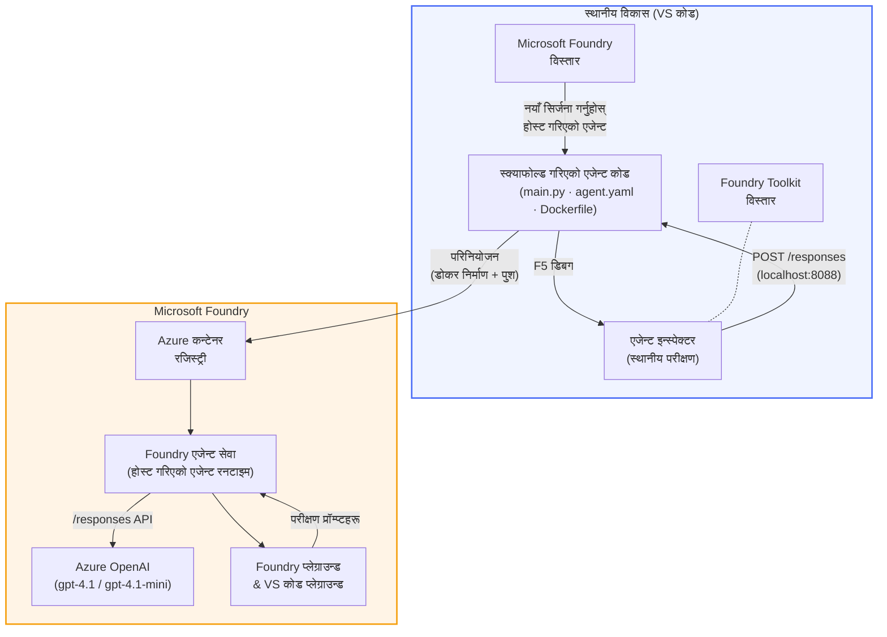

# Foundry Toolkit + Foundry Hosted Agents कार्यशाला

[](https://www.python.org/)
[](https://github.com/microsoft/agents)
[](https://learn.microsoft.com/azure/ai-foundry/agents/concepts/hosted-agents/)
[](https://ai.azure.com/)
[](https://learn.microsoft.com/azure/ai-services/openai/)
[](https://learn.microsoft.com/cli/azure/install-azure-cli)
[](https://learn.microsoft.com/azure/developer/azure-developer-cli/install-azd)
[](https://www.docker.com/)
[](https://marketplace.visualstudio.com/items?itemName=ms-windows-ai-studio.windows-ai-studio)
[](LICENSE)

**Microsoft Foundry Agent Service** मा AI एजेन्टहरूलाई **Hosted Agents** को रूपमा निर्माण, परीक्षण, र परिनियोजन गर्नुहोस् - सम्पूर्ण रूपमा VS Code बाट **Microsoft Foundry extension** र **Foundry Toolkit** प्रयोग गरी।

> **Hosted Agents हाल प्रीभ्युमा छन्।** समर्थित क्षेत्रहरू सीमित छन् - हेर्नुहोस् [region availability](https://learn.microsoft.com/azure/foundry/agents/concepts/hosted-agents#region-availability)।

> प्रत्येक ल्याब भित्रको `agent/` फोल्डर **Foundry extension द्वारा स्वचालित रूपमा निर्माण गरिन्छ** - त्यसपछि तपाईंले कोड कस्टमाइज गर्न, स्थानीय रूपमा परीक्षण गर्न, र परिनियोजन गर्न सक्नुहुन्छ।

<!-- CO-OP TRANSLATOR LANGUAGES TABLE START -->
[Arabic](../ar/README.md) | [Bengali](../bn/README.md) | [Bulgarian](../bg/README.md) | [Burmese (Myanmar)](../my/README.md) | [Chinese (Simplified)](../zh-CN/README.md) | [Chinese (Traditional, Hong Kong)](../zh-HK/README.md) | [Chinese (Traditional, Macau)](../zh-MO/README.md) | [Chinese (Traditional, Taiwan)](../zh-TW/README.md) | [Croatian](../hr/README.md) | [Czech](../cs/README.md) | [Danish](../da/README.md) | [Dutch](../nl/README.md) | [Estonian](../et/README.md) | [Finnish](../fi/README.md) | [French](../fr/README.md) | [German](../de/README.md) | [Greek](../el/README.md) | [Hebrew](../he/README.md) | [Hindi](../hi/README.md) | [Hungarian](../hu/README.md) | [Indonesian](../id/README.md) | [Italian](../it/README.md) | [Japanese](../ja/README.md) | [Kannada](../kn/README.md) | [Khmer](../km/README.md) | [Korean](../ko/README.md) | [Lithuanian](../lt/README.md) | [Malay](../ms/README.md) | [Malayalam](../ml/README.md) | [Marathi](../mr/README.md) | [Nepali](./README.md) | [Nigerian Pidgin](../pcm/README.md) | [Norwegian](../no/README.md) | [Persian (Farsi)](../fa/README.md) | [Polish](../pl/README.md) | [Portuguese (Brazil)](../pt-BR/README.md) | [Portuguese (Portugal)](../pt-PT/README.md) | [Punjabi (Gurmukhi)](../pa/README.md) | [Romanian](../ro/README.md) | [Russian](../ru/README.md) | [Serbian (Cyrillic)](../sr/README.md) | [Slovak](../sk/README.md) | [Slovenian](../sl/README.md) | [Spanish](../es/README.md) | [Swahili](../sw/README.md) | [Swedish](../sv/README.md) | [Tagalog (Filipino)](../tl/README.md) | [Tamil](../ta/README.md) | [Telugu](../te/README.md) | [Thai](../th/README.md) | [Turkish](../tr/README.md) | [Ukrainian](../uk/README.md) | [Urdu](../ur/README.md) | [Vietnamese](../vi/README.md)

> **स्थानीय रूपमा क्लोन गर्न मन छ?**
>
> यो रिपोजिटरीमा ५०+ भाषा अनुवादहरू छन् जसले डाउनलोड साइज बढाउँछ। अनुवाद बिना क्लोन गर्न, sparse checkout प्रयोग गर्नुहोस्:
>
> **Bash / macOS / Linux:**
> ```bash
> git clone --filter=blob:none --sparse https://github.com/microsoft-foundry/Foundry_Toolkit_for_VSCode_Lab.git
> cd Foundry_Toolkit_for_VSCode_Lab
> git sparse-checkout set --no-cone '/*' '!translations' '!translated_images'
> ```
>
> **CMD (Windows):**
> ```cmd
> git clone --filter=blob:none --sparse https://github.com/microsoft-foundry/Foundry_Toolkit_for_VSCode_Lab.git
> cd Foundry_Toolkit_for_VSCode_Lab
> git sparse-checkout set --no-cone "/*" "!translations" "!translated_images"
> ```
>
> यसले तपाईंलाई कोर्स पूरा गर्न आवश्यक सबै कुरा छिटो डाउनलोडको साथ प्रदान गर्दछ।
<!-- CO-OP TRANSLATOR LANGUAGES TABLE END -->

---

## वास्तुकला


**प्रवाह:** Foundry extension ले एजेन्टलाई स्क्याफोल्ड गर्छ → तपाईं कोड र निर्देशहरू अनुकूलन गर्नुहुन्छ → Agent Inspector सँग स्थानीय रुपमा परीक्षण गर्नुहोस् → Foundry मा परिनियोजन गर्नुहोस् (Docker छवि ACR मा पुश गरिन्छ) → Playground मा पुष्टि गर्नुहोस्।

---

## तपाईं के बनाउनेछौं

| ल्याब | विवरण | स्थिति |
|-----|-------------|--------|
| **लयाब ०१ - एकल एजेन्ट** | **"Explain Like I'm an Executive" एजेन्ट** बनाउनुहोस्, स्थानीय रूपमा परीक्षण गर्नुहोस्, र Foundry मा परिनियोजन गर्नुहोस् | ✅ उपलब्ध |
| **लयाब ०२ - बहु-एजेन्ट कार्यप्रवाह** | **"Resume → Job Fit Evaluator"** बनाउनुहोस् - ४ एजेन्टहरूले सहकार्य गरी रिजुमे फिट स्कोर गर्छन् र सिकाइ रोडम्याप बनाउँछन् | ✅ उपलब्ध |

---

## Executive Agent सँग भेट

यस कार्यशालामा तपाईं **"Explain Like I'm an Executive" एजेन्ट** बनाउनुहुनेछ - एक AI एजेन्ट जसले जटिल प्राविधिक भाषा लिएर शान्त, बोर्डरूम-योग्य सारांशमा अनुवाद गर्छ। किनभने साँचो नै हो, कसैले पनि C-सुइटमा "v3.2 मा परिचालित synchronous सङ्घ कलका कारण thread pool exhaustion" जस्तो कुरा सुन्न इच्छाउँदैन।

मैले यो एजेन्ट तेस्रो पटक निर्माण गरेको हुँ जब मेरो पूर्ण तयारी पोस्ट-मोर्टमको प्रतिक्रियाले भन्यो: *"त्यसो भए... वेबसाइट चलिरहेको छ कि छैन?"*

### यसले कसरी काम गर्छ

तपाईं यसलाई प्राविधिक अपडेट दिनुहुन्छ। यो प्रतिक्रियामा तीन तर्फका बुलेट पोइन्टहरू सहित एक कार्यकारी सारांश दिन्छ - कुनै जटिल शब्द होइन, कुनै स्ट्याक ट्रेस छैन, कुनै अस्तित्वगत चिन्ता छैन। केवल **के भयो**, **व्यापार प्रभाव**, र **अर्को कदम**।

### क्रियामा हेर्नुहोस्

**तपाईं भन्नुहुन्छ:**
> "API लेटेन्सी बढ्यो किनभने v3.2 मा परिचालित synchronous कॉलहरूले thread pool exhaustion गरायो।"

**एजेन्टले जवाफ दिन्छ:**

> **कार्यकारी सारांश:**
> - **के भयो:** पछिल्लो रिलिज पछि, प्रणाली सुस्त भयो।
> - **व्यापार प्रभाव:** केही प्रयोगकर्ताहरूले सेवा प्रयोग गर्दा ढिलाइ अनुभव गरे।
> - **अर्को कदम:** परिवर्तनलाई फिर्ता गरिएको छ र पुनः परिनियोजन अघि समाधान तयार भइरहेको छ।

### यस एजेन्ट किन?

यो एकदमै सरल, एकल-उद्देश्य एजेन्ट हो - जटिल उपकरण श्रृंखलाहरूमा फस्न बिना होस्ट गरिएको एजेन्ट कार्यप्रवाह सिक्नका लागि उत्तम। र साँचो कुरा के हो? हरेक इञ्जिनियरिङ टोलीले यस्ता एउटा एजेन्ट चाहन्छ।

---

## कार्यशाला संरचना

```
📂 Foundry_Toolkit_for_VSCode_Lab/
├── 📄 README.md                      ← You are here
├── 📂 ExecutiveAgent/                ← Standalone hosted agent project
│   ├── agent.yaml
│   ├── Dockerfile
│   ├── main.py
│   └── requirements.txt
└── 📂 workshop/
    ├── 📂 lab01-single-agent/        ← Full lab: docs + agent code
    │   ├── README.md                 ← Hands-on lab instructions
    │   ├── 📂 docs/                  ← Step-by-step tutorial modules
    │   │   ├── 00-prerequisites.md
    │   │   ├── 01-install-foundry-toolkit.md
    │   │   ├── 02-create-foundry-project.md
    │   │   ├── 03-create-hosted-agent.md
    │   │   ├── 04-configure-and-code.md
    │   │   ├── 05-test-locally.md
    │   │   ├── 06-deploy-to-foundry.md
    │   │   ├── 07-verify-in-playground.md
    │   │   └── 08-troubleshooting.md
    │   └── 📂 agent/                 ← Reference solution (auto-scaffolded by Foundry extension)
    │       ├── agent.yaml
    │       ├── Dockerfile
    │       ├── main.py
    │       └── requirements.txt
    └── 📂 lab02-multi-agent/         ← Resume → Job Fit Evaluator
        ├── README.md                 ← Hands-on lab instructions (end-to-end)
        ├── 📂 docs/                  ← Step-by-step tutorial modules
        │   ├── 00-prerequisites.md
        │   ├── 01-understand-multi-agent.md
        │   ├── 02-scaffold-multi-agent.md
        │   ├── 03-configure-agents.md
        │   ├── 04-orchestration-patterns.md
        │   ├── 05-test-locally.md
        │   ├── 06-deploy-to-foundry.md
        │   ├── 07-verify-in-playground.md
        │   └── 08-troubleshooting.md
        └── 📂 PersonalCareerCopilot/ ← Reference solution (multi-agent workflow)
            ├── agent.yaml
            ├── Dockerfile
            ├── main.py
            └── requirements.txt
```

> **सूचना:** प्रत्येक ल्याब भित्रको `agent/` फोल्डर **Microsoft Foundry extension** ले कमाण्ड प्यालेटबाट `Microsoft Foundry: Create a New Hosted Agent` चलाउँदा उत्पादन गर्छ। फाइलहरू त्यसपछि तपाईंको एजेन्टका निर्देशनहरू, उपकरणहरू र कन्फिगरेसनका साथ अनुकूलन गरिन्छन्। ल्याब ०१ ले तपाईंलाई यसलाई शून्यबाट पुन: सिर्जना गर्न निर्देशन दिन्छ।

---

## शुरूवात

### १. रिपोजिटरी क्लोन गर्नुहोस्

```bash
git clone https://github.com/microsoft-foundry/Foundry_Toolkit_for_VSCode_Lab.git
cd Foundry_Toolkit_for_VSCode_Lab
```

### २. Python भर्चुअल वातावरण सेटअप गर्नुहोस्

```bash
python -m venv venv
```

यसलाई सक्रिय गर्नुहोस्:

- **Windows (PowerShell):**
  ```powershell
  .\venv\Scripts\Activate.ps1
  ```
- **macOS / Linux:**
  ```bash
  source venv/bin/activate
  ```

### ३. निर्भरता स्थापना गर्नुहोस्

```bash
pip install -r workshop/lab01-single-agent/agent/requirements.txt
```

### ४. वातावरण चरहरू कन्फिगर गर्नुहोस्

एजेन्ट फोल्डर भित्रको उदाहरण `.env` फाइल कॉपी गरी आफ्ना मानहरू भर्नुहोस्:

```bash
cp workshop/lab01-single-agent/agent/.env.example workshop/lab01-single-agent/agent/.env
```

`workshop/lab01-single-agent/agent/.env` सम्पादन गर्नुहोस्:

```env
AZURE_AI_PROJECT_ENDPOINT=https://<your-account>.services.ai.azure.com/api/projects/<your-project>
MODEL_DEPLOYMENT_NAME=<your-model-deployment-name>
```

### ५. कार्यशाला ल्याबहरू अनुसरण गर्नुहोस्

प्रत्येक ल्याब आफ्ना मोड्युलहरू सहित स्वतन्त्र हुन्छ। आधार सिक्न **लयाब ०१** बाट थाल्नुहोस्, त्यसपछि बहु-एजेन्ट कार्यप्रवाहहरूको लागि **लयाब ०२** मा जानुहोस्।

#### लयाब ०१ - एकल एजेन्ट ([पूर्ण निर्देशनहरू](workshop/lab01-single-agent/README.md))

| # | मोड्युल | लिंक |
|---|--------|------|
| 1 | पूर्वापेक्षहरू पढ्नुहोस् | [00-prerequisites.md](workshop/lab01-single-agent/docs/00-prerequisites.md) |
| 2 | Foundry Toolkit र Foundry extension स्थापना गर्नुहोस् | [01-install-foundry-toolkit.md](workshop/lab01-single-agent/docs/01-install-foundry-toolkit.md) |
| 3 | Foundry परियोजना सिर्जना गर्नुहोस् | [02-create-foundry-project.md](workshop/lab01-single-agent/docs/02-create-foundry-project.md) |
| 4 | होस्ट गरिएको एजेन्ट सिर्जना गर्नुहोस् | [03-create-hosted-agent.md](workshop/lab01-single-agent/docs/03-create-hosted-agent.md) |
| 5 | निर्देशहरू र वातावरण कन्फिगर गर्नुहोस् | [04-configure-and-code.md](workshop/lab01-single-agent/docs/04-configure-and-code.md) |
| 6 | स्थानीय रूपमा परीक्षण गर्नुहोस् | [05-test-locally.md](workshop/lab01-single-agent/docs/05-test-locally.md) |
| 7 | Foundry मा परिनियोजन गर्नुहोस् | [06-deploy-to-foundry.md](workshop/lab01-single-agent/docs/06-deploy-to-foundry.md) |
| 8 | playground मा प्रमाणित गर्नुहोस् | [07-verify-in-playground.md](workshop/lab01-single-agent/docs/07-verify-in-playground.md) |
| 9 | समस्या समाधान | [08-troubleshooting.md](workshop/lab01-single-agent/docs/08-troubleshooting.md) |

#### लयाब ०२ - बहु-एजेन्ट कार्यप्रवाह ([पूर्ण निर्देशनहरू](workshop/lab02-multi-agent/README.md))

| # | मोड्युल | लिंक |
|---|--------|------|
| 1 | पूर्वापेक्षहरू (लयाब ०२) | [00-prerequisites.md](workshop/lab02-multi-agent/docs/00-prerequisites.md) |
| 2 | बहु-एजेन्ट वास्तुकला बुझ्नुहोस् | [01-understand-multi-agent.md](workshop/lab02-multi-agent/docs/01-understand-multi-agent.md) |
| 3 | बहु-एजेन्ट परियोजना स्क्याफोल्ड गर्नुहोस् | [02-scaffold-multi-agent.md](workshop/lab02-multi-agent/docs/02-scaffold-multi-agent.md) |
| 4 | एजेन्टहरू र वातावरण कन्फिगर गर्नुहोस् | [03-configure-agents.md](workshop/lab02-multi-agent/docs/03-configure-agents.md) |
| 5 | समन्वय ढाँचा | [04-orchestration-patterns.md](workshop/lab02-multi-agent/docs/04-orchestration-patterns.md) |
| 6 | स्थानीय रूपमा परीक्षण गर्नुहोस् (बहु-एजेन्ट) | [05-test-locally.md](workshop/lab02-multi-agent/docs/05-test-locally.md) |
| 7 | Foundry मा परिनियोजन गर्नुहोस् | [06-deploy-to-foundry.md](workshop/lab02-multi-agent/docs/06-deploy-to-foundry.md) |
| 8 | प्यालग्राउण्डमा प्रमाणित गर्नुहोस् | [07-verify-in-playground.md](workshop/lab02-multi-agent/docs/07-verify-in-playground.md) |
| 9 | समस्या समाधान (बहु-एजेन्ट) | [08-troubleshooting.md](workshop/lab02-multi-agent/docs/08-troubleshooting.md) |

---

## मर्मतकर्ता

<table>
<tr>
    <td align="center"><a href="https://github.com/ShivamGoyal03">
        <br />
        <sub><b>शिवम गोयल</b></sub>
    </a><br />
    </td>
</tr>
</table>

---

## आवश्यक अनुमतिहरु (छिटो सन्दर्भ)

| परिदृश्य | आवश्यक भूमिका |
|----------|---------------|
| नयाँ Foundry प्रोजेक्ट बनाउन | Foundry स्रोतमा **Azure AI Owner** |
| विद्यमान प्रोजेक्टमा परिनियोजन गर्नुहोस् (नयाँ स्रोतहरू) | सदस्यतामा **Azure AI Owner** + **Contributor** |
| पूर्ण रूपमा कन्फिगर गरिएको प्रोजेक्टमा परिनियोजन गर्नुहोस् | खातामा **Reader** + प्रोजेक्टमा **Azure AI User** |

> **महत्त्वपूर्ण:** Azure `Owner` र `Contributor` भूमिकाहरूमा केवल *व्यवस्थापन* अनुमतिहरू छन्, *विकास* (डेटा कार्य) अनुमतिहरू छैनन्। एजेन्टहरू निर्माण र परिनियोजन गर्न **Azure AI User** वा **Azure AI Owner** आवश्यक छ।

---

## सन्दर्भहरू

- [छिटो सुरु: तपाईंको पहिलो होस्टेड एजेन्ट परिनियोजन गर्नुहोस् (VS Code)](https://learn.microsoft.com/azure/foundry/agents/quickstarts/quickstart-hosted-agent)
- [होस्टेड एजेन्टहरू के हुन्?](https://learn.microsoft.com/azure/foundry/agents/concepts/hosted-agents)
- [VS Code मा होस्टेड एजेन्ट वर्कफ्लोहरू बनाउनुहोस्](https://learn.microsoft.com/azure/foundry/agents/how-to/vs-code-agents-workflow-pro-code)
- [होस्टेड एजेन्ट परिनियोजन गर्नुहोस्](https://learn.microsoft.com/azure/foundry/agents/how-to/deploy-hosted-agent)
- [Microsoft Foundry को लागि RBAC](https://learn.microsoft.com/azure/foundry/concepts/rbac-foundry)
- [आर्किटेक्चर समीक्षा एजेन्ट नमूना](https://github.com/Azure-Samples/agent-architecture-review-sample) - MCP उपकरणहरू, Excalidraw चित्रहरू, र दोहोरो परिनियोजन सहित वास्तविक विश्व होस्टेड एजेन्ट

---

## अनुमति

[MIT](../../LICENSE)

---

<!-- CO-OP TRANSLATOR DISCLAIMER START -->
**अस्वीकरण**:  
यो दस्तावेज़ AI अनुवाद सेवा [Co-op Translator](https://github.com/Azure/co-op-translator) प्रयोग गरेर अनुवाद गरिएको हो। हामी शुद्धताको लागि प्रयासरत छौं भने पनि, कृपया जानकारियुक्त हुनुहोस् कि स्वचालित अनुवादहरूमा त्रुटिहरू वा असत्यताहरू हुनसक्छन्। मूल दस्तावेज् यसको मातृभाषामा आधिकारिक स्रोत मान्नु पर्छ। महत्वपूर्ण जानकारीका लागि, पेशेवर मानव अनुवाद सिफारिस गरिन्छ। यस अनुवादको प्रयोगबाट उत्पन्न कुनै पनि गलतफहमी वा गलत व्याख्याहरूको लागि हामी उत्तरदायी छैनौं।
<!-- CO-OP TRANSLATOR DISCLAIMER END -->