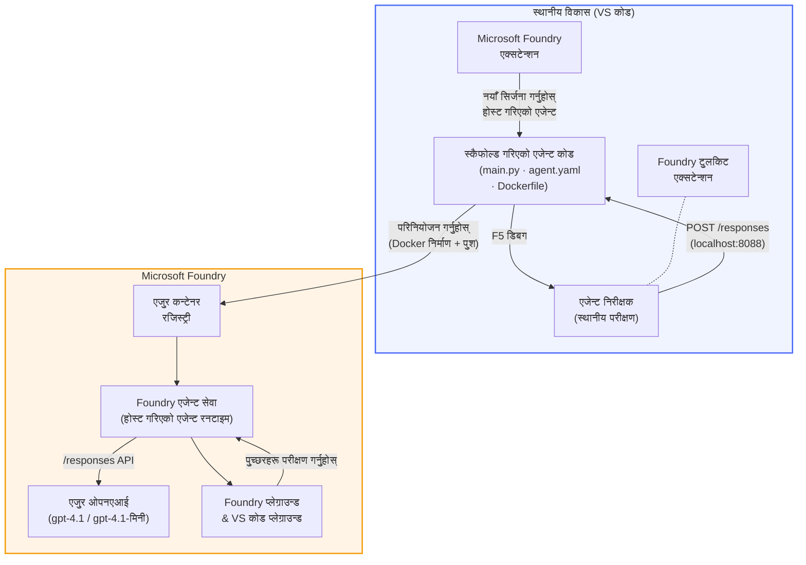

# Foundry Toolkit + Foundry Hosted Agents कार्यशाला

[](https://www.python.org/)
[](https://github.com/microsoft/agents)
[](https://learn.microsoft.com/azure/ai-foundry/agents/concepts/hosted-agents/)
[](https://ai.azure.com/)
[](https://learn.microsoft.com/azure/ai-services/openai/)
[](https://learn.microsoft.com/cli/azure/install-azure-cli)
[](https://learn.microsoft.com/azure/developer/azure-developer-cli/install-azd)
[](https://www.docker.com/)
[](https://marketplace.visualstudio.com/items?itemName=ms-windows-ai-studio.windows-ai-studio)
[](LICENSE)

AI एजेन्टहरू **Microsoft Foundry Agent Service** मा **Hosted Agents** को रूपमा निर्माण, परीक्षण, र डिप्लोय गर्नुहोस् - पूर्ण रूपमा VS Code मार्फत **Microsoft Foundry extension** र **Foundry Toolkit** द्वारा।

> **Hosted Agents हाल प्रिभ्यूमा छन्।** समर्थित क्षेत्रहरू सीमित छन् - हेर्नुहोस् [क्षेत्र उपलब्धता](https://learn.microsoft.com/azure/foundry/agents/concepts/hosted-agents#region-availability)।

> हरेक प्रयोगशालाको `agent/` फोल्डर **Foundry extension ले स्वचालित रूपमा स्क्याफोल्ड गर्दछ** - त्यसपछि तपाईं कोड अनुकूलन गर्नुहुन्छ, स्थानीय रूपमा परीक्षण गर्नुहुन्छ, र डिप्लोय गर्नुहुन्छ।

### 🌐 बहुभाषी समर्थन

#### GitHub Action द्वारा समर्थित (स्वचालित र सधैं अपडेट रहने)

<!-- CO-OP TRANSLATOR LANGUAGES TABLE START -->
[Arabic](../ar/README.md) | [Bengali](../bn/README.md) | [Bulgarian](../bg/README.md) | [Burmese (Myanmar)](../my/README.md) | [Chinese (Simplified)](../zh-CN/README.md) | [Chinese (Traditional, Hong Kong)](../zh-HK/README.md) | [Chinese (Traditional, Macau)](../zh-MO/README.md) | [Chinese (Traditional, Taiwan)](../zh-TW/README.md) | [Croatian](../hr/README.md) | [Czech](../cs/README.md) | [Danish](../da/README.md) | [Dutch](../nl/README.md) | [Estonian](../et/README.md) | [Finnish](../fi/README.md) | [French](../fr/README.md) | [German](../de/README.md) | [Greek](../el/README.md) | [Hebrew](../he/README.md) | [Hindi](../hi/README.md) | [Hungarian](../hu/README.md) | [Indonesian](../id/README.md) | [Italian](../it/README.md) | [Japanese](../ja/README.md) | [Kannada](../kn/README.md) | [Khmer](../km/README.md) | [Korean](../ko/README.md) | [Lithuanian](../lt/README.md) | [Malay](../ms/README.md) | [Malayalam](../ml/README.md) | [Marathi](../mr/README.md) | [Nepali](./README.md) | [Nigerian Pidgin](../pcm/README.md) | [Norwegian](../no/README.md) | [Persian (Farsi)](../fa/README.md) | [Polish](../pl/README.md) | [Portuguese (Brazil)](../pt-BR/README.md) | [Portuguese (Portugal)](../pt-PT/README.md) | [Punjabi (Gurmukhi)](../pa/README.md) | [Romanian](../ro/README.md) | [Russian](../ru/README.md) | [Serbian (Cyrillic)](../sr/README.md) | [Slovak](../sk/README.md) | [Slovenian](../sl/README.md) | [Spanish](../es/README.md) | [Swahili](../sw/README.md) | [Swedish](../sv/README.md) | [Tagalog (Filipino)](../tl/README.md) | [Tamil](../ta/README.md) | [Telugu](../te/README.md) | [Thai](../th/README.md) | [Turkish](../tr/README.md) | [Ukrainian](../uk/README.md) | [Urdu](../ur/README.md) | [Vietnamese](../vi/README.md)

> **स्थानीय रूपमा क्लोन गर्न रुचाउनु हुन्छ?**
>
> यस रिपोजिटरीमा ५०+ भाषा अनुवादहरू समावेश छन् जसले डाउनलोड साइज धेरै बढाउँछ। अनुवाद बिना क्लोन गर्न, sparse checkout प्रयोग गर्नुहोस्:
>
> **Bash / macOS / Linux:**
> ```bash
> git clone --filter=blob:none --sparse https://github.com/microsoft-foundry/Foundry_Toolkit_for_VSCode_Lab.git
> cd Foundry_Toolkit_for_VSCode_Lab
> git sparse-checkout set --no-cone '/*' '!translations' '!translated_images'
> ```
>
> **CMD (Windows):**
> ```cmd
> git clone --filter=blob:none --sparse https://github.com/microsoft-foundry/Foundry_Toolkit_for_VSCode_Lab.git
> cd Foundry_Toolkit_for_VSCode_Lab
> git sparse-checkout set --no-cone "/*" "!translations" "!translated_images"
> ```
>
> यसले तपाईंलाई कोर्स पूरा गर्न आवश्यक सबै सामग्री धेरै छिटो डाउनलोड दिन्छ।
<!-- CO-OP TRANSLATOR LANGUAGES TABLE END -->

---

## वास्तुकला


**प्रवाह:** Foundry extension एजेन्ट स्क्याफोल्ड गर्छ → तपाईंले कोड र निर्देशनहरू अनुकूलन गर्नुहुन्छ → Agent Inspector सँग स्थानीय रूपमा परीक्षण गर्नुहोस् → Foundry मा डिप्लोय गर्नुहोस् (Docker image ACR मा पठाइन्छ) → Playground मा जाँच गर्नुहोस्।

---

## तपाईंले के निर्माण गर्नुहुनेछ

| ल्याब | विवरण | स्थिति |
|-----|-------------|--------|
| **Lab 01 - Single Agent** | **"Explain Like I'm an Executive" एजेन्ट** निर्माण गर्नुहोस्, स्थानीय रूपमा परीक्षण गर्नुहोस्, र Foundry मा डिप्लोय गर्नुहोस् | ✅ उपलब्ध |
| **Lab 02 - Multi-Agent Workflow** | **"Resume → Job Fit Evaluator"** निर्माण गर्नुहोस् - ४ एजेन्टहरूले सहकार्य गरी रिजुमे फिट मूल्याङ्कन गर्छन् र सिकाइ रोडम्याप उत्पादन गर्छन् | ✅ उपलब्ध |

---

## Executive Agent सँग भेट्नुहोस्

यो कार्यशालामा तपाईं **"Explain Like I'm an Executive" एजेन्ट** निर्माण गर्नुहुनेछ - एउटा AI एजेन्ट जसले जटिल प्राविधिक जर्गनलाई शान्त, बोर्डरूम-योग्य सारांशमा अनुवाद गर्छ। किनकि साँचो कुरा, कुनै पनि C-suite सदस्यले "thread pool exhaustion caused by synchronous calls introduced in v3.2" को बारेमा सुन्न चाहँदैन।

मैले यो एजेन्ट त्यस्तो धेरै घटनापछिको प्रतिक्रियामा बनाएको हुँ जहाँ मेरो राम्ररी तयार पारिएको पोस्ट-मोर्टेमलाई जवाफ आयो: *"त्यसो भए वेबसाइट डाउन छ वा छैन?"*

### यो कसरी काम गर्छ

तपाईंले यसलाई प्राविधिक अपडेट दिनुहुन्छ। यो तीन वटा बुलेट पोइन्टहरू सहित एक executive summary फर्काउँछ - कुनै जर्गन छैन, कुनै स्ट्याक ट्रेस छैन, कुनै अस्तित्वगत डर छैन। केवल **के भयो**, **व्यापारमा असर**, र **अर्को कदम**।

### यसलाई काम गर्दै हेर्नुहोस्

**तपाईं भन्नुहुन्छ:**
> "The API latency increased due to thread pool exhaustion caused by synchronous calls introduced in v3.2."

**एजेन्ट जवाफ दिन्छ:**

> **Executive Summary:**
> - **के भयो:** पछिल्लो संस्करण पछि सिस्टम सुस्त भयो।
> - **व्यापारमा असर:** केही प्रयोगकर्ताहरूले सेवा प्रयोग गर्दा ढिलाइ अनुभव गरे।
> - **अर्को कदम:** परिवर्तन फिर्ता गरिएको छ र पुन: डिप्लोयमेन्ट अघि समाधान तयार पार्दैछ।

### किन यो एजेन्ट?

यो एकदम सरल, एकल-उद्देश्य एजेन्ट हो - hosted agent workflow सिक्नको लागि उपयुक्त जसले जटिल उपकरण श्रृंखलामा अल्झिन दिन्न। र ईमानदारीपूर्वक? हरेक इन्जिनियरिङ टिमले यस्ता एउटा एजेन्ट चाहिन्छ।

---

## कार्यशाला संरचना

```
📂 Foundry_Toolkit_for_VSCode_Lab/
├── 📄 README.md                      ← You are here
├── 📂 ExecutiveAgent/                ← Standalone hosted agent project
│   ├── agent.yaml
│   ├── Dockerfile
│   ├── main.py
│   └── requirements.txt
└── 📂 workshop/
    ├── 📂 lab01-single-agent/        ← Full lab: docs + agent code
    │   ├── README.md                 ← Hands-on lab instructions
    │   ├── 📂 docs/                  ← Step-by-step tutorial modules
    │   │   ├── 00-prerequisites.md
    │   │   ├── 01-install-foundry-toolkit.md
    │   │   ├── 02-create-foundry-project.md
    │   │   ├── 03-create-hosted-agent.md
    │   │   ├── 04-configure-and-code.md
    │   │   ├── 05-test-locally.md
    │   │   ├── 06-deploy-to-foundry.md
    │   │   ├── 07-verify-in-playground.md
    │   │   └── 08-troubleshooting.md
    │   └── 📂 agent/                 ← Reference solution (auto-scaffolded by Foundry extension)
    │       ├── agent.yaml
    │       ├── Dockerfile
    │       ├── main.py
    │       └── requirements.txt
    └── 📂 lab02-multi-agent/         ← Resume → Job Fit Evaluator
        ├── README.md                 ← Hands-on lab instructions (end-to-end)
        ├── 📂 docs/                  ← Step-by-step tutorial modules
        │   ├── 00-prerequisites.md
        │   ├── 01-understand-multi-agent.md
        │   ├── 02-scaffold-multi-agent.md
        │   ├── 03-configure-agents.md
        │   ├── 04-orchestration-patterns.md
        │   ├── 05-test-locally.md
        │   ├── 06-deploy-to-foundry.md
        │   ├── 07-verify-in-playground.md
        │   └── 08-troubleshooting.md
        └── 📂 PersonalCareerCopilot/ ← Reference solution (multi-agent workflow)
            ├── agent.yaml
            ├── Dockerfile
            ├── main.py
            └── requirements.txt
```

> **टिप्पणी:** हरेक ल्याब भित्रको `agent/` फोल्डर **Microsoft Foundry extension** ले `Microsoft Foundry: Create a New Hosted Agent` कमाण्ड प्यालेटबाट चलाउँदा उत्पन्न गर्छ। फाइलहरू तब तपाईंको एजेन्टको निर्देशन, उपकरणहरू, र कन्फिगरेसनसँग अनुकूलित गरिन्छ। ल्याब ०१ ले तपाईंलाई शून्यबाट यो कसरी बनाउने देखाउँछ।

---

## सुरु गर्दै

### १. रिपोजिटरी क्लोन गर्नुहोस्

```bash
git clone https://github.com/microsoft-foundry/Foundry_Toolkit_for_VSCode_Lab.git
cd Foundry_Toolkit_for_VSCode_Lab
```

### २. Python भर्चुअल वातावरण सेटअप गर्नुहोस्

```bash
python -m venv venv
```

यसलाई सक्रिय गर्नुहोस्:

- **Windows (PowerShell):**
  ```powershell
  .\venv\Scripts\Activate.ps1
  ```
- **macOS / Linux:**
  ```bash
  source venv/bin/activate
  ```

### ३. निर्भरता स्थापना गर्नुहोस्

```bash
pip install -r workshop/lab01-single-agent/agent/requirements.txt
```

### ४. वातावरण भेरिएबल कन्फिगर गर्नुहोस्

एजेन्ट फोल्डर भित्रको उदाहरण `.env` फाइल कपी गरी तपाईंका मानहरू भर्नुहोस्:

```bash
cp workshop/lab01-single-agent/agent/.env.example workshop/lab01-single-agent/agent/.env
```

`workshop/lab01-single-agent/agent/.env` सम्पादन गर्नुहोस्:

```env
AZURE_AI_PROJECT_ENDPOINT=https://<your-account>.services.ai.azure.com/api/projects/<your-project>
MODEL_DEPLOYMENT_NAME=<your-model-deployment-name>
```

### ५. कार्यशाला ल्याबहरू पछ्याउनुहोस्

हरेक ल्याब आफ्नो मोड्युलहरू सहित आत्मनिर्भर छ। **Lab 01** बाट सुरु गर्नुहोस् आधारभूत विषयहरू सिक्न, त्यसपछि **Lab 02** मा बहु-एजेन्ट कार्य प्रवाहहरूका लागि अगाडि बढ्नुहोस्।

#### Lab 01 - Single Agent ([पूर्ण निर्देशनहरू](workshop/lab01-single-agent/README.md))

| # | मोड्युल | लिंक |
|---|--------|------|
| 1 | पूर्व आवश्यकताहरू पढ्नुहोस् | [00-prerequisites.md](workshop/lab01-single-agent/docs/00-prerequisites.md) |
| 2 | Foundry Toolkit र Foundry extension स्थापना गर्नुहोस् | [01-install-foundry-toolkit.md](workshop/lab01-single-agent/docs/01-install-foundry-toolkit.md) |
| 3 | Foundry प्रोजेक्ट सिर्जना गर्नुहोस् | [02-create-foundry-project.md](workshop/lab01-single-agent/docs/02-create-foundry-project.md) |
| 4 | Hosted agent सिर्जना गर्नुहोस् | [03-create-hosted-agent.md](workshop/lab01-single-agent/docs/03-create-hosted-agent.md) |
| 5 | निर्देशनहरू र वातावरण कन्फिगर गर्नुहोस् | [04-configure-and-code.md](workshop/lab01-single-agent/docs/04-configure-and-code.md) |
| 6 | स्थानीय रूपमा परीक्षण गर्नुहोस् | [05-test-locally.md](workshop/lab01-single-agent/docs/05-test-locally.md) |
| 7 | Foundry मा डिप्लोय गर्नुहोस् | [06-deploy-to-foundry.md](workshop/lab01-single-agent/docs/06-deploy-to-foundry.md) |
| 8 | प्लेग्राउन्डमा जाँच गर्नुहोस् | [07-verify-in-playground.md](workshop/lab01-single-agent/docs/07-verify-in-playground.md) |
| 9 | समस्या समाधान | [08-troubleshooting.md](workshop/lab01-single-agent/docs/08-troubleshooting.md) |

#### Lab 02 - Multi-Agent Workflow ([पूर्ण निर्देशनहरू](workshop/lab02-multi-agent/README.md))

| # | मोड्युल | लिंक |
|---|--------|------|
| 1 | पूर्व आवश्यकताहरू (Lab 02) | [00-prerequisites.md](workshop/lab02-multi-agent/docs/00-prerequisites.md) |
| 2 | बहु-एजेन्ट वास्तुकला बुझ्नुहोस् | [01-understand-multi-agent.md](workshop/lab02-multi-agent/docs/01-understand-multi-agent.md) |
| 3 | बहु-एजेन्ट प्रोजेक्ट स्क्याफोल्ड गर्नुहोस् | [02-scaffold-multi-agent.md](workshop/lab02-multi-agent/docs/02-scaffold-multi-agent.md) |
| 4 | एजेन्टहरू र वातावरण कन्फिगर गर्नुहोस् | [03-configure-agents.md](workshop/lab02-multi-agent/docs/03-configure-agents.md) |
| 5 | अर्चेस्ट्रेशन ढाँचाहरू | [04-orchestration-patterns.md](workshop/lab02-multi-agent/docs/04-orchestration-patterns.md) |
| 6 | स्थानीय रूपमा परीक्षण गर्नुहोस् (बहु-एजेन्ट) | [05-test-locally.md](workshop/lab02-multi-agent/docs/05-test-locally.md) |
| 7 | Foundry मा परिनियोजन गर्नुहोस् | [06-deploy-to-foundry.md](workshop/lab02-multi-agent/docs/06-deploy-to-foundry.md) |
| 8 | खेल मैदानमा प्रमाणित गर्नुहोस् | [07-verify-in-playground.md](workshop/lab02-multi-agent/docs/07-verify-in-playground.md) |
| 9 | समस्या समाधान (बहु-एजेन्ट) | [08-troubleshooting.md](workshop/lab02-multi-agent/docs/08-troubleshooting.md) |

---

## संरक्षक

<table>
<tr>
    <td align="center"><a href="https://github.com/ShivamGoyal03">
        <br />
        <sub><b>शिवम गोयल</b></sub>
    </a><br />
    </td>
</tr>
</table>

---

## आवश्यक अनुमति (छिटो सन्दर्भ)

| अवस्था | आवश्यक भूमिका |
|----------|---------------|
| नयाँ Foundry परियोजना सिर्जना गर्नुहोस् | Foundry स्रोतमा **Azure AI Owner** |
| अवस्थित परियोजनामा परिनियोजन गर्नुहोस् (नयाँ स्रोतहरू) | सदस्यतामा **Azure AI Owner** + **Contributor** |
| पूर्ण रूपमा कन्फिगर गरिएको परियोजनामा परिनियोजन गर्नुहोस् | खातामा **Reader** + परियोजनामा **Azure AI User** |

> **महत्त्वपूर्ण:** Azure `Owner` र `Contributor` भूमिकाहरूमा केवल *प्रबंधन* अनुमति मात्र समावेश छ, *विकास* (डाटा एक्शन) अनुमति होइन। एजेन्टहरू निर्माण र परिनियोजन गर्न तपाईंलाई **Azure AI User** वा **Azure AI Owner** आवश्यक छ।

---

## सन्दर्भहरू

- [द्रुत आरम्भ: तपाईंको पहिलो होस्टेड एजेन्ट परिनियोजन गर्नुहोस् (VS Code)](https://learn.microsoft.com/azure/foundry/agents/quickstarts/quickstart-hosted-agent)
- [होस्टेड एजेन्टहरू के हुन्?](https://learn.microsoft.com/azure/foundry/agents/concepts/hosted-agents)
- [VS Code मा होस्टेड एजेन्ट कार्यप्रवाहहरू सिर्जना गर्नुहोस्](https://learn.microsoft.com/azure/foundry/agents/how-to/vs-code-agents-workflow-pro-code)
- [होस्टेड एजेन्ट परिनियोजन गर्नुहोस्](https://learn.microsoft.com/azure/foundry/agents/how-to/deploy-hosted-agent)
- [Microsoft Foundry का लागि RBAC](https://learn.microsoft.com/azure/foundry/concepts/rbac-foundry)
- [आर्किटेक्चर समीक्षा एजेन्ट नमूना](https://github.com/Azure-Samples/agent-architecture-review-sample) - MCP उपकरणहरू, Excalidraw योजनाहरू, र दोहोरो परिनियोजन सहित वास्तविक संसार होस्टेड एजेन्ट

---


## लाइसेन्स

[MIT](../../LICENSE)

---

<!-- CO-OP TRANSLATOR DISCLAIMER START -->
**अस्वीकरण**:  
यो दस्तावेज AI अनुवाद सेवा [Co-op Translator](https://github.com/Azure/co-op-translator) प्रयोग गरी अनुवाद गरिएको हो। हामी शुद्धताका लागि प्रयासरत भए तापनि, कृपया बुझ्नुस् कि स्वचालित अनुवादमा त्रुटि वा अशुद्धि हुनसक्छ। मूल भाषा मा रहेको दस्तावेजलाई मात्र आधिकारिक स्रोत मानिनु पर्दछ। महत्वपूर्ण जानकारीका लागि, व्यावसायिक मानव अनुवादको सिफारिस गरिन्छ। यस अनुवादको प्रयोगबाट हुने कुनै पनि गलतफहमी वा गलत व्याख्याहरूका लागि हामी जिम्मेवार हुनुहुन्न।
<!-- CO-OP TRANSLATOR DISCLAIMER END -->