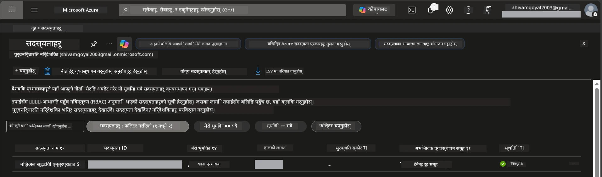

# मोड्युल 0 - पूर्वापेक्षाहरू

कार्यशाला सुरू गर्नु अघि, सुनिश्चित गर्नुहोस् कि तपाईंसँग तलका उपकरणहरू, पहुँच, र वातावरण तयार छन्। तलका प्रत्येक कदम पालना गर्नुहोस् - अगाडि नबढ्नुस्।

---

## 1. Azure खाता र सदस्यता

### 1.1 Azure सदस्यता सिर्जना वा पुष्टि गर्नुहोस्

1. ब्राउजर खोल्नुहोस् र [https://azure.microsoft.com/free/](https://azure.microsoft.com/free/) मा जानुहोस्।
2. यदि तपाईंसँग Azure खाता छैन भने, **Start free** थिच्नुहोस् र साइन-अप प्रक्रिया पूरा गर्नुहोस्। तपाईलाई Microsoft खाता (वा नयाँ खाता बनाउन) र पहिचान प्रमाणिकरणका लागि क्रेडिट कार्ड चाहिन्छ।
3. यदि तपाईंसँग पहिले नै खाता छ भने, [https://portal.azure.com](https://portal.azure.com) मा लगइन गर्नुहोस्।
4. पोर्टलमा, बायाँ नेभिगेसनमा **Subscriptions** ब्लेड क्लिक गर्नुहोस् (वा माथिको खोजी पट्टिमा "Subscriptions" खोज्नुस्)।
5. कम्तीमा एक **Active** सदस्यता छ कि छैन सुनिश्चित गर्नुहोस्। **Subscription ID** नोट गर्नुहोस् - पछि प्रयोग हुनेछ।



### 1.2 आवश्यक RBAC भूमिका बुझ्नुहोस्

[Hosted Agent](https://learn.microsoft.com/azure/foundry/agents/concepts/hosted-agents) वितरण गर्नको लागि **data action** अनुमति आवश्यक हुन्छ जुन सामान्य Azure का `Owner` र `Contributor` भूमिकामा पर्दैन। तपाईलाई यी मध्ये एक [भूमिका संयोजनहरू](https://learn.microsoft.com/azure/foundry/concepts/rbac-foundry#built-in-roles) चाहिन्छ:

| अवस्था | आवश्यक भूमिका | ती कहाँ असाइन गर्ने |
|----------|---------------|----------------------|
| नयाँ Foundry परियोजना सिर्जना गर्नुहोस् | Foundry स्रोतमा **Azure AI Owner** | Azure पोर्टलमा Foundry स्रोत |
| अवस्थित परियोजनामा नयाँ स्रोतहरू वितरण गर्नुहोस् | सदस्यतामा **Azure AI Owner** + **Contributor** | सदस्यता + Foundry स्रोत |
| पूर्ण रूपमा कन्फिगर गरिएको परियोजनामा वितरण गर्नुहोस् | खातामा **Reader** + परियोजनामा **Azure AI User** | Azure पोर्टलमा खाता + परियोजना |

> **मुख्य कुरा:** Azure `Owner` र `Contributor` भूमिकाले केवल *प्रबंधन* अनुमति (ARM अपरेसनहरू) कभर गर्छ। तपाईलाई एजेन्टहरू सिर्जना र वितरण गर्न आवश्यक *data actions* जस्तै `agents/write` को लागि [**Azure AI User**](https://learn.microsoft.com/azure/foundry/concepts/rbac-foundry#built-in-roles) (वा त्यसभन्दा माथि) चाहिन्छ। यी भूमिकाहरू तपाईंले [मोड्युल 2](02-create-foundry-project.md) मा असाइन गर्नु हुनेछ।

---

## 2. स्थानीय उपकरण स्थापना गर्नुहोस्

तलका प्रत्येक उपकरण स्थापना गर्नुहोस्। स्थापना पछि, जाँच कमाण्ड चलाएर काम गर्छ कि हेर्नुहोस्।

### 2.1 Visual Studio Code

1. [https://code.visualstudio.com/](https://code.visualstudio.com/) मा जानुहोस्।
2. आफ्नो अपरेटिङ सिस्टम (Windows/macOS/Linux) को लागि इन्स्टालर डाउनलोड गर्नुहोस्।
3. डिफल्ट सेटिङहरूसँग इन्स्टालर चलाउनुहोस्।
4. VS Code खोल्नुहोस् र सुरु हुन्छ कि भनी सुनिश्चित गर्नुहोस्।

### 2.2 Python 3.10+

1. [https://www.python.org/downloads/](https://www.python.org/downloads/) मा जानुहोस्।
2. Python 3.10 वा पछि संस्करण डाउनलोड गर्नुहोस् (3.12+ सिफारिस गरिएको)।
3. **Windows:** इन्स्टलेशनको क्रममा पहिलो स्क्रिनमा **"Add Python to PATH"** चयन गर्नुहोस्।
4. टर्मिनल खोल्नुहोस् र जाँच गर्नुहोस्:

   ```powershell
   python --version
   ```

   अपेक्षित परिणाम: `Python 3.10.x` वा माथि।

### 2.3 Azure CLI

1. [https://learn.microsoft.com/cli/azure/install-azure-cli](https://learn.microsoft.com/cli/azure/install-azure-cli) मा जानुहोस्।
2. आफ्नो अपरेटिङ सिस्टमको अनुसार इन्स्टलेशन निर्देशनहरू पालना गर्नुहोस्।
3. जाँच गर्नुहोस्:

   ```powershell
   az --version
   ```

   अपेक्षित: `azure-cli 2.80.0` वा माथि।

4. लगइन हुनुहोस्:

   ```powershell
   az login
   ```

### 2.4 Azure Developer CLI (azd)

1. [https://learn.microsoft.com/azure/developer/azure-developer-cli/install-azd](https://learn.microsoft.com/azure/developer/azure-developer-cli/install-azd) मा जानुहोस्।
2. आफ्नो अपरेटिङ सिस्टमको लागि इन्स्टलेशन निर्देशनहरू पालना गर्नुहोस्। Windows मा:

   ```powershell
   winget install microsoft.azd
   ```

3. जाँच गर्नुहोस्:

   ```powershell
   azd version
   ```

   अपेक्षित: `azd version 1.x.x` वा माथि।

4. लगइन हुनुहोस्:

   ```powershell
   azd auth login
   ```

### 2.5 Docker Desktop (Optional)

यदि तपाईले स्थानीय रूपमा कन्टेनर छवि निर्माण र परीक्षण गर्न चाहनुहुन्छ भने मात्र Docker आवश्यक छ। Foundry विस्तारले वितरणको समयमा कन्टेनर निर्माणहरू आफ्नै रूपमा ह्यान्डल गर्छ।

1. [https://docs.docker.com/get-docker/](https://docs.docker.com/get-docker/) मा जानुहोस्।
2. आफ्नो अपरेटिङ सिस्टमका लागि Docker Desktop डाउनलोड र इन्स्टल गर्नुहोस्।
3. **Windows:** इन्स्टलेशनको क्रममा WSL 2 ब्याकएन्ड चयन गरिएको छ कि छैन सुनिश्चित गर्नुहोस्।
4. Docker Desktop सुरु गर्नुहोस् र सिस्टम ट्रेमा आइकनले **"Docker Desktop is running"** देखाउनुहोस्।
5. टर्मिनल खोल्नुहोस् र जाँच गर्नुहोस्:

   ```powershell
   docker info
   ```

   यसले Docker प्रणाली जानकारी बिना त्रुटिहरू प्रिन्ट गर्नुपर्छ। यदि तपाईलाई `Cannot connect to the Docker daemon` देखियो भने, Docker पूर्ण रूपमा सुरु हुने गरी केही सेकेन्ड पर्खनुहोस्।

---

## 3. VS Code विस्तारहरू स्थापना गर्नुहोस्

तपाईंलाई तीन विस्तारहरू चाहिन्छ। कार्यशाला सुरु हुनु अघि ती स्थापना गर्नुहोस्।

### 3.1 Microsoft Foundry for VS Code

1. VS Code खोल्नुहोस्।
2. `Ctrl+Shift+X` थिचेर एक्सटेन्सन प्यानल खोल्नुहोस्।
3. खोजी बाकसमा **"Microsoft Foundry"** टाइप गर्नुहोस्।
4. **Microsoft Foundry for Visual Studio Code** (प्रकाशक: Microsoft, ID: `TeamsDevApp.vscode-ai-foundry`) फेला पार्नुहोस्।
5. **Install** मा क्लिक गर्नुहोस्।
6. इन्स्टलेशन पछि, Activity Bar (बायाँ साइडबार) मा **Microsoft Foundry** आइकन देखिनु पर्छ।

### 3.2 Foundry Toolkit

1. एक्सटेन्सन प्यानल (`Ctrl+Shift+X`) मा, **"Foundry Toolkit"** खोज्नुहोस्।
2. **Foundry Toolkit** (प्रकाशक: Microsoft, ID: `ms-windows-ai-studio.windows-ai-studio`) फेला पार्नुहोस्।
3. **Install** मा क्लिक गर्नुहोस्।
4. Activity Bar मा **Foundry Toolkit** आइकन देखा पर्नु पर्छ।

### 3.3 Python

1. एक्सटेन्सन प्यानलमा **"Python"** खोज्नुहोस्।
2. **Python** (प्रकाशक: Microsoft, ID: `ms-python.python`) फेला पार्नुहोस्।
3. **Install** मा क्लिक गर्नुहोस्।

---

## 4. VS Code बाट Azure मा साइन इन गर्नुहोस्

[Microsoft Agent Framework](https://learn.microsoft.com/agent-framework/overview/) ले प्रमाणीकरणको लागि [`DefaultAzureCredential`](https://learn.microsoft.com/azure/developer/python/sdk/authentication/credential-chains#defaultazurecredential-overview) प्रयोग गर्छ। तपाईलाई VS Code मा Azure मा साइन इन गरिएको हुनुपर्छ।

### 4.1 VS Code मार्फत साइन इन

1. VS Code को तल्लो-बायाँ कुनामा रहेको **Accounts** आइकन (मान्छेको आकृति) मा क्लिक गर्नुहोस्।
2. **Sign in to use Microsoft Foundry** (वा **Sign in with Azure**) क्लिक गर्नुहोस्।
3. ब्राउजर विन्डो खुल्छ - तपाईको सदस्यता पहुँच भएको Azure खातामा साइन इन गर्नुहोस्।
4. VS Code मा फर्कनुहोस्। तल्लो-बायाँमा आफ्नो खाता नाम देखिनु पर्नेछ।

### 4.2 (वैकल्पिक) Azure CLI मार्फत साइन इन

यदि तपाइँले Azure CLI इन्स्टल गर्नुभएको छ र CLI-आधारित प्रमाणीकरण रोज्नुहुन्छ भने:

```powershell
az login
```

यसले साइन-इनका लागि ब्राउजर खोल्छ। साइन इन पछि, सही सदस्यता चयन गर्नुहोस्:

```powershell
az account set --subscription "<your-subscription-id>"
```

जाँच गर्नुहोस्:

```powershell
az account show --query "{name:name, id:id, state:state}" --output table
```

तपाईले आफ्नो सदस्यता नाम, ID, र अवस्था = `Enabled` देख्नुपर्छ।

### 4.3 (वैकल्पिक) सेवा प्रिन्सिपल प्रमाणीकरण

CI/CD वा साझा वातावरणका लागि, निम्न वातावरण भेरिएबलहरू सेट गर्नुहोस्:

```powershell
$env:AZURE_TENANT_ID = "<your-tenant-id>"
$env:AZURE_CLIENT_ID = "<your-client-id>"
$env:AZURE_CLIENT_SECRET = "<your-client-secret>"
```

---

## 5. पूर्वावलोकन सीमितताहरू

अगाडि बढ्नु अघि, हालका सीमितताहरूलाई जान्नुहोस्:

- [**Hosted Agents**](https://learn.microsoft.com/azure/foundry/agents/concepts/hosted-agents) हाल **public preview** मा छन् - उत्पादन कार्यभारहरूको लागि सिफारिस छैन।
- **समर्थित क्षेत्रहरू सीमित छन्** - स्रोतहरू सिर्जना गर्नु अघि [क्षेत्र उपलब्धता](https://learn.microsoft.com/azure/foundry/agents/concepts/hosted-agents#region-availability) जाँच गर्नुहोस्। यदि तपाईंले असमर्थित क्षेत्र चयन गर्नुभयो भने, वितरण असफल हुनेछ।
- `azure-ai-agentserver-agentframework` प्याकेज प्रि-रिलिज (`1.0.0b16`) मा छ - API हरू परिवर्तन हुन सक्छन्।
- स्केल सीमाहरू: होस्टेड एजेन्टहरू 0-5 रेप्लिका समर्थन गर्छन् (शून्यसम्म स्केल सहित)।

---

## 6. प्रारम्भिक जाँच सूचि

तलका प्रत्येक वस्तुमा जानुहोस्। कुनै पनि चरण असफल भयो भने, फर्केर समाधान गर्नुहोस्।

- [ ] VS Code खुल्छ र कुनै त्रुटि छैन
- [ ] Python 3.10+ तपाईँको PATH मा छ (`python --version` ले `3.10.x` वा माथि देखाउछ)
- [ ] Azure CLI इन्स्टल छ (`az --version` ले `2.80.0` वा माथि देखाउछ)
- [ ] Azure Developer CLI इन्स्टल छ (`azd version` ले संस्करण जानकारी देखाउछ)
- [ ] Microsoft Foundry विस्तार इन्स्टल छ (Activity Bar मा आइकन देखिन्छ)
- [ ] Foundry Toolkit विस्तार इन्स्टल छ (Activity Bar मा आइकन देखिन्छ)
- [ ] Python विस्तार इन्स्टल छ
- [ ] तपाई VS Code मा Azure मा साइन इन हुनुहुन्छ (तल्लो-बायाँ Accounts आइकन जाँच्नुहोस्)
- [ ] `az account show` बाट तपाईँको सदस्यता देखिन्छ
- [ ] (वैकल्पिक) Docker Desktop चलिरहेको छ (`docker info` ले त्रुटिबिना प्रणाली जानकारी देखाउछ)

### चेकपॉइंट

VS Code को Activity Bar खोल्नुहोस् र **Foundry Toolkit** र **Microsoft Foundry** साइडबार दृश्यहरू देख्न सक्नुहुन्छ कि सुनिश्चित गर्नुहोस्। हरेकमा क्लिक गरेर त्रुटि बिना लोड हुन्छ कि जाँच गर्नुहोस्।

---

**अर्को:** [01 - Install Foundry Toolkit & Foundry Extension →](01-install-foundry-toolkit.md)

---

<!-- CO-OP TRANSLATOR DISCLAIMER START -->
**अस्वीकरण**:  
यो दस्तावेज AI अनुवाद सेवा [Co-op Translator](https://github.com/Azure/co-op-translator) प्रयोग गरेर अनुवाद गरिएको हो। हामी शुद्धताका लागि प्रयासरत छौं, तर कृपया ध्यान दिनुहोस् कि स्वचालित अनुवादहरूमा त्रुटिहरू वा अशुद्धिहरू हुन सक्छन्। मूल दस्तावेज यसको स्थानीय भाषामा आधिकारिक स्रोत मानिनु पर्छ। महत्वपूर्ण जानकारीका लागि व्यवसायिक मानव अनुवाद सिफारिस गरिन्छ। यस अनुवादको प्रयोगबाट उत्पन्न कुनै पनि गलतफहमी वा गलत व्याख्याका लागि हामी जिम्मेवार छैनौं।
<!-- CO-OP TRANSLATOR DISCLAIMER END -->