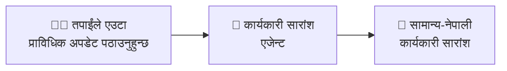

# मोड्युल ० - परिचय

⏱️ ~१० मिनेट

> [!WARNING]
> **पूर्वावलोकन र सीमाहरू:** [Hosted Agents](https://learn.microsoft.com/azure/foundry/agents/concepts/hosted-agents) हाल **सार्वजनिक पूर्वावलोकन** मा छन् - उत्पादन कार्यभारको लागि सिफारिस गरिँदैन। तलका कुरामा सचेत हुनुहोस्:
> - **समर्थित क्षेत्रहरू सीमित छन्** - स्रोतहरू सिर्जना गर्नु अघि [क्षेत्र उपलब्धता](https://learn.microsoft.com/azure/foundry/agents/concepts/hosted-agents#region-availability) जाँच गर्नुहोस्। यदि तपाईंलाई असमर्थित क्षेत्र छान्नुभयो भने, परिनियोजन असफल हुनेछ।
> - `azure-ai-agentserver-agentframework` प्याकेज प्रि-रिलीजमा छ - एपीआईहरू संस्करणहरू बीच परिवर्तन हुन सक्दछ।
> - स्केल सिमाहरू: होस्ट गरिएको एजेन्टहरूले ०–५ रेप्लिका समर्थन गर्छन् (स्केल-टु-जीरो सहित)।
> - यो कार्यशालामा देखाइएका केही सुविधाहरू सेवा GAतर्फ बढ्दै गर्दा परिवर्तन हुन सक्छन्।

## तपाईंले के निर्माण गर्नुहुनेछ

यस कार्यशालामा, तपाईंले एउटा **"म एक्जिक्युटिभ हुँ जस्तो व्याख्या गर"** एजेण्ट बनाउनुहुनेछ - होस्ट गरिएको एआई एजेन्ट जसले जटिल प्राविधिक अद्यावधिकहरू लिएर तिनीहरूलाई सरल अनौपचारिक कार्यकारी सारांशहरूमा पुनर्लेखन गर्छ।

```mermaid
flowchart LR
    A["🧑‍💻 तपाईंले एउटा\nप्राविधिक अपडेट पठाउनुहुन्छ"] --> B["🤖 कार्यकारी सारांश\nएजेन्ट"]
    B --> C["📝 सामान्य-नेपाली\nकार्यकारी सारांश"]
```

**एजेण्टले प्रयोग गर्दछ:**
- **माइक्रोसफ्ट एजेन्ट फ्रेमवर्क** - एजेन्ट तर्क र संरचनाको लागि
- **फाउन्ड्री टूलकिट फॉर VS कोड** - स्क्याफोल्ड, स्थानीय रूपमा परीक्षण, र परिनियोजन गर्न
- **एआई मोडल** (जस्तै, `gpt-4.1-mini/gpt-5-mini`) - सारांशहरू उत्पादन गर्न

यस ल्याबको अन्त्यमा, तपाईंले एउटा काम गर्ने एजेन्ट पाउनुहुनेछ जुन तपाईंले एजेन्ट इन्स्पेक्टर मार्फत स्थानीय रूपमा परीक्षण गर्न सक्नुहुन्छ, र वैकल्पिक रूपमा क्लाउडमा परिनियोजन गर्न सक्नुहुन्छ।

---

## होस्ट गरिएको एजेन्टहरू के हुन्?

एक **होस्ट गरिएको एजेन्ट** भनेको माइक्रोसफ्ट फाउन्ड्रीमा एक प्रबन्धित सेवाको रूपमा चल्ने एआई एजेन्ट हो। तपाईंको आफ्नै पूर्वाधार व्यवस्थापन नगरी, तपाईं आफ्नो एजेन्ट कोड कन्टेनरमा प्याक गर्नुहुन्छ र फाउन्ड्रीले स्केलिंग, होस्टिङ, र मानक HTTP इन्डपोइन्ट मार्फत यो एक्स्पोज गर्दछ।

| अवधारणा | यसको अर्थ के हो |
|---------|--------------|
| **एजेन्ट** | तपाईंको Python कोड जसले प्रयोगकर्ताबाट सन्देश लिन्छ, एआई मोडललाई कल गर्छ, र संरचित प्रतिक्रिया फर्काउँछ |
| **होस्ट गरिएको** | फाउन्ड्रीले तपाईंको कन्टेनर चलाउँछ - कुनै VM, कुनै Kubernetes, कुनै पूर्वाधार व्यवस्थापन छैन |
| **प्रतिक्रिया प्रोटोकल** | मानक HTTP API (`POST /responses`) जसलाई कुनै पनि क्लाइन्टले तपाईंको एजेन्टसँग अन्तरक्रिया गर्न कल गर्न सक्छ |
| **एजेन्ट इन्स्पेक्टर** | स्थानीय परीक्षण UI (फाउन्ड्री टूलकिटमा निर्मित) जसले तपाईलाई एजेन्टसँग कुरा गर्न दिन्छ परिनियोजनअघि |

यस कार्यशालामा, तपाईं शून्यबाट पूर्ण रूपमा होस्ट गरिएको एजेन्टसम्म जानुहुनेछ - वा स्थानीय परीक्षणमै रोक्न सक्नुहुन्छ यदि तपाईंलाई मन पर्छ भने।

---

## तपाईंको बाटो छनोट गर्नुहोस्

> ⚠️ **अगाडि बढ्नु अघि एउटा बाटो छान्नुहोस्।** तपाईंको छनौटले कुन उपकरणहरू स्थापना गर्ने र कुन मोड्युलहरू लागू हुने निर्धारण गर्दछ। तपाईं पछि Path B → Path A मा स्विच गर्न सक्नुहुन्छ यदि तपाईंलाई सदस्यता मिल्छ भने।

<strong>🅰️ बाटो A - Azure क्लाउड (Azure सदस्यता आवश्यक)</strong>

| | विवरणहरू |
|---|---|
| **यो कसका लागि हो?** | तपाईंसँग सक्रिय Azure सदस्यता छ र तपाईं फाउन्ड्री स्रोतहरू सिर्जना गर्न सक्नुहुन्छ |
| **मोडेल** | फाउन्ड्री मार्फत Azure OpenAI (जस्तै, `gpt-4.1-mini/gpt-5-mini`) |
| **समेटिएका मोड्युलहरू** | सबै मोड्युलहरू (००–०७) |
| **क्लाउडमा परिनियोजन?** | ✅ हो - पूर्ण अन्त्य-देखि-अन्त परिनियोजन |

<strong>🅱️ बाटो B - स्थानीय / मुफ्त-स्तर (Azure सदस्यता आवश्यक छैन)</strong>

| | विवरणहरू |
|---|---|
| **यो कसका लागि हो?** | MVPहरू, विद्यार्थीहरू, वा Azure पहुँच बिना कुनै पनि व्यक्ति |
| **मोडेल** | **फाउन्ड्री लोकल** (मुफ्त, तपाईंको मेसिनमा चल्छ) |
| **समेटिएका मोड्युलहरू** | मोड्युलहरू ००–०४ (परिनियोजन र क्लाउड प्रमाणीकरण छुट) |
| **क्लाउडमा परिनियोजन?** | ❌ होइन - एजेन्ट इन्स्पेक्टर मार्फत मात्र स्थानीय परीक्षण |

---

## सबै बाटोहरू: आवश्यक उपकरणहरू

तल प्रत्येक उपकरण स्थापना गर्नुहोस्। स्थापना पछि, जाँच आदेश चलाएर यो काम गर्छ कि गर्दैन हेर्नुहोस्।

| # | उपकरण | संस्करण | स्थापना | परीक्षण (अपेक्षित नतिजा) |
|---|------|---------|---------|---------------------------|
| 1 | **भिजुअल स्टुडियो कोड** | नयाँतम | [code.visualstudio.com](https://code.visualstudio.com/) | त्रुटि बिना खुल्छ |
| 2 | **Python** | ३.१२ वा माथि| [python.org/downloads](https://www.python.org/downloads/) | `python --version` $\rightarrow$ `Python 3.12.x` |
| 3 | **फाउन्ड्री टूलकिट फॉर VS कोड** | नयाँतम | विस्तार ID: `ms-windows-ai-studio.windows-ai-studio` | एक्टिविटी बारमा फाउन्ड्री आइकन |
| 4 | **Python एक्सटेन्शन फॉर VS कोड** | नयाँतम | विस्तार ID: `ms-python.python` | एक्सटेन्शन प्यानलमा स्थापना गरिएको |

> [!TIP]
> **स्थापना सल्लाहहरू:**
> - **Python PATH (Windows):** सधैँ Python इन्स्टलरको पहिलो स्क्रिनमा **"Add Python to PATH"** जाँच्नुहोस्। यसबिना, तपाईंको टर्मिनलमा `python` मान्यता प्राप्त हुँदैन।
> - **धेरै Python संस्करणहरू:** यदि तपाईं सँग Python 3.10 र 3.12 दुवै छ भने, `python3.12 -m venv .venv` प्रयोग गर्नुहोस् ताकि तपाईंको भर्चुअल वातावरणको लागि सही संस्करण प्रयोग होस्।
> - **Docker WSL 2 (Windows):** Docker Desktop स्थापना गर्दा, **WSL 2 backend** चयन गरिएको छ भनि सुनिश्चित गर्नुहोस्। Hyper-V सँग Docker ढिलो हुन्छ र फाउन्ड्री कन्टेनर निर्माणमा समस्या आउन सक्छ।
> - **Docker सुरु नभएको छ?** Docker Desktop सुरु गरेपछि ३०–६० सेकेन्ड पर्खनुहोस्। `docker info` चलाउनुहोस् - यदि तपाईंले "Cannot connect to the Docker daemon" देख्नु भयो भने, Docker अझै सुरु हुँदैछ।
> - **VS Code एक्सटेन्सनहरू लोड हुँदैनन्?** एक्सटेन्सनहरू स्थापना गर्दा विन्डो रीलोड गर्नुहोस्: `Ctrl+Shift+P` → `Developer: Reload Window`.

> **Windows प्रयोगकर्ताहरू:** Python इन्स्टल गर्दा **"Add Python to PATH"** जाँच्नुहोस्।

**अर्को:** [०१ - सेटअप →](01-setup.md)

---

<!-- CO-OP TRANSLATOR DISCLAIMER START -->
**अस्वीकरण**:
यो दस्तावेज़ AI अनुवाद सेवा [Co-op Translator](https://github.com/Azure/co-op-translator) प्रयोग गरेर अनुवाद गरिएको हो। हामी सही हुन प्रयास गर्छौं, तर कृपया जानकार हुनुस् कि स्वचालित अनुवादमा त्रुटिहरू वा अशुद्धताहरू हुन सक्छन्। मूल दस्तावेज़ यसको मूल भाषामा आधिकारिक स्रोत मानिनुपर्छ। महत्वपूर्ण जानकारीका लागि व्यावसायिक मानव अनुवाद सिफारिस गरिन्छ। यस अनुवादको प्रयोगबाट उत्पन्न कुनै पनि गलत बुझाइ वा त्रुटिको लागि हामी जिम्मेवार छैनौं।
<!-- CO-OP TRANSLATOR DISCLAIMER END -->