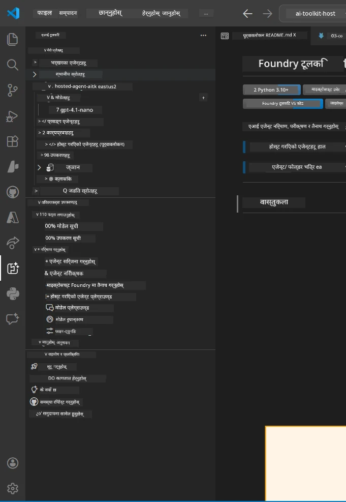
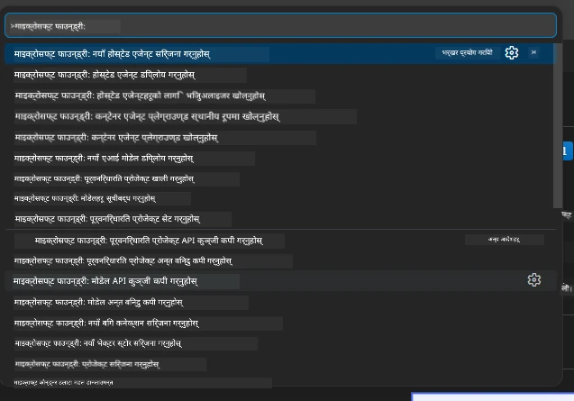

# Module 1 - Foundry Toolkit र Foundry Extension स्थापना गर्नुहोस्

यस मोड्युलले तपाईंलाई यस कार्यशालाको लागि दुईवटा मुख्य VS Code एक्सटेन्सनहरू स्थापना र पुष्टि गर्न मार्गदर्शन गर्छ। यदि तपाईंले पहिले नै [Module 0](00-prerequisites.md) मा तिनीहरूलाई स्थापना गर्नुभएको छ भने, यो मोड्युल प्रयोग गरी तिनीहरू सहीसँग काम गरिरहेका छन् कि छैनन् जाँच्न सक्नुहुन्छ।

---

## Step 1: Microsoft Foundry Extension स्थापना गर्नुहोस्

**Microsoft Foundry for VS Code** एक्सटेन्सन तपाईंको Foundry प्रोजेक्टहरू बनाउन, मोडेल तैनाथ गर्न, होस्टेड एजेन्टहरू स्क्याफोल्ड गर्न, र VS Code बाट सिधै तैनाथ गर्नको मुख्य उपकरण हो।

1. VS Code खोल्नुहोस्।
2. `Ctrl+Shift+X` थिचेर **Extensions** प्यानल खोल्नुहोस्।
3. माथि भएको खोजी बक्समा टाइप गर्नुहोस्: **Microsoft Foundry**
4. परिणामहरूमा **Microsoft Foundry for Visual Studio Code** शीर्षक खोज्नुहोस्।
   - प्रकाशक: **Microsoft**
   - Extension ID: `TeamsDevApp.vscode-ai-foundry`
5. **Install** बटनमा क्लिक गर्नुहोस्।
6. स्थापना पूरा हुन कुर्नुहोस् (सानो प्रगति सूचक देखिनेछ)।
7. स्थापना पछि, **Activity Bar** (VS Code को बाँया पट्टि रहेको ठाडो आइकन पट्टि) मा नयाँ **Microsoft Foundry** आइकन देखिनेछ (हीरा/AI आइकन जस्तो देखिन्छ)।
8. **Microsoft Foundry** आइकनमा क्लिक गरी यसको साइडबार दृश्य खोल्नुहोस्। तपाईंले निम्नखाली खण्डहरू देख्नुहुनेछ:
   - **Resources** (वा Projects)
   - **Agents**
   - **Models**

> **यदि आइकन देखिँदैन भने:** VS Code पुनः लोड गर्ने प्रयास गर्नुहोस् (`Ctrl+Shift+P` → `Developer: Reload Window`)।

---

## Step 2: Foundry Toolkit Extension स्थापना गर्नुहोस्

**Foundry Toolkit** एक्सटेन्सनले [**Agent Inspector**](https://learn.microsoft.com/azure/foundry/agents/how-to/vs-code-agents-workflow-pro-code) प्रदान गर्दछ - एक दृश्य अन्तरफलक स्थानीय रूपमा एजेन्टहरू परीक्षण र डिबग गर्नका लागि - साथै प्लेग्राउन्ड, मोडेल व्यवस्थापन, र मूल्याङ्कन उपकरणहरू पनि।

1. Extensions प्यानलमा (`Ctrl+Shift+X`), खोजी बक्स खाली गरी टाइप गर्नुहोस्: **Foundry Toolkit**
2. परिणामहरूमा **Foundry Toolkit** खोज्नुहोस्।
   - प्रकाशक: **Microsoft**
   - Extension ID: `ms-windows-ai-studio.windows-ai-studio`
3. **Install** क्लिक गर्नुहोस्।
4. स्थापना पछि, **Foundry Toolkit** आइकन Activity Bar मा देखिनेछ (रोबोट/चम्किलो आइकन जस्तो देखिन्छ)।
5. **Foundry Toolkit** आइकनमा क्लिक गरी यसको साइडबार दृश्य खोल्नुहोस्। तपाईंले Foundry Toolkit स्वागत स्क्रिन देख्नुहुनेछ विकल्पहरू सहित:
   - **Models**
   - **Playground**
   - **Agents**

---

## Step 3: दुवै एक्सटेन्सनहरू सही काम गरिरहेका छन् कि छैनन् जाँच्नुहोस्

### 3.1 Microsoft Foundry Extension जाँच्नुहोस्

1. Activity Bar मा रहेको **Microsoft Foundry** आइकन क्लिक गर्नुहोस्।
2. यदि तपाईं Azure मा साइन इन भइसकेको (Module 0 बाट), तपाईंले **Resources** अन्तर्गत आफ्ना प्रोजेक्टहरू देख्न सक्नुहुनेछ।
3. साइन इन गर्न भनिएमा, **Sign in** क्लिक गरी प्रमाणीकरण प्रक्रिया पूरा गर्नुहोस्।
4. साइडबार त्रुटि बिना देखिन्छ कि छैन भनेर सुनिश्चित गर्नुहोस्।

### 3.2 Foundry Toolkit Extension जाँच्नुहोस्

1. Activity Bar मा रहेको **Foundry Toolkit** आइकन क्लिक गर्नुहोस्।
2. स्वागत दृश्य वा मुख्य प्यानल त्रुटि बिना लोड हुन्छ कि हुँदैन जाँच गर्नुहोस्।
3. तपाईंले अहिलेसम्म केही कन्फिगर गर्न आवश्यक छैन - हामी Agent Inspector लाई [Module 5](05-test-locally.md) मा प्रयोग गर्नेछौं।

### 3.3 Command Palette मार्फत जाँच गर्नुहोस्

1. `Ctrl+Shift+P` थिचेर Command Palette खोल्नुहोस्।
2. टाइप गर्नुहोस् **"Microsoft Foundry"** - तपाईंले यस्ता आदेशहरू देख्नुहुनेछ:
   - `Microsoft Foundry: Create a New Hosted Agent`
   - `Microsoft Foundry: Deploy Hosted Agent`
   - `Microsoft Foundry: Open Model Catalog`
3. Command Palette बन्द गर्न `Escape` थिच्नुहोस्।
4. फेरि Command Palette खोल्नुहोस् र टाइप गर्नुहोस् **"Foundry Toolkit"** - तपाईंले यस्ता आदेशहरू देख्नुहुनेछ:
   - `Foundry Toolkit: Open Agent Inspector`

> यदि यी आदेशहरू देखिँदैन भने, एक्सटेन्सनहरू सहीसँग स्थापना भएका छैनन्। तिनीहरू अनइन्स्टल गरी पुनः स्थापना गर्ने प्रयास गर्नुहोस्।

---

## यी एक्सटेन्सनहरूले यस कार्यशालामा गर्ने कार्यहरू

| Extension | के गर्छ | कहिले प्रयोग गर्ने |
|-----------|---------|-------------------|
| **Microsoft Foundry for VS Code** | Foundry प्रोजेक्टहरू बनाउने, मोडेल तैनाथ गर्ने, **[hosted agents](https://learn.microsoft.com/azure/foundry/agents/concepts/hosted-agents)** स्क्याफोल्ड गर्ने (स्वचालित रूपमा `agent.yaml`, `main.py`, `Dockerfile`, `requirements.txt` सिर्जना गर्ने), [Foundry Agent Service](https://learn.microsoft.com/azure/foundry/agents/overview) मा तैनाथ गर्ने | Modules 2, 3, 6, 7 |
| **Foundry Toolkit** | स्थानीय परीक्षण/डिबगिङको लागि Agent Inspector, प्लेग्राउन्ड UI, मोडेल व्यवस्थापन | Modules 5, 7 |

> **Foundry एक्सटेन्सन यस कार्यशालाको सबैभन्दा महत्वपूर्ण उपकरण हो।** यसले सम्पूर्ण जीवनचक्र प्रक्रिया सम्हाल्छ: स्क्याफोल्ड → कन्फिगर → तैनाथ → पुष्टि। Foundry Toolkit ले स्थानीय परीक्षणको लागि दृश्य Agent Inspector प्रदान गरेर यसलाई पूरक गर्छ।

---

### चेकप्वाइन्ट

- [ ] Activity Bar मा Microsoft Foundry आइकन देखिन्छ
- [ ] क्लिक गर्दा साइडबार त्रुटि बिना खुल्छ
- [ ] Activity Bar मा Foundry Toolkit आइकन देखिन्छ
- [ ] क्लिक गर्दा साइडबार त्रुटि बिना खुल्छ
- [ ] `Ctrl+Shift+P` → "Microsoft Foundry" टाइप गर्दा उपलब्ध आदेशहरू देखिन्छन्
- [ ] `Ctrl+Shift+P` → "Foundry Toolkit" टाइप गर्दा उपलब्ध आदेशहरू देखिन्छन्

---

**अघिल्लो:** [00 - Prerequisites](00-prerequisites.md) · **अर्को:** [02 - Create Foundry Project →](02-create-foundry-project.md)

---

<!-- CO-OP TRANSLATOR DISCLAIMER START -->
**अस्वीकरण**:  
यो दस्तावेज AI अनुवाद सेवा [Co-op Translator](https://github.com/Azure/co-op-translator) प्रयोग गरी अनुवाद गरिएको हो। हामी शुद्धताको लागि प्रयासरत छौं, तर कृपया ध्यान दिनुहोस् कि स्वचालित अनुवादमा त्रुटि वा गलत जानकारी हुन सक्दछ। मूल दस्तावेज यसको मूल भाषामा प्रामाणिक स्रोत मानिनुपर्छ। महत्वपूर्ण जानकारीको लागि, पेशेवर मानव अनुवाद सिफारिस गरिन्छ। यो अनुवादको प्रयोगबाट उत्पन्न कुनै पनि गलत बुझाइ वा गलत व्याख्याका लागि हामी उत्तरदायी छैनौं।
<!-- CO-OP TRANSLATOR DISCLAIMER END -->