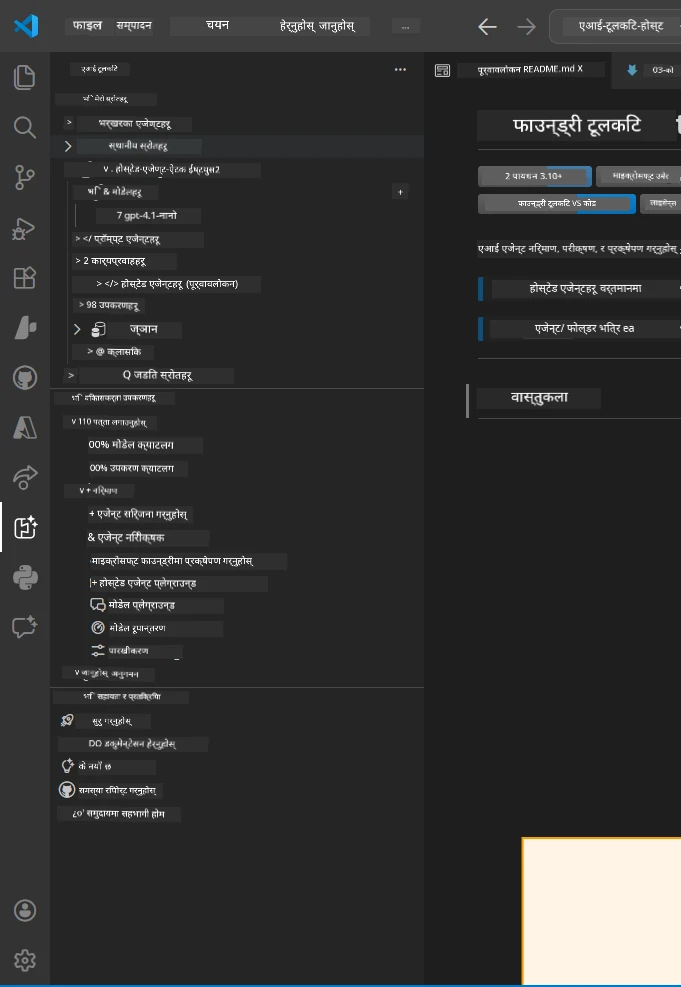
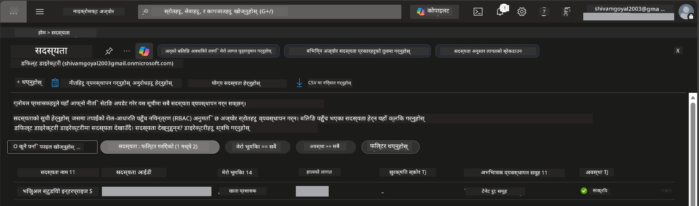
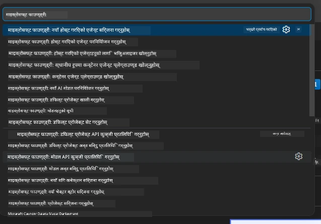
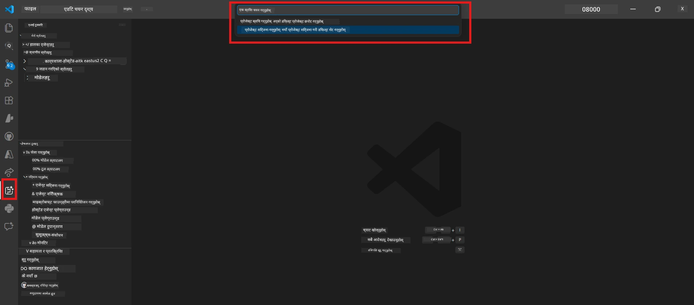
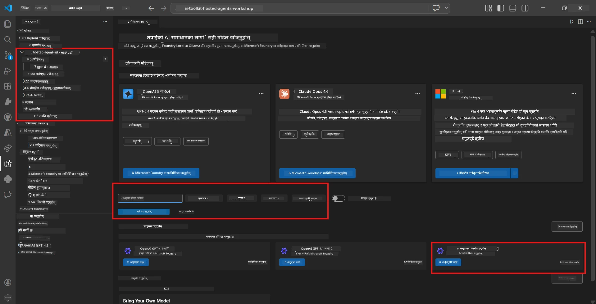
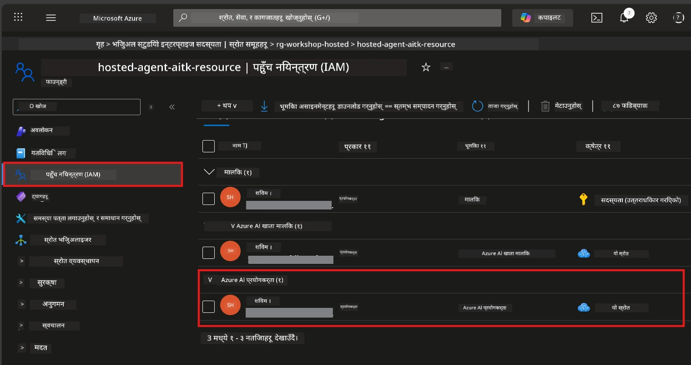

# सेटअप: एक्सटेन्सन, प्रोजेक्ट र मोडेल

⏱️ ~१५ मिनेट

यो मोड्युलमा, तपाईंले Foundry Toolkit एक्सटेन्सन इन्स्टल गर्नुहुन्छ र जाँच गर्नुहुन्छ, Foundry प्रोजेक्ट सिर्जना वा जडान गर्नुहुन्छ, र तपाईंको एजेन्टले प्रयोग गर्ने मोडेल परिनियुक्त गर्नुहुन्छ।

## चरण १: Foundry Toolkit स्थापना गर्नुहोस्

**Foundry Toolkit for VS Code** यस वर्कशपको मुख्य एक्सटेन्सन हो। यसले प्रोजेक्ट सिर्जना, मोडेल परिनियुक्ति, एजेन्ट स्क्याफोल्डिङ, स्थानीय परीक्षण (Agent Inspector), र क्लाउड परिनियुक्ति - सबै VS Code बाट प्रदान गर्दछ।

१. VS Code खोल्नुहोस् र `Ctrl+Shift+X` थिचेर **Extensions** प्यानल खोल्नुहोस्।
२. **Foundry Toolkit** खोज्नुहोस्।
३. **Foundry Toolkit for VS Code** इन्स्टल गर्नुहोस् (प्रकाशक: Microsoft, आईडी: `ms-windows-ai-studio.windows-ai-studio`)।
४. इन्स्टलपछि, **Foundry Toolkit** आइकन Activity Bar (बायाँ साइडबार) मा देखिनेछ।

> *सूचना: पुरानो एक्सटेन्सन संस्करणहरूमा Activity Bar मा "AI TOOLKIT" देखिन सक्छ। कार्यक्षमता उस्तै छ।*



## चरण २: तपाईंको पहुँच अनुसार सेटअप गर्नुहोस्

> **तपाईंको बाटो छान्नुहोस्:** तलको सेक्सन तपाईंको सेटअपसँग मेल खान्छ, त्यसलाई विस्तार गर्नुहोस्। तपाईंले **एकै** बाटो पूरा गर्न जरुरी छ।

<details>
<summary><strong>🅰️ बाटो A - Azure क्लाउड (Azure सदस्यता आवश्यक)</strong></summary>

### Azure CLI

१. [learn.microsoft.com/cli/azure/install-azure-cli](https://learn.microsoft.com/cli/azure/install-azure-cli) बाट इन्स्टल गर्नुहोस्।
२. जाँच्नुहोस्: `az --version` (2.80.0+ आशा गर्नुहोस्)।
३. साइन इन गर्नुहोस्: `az login`

### प्रमाणीकरण विकल्पहरू

[Microsoft Agent Framework](https://learn.microsoft.com/agent-framework/overview/) ले [`DefaultAzureCredential`](https://learn.microsoft.com/azure/developer/python/sdk/authentication/credential-chains#defaultazurecredential-overview) प्रयोग गर्दछ जुन विभिन्न प्रमाणीकरण विधिहरू क्रमशः प्रयास गर्छ। आफ्नो वातावरण अनुकूल विकल्प छान्नुहोस्:

#### विकल्प 1: VS Code खाता (वर्कशपको लागि सिफारिस गरिएको)
१. VS Code मा तल-बायाँ कुनामा **Accounts** आइकन (मान्छेको आकृति) क्लिक गर्नुहोस्।
२. **Sign in to use Microsoft Foundry** (वा **Sign in with Azure**) चयन गर्नुहोस्।
३. ब्राउजर खुल्छ - Azure सदस्यता पहुँच भएको Azure खातामा साइन इन गर्नुहोस्।
४. VS Code मा फिर्ता जानुहोस्। तल-बायाँमा तपाईंको खाता नाम देखिनु पर्छ।

#### विकल्प 2: Azure CLI
```bash
az login
az account set --subscription "<your-subscription-id>"
```

#### विकल्प 3: सेवा प्रिन्सिपल (Enterprise/CI)
लकडाउन वातावरण वा CI/CD पाइपलाइनहरूका लागि, `.env` फाइलमा यी वातावरण भेरिएबलहरू सेट गर्नुहोस्:
```env
AZURE_TENANT_ID=<your-tenant-id>
AZURE_CLIENT_ID=<your-client-id>
AZURE_CLIENT_SECRET=<your-client-secret>
```

> **`DefaultAzureCredential` कसरी काम गर्छ:** यसले पहिलोमा वातावरण भेरिएबलहरू प्रयास गर्छ, त्यसपछि प्रबन्धित पहिचान, त्यसपछि VS Code साइन-इन, त्यसपछि Azure CLI - र जुनसुकै सफल हुन्छ प्रयोग गर्छ। हेर्नुहोस् [क्रेडेन्शियल चेन दस्तावेजहरू](https://learn.microsoft.com/azure/developer/python/sdk/authentication/credential-chains#defaultazurecredential-overview)।

### Azure Developer CLI (azd)

१. इन्स्टल गर्नुहोस्: `winget install microsoft.azd` (Windows) वा हेर्नुहोस् [इन्स्टल दस्तावेज](https://learn.microsoft.com/azure/developer/azure-developer-cli/install-azd)।
२. जाँच्नुहोस्: `azd version`
३. साइन इन गर्नुहोस्: `azd auth login`

### Docker Desktop (ऐच्छिक)

यदि तपाईँ स्थानीय रूपमा कन्टेनरहरू बनाउनु हुन्छ भने मात्र Docker चाहिन्छ। Foundry एक्सटेन्सनले परिनियुक्तिको क्रममा बिल्डहरू आफैं सँभाल्छ।

१. [docs.docker.com/get-docker](https://docs.docker.com/get-docker/) बाट इन्स्टल गर्नुहोस्।
२. जाँच्नुहोस्: `docker info`

### Azure सदस्यता र RBAC

१. [portal.azure.com](https://portal.azure.com) मा साइन इन गर्नुहोस्।
२. **Subscriptions** मा जानुहोस् र कम्तिमा एउटा **Active** छ कि छैन जाँच्नुहोस्।
३. आफ्नो **Subscription ID** नोट गर्नुहोस् - तपाईंलाई यो Module 01 मा आवश्यक हुन्छ।



#### RBAC परिदृश्य तालिका

[Hosted Agent](https://learn.microsoft.com/azure/foundry/agents/concepts/hosted-agents) परिनियुक्तिका लागि **डेटा क्रिया** अनुमति आवश्यक छ जुन सामान्य Azure `Owner` र `Contributor` भूमिका मात्रमा हुँदैन। आवश्यक भूमिकाहरू तलको तालिका प्रयोग गरेर निर्धारण गर्नुहोस्:

| परिदृश्य | आवश्यक भूमिका | कहाँ असाइन गर्ने |
|----------|---------------|-----------------|
| नयाँ Foundry प्रोजेक्ट सिर्जना गर्ने | Foundry स्रोतमा **Azure AI Owner** | Azure Portal मा Foundry स्रोत |
| विद्यमान प्रोजेक्टमा परिनियुक्ति (नयाँ स्रोतहरू) | सदस्यतामा **Azure AI Owner** + **Contributor** | सदस्यता + Foundry स्रोत |
| पूर्ण रूपमा कन्फिगर गरिएको प्रोजेक्टमा परिनियुक्ति | खातामा **Reader** + प्रोजेक्टमा **Azure AI User** | Azure Portal मा खाता + प्रोजेक्ट |
| स्थानीय परीक्षण मात्र (परिनियुक्ति छैन) | प्रोजेक्टमा **Azure AI User** | Azure Portal मा प्रोजेक्ट |

> **मुख्य कुरा:** Azure `Owner` र `Contributor` भूमिकाले केवल *प्रबंधन* अनुमतिहरू कभर गर्छन् (ARM अपरेसनहरू)। तपाईंलाई [**Azure AI User**](https://learn.microsoft.com/azure/foundry/concepts/rbac-foundry#built-in-roles) (वा उच्च) चाहिए *डेटा क्रियाहरू* (जस्तै `agents/write`) का लागि जुन एजेन्टहरू सिर्जना र परिनियुक्त गर्न आवश्यक छ।

## Foundry प्रोजेक्टमा जडान वा सिर्जना गर्नुहोस्



१. `Ctrl+Shift+P` थिच्नुहोस् → टाइप गर्नुहोस् **Foundry Toolkit: Create Project** → चयन गर्नुहोस्।
२. तपाईंको **Azure सदस्यता** ड्रपडाउनबाट चयन गर्नुहोस्।
३. एउटा **resource group** चयन वा सिर्जना गर्नुहोस् (जस्तै, `rg-hosted-agents-workshop`)।
४. होस्टेड एजेन्टलाई समर्थन गर्ने **क्षेत्र** चयन गर्नुहोस्: `East US`, `West US 2`, वा `Sweden Central`। [क्षेत्र उपलब्धता](https://learn.microsoft.com/azure/foundry/agents/concepts/hosted-agents#region-availability) हेर्नुहोस्।
५. प्रोजेक्ट नाम प्रविष्ट गर्नुहोस् (जस्तै, `workshop-agents`)।
६. आपूर्ति गर्न २-५ मिनेट पर्खनुहोस्। VS Code मा प्रगति सूचना देखा पर्नेछ।
७. पूरा भएपछि, तपाईंको प्रोजेक्ट Foundry Toolkit साइडबारमा **MY RESOURCES** अन्तर्गत देखिनेछ।



## मोडेल परिनियुक्त गर्नुहोस् र RBAC असाइन गर्नुहोस्

तपाईंको होस्टेड एजेन्टलाई प्रतिक्रियाहरू उत्पन्न गर्न AI मोडेल चाहिन्छ।

#### मोडेल चयन म्याट्रिक्स
तपाईंको आवश्यकताअनुसार विभिन्न मोडेल तहहरूबाट छनोट गर्न सक्नुहुन्छ:

| मोडेल | उत्तम | लागत | टिप्पणीहरू |
|-------|----------|------|---------|
| `gpt-4.1` | उच्च गुणस्तर, सूक्ष्म प्रतिक्रिया | उच्च | उत्तम परिणाम, अन्तिम परीक्षणका लागि सिफारिस गरिएको |
| `gpt-4.1-mini/gpt-5-mini` | द्रुत पुनरावृत्ति, कम लागत | कम | वर्कशप विकास र छिटो परीक्षणको लागि राम्रो |
| `gpt-4.1-nano` | हल्का कामहरू | सबैभन्दा कम | सबैभन्दा किफायती, तर सरल प्रतिक्रिया |

१. `Ctrl+Shift+P` थिच्नुहोस् → **Foundry Toolkit: Open Model Catalog** (वा साइडबारमा DEVELOPER TOOLS अन्तर्गत **Model Catalog** मा क्लिक गर्नुहोस्)।
२. क्याटलगमा **gpt-4.1** खोज्नुहोस्।
३. **OpenAI GPT-4.1-mini** (वा राम्रो गुणस्तरका लागि `gpt-5-mini`) फेला पारेर **Deploy** मा क्लिक गर्नुहोस्।



४. परिनियुक्ति कन्फिगरेसनमा:
   - **परिनियुक्ति नाम:** डिफल्ट राख्नुहोस् वा कस्टम नाम राख्नुहोस्। **यो नाम सम्झनुहोस्।**
   - **लक्षित:** **Deploy to Foundry Toolkit** चयन गर्नुहोस् → तपाईंको प्रोजेक्ट छान्नुहोस्।
५. **Deploy** मा क्लिक गर्नुहोस् र १-३ मिनेट पर्खनुहोस्।

> **सिफारिस:** वर्कशपका लागि `gpt-4.1-mini/gpt-5-mini` प्रयोग गर्नुहोस् - छिटो, किफायती, र राम्रो परिणाम दिन्छ।

### आफ्ना मानहरू नोट गर्नुहोस्

परिनियुक्ति पछि, यी दुई मानहरू नोट गर्नुहोस् (तपाईंलाई Module 03 मा आवश्यक हुनेछ):

| मान | कहाँ फेला पार्ने |
|-------|----------------|
| **प्रोजेक्ट एन्डपोइन्ट** | साइडबारमा तपाईंको प्रोजेक्टमा क्लिक गर्नुहोस् → विवरणमा URL देखिन्छ (उदाहरण, `https://<account>.services.ai.azure.com/api/projects/<project>`) |
| **मोडेल परिनियुक्ति नाम** | प्रोजेक्ट विस्तार गर्नुहोस् → **Models** → तपाईंले परिनियुक्त गरेको मोडेलको नाम (जस्तै `gpt-4.1-mini/gpt-5-mini`) |

### RBAC भूमिका असाइन गर्नुहोस्

> ⚠️ **यो सबैभन्दा सामान्य छुटेको चरण हो।** सही भूमिका बिना Module 05 मा परिनियुक्ति असफल हुनेछ।

#### कुन भूमिका चाहिन्छ?
तपाईंको परिदृश्य अनुसार निम्न भूमिका संयोजनहरू आवश्यक छन्:

| परिदृश्य | आवश्यक भूमिका | कहाँ असाइन गर्ने |
|----------|--------------|------------------|
| नयाँ Foundry प्रोजेक्ट सिर्जना | Foundry स्रोतमा **Azure AI Owner** | Azure Portal मा Foundry स्रोत |
| विद्यमान प्रोजेक्टमा परिनियुक्ति (नयाँ स्रोतहरू) | सदस्यतामा **Azure AI Owner** + **Contributor** | सदस्यता + Foundry स्रोत |
| पूर्ण कन्फिगर गरिएको प्रोजेक्टमा परिनियुक्ति | खातामा **Reader** + प्रोजेक्टमा **Azure AI User** | Azure Portal मा खाता + प्रोजेक्ट |

**मुख्य कुरा:** Azure `Owner` र `Contributor` भूमिकाले केवल *प्रबंधन* अनुमतिहरू कभर गर्छन्। तपाईंलाई *डेटा क्रियाहरू* (जस्तै `agents/write`) का लागि **Azure AI User** (वा माथि) चाहिन्छ।

१. [portal.azure.com](https://portal.azure.com) खोल्नुहोस्।
२. तपाईंको **Foundry प्रोजेक्ट** नाम खोज्नुहोस् → **"Foundry Toolkit project"** प्रकारको परिणाममा क्लिक गर्नुहोस् (मूल खाता होइन)।
३. बायाँ नेभिगेसनमा **Access control (IAM)** क्लिक गर्नुहोस्।
४. **+ Add** → **Add role assignment** क्लिक गर्नुहोस्।
५. **Role tab:** **Azure AI User** खोज्नुहोस्, चयन गर्नुहोस्, र **Next** क्लिक गर्नुहोस्।
६. **Members tab:** **User, group, or service principal** चयन गर्नुहोस् → **+ Select members** क्लिक गर्नुहोस् → आफ्नो नाम खोजी र चयन गरी **Select** मा क्लिक गर्नुहोस्।
७. **Review + assign** मा क्लिक गर्नुहोस् → फेरि **Review + assign** मा क्लिक गर्नुहोस्।
८. फैलावटको लागि **१-२ मिनेट पर्खनुहोस्**।

> **किन यो भूमिका?** Azure `Owner`/`Contributor` ले मात्र प्रबंधन अनुमतिहरू दिन्छ। **Azure AI User** भूमिकाले `agents/write` डेटा क्रिया प्रदान गर्छ जुन एजेन्टहरू सिर्जना र परिनियुक्त गर्न आवश्यक छ। हेर्नुहोस् [Foundry RBAC दस्तावेजहरू](https://learn.microsoft.com/azure/foundry/concepts/rbac-foundry#built-in-roles)।



</details>

<details>
<summary><strong>🅱️ बाटो B - स्थानीय / निःशुल्क-स्तर (Azure सदस्यता आवश्यक छैन)</strong></summary>

### Foundry Local

Foundry Local ले तपाईंलाई तपाईंको आफ्नै मेसिनमा AI मोडेलहरू चलाउन दिन्छ - कुनै क्लाउड खाता आवश्यक छैन। तपाईं Foundry Local मोडेलहरू Foundry Toolkit मार्फत मोडेल क्याटलग प्रयोग गरेर पहुँच गर्न सक्नुहुन्छ:

१. Foundry Toolkit एक्सटेन्सनमा जानुहोस्।
२. Foundry Toolkit नेभिगेसनमा **Developer Tools** > र **Model Catalog** चयन गर्नुहोस्।
३. नयाँ विन्डोमा, नेभिगेसन बारबाट **local** चयन गर्नुहोस्। 
४. तल स्क्रोल गरेर **Phi 4 Mini**, क्लिक गरेर **add button** थिच्नुहोस्, एउटा पपअप देखिन्छ मोडेल डाउनलोड भइरहेको छ भनी।
५. मोडेल डाउनलोड भएपछि, तपाईं अर्को चरणमा अघि बढ्न सक्नुहुन्छ।

</details>

### ✅ जाँच बुँदा


- [ ] `Ctrl+Shift+P` → "Foundry Toolkit" मा उपलब्ध आदेशहरू देखिन्छन्
- [ ] Foundry Toolkit एक्सटेन्सन इन्स्टल गरिएको र साइडबार बिना त्रुटिहरू खुल्छ
- [ ] VS Code खुल्छ र राम्ररी सञ्चालन हुन्छ
- [ ] `python --version` 3.10+ देखाउँछ
- [ ] Foundry Toolkit आइकन VS Code Activity Bar मा देखिन्छ
- [ ] **बाटो A:** `az login` सफल, सदस्यता सक्रिय छ
- [ ] **बाटो B:** Foundry Local चलिरहेको छ (`foundry local status`)
- [ ] **बाटो A:** Foundry प्रोजेक्ट साइडबारमा देखिन्छ, मोडेल परिनियुक्त, Azure AI User भूमिका असाइन गरिएको
- [ ] **बाटो B:** Foundry Local मोडेलसहित चलिरहेका छन्
- [ ] तपाईंले आफ्नो **एन्डपोइन्ट** र **मोडेल परिनियुक्ति नाम** नोट गर्नुभएको छ


**अघिल्लो:** [00 - पूर्वआवश्यकताहरू](00-prerequisites.md) · **अर्को:** [02 - होस्टेड एजेन्ट सिर्जना गर्नुहोस् →](02-create-hosted-agent.md)

---

<!-- CO-OP TRANSLATOR DISCLAIMER START -->
**अस्वीकरण**:
यो दस्तावेज़ AI अनुवाद सेवा [Co-op Translator](https://github.com/Azure/co-op-translator) प्रयोग गरेर अनुवाद गरिएको हो। हामी सही हुन प्रयास गर्छौं, तर कृपया जानकार हुनुस् कि स्वचालित अनुवादमा त्रुटिहरू वा अशुद्धताहरू हुन सक्छन्। मूल दस्तावेज़ यसको मूल भाषामा आधिकारिक स्रोत मानिनुपर्छ। महत्वपूर्ण जानकारीका लागि व्यावसायिक मानव अनुवाद सिफारिस गरिन्छ। यस अनुवादको प्रयोगबाट उत्पन्न कुनै पनि गलत बुझाइ वा त्रुटिको लागि हामी जिम्मेवार छैनौं।
<!-- CO-OP TRANSLATOR DISCLAIMER END -->