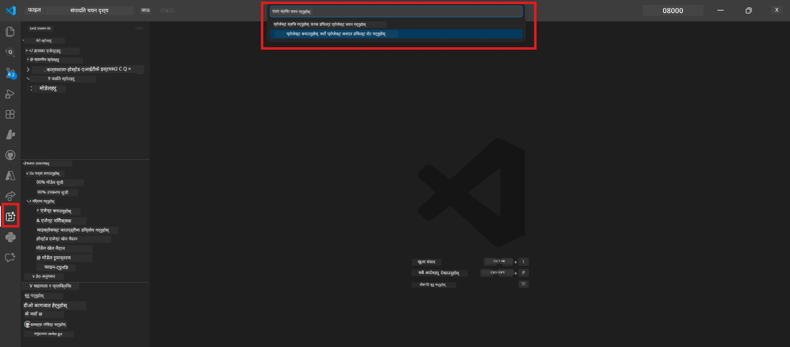
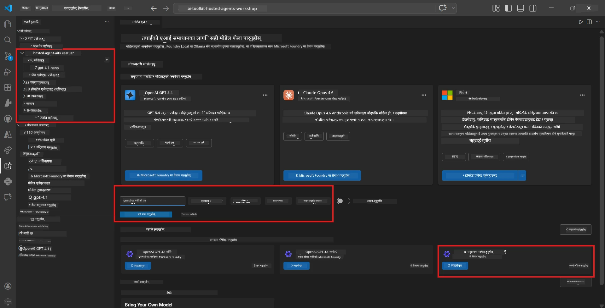
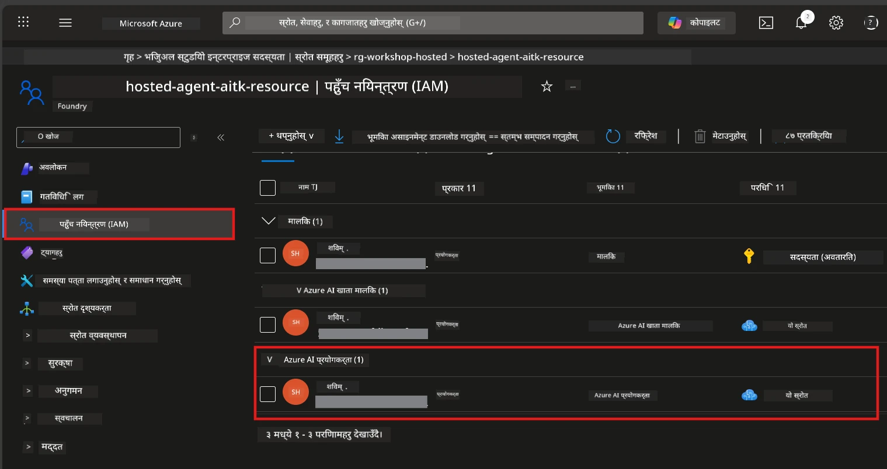

# Module 2 - Foundry परियोजना सिर्जना गर्नुहोस् र मोडेल तैनाथ गर्नुहोस्

यस मोड्युलमा, तपाईं Microsoft Foundry परियोजना सिर्जना गर्नुहुन्छ (वा चुन्नुहुन्छ) र एउटा मोडेल तैनाथ गर्नुहुन्छ जुन तपाईंको एजेन्टले उपयोग गर्नेछ। प्रत्येक कदम स्पष्ट रूपमा लेखिएको छ - क्रमसँगै पालन गर्नुहोस्।

> यदि तपाईं सँग पहिले नै एउटा Foundry परियोजना छ जसमा मोडेल तैनाथ छ भने, [Module 3](03-create-hosted-agent.md) मा जानुहोस्।

---

## Step 1: VS Code बाट Foundry परियोजना सिर्जना गर्नुहोस्

तपाईं Microsoft Foundry एक्सटेन्सनको प्रयोग गरेर परियोजना सिर्जना गर्नुहुनेछ VS Code छोड्नु नपर्ने गरी।

1. `Ctrl+Shift+P` थिचेर **Command Palette** खोल्नुहोस्।
2. टाइप गर्नुहोस्: **Microsoft Foundry: Create Project** र चयन गर्नुहोस्।
3. एउटा ड्रपडाउन देखिन्छ - सूचीबाट तपाईंको **Azure subscription** चयन गर्नुहोस्।
4. तपाईंलाई **resource group** छान्न वा सिर्जना गर्न सोधिनेछ:
   - नयाँ बनाउन: नाम टाइप गर्नुहोस् (जस्तै, `rg-hosted-agents-workshop`) र Enter थिच्नुहोस्।
   - पहिले देखि रहेका मध्ये छान्न: ड्रपडाउनबाट चयन गर्नुहोस्।
5. एक **region** चयन गर्नुहोस्। **महत्त्वपूर्ण:** होस्ट गरिएका एजेन्टहरू समर्थित क्षेत्र छनोट गर्नुस्। [region availability](https://learn.microsoft.com/azure/foundry/agents/concepts/hosted-agents#region-availability) हेर्नुहोस् - सामान्य विकल्पहरू `East US`, `West US 2`, वा `Sweden Central` हुन्।
6. Foundry परियोजनाको लागि एक **नाम** प्रविष्ट गर्नुहोस् (जस्तै, `workshop-agents`)।
7. Enter थिचेर provisioning पूरा हुन पर्खनुहोस्।

> **Provisioning मा २-५ मिनेट लाग्छ।** तपाईंले VS Code को तल्लो-दायाँ कुन्तामा प्रगति सूचना देख्नुहुनेछ। Provisioning हुँदा VS Code बन्द नगर्नुहोस्।

8. पूरा भएपछि, **Microsoft Foundry** साइडबारले तपाईंको नयाँ परियोजना **Resources** अन्तर्गत देखाउनेछ।
9. परियोजना नाममा क्लिक गरेर विस्तार गर्नुहोस् र यसले **Models + endpoints** र **Agents** जस्ता खण्डहरू देखाउँछ भनी पुष्टि गर्नुहोस्।



### विकल्प: Foundry पोर्टलबाट सिर्जना गर्नुहोस्

यदि तपाईं ब्राउजर प्रयोग गर्न चाहनुहुन्छ भने:

1. [https://ai.azure.com](https://ai.azure.com) खोल्नुहोस् र साइन इन गर्नुहोस्।
2. होम पेजमा **Create project** मा क्लिक गर्नुहोस्।
3. परियोजनाको नाम प्रविष्ट गर्नुहोस्, तपाईंको subscription, resource group, र region चयन गर्नुहोस्।
4. **Create** मा क्लिक गर्नुहोस् र provisioning पूरा हुन पर्खनुहोस्।
5. सिर्जना भएपछि, VS Code फर्कनुहोस् - परियोजना Foundry साइडबारमा रिफ्रेशपछि देखा पर्नेछ (रिफ्रेश आइकनमा क्लिक गर्नुहोस्)।

---

## Step 2: मोडेल तैनाथ गर्नुहोस्

तपाईंको [hosted agent](https://learn.microsoft.com/azure/foundry/agents/concepts/hosted-agents) लाई प्रतिक्रिया उत्पन्न गर्न Azure OpenAI मोडेल चाहिन्छ। तपाईं [अब मोडेल तैनाथ गर्नु पर्नेछ](https://learn.microsoft.com/azure/ai-foundry/openai/how-to/create-resource#deploy-a-model)।

1. `Ctrl+Shift+P` थिचेर **Command Palette** खोल्नुहोस्।
2. टाइप गर्नुहोस्: **Microsoft Foundry: Open [Model Catalog](https://learn.microsoft.com/azure/ai-foundry/openai/concepts/models)** र चयन गर्नुहोस्।
3. Model Catalog दृश्य VS Code मा खुल्छ। ब्राउज गर्नुहोस् वा खोजी पट्टीमा **gpt-4.1** खोज्नुहोस्।
4. **gpt-4.1** मोडेल कार्डमा क्लिक गर्नुहोस् (वा तपाइँले कम खर्चिलो चाहनुहुन्छ भने `gpt-4.1-mini`)।
5. **Deploy** मा क्लिक गर्नुहोस्।


6. तैनाथीकरण कन्फिगरेसनमा:
   - **Deployment name**: पूर्वनिर्धारित छोड्नुहोस् (जस्तै, `gpt-4.1`) वा कस्टम नाम प्रविष्ट गर्नुहोस्। **यस नामलाई सम्झनुहोस्** - तपाइँलाई Module 4 मा आवश्यक पर्छ।
   - **Target**: **Deploy to Microsoft Foundry** चयन गर्नुहोस् र तपाईंले हालै सिर्जना गरेको परियोजना छान्नुहोस्।
7. **Deploy** क्लिक गर्नुहोस् र तैरमाथि पूरा हुन (१-३ मिनेट) पर्खनुहोस्।

### मोडेल छनोट गर्ने

| मोडेल | उत्कृष्ट प्रयोग | लागत | नोटहरू |
|-------|----------------|-------|----------|
| `gpt-4.1` | उच्च गुणस्तरीय, बृहत् प्रतिक्रिया | उच्च | उत्कृष्ट नतिजा, अन्तिम परीक्षणका लागि सिफारिस गरिन्छ |
| `gpt-4.1-mini` | छिटो पुनरावृति, कम लागत | कम | कार्यशाला विकास र छिटो परीक्षणका लागि राम्रो |
| `gpt-4.1-nano` | हल्का वजन कार्यहरू | सबैभन्दा कम | सबैभन्दा लागत-कुशल, तर सरल प्रतिक्रिया |

> **यस कार्यशालाको लागि सिफारिस:** विकास र परीक्षणमा `gpt-4.1-mini` प्रयोग गर्नुहोस्। छिटो, सस्तो र अभ्यासका लागि राम्रो परिणाम दिन्छ।

### मोडेल तैनाथीकरण पुष्टि गर्नुहोस्

1. **Microsoft Foundry** साइडबारमा तपाईंको परियोजना विस्तार गर्नुहोस्।
2. **Models + endpoints** (वा समान खण्ड) मा हेर्नुहोस्।
3. तपाईंले तैनाथ गरिएको मोडेल (जस्तै, `gpt-4.1-mini`) **Succeeded** वा **Active** स्थिति सहित देख्नु पर्छ।
4. मोडेल तैनाथीकरणमा क्लिक गरेर विवरणहरू हेर्नुहोस्।
5. यी दुई मानहरू **नोट गर्नुहोस्** - तपाइँलाई Module 4 मा आवश्यक पर्छ:

   | सेटिङ | कहाँ खोज्ने | उदाहरण मान |
   |---------|-------------|-------------|
   | **Project endpoint** | Foundry साइडबारमा परियोजना नाममा क्लिक गर्नुहोस्। विवरण दृश्यमा endpoint URL देखिन्छ। | `https://<account>.services.ai.azure.com/api/projects/<project>` |
   | **Model deployment name** | तैनाथ मोडेलको नाम जुन देखिन्छ। | `gpt-4.1-mini` |

---

## Step 3: आवश्यक RBAC रोलहरू असाइन गर्नुहोस्

यो **सबैभन्दा प्रायः छुट्ने चरण** हो। सही रोलहरू बिना, Module 6 को तैनाथीकरण अनुमति त्रुटिसँग असफल हुनेछ।

### 3.1 Azure AI User रोल आफूलाई असाइन गर्नुहोस्

1. ब्राउजर खोल्नुहोस् र [https://portal.azure.com](https://portal.azure.com) मा जानुहोस्।
2. शीर्ष खोजी बारमा तपाईंको **Foundry परियोजना** नाम टाइप गर्नुहोस् र परिणाममा क्लिक गर्नुहोस्।
   - **महत्त्वपूर्ण:** **परियोजना** स्रोत (type: "Microsoft Foundry project") मा जानुहोस्, अभिभावक खाता/हब स्रोतमा होइन।
3. परियोजनाको बाँया नेभिगेसनमा **Access control (IAM)** क्लिक गर्नुहोस्।
4. माथि **+ Add** बटनमा क्लिक गर्नुहोस् → **Add role assignment** चयन गर्नुहोस्।
5. **Role** ट्याबमा, [**Azure AI User**](https://learn.microsoft.com/azure/foundry/concepts/rbac-foundry#built-in-roles) खोज्नुहोस् र चयन गर्नुहोस्। **Next** क्लिक गर्नुहोस्।
6. **Members** ट्याबमा:
   - **User, group, or service principal** चयन गर्नुहोस्।
   - **+ Select members** क्लिक गर्नुहोस्।
   - तपाईंको नाम वा इमेल खोज्नुहोस्, आफैँ चयन गर्नुहोस् र **Select** क्लिक गर्नुहोस्।
7. **Review + assign** क्लिक गर्नुहोस् → फेरि पुष्टि गर्न **Review + assign** क्लिक गर्नुहोस्।



### 3.2 (वैकल्पिक) Azure AI Developer रोल असाइन गर्नुहोस्

यदि तपाईंले परियोजनामा थप स्रोतहरू सिर्जना गर्न वा प्रोग्रामिङ्गले तैनाथीकरण व्यवस्थापन गर्न चाहनुहुन्छ भने:

1. माथिका चरणहरू दोहोर्याउनुहोस्, तर चरण 5 मा **Azure AI Developer** चयन गर्नुहोस्।
2. यो Foundry स्रोत (खाता) स्तरमा असाइन गर्नुहोस्, केवल परियोजना स्तरमा मात्र होइन।

### 3.3 आफ्नो रोल असाइनमेंटहरू पुष्टि गर्नुहोस्

1. परियोजनाको **Access control (IAM)** पृष्ठमा **Role assignments** ट्याबमा जानुहोस्।
2. आफ्नो नाम खोज्नुहोस्।
3. परियोजना स्कोपमा कम्तीमा **Azure AI User** सूचीकृत भएको देख्नु पर्छ।

> **किन यो महत्त्वपूर्ण छ:** [`Azure AI User`](https://learn.microsoft.com/azure/foundry/concepts/rbac-foundry#built-in-roles) रोलले `Microsoft.CognitiveServices/accounts/AIServices/agents/write` डाटा क्रिया अनुमति दिन्छ। बिना यस अनुमति, तपाईंले तैनाथीकरण क्रममा त्रुटि देख्नुहुनेछ:
>
> ```
> Error: lacks the required data action 
> Microsoft.CognitiveServices/accounts/AIServices/agents/write 
> to perform POST /api/projects/{projectName}/assistants operation.
> ```
>
> थप विवरणका लागि [Module 8 - Troubleshooting](08-troubleshooting.md) हेर्नुहोस्।

---

### जाँचसूची

- [ ] Foundry परियोजना अवस्थित छ र VS Code मा Microsoft Foundry साइडबारमा देखिन्छ
- [ ] कम्तीमा एउटा मोडेल तैनाथ छ (जस्तै, `gpt-4.1-mini`) स्थिति **Succeeded** सहित
- [ ] तपाईंले **project endpoint** URL र **model deployment name** नोट गर्नुभयो
- [ ] तपाईंलाई परियोजना स्तरमा **Azure AI User** रोल असाइन गरिएको छ (Azure Portal → IAM → Role assignments मा पुष्टि गर्नुहोस्)
- [ ] परियोजना होस्ट गरिएका एजेन्टहरूको लागि [समर्थित क्षेत्र](https://learn.microsoft.com/azure/foundry/agents/concepts/hosted-agents#region-availability) मा छ

---

**अघिल्लो:** [01 - Install Foundry Toolkit](01-install-foundry-toolkit.md) · **अर्को:** [03 - Create a Hosted Agent →](03-create-hosted-agent.md)

---

<!-- CO-OP TRANSLATOR DISCLAIMER START -->
**अस्वीकरण**:  
यो दस्तावेज़ AI अनुवाद सेवा [Co-op Translator](https://github.com/Azure/co-op-translator) को प्रयोग गरेर अनुवाद गरिएको हो। हामी 정확ताको प्रयास गर्दछौं, तर स्वचालित अनुवादमा त्रुटिहरू वा अशुद्धिहरू हुन सक्छन्। मूल दस्तावेज़ यसको मातृभाषामा आधिकारिक स्रोत मान्नुपर्छ। महत्वपूर्ण जानकारीका लागि व्यावसायिक मानव अनुवाद सिफारिस गरिन्छ। यस अनुवादको प्रयोगबाट उत्पन्न कुनै पनि गलतफहमी वा गलत व्याख्याहरूका लागि हामी जिम्मेवार हुनेछैनौं।
<!-- CO-OP TRANSLATOR DISCLAIMER END -->