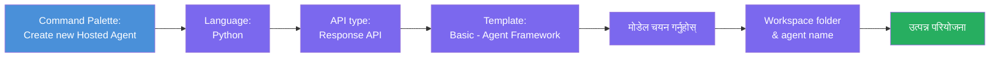
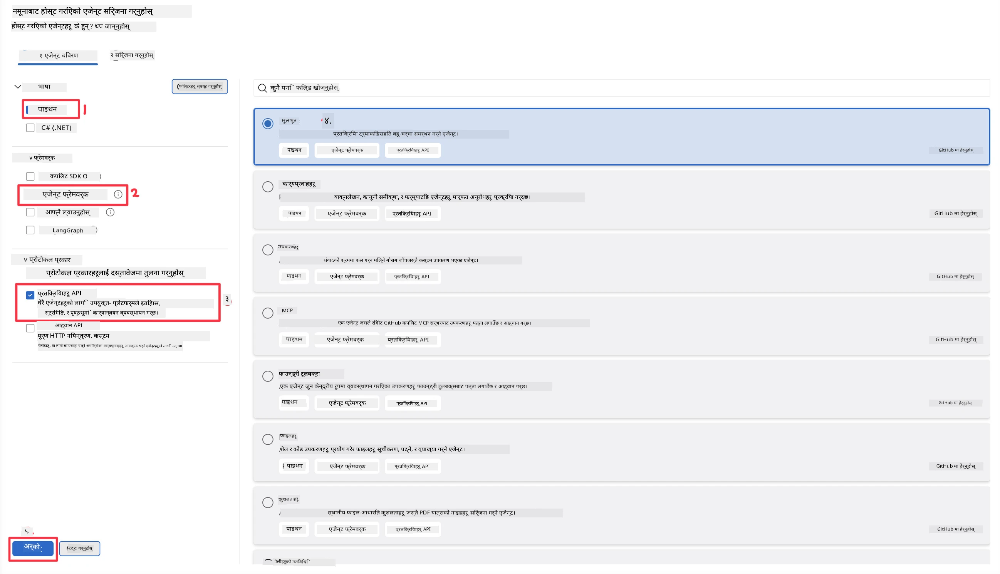
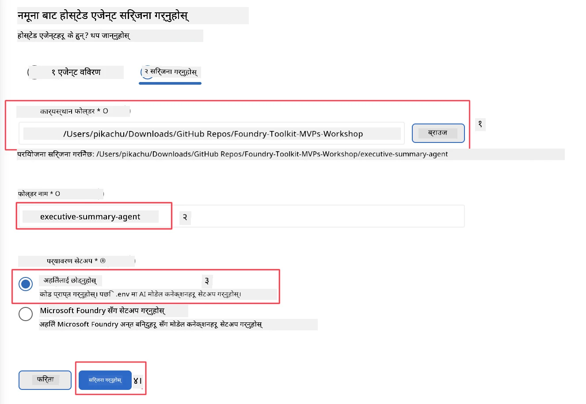

# मोड्युल २ - नयाँ होस्ट गरिएको एजेन्ट सिर्जना गर्नुहोस्

⏱️ ~५ मिनेट

यस मोड्युलमा, तपाईं Foundry Toolkit प्रयोग गरेर **होस्ट गरिएको एजेन्ट परियोजना स्क्याफोल्ड गर्नुहुन्छ**। स्क्याफोल्डले पूरै परियोजना संरचना - `agent.yaml`, `main.py`, `Dockerfile`, `requirements.txt`, र VS Code डिबग कन्फिगरेसन - उत्पादन गर्छ ताकि तपाईं एजेन्टको व्यवहार अनुकूलनमा केन्द्रित हुन सक्नुहोस्।

> **मुख्य अवधारणा:** यस लेबमा `agent/` फोल्डर Foundry Toolkit ले जे उत्पादन गर्छ त्यसको उदाहरण हो। तपाईंले यी फाइलहरू स्क्र्याचबाट लेख्नु पर्दैन।

### स्क्याफोल्ड विजार्ड प्रवाह



---

## कदम १: Create Hosted Agent विजार्ड खोल्नुहोस्

१. `Ctrl+Shift+P` थिचेर **कमाण्ड प्यालेट** खोल्नुहोस्।
२. टाइप गर्नुहोस्: **Foundry Toolkit: Create new Hosted Agent** र चयन गर्नुहोस्।

> **वैकल्पिक: Foundry पोर्टल मार्फत सिर्जना गर्नुहोस्**
> यदि तपाईं ब्राउजर प्रयोग गर्न चाहनुहुन्छ भने, तपाईं आफ्नो परियोजना [https://ai.azure.com](https://ai.azure.com) मा सिर्जना गर्न सक्नुहुन्छ। परियोजना प्राविधिक भएपछि, VS Code मा फर्केर **Foundry Toolkit** साइडबार प्रयोग गरी यसमा जडान गर्नुहोस्।

> **वैकल्पिक:** Foundry Toolkit साइडबारमा **Hosted Agents (Preview)** नजिकको **+** आइकन क्लिक गर्नुहोस्।

## कदम २: सेटिङहरू चयन गर्नुहोस्



१. बाँयातर्फको नेभिगेशन/विकल्प सेक्सनमा तलका विकल्पहरू चयन गर्नुहोस्:

| मेनु | चयन | नोटहरू |
|--------|-----------|-------|
| **भाषा** | Python | C# पनि समर्थित |
| **फ्रेमवर्क** | Agent Framework | Agent Framework SDK प्रयोग गरेर सजिलो सुरुवात बिन्दु |
| **एपीआई प्रकार** | Response API | `POST /responses` - प्लेटफर्म-प्रबन्धित इतिहाससहित कुराकानीमूलक |
| **टेम्प्लेट** | Basic | Agent Framework SDK प्रयोग गरेर साधारण सुरुवात बिन्दु |

२. चयन गरेपछि, **Next** क्लिक गर्नुहोस्



३. अर्को विन्डोमा, तलको चयन गर्नुहोस्:

| मेनु | चयन | नोटहरू |
|--------|-----------|-------|
| **वर्कस्पेस फोल्डर** | लक्ष्य फोल्डर चयन गर्नुहोस् | जस्तै `/workspace/Foundry_Toolkit_for_VSCode_Lab/` वा यस रिपोमा कुनै उपफोल्डर |
| **एजेन्ट नाम** | नाम प्रविष्ट गर्नुहोस् | जस्तै `executive-summary-agent` |
| **पर्यावरण सेटअप** | अहिले सेटअप नगर्नुहोस् |  |

बनाउने क्लिक गरेर हाम्रो एजेन्ट सिर्जना गर्नुहोस्। एजेन्ट नामसँग नयाँ फोल्डर सिर्जना हुनेछ।

## कदम ३: उत्पादित परियोजना निरीक्षण गर्नुहोस्

स्क्याफोल्डिंग पूरा भएपछि, Explorer (`Ctrl+Shift+E`) मा यी फाइलहरू देखिने सुनिश्चित गर्नुहोस्:

```
📂 my-agent/
├── .env                ← Environment variables (placeholders)
├── .vscode/
│   ├── launch.json     ← Debug config (F5 → run + Agent Inspector)
│   └── tasks.json      ← VS Code task definitions
├── agent.yaml          ← Agent definition (kind: hosted)
├── Dockerfile          ← Container config for deployment
├── main.py             ← Agent entry point (your main code)
└── requirements.txt    ← Python dependencies
```

### प्रमुख फाइलहरू व्याख्या

| फाइल | लक्ष्य |
|------|---------|
| `agent.yaml` | एजेन्टलाई `kind: hosted` को रूपमा घोषणा गर्छ, वातावरण भेरिएबलहरू नक्शा गर्छ, `/responses` प्रोटोकल परिभाषित गर्छ |
| `main.py` | `FoundryChatClient` सिर्जना गर्छ → यसलाई `Agent` मा निर्देशनसहित र्याप गर्छ → `ResponsesHostServer` मार्फत पोर्ट ८०८८ मा सेवा दिन्छ |
| `Dockerfile` | `python:3.12-slim` प्रयोग गर्छ, निर्भरता स्थापना गर्छ, पोर्ट ८०८८ खुला गर्छ, `main.py` चलाउँछ |
| `requirements.txt` | `agent-framework-foundry`, `agent-framework-foundry-hosting`, `mcp`, `debugpy` |

> **महत्त्वपूर्ण:** स्क्याफोल्ड गरिएको एजेन्ट फोल्डरलाई सिधै VS Code मा (अर्थात् `agent/` फोल्डर आफैँ) खोल्नुहोस् ताकि `.vscode/launch.json` र `tasks.json` F5 डिबगिङका लागि सहि काम गरोस्।

---

### ✅ जाँच बिन्दु

- [ ] सबै अपेक्षित फाइलहरूसँग स्क्याफोल्ड गरिएको परियोजना सिर्जना भएको छ
- [ ] `agent.yaml` मा `kind: hosted` र `protocol: responses` देखिन्छ
- [ ] `main.py` मा `Agent`, `FoundryChatClient`, `ResponsesHostServer` आयात गरिएको छ
- [ ] एजेन्ट फोल्डर VS Code मा वर्कस्पेस रुटको रूपमा खुला छ

---

**अघिल्लो:** [01 - सेटअप](01-setup.md) · **अर्को:** [03 - कन्फिगर र कोड गर्नुहोस् →](03-configure-and-code.md)

---

<!-- CO-OP TRANSLATOR DISCLAIMER START -->
**अस्वीकरण**:
यो दस्तावेज़ AI अनुवाद सेवा [Co-op Translator](https://github.com/Azure/co-op-translator) प्रयोग गरेर अनुवाद गरिएको हो। हामी सही हुन प्रयास गर्छौं, तर कृपया जानकार हुनुस् कि स्वचालित अनुवादमा त्रुटिहरू वा अशुद्धताहरू हुन सक्छन्। मूल दस्तावेज़ यसको मूल भाषामा आधिकारिक स्रोत मानिनुपर्छ। महत्वपूर्ण जानकारीका लागि व्यावसायिक मानव अनुवाद सिफारिस गरिन्छ। यस अनुवादको प्रयोगबाट उत्पन्न कुनै पनि गलत बुझाइ वा त्रुटिको लागि हामी जिम्मेवार छैनौं।
<!-- CO-OP TRANSLATOR DISCLAIMER END -->