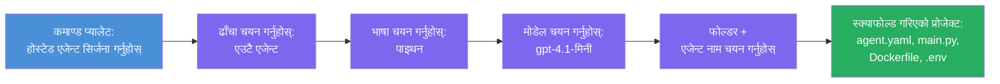

# मोड्युल ३ - नयाँ होस्टेड एजेन्ट सिर्जना गर्नुहोस् (फाउन्ड्री एक्सटेन्सनद्वारा अटो-स्क्याफोल्डेड)

यस मोड्युलमा, तपाईं Microsoft Foundry विस्तार प्रयोग गरेर **नयाँ [होस्टेड एजेन्ट](https://learn.microsoft.com/azure/foundry/agents/concepts/hosted-agents) परियोजना स्क्याफोल्ड गर्नुहुन्छ**। विस्तारले तपाईंको लागि सम्पूर्ण परियोजना संरचना उत्पन्न गर्छ - जसमा `agent.yaml`, `main.py`, `Dockerfile`, `requirements.txt`, `.env` फाइल, र VS Code डिबग कन्फिगरेशन समावेश छन्। स्क्याफोल्ड गरेपछि, तपाईं यी फाइलहरूलाई तपाईंको एजेन्टका निर्देशनहरू, उपकरणहरू र कन्फिगरेसन अनुसार अनुकूलित गर्नुहुन्छ।

> **मुख्य अवधारणा:** यो ल्याबको `agent/` फोल्डर Foundry विस्तारले यो स्क्याफोल्ड कमाण्ड चलाउँदा उत्पन्न गर्ने उदाहरण हो। तपाईंले यी फाइलहरू स्क्र्याचबाट लेख्नु पर्दैन - विस्तारले सिर्जना गर्छ र त्यसपछि तपाईंले तिनीहरूलाई परिमार्जन गर्नुहुन्छ।

### स्क्याफोल्ड विजार्ड प्रवाह


---

## चरण १: Create Hosted Agent विजार्ड खोल्नुहोस्

१. `Ctrl+Shift+P` थिचेर **Command Palette** खोल्नुहोस्।  
२. टाइप गर्नुहोस्: **Microsoft Foundry: Create a New Hosted Agent** र यसलाई चयन गर्नुहोस्।  
३. होस्टेड एजेन्ट सिर्जना विजार्ड खुल्छ।  

> **वैकल्पिक बाटो:** तपाईं Microsoft Foundry साइडबारबाट पनि यो विजार्डमा पुग्न सक्नुहुन्छ → **Agents** सँगको **+** आइकनमा क्लिक गर्नुहोस् वा दायाँ-क्लिक गरेर **Create New Hosted Agent** चयन गर्नुहोस्।

---

## चरण २: आफ्नो टेम्प्लेट छान्नुहोस्

विजार्डले तपाईंलाई टेम्प्लेट छान्न सोध्छ। तपाईंले यस्ता विकल्पहरू देख्नुहुनेछ:

| टेम्प्लेट | विवरण | कहिल्यै प्रयोग गर्ने |
|----------|-------------|-------------|
| **Single Agent** | एउटै एजेन्ट जसको आफ्नै मोडल, निर्देशनहरू, र वैकल्पिक उपकरणहरू छन् | यो कार्यशाला (Lab 01) |
| **Multi-Agent Workflow** | बहु एजेन्टहरू जुन अनुक्रममा सहकार्य गर्छन् | Lab 02 |

१. **Single Agent** चयन गर्नुहोस्।  
२. **Next** क्लिक गर्नुहोस् (वा चयन स्वचालित रूपमा अघि बढ्छ)।  

---

## चरण ३: प्रोग्रामिङ भाषा छान्नुहोस्

१. **Python** (यस कार्यशालाका लागि सिफारिश गरिएको) चयन गर्नुहोस्।  
२. **Next** क्लिक गर्नुहोस्।  

> **C# पनि समर्थित छ** यदि तपाईं .NET रोज्नुहुन्छ भने। स्क्याफोल्ड संरचना समान छ (यसमा `Program.cs` हुन्छ `main.py` को सट्टा)।

---

## चरण ४: आफ्नो मोडल चयन गर्नुहोस्

१. विजार्डले Foundry परियोजनामा तैनाथ गरिएको मोडलहरू देखाउँछ (मोड्युल २ बाट)।  
२. तपाईंले तैनाथ गर्नुभएको मोडल चयन गर्नुहोस् - जस्तै, **gpt-4.1-mini**।  
३. **Next** क्लिक गर्नुहोस्।  

> यदि तपाईंले कुनै मोडल देख्नु हुन्न भने, [मोड्युल २](02-create-foundry-project.md) मा फर्केर पहिले एउटा मोडल तैनाथ गर्नुहोस्।

---

## चरण ५: फोल्डर स्थान र एजेन्ट नाम चयन गर्नुहोस्

१. फाइल संवाद खोलिन्छ - परियोजना सिर्जना हुने **लक्ष्य फोल्डर** चयन गर्नुहोस्। यस कार्यशालाका लागि:  
   - नयाँ सुरु गर्नु भएमा: कुनै पनि फोल्डर छान्न सक्नुहुन्छ (जस्तै, `C:\Projects\my-agent`)  
   - कार्यशाला रिपो भित्र काम गर्दा: `workshop/lab01-single-agent/agent/` भित्र नयाँ सबफोल्डर सिर्जना गर्नुहोस्  
२. होस्टेड एजेन्टको **नाम** लेख्नुहोस् (जस्तै, `executive-summary-agent` वा `my-first-agent`)।  
३. **Create** क्लिक गर्नुहोस् (वा Enter थिच्नुहोस्)।  

---

## चरण ६: स्क्याफोल्डिङ पूरा हुन पर्खनुहोस्

१. VS Code ले स्क्याफोल्ड गरिएको परियोजनासहितको **नयाँ विन्डो** खोल्छ।  
२. परियोजना पूर्ण रूपमा लोड हुन केहि सेकेन्ड पर्खनुहोस्।  
३. एक्सप्लोरर प्यानलमा (`Ctrl+Shift+E`) निम्न फाइलहरू देखिनु पर्छ:

```
📂 my-first-agent/
├── .env                ← Environment variables (auto-generated with placeholders)
├── .vscode/
│   └── launch.json     ← Debug configuration (F5 to run + Agent Inspector)
├── agent.yaml          ← Agent definition (kind: hosted)
├── Dockerfile          ← Container configuration for deployment
├── main.py             ← Agent entry point (your main code file)
└── requirements.txt    ← Python dependencies
```

> **यो यो ल्याबको `agent/` फोल्डर जस्तै संरचना हो।** Foundry विस्तारले यी फाइलहरू स्वचालित रूपमा सिर्जना गर्छ - तपाईंले म्यानुअली स्थापना गर्नु पर्दैन।

> **कार्यशाला नोट:** यस कार्यशाला रिपोमा `.vscode/` फोल्डर **वर्कस्पेस रूट** मा छ (हरेक परियोजनाभित्र होइन)। यसले साझा `launch.json` र `tasks.json` समावेश गर्दछ जसमा दुई डिबग कन्फिगरेशन छन् - **"Lab01 - Single Agent"** र **"Lab02 - Multi-Agent"** - हरेकले सही ल्याबको `cwd` तर्फ निर्देशन गर्दछ। F5 थिच्दा, तपाईंले काम गर्दै हुनु भएको ल्याबसँग मिल्दोजुल्दो कन्फिगरेशन ड्रपडाउनबाट चयन गर्नुहोस्।

---

## चरण ७: प्रत्येक उत्पन्न फाइल बुझ्नुहोस्

विजार्डले सिर्जना गरेका प्रत्येक फाइल जाँच गर्न केही समय लिनुहोस्। यसलाई बुझ्न महत्त्वपूर्ण छ, विशेष गरी मोड्युल ४ (अनुकूलन) का लागि।

### ७.१ `agent.yaml` - एजेन्ट परिभाषा

`agent.yaml` खोल्नुहोस्। यसरी देखिन्छ:

```yaml
# yaml-language-server: $schema=https://raw.githubusercontent.com/microsoft/AgentSchema/refs/heads/main/schemas/v1.0/ContainerAgent.yaml

kind: hosted
name: my-first-agent
description: >
  A hosted agent deployed to Microsoft Foundry Agent Service.
metadata:
  authors:
    - Microsoft
  tags:
    - Azure AI AgentServer
    - Microsoft Agent Framework
    - Hosted Agent
protocols:
  - protocol: responses
    version: v1
environment_variables:
  - name: AZURE_AI_PROJECT_ENDPOINT
    value: ${PROJECT_ENDPOINT}
  - name: AZURE_AI_MODEL_DEPLOYMENT_NAME
    value: ${MODEL_DEPLOYMENT_NAME}
dockerfile_path: Dockerfile
resources:
  cpu: '0.25'
  memory: 0.5Gi
```

**मुख्य फिल्डहरू:**

| फिल्ड | उद्देश्य |
|-------|---------|
| `kind: hosted` | यो एक होस्टेड एजेन्ट हो भनी घोषणा गर्छ (कन्टेनर-आधारित, [Foundry Agent Service](https://learn.microsoft.com/azure/foundry/agents/overview) मा तैनाथ) |
| `protocols: responses v1` | एजेन्टले OpenAI-अनुकूल `/responses` HTTP एन्डपोइन्ट प्रदान गर्छ |
| `environment_variables` | तैनाथ गर्दा `.env` मानहरूलाई कन्टेनर वातावरण चरहरूसँग म्याप गर्छ |
| `dockerfile_path` | कन्टेनर इमेज बनाउन प्रयोग हुने Dockerfile तर्फ सङ्केत गर्छ |
| `resources` | कन्टेनरका लागि CPU र मेमोरी आवंटन (०.२५ CPU, ०.५Gi मेमोरी) |

### ७.२ `main.py` - एजेन्ट प्रवेश बिन्दु

`main.py` खोल्नुहोस्। यो मुख्य Python फाइल हो जहाँ तपाईंको एजेन्ट तर्क हुन्छ। स्क्याफोल्डमा समावेश छन्:

```python
from agent_framework.azure import AzureAIAgentClient
from azure.ai.agentserver.agentframework import from_agent_framework
from azure.identity.aio import DefaultAzureCredential
```

**मुख्य आयातहरू:**

| आयात | उद्देश्य |
|--------|--------|
| `AzureAIAgentClient` | Foundry परियोजनासँग जडान गर्दछ र `.as_agent()` मार्फत एजेन्टहरू सिर्जना गर्छ |
| [`DefaultAzureCredential`](https://learn.microsoft.com/azure/developer/python/sdk/authentication/credential-chains#defaultazurecredential-overview) | प्रमाणीकरण ह्यान्डल गर्छ (Azure CLI, VS Code साइन-इन, म्यानेज्ड आइडेन्टिटी, वा सर्भिस प्रिन्सिपल) |
| `from_agent_framework` | एजेन्टलाई HTTP सर्भरको रूपमा र्याप गर्छ, `/responses` एन्डपोइन्ट प्रदान गर्दै |

मुख्य प्रवाह हो:  
१. क्रिडेन्सियल सिर्जना → क्लाइन्ट सिर्जना → `.as_agent()` कल गरेर एजेन्ट पाउनु (एसिंक्रोनस कन्टेक्स्ट म्यानेजर) → सर्भरको रूपमा र्याप → चलाउनुहोस्

### ७.३ `Dockerfile` - कन्टेनर इमेज

```dockerfile
FROM python:3.14-slim

WORKDIR /app

COPY ./ .

RUN pip install --upgrade pip && \
    if [ -f requirements.txt ]; then \
        pip install -r requirements.txt; \
    else \
        echo "No requirements.txt found" >&2; exit 1; \
    fi

EXPOSE 8088

CMD ["python", "main.py"]
```

**मुख्य विवरणहरू:**  
- `python:3.14-slim` आधार इमेजको रूपमा प्रयोग गर्छ।  
- सबै परियोजना फाइलहरू `/app` मा कपी गर्छ।  
- `pip` अपग्रेड गर्छ, `requirements.txt` बाट निर्भरता इन्स्टल गर्छ, र यदि त्यो फाइल नपाइए चाँडै असफल हुन्छ।  
- **पोर्ट ८०८८ खुलाउँछ** - होस्टेड एजेन्टहरूका लागि आवश्यक पोर्ट हो। यो परिवर्तन नगर्नुहोस्।  
- एजेन्ट `python main.py` संग सुरू हुन्छ।  

### ७.४ `requirements.txt` - निर्भरता

```
agent-framework-azure-ai==1.0.0rc3
agent-framework-core==1.0.0rc3
azure-ai-agentserver-agentframework==1.0.0b16
azure-ai-agentserver-core==1.0.0b16
debugpy
agent-dev-cli
```

| प्याकेज | उद्देश्य |
|---------|---------|
| `agent-framework-azure-ai` | Microsoft Agent Framework को लागि Azure AI एकीकरण |
| `agent-framework-core` | एजेन्टहरू तयार पार्न कोर रनटाइम (जसमा `python-dotenv` समावेश छ) |
| `azure-ai-agentserver-agentframework` | Foundry Agent Service का लागि होस्टेड एजेन्ट सर्भर रनटाइम |
| `azure-ai-agentserver-core` | कोर एजेन्ट सर्भर अब्स्ट्र्याक्सनहरू |
| `debugpy` | Python डिबगिङ समर्थन (VS Code मा F5 डिबगिङ सक्षम पार्छ) |
| `agent-dev-cli` | एजेन्टहरू टेस्ट गर्न स्थानीय विकास CLI (डिबग/रन कन्फिग्युरेसनले प्रयोग गर्छ) |

---

## एजेन्ट प्रोटोकल बुझ्नुहोस्

होस्टेड एजेन्टहरूले **OpenAI Responses API** प्रोटोकल मार्फत सञ्चार गर्छन्। चल्दा (स्थानीय वा क्लाउडमा) एजेन्टले एक HTTP एन्डपोइन्ट प्रदान गर्छ:

```
POST http://localhost:8088/responses
Content-Type: application/json

{
  "input": "Your prompt here",
  "stream": false
}
```

Foundry Agent Service ले यो एन्डपोइन्ट कल गरेर प्रयोगकर्ताका प्रॉम्प्टहरू पठाउँछ र एजेन्टका प्रतिक्रिया प्राप्त गर्छ। यो OpenAI API द्वारा प्रयोग हुने समान प्रोटोकल हो, त्यसैले तपाईंको एजेन्ट OpenAI Responses ढाँचामा बोल्ने कुनै पनि क्लाइन्टसँग उपयुक्त छ।

---

### चेकप्वाइन्ट

- [ ] स्क्याफोल्ड विजार्ड सफलतापूर्वक पूरा भयो र **नयाँ VS Code विन्डो** खुल्यो  
- [ ] सबै ५ फाइलहरू देख्न सक्नुहुन्छ: `agent.yaml`, `main.py`, `Dockerfile`, `requirements.txt`, `.env`  
- [ ] `.vscode/launch.json` फाइल छ (F5 डिबगिङ सक्षम बनाउँछ - यस कार्यशालामा यो कार्यक्षेत्र रुटमा छ र ल्याब-विशिष्ट कन्फिगहरू छन्)  
- [ ] तपाईंले प्रत्येक फाइल पढ्नुभयो र यसको उद्देश्य बुझ्नुभयो  
- [ ] तपाईं बुझ्नुभयो कि पोर्ट `8088` आवश्यक छ र `/responses` एन्डपोइन्ट प्रोटोकल हो  

---

**अघिल्लो:** [02 - Create Foundry Project](02-create-foundry-project.md) · **अर्को:** [04 - Configure & Code →](04-configure-and-code.md)

---

<!-- CO-OP TRANSLATOR DISCLAIMER START -->
**अस्वीकरण**:  
यो दस्तावेज AI अनुवाद सेवा [Co-op Translator](https://github.com/Azure/co-op-translator) को प्रयोग गरेर अनुवाद गरिएको हो। हामी शुद्धताका लागि प्रयासरत छौं, तर कृत्रिम अनुवादमा त्रुटिहरू वा अशुद्धिहरू हुन सक्ने सम्भावना हुन्छ। मूल दस्तावेज यसको आफ्नै भाषामा अधिकारिक स्रोतको रूपमा मानिनुपर्छ। महत्वपूर्ण जानकारीका लागि व्यावसायिक मानव अनुवादको सुझाव दिइन्छ। यस अनुवादको प्रयोगबाट उत्पन्न कुनै पनि गलतफहमी वा गलत व्याख्याका लागि हामी जिम्मेवार छैनौं।
<!-- CO-OP TRANSLATOR DISCLAIMER END -->