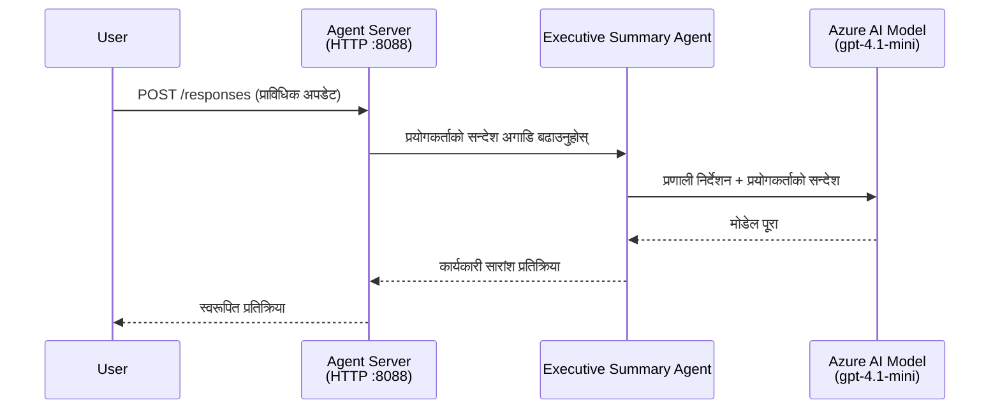
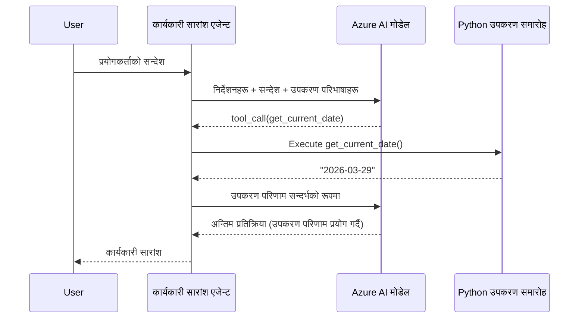

# Module 4 - निर्देशनहरू कन्फिगर गर्नुहोस्, वातावरण सेट गर्नुहोस् र निर्भरताहरू स्थापना गर्नुहोस्

यस मोड्युलमा, तपाईंले Module 3 बाट स्वत: स्क्याफोल्ड गरिएको एजेन्ट फाइलहरू अनुकूलित गर्नुहुन्छ। यहाँ तपाईंले सामान्य स्क्याफोल्डलाई **तपाईंको** एजेन्टमा परिवर्तन गर्नुहुन्छ - निर्देशनहरू लेखेर, वातावरण भेरिएबलहरू सेट गरेर, वैकल्पिक रूपमा उपकरणहरू थपेर, र निर्भरताहरू स्थापना गरेर।

> **स्मरण रहोस्:** Foundry विस्तारले तपाईंको प्रोजेक्ट फाइलहरू स्वत: रूपमा उत्पन्न गर्यो। अब तपाईंले तिनीहरूलाई संशोधन गर्नुहुन्छ। अनुकूलित एजेन्टको पूर्ण कार्यरत उदाहरणको लागि [`agent/`](../../../../../workshop/lab01-single-agent/agent) फोल्डर हेर्नुहोस्।

---

## कम्पोनेन्टहरूले कसरी संगै मिल्दछन्

### अनुरोध जीवनचक्र (एकल एजेन्ट)


> **उपकरणहरूसँग:** यदि एजेन्टमा दर्ता गरिएका उपकरणहरू छन् भने, मोडेलले सिधा पूर्णता नभई उपकरण-कॉल फिर्ता गर्न सक्छ। फ्रेमवर्क उपकरणलाई स्थानीय रूपमा चलाउँछ, नतिजा मोडेलमा फिर्ता दिन्छ, र त्यसपछि मोडेलले अन्तिम प्रतिक्रिया उत्पन्न गर्छ।


---

## चरण 1: वातावरण भेरिएबलहरू कन्फिगर गर्नुहोस्

स्क्याफोल्डले ठाउँधारी मानहरू सहित `.env` फाइल बनायो। तपाईंले Module 2 बाट वास्तविक मानहरू भर्नु आवश्यक छ।

1. तपाईंको स्क्याफोल्ड गरिएको प्रोजेक्टमा, **`.env`** फाइल खोल्नुहोस् (यो प्रोजेक्ट रुटमा छ)।
2. ठाउँधारी मानहरूलाई तपाईंको वास्तविक Foundry प्रोजेक्ट विवरणहरूसँग बदल्नुहोस्:

   ```env
   PROJECT_ENDPOINT=https://<your-account>.services.ai.azure.com/api/projects/<your-project>
   MODEL_DEPLOYMENT_NAME=gpt-4.1-mini
   ```

3. फाइल सुरक्षित गर्नुहोस्।

### यी मानहरू कहाँ फेला पार्ने

| मान | कसरी फेला पार्ने |
|-------|-------------------|
| **प्रोजेक्ट अन्तबिन्दु** | VS Code मा **Microsoft Foundry** साइडबार खोल्नुहोस् → तपाईंको प्रोजेक्टमा क्लिक गर्नुहोस् → विवरण दृश्यमा अन्तबिन्दु URL देखिन्छ। यो यसरी देखिन्छ `https://<account-name>.services.ai.azure.com/api/projects/<project-name>` |
| **मोडेल डिप्लोयमेन्ट नाम** | Foundry साइडबारमा, तपाईंको प्रोजेक्ट विस्तार गर्नुहोस् → **Models + endpoints** अन्तर्गत हेर्नुहोस् → डिप्लोय गरिएको मोडेलको नाम सूचीबद्ध हुन्छ (जस्तै, `gpt-4.1-mini`) |

> **सुरक्षा:** `.env` फाइल कहिल्यै भर्सन कन्ट्रोलमा कमिट नगर्नुहोस्। यो डिफल्ट रूपमा `.gitignore` मा समावेश गरिएको छ। यदि छैन भने, थप्नुहोस्:
> ```
> .env
> ```

### वातावरण भेरिएबलहरू कसरी प्रवाह हुन्छन्

नक्साङ्कन श्रृंखला: `.env` → `main.py` (ले `os.getenv` मार्फत) → `agent.yaml` (डिप्लोय समयमा कन्टेनर वातावरण भेरिएबलहरूमा नक्साङ्कन गर्छ)।

`main.py` मा, स्क्याफोल्डले यी मानहरू यसरी पढ्छ:

```python
PROJECT_ENDPOINT = os.getenv("AZURE_AI_PROJECT_ENDPOINT") or os.getenv("PROJECT_ENDPOINT")
MODEL_DEPLOYMENT_NAME = os.getenv("AZURE_AI_MODEL_DEPLOYMENT_NAME", os.getenv("MODEL_DEPLOYMENT_NAME", "gpt-4.1-mini"))
```

दुवै `AZURE_AI_PROJECT_ENDPOINT` र `PROJECT_ENDPOINT` स्वीकार्य छन् (`agent.yaml` मा `AZURE_AI_*` उपसर्ग प्रयोग हुन्छ)।

---

## चरण 2: एजेन्ट निर्देशनहरू लेख्नुहोस्

यो सबैभन्दा महत्त्वपूर्ण अनुकूलन चरण हो। निर्देशनहरूले तपाईंको एजेन्टको व्यक्तित्व, व्यवहार, आउटपुट ढाँचा, र सुरक्षा सिमाहरू परिभाषित गर्छ।

1. तपाईंको प्रोजेक्टमा `main.py` खोल्नुहोस्।
2. निर्देशन स्ट्रिङ खोज्नुहोस् (स्क्याफोल्डले डिफल्ट/सामान्य एक समावेश गरेको हुन्छ)।
3. यसको सट्टा विस्तृत, संरचित निर्देशनहरू राख्नुहोस्।

### राम्रो निर्देशनहरूले के समावेश गर्छन्

| कम्पोनेन्ट | उद्देश्य | उदाहरण |
|------------|----------|---------|
| **भूमिका** | एजेन्ट के हो र के गर्छ | "तपाईं कार्यकारी सारांश एजेन्ट हुनुहुन्छ" |
| **दर्शकवर्ग** | को लागि प्रतिक्रिया हो | "सीनियर नेताहरू जसलाई सीमित प्राविधिक पृष्ठभूमि छ" |
| **इनपुट परिभाषा** | कुन प्रकारका प्रॉम्प्टहरू सम्हाल्छ | "प्राविधिक घटना रिपोर्टहरू, सञ्चालन अद्यावधिकहरू" |
| **आउटपुट ढाँचा** | प्रतिक्रियाको ठ्याक्कै संरचना | "कार्यकारी सारांश: - के भयो: ... - व्यापार प्रभाव: ... - अर्को कदम: ..." |
| **नियमहरू** | सिमा र अस्वीकृति सर्तहरू | "दिनुभएको भन्दा बाहिर जानकारी नथप्नुहोस्" |
| **सुरक्षा** | दुरुपयोग र भ्रम रोकथाम | "इनपुट अस्पष्ट भएमा, स्पष्टिकरणको लागि सोध्नुहोस्" |
| **उदाहरणहरू** | व्यवहारलाई निर्देशन दिन इनपुट/आउटपुट जोडीहरू | फरक-फरक इनपुटसहित २-३ उदाहरणहरू समावेश गर्नुहोस् |

### उदाहरण: कार्यकारी सारांश एजेन्ट निर्देशहरू

यहाँ कार्यशालाको [`agent/main.py`](../../../../../workshop/lab01-single-agent/agent/main.py) मा प्रयोग गरिएको निर्देशनहरू छन्:

```python
AGENT_INSTRUCTIONS = """You are an "Explain Like I'm an Executive" agent.

Purpose:
Your job is to translate complex technical or operational information into
clear, concise, and outcome-focused summaries that can be easily understood
by non-technical executives.

Audience:
Senior leaders with limited technical background who care about impact,
risk, and what happens next.

What you must do:
- Rephrase the input so it is understandable to a non-technical audience
- Prioritize clarity, brevity, and outcomes over technical accuracy
- Remove technical jargon, logs, metrics, stack traces, and deep root-cause details
- Translate technical causes into simple cause-and-effect statements
- Explicitly call out business impact
- Always include a clear next step or action
- Maintain a neutral, factual, and calm executive tone
- Do NOT add new facts or speculate beyond the input

Standard Output Structure (always use this wording):

Executive Summary:
- What happened: <plain-language description>
- Business impact: <clear, non-technical impact>
- Next step: <clear action or mitigation>

Rules:
- Keep responses under 100 words
- Do NOT add facts beyond the input
- If input is unclear, ask for clarification
"""
```

4. `main.py` मा भएका पुराना निर्देशन स्ट्रिङलाई तपाईंको अनुकूलित निर्देशनहरूसँग प्रतिस्थापन गर्नुहोस्।
5. फाइल सुरक्षित गर्नुहोस्।

---

## चरण 3: (वैकल्पिक) कस्टम उपकरणहरू थप्नुहोस्

होस्ट गरिएको एजेन्टहरूले [उपकरणहरू](https://learn.microsoft.com/azure/foundry/agents/concepts/tool-catalog) को रूपमा **स्थानीय Python फंक्शनहरू** चलाउन सक्छन्। यो कोड आधारित होस्ट गरिएको एजेन्टहरूको प्रम्प्ट मात्र एजेन्टहरू माथिको प्रमुख फाइदा हो - तपाईंको एजेन्टले मनपर्ने सर्भर-साइड लॉजिक चलाउन सक्छ।

### 3.1 उपकरण फंक्शन परिभाषित गर्नुहोस्

`main.py` मा उपकरण फंक्शन थप्नुहोस्:

```python
from agent_framework import tool

@tool
def get_current_date() -> str:
    """Returns the current date in YYYY-MM-DD format."""
    from datetime import date
    return str(date.today())
```

`@tool` डेकोरेटरले मानक Python फंक्शनलाई एजेन्ट उपकरणमा परिणत गर्छ। डकस्ट्रिङले उपकरणको विवरण दिन्छ जुन मोडेलले हेर्छ।

### 3.2 उपकरणलाई एजेन्टसँग दर्ता गर्नुहोस्

`.as_agent()` कन्टेक्स्ट म्यानेजरमार्फत एजेन्ट सिर्जना गर्दा, `tools` प्यारामिटरमा उपकरण पास गर्नुहोस्:

```python
async with AzureAIAgentClient(
    project_endpoint=PROJECT_ENDPOINT,
    model_deployment_name=MODEL_DEPLOYMENT_NAME,
    credential=credential,
).as_agent(
    name="my-agent",
    instructions=AGENT_INSTRUCTIONS,
    tools=[get_current_date],
) as agent:
    server = from_agent_framework(agent)
    await server.run_async()
```

### 3.3 उपकरण कल कसरी काम गर्छ

1. प्रयोगकर्ताले प्रॉम्प्ट पठाउँछ।
2. मोडेलले उपकरण चाहिन्छ कि छैन निर्णय गर्छ (प्रॉम्प्ट, निर्देशनहरू, र उपकरण विवरणको आधारमा)।
3. यदि उपकरण आवश्यक छ भने, फ्रेमवर्कले तपाईंको Python फंक्शनलाई स्थानीय रूपमा (कन्टेनर भित्र) कल गर्छ।
4. उपकरणको फिर्ता मान मोडेललाई सन्दर्भको रूपमा पठाइन्छ।
5. मोडेलले अन्तिम प्रतिक्रिया उत्पन्न गर्छ।

> **उपकरणहरू सर्भर-साइडमा चल्छन्** - तिनीहरू तपाईंको कन्टेनर भित्र चल्छन्, प्रयोगकर्ताको ब्राउजर वा मोडेलमा होइन। यसको मतलब तपाईं डेटाबेस, API, फाइल प्रणाली, वा कुनै पनि Python पुस्तकालयमा पहुँच गर्न सक्नुहुन्छ।

---

## चरण 4: भर्चुअल वातावरण सिर्जना र सक्रिय गर्नुहोस्

निर्भरताहरू स्थापना गर्नु अघि, पृथक Python वातावरण सिर्जना गर्नुहोस्।

### 4.1 भर्चुअल वातावरण सिर्जना गर्नुहोस्

VS Code मा टर्मिनल खोल्नुहोस् (`` Ctrl+` ``) र चलाउनुहोस्:

```powershell
python -m venv .venv
```

यसले तपाईंको प्रोजेक्ट डाइरेक्टरीमा `.venv` फोल्डर बनाउँछ।

### 4.2 भर्चुअल वातावरण सक्रिय गर्नुहोस्

**PowerShell (Windows):**

```powershell
.\.venv\Scripts\Activate.ps1
```

**Command Prompt (Windows):**

```cmd
.venv\Scripts\activate.bat
```

**macOS/Linux (Bash):**

```bash
source .venv/bin/activate
```

टर्मिनल प्रॉम्प्टको सुरुमा `(.venv)` देखिनु पर्छ, जुन भर्चुअल वातावरण सकृय छ भनी जनाउँछ।

### 4.3 निर्भरताहरू स्थापना गर्नुहोस्

भर्चुअल वातावरण सक्रिय गरेर, आवश्यक प्याकेजहरू स्थापना गर्नुहोस्:

```powershell
pip install -r requirements.txt
```

यसले स्थापना गर्छ:

| प्याकेज | उद्देश्य |
|---------|----------|
| `agent-framework-azure-ai==1.0.0rc3` | [Microsoft Agent Framework](https://learn.microsoft.com/agent-framework/overview/) का लागि Azure AI एकीकरण |
| `agent-framework-core==1.0.0rc3` | एजेन्ट निर्माणको लागि कोर रनटाइम (यसमा `python-dotenv` समावेश छ) |
| `azure-ai-agentserver-agentframework==1.0.0b16` | [Foundry Agent Service](https://learn.microsoft.com/azure/foundry/agents/overview) को लागि होस्ट गरिएको एजेन्ट सर्भर रनटाइम |
| `azure-ai-agentserver-core==1.0.0b16` | कोर एजेन्ट सर्भर सारांशहरू |
| `debugpy` | Python डिबगिङ (VS Code मा F5 डिबग सक्षम गर्दछ) |
| `agent-dev-cli` | एजेन्टहरू परीक्षण गर्नको लागि स्थानीय विकास CLI |

### 4.4 स्थापना पुष्टि गर्नुहोस्

```powershell
pip list | Select-String "agent-framework|agentserver"
```

अपेक्षित आउटपुट:
```
agent-framework-azure-ai   1.0.0rc3
agent-framework-core       1.0.0rc3
azure-ai-agentserver-agentframework 1.0.0b16
azure-ai-agentserver-core  1.0.0b16
```

---

## चरण 5: प्रमाणीकरण पुष्टि गर्नुहोस्

एजेन्ट [`DefaultAzureCredential`](https://learn.microsoft.com/azure/developer/python/sdk/authentication/credential-chains#defaultazurecredential-overview) प्रयोग गर्छ जुन तलको क्रम अनुसार बहु प्रमाणीकरण विधिहरू प्रयास गर्छ:

1. **वातावरण भेरिएबलहरू** - `AZURE_CLIENT_ID`, `AZURE_TENANT_ID`, `AZURE_CLIENT_SECRET` (सेवा प्रमुख)
2. **Azure CLI** - तपाईंको `az login` सत्रलाई उठाउँछ
3. **VS Code** - तपाईंले VS Code मा साइन इन गरेको खाताको प्रयोग गर्छ
4. **Managed Identity** - जब Azure मा चलाउँदा (डिप्लोय समयमा) प्रयोग हुन्छ

### 5.1 स्थानीय विकासका लागि पुष्टि गर्नुहोस्

कम्तिमा यी मध्ये कुनै एक काम गर्नुपर्छ:

**विकल्प A: Azure CLI (सिफारिस गरिएको)**

```powershell
az account show --query "{name:name, id:id}" --output table
```

अपेक्षित: तपाईंको सदस्यता नाम र ID देखाउँछ।

**विकल्प B: VS Code साइन-इन**

1. VS Code को तल-बायाँमा **Accounts** आइकन हेर्नुहोस्।
2. यदि तपाईंको खाता नाम देखिन्छ भने, तपाईं प्रमाणीकरण भइसकेको हुनुहुन्छ।
3. यदि छैन भने, आइकनमा क्लिक गर्नुहोस् → **Microsoft Foundry प्रयोग गर्न साइन इन गर्नुहोस्**।

**विकल्प C: सेवा प्रमुख (CI/CD का लागि)**

```powershell
$env:AZURE_TENANT_ID = "<your-tenant-id>"
$env:AZURE_CLIENT_ID = "<your-client-id>"
$env:AZURE_CLIENT_SECRET = "<your-client-secret>"
```

### 5.2 सामान्य प्रमाणीकरण समस्या

यदि तपाईं धेरै Azure खातामा साइन इन हुनुहुन्छ भने, सुनिश्चित गर्नुहोस् कि सहि सदस्यता चयन गरिएको छ:

```powershell
az account set --subscription "<your-subscription-id>"
```

---

### चेकपोइन्ट

- [ ] `.env` फाइलमा वैध `PROJECT_ENDPOINT` र `MODEL_DEPLOYMENT_NAME` छन् (ठाउँधारी होइन)
- [ ] एजेन्ट निर्देशनहरू `main.py` मा अनुकूलित गरिएको छ - जसले भूमिका, दर्शकवर्ग, आउटपुट ढाँचा, नियमहरू, र सुरक्षा सिमा परिभाषित गर्छ
- [ ] (वैकल्पिक) कस्टम उपकरणहरू परिभाषित र दर्ता गरिएको छ
- [ ] भर्चुअल वातावरण सिर्जना र सक्रिय गरिएको छ (`(.venv)` टर्मिनल प्रॉम्प्टमा देखिन्छ)
- [ ] `pip install -r requirements.txt` सफलतापूर्वक पूरा भयो र त्रुटि छैन
- [ ] `pip list | Select-String "azure-ai-agentserver"` ले प्याकेज इन्स्टल भएको देखाउँछ
- [ ] प्रमाणीकरण वैध छ - `az account show` तपाईंको सदस्यता फिर्ता गर्दछ वा तपाईं VS Code मा साइन इन हुनुहुन्छ

---

**अघिल्लो:** [03 - होस्ट गरिएको एजेन्ट सिर्जना गर्नुहोस्](03-create-hosted-agent.md) · **अर्को:** [05 - स्थानीय रुपमा परीक्षण गर्नुहोस् →](05-test-locally.md)

---

<!-- CO-OP TRANSLATOR DISCLAIMER START -->
**अस्वीकरण**:  
यो दस्तावेज AI अनुवाद सेवा [Co-op Translator](https://github.com/Azure/co-op-translator) प्रयोग गरेर अनुवाद गरिएको छ। जबकि हामी सटीकता सुनिश्चित गर्न प्रयास गर्दछौं, कृपया जानकार रहनुहोस् कि स्वतः अनुवादमा त्रुटिहरू वा गलतिहरू हुन सक्छन्। मूल दस्तावेज यसको मूल भाषामा आधिकारिक स्रोत मानिनु पर्छ। महत्वपूर्ण जानकारीका लागि, व्यावसायिक मानव अनुवाद सिफारिस गरिन्छ। यस अनुवादको प्रयोगबाट उत्पन्न हुने कुनै पनि गलतफहमी वा गलत व्याख्याहरूको लागि हामी जिम्मेवार हुँदैनौं।
<!-- CO-OP TRANSLATOR DISCLAIMER END -->