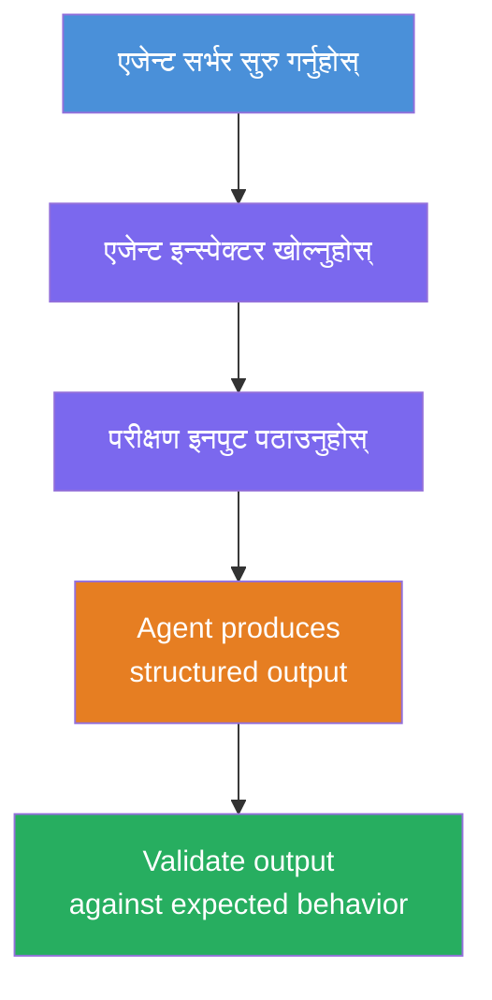
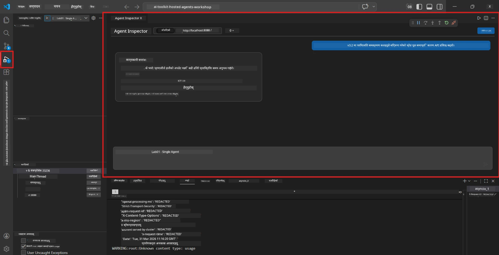
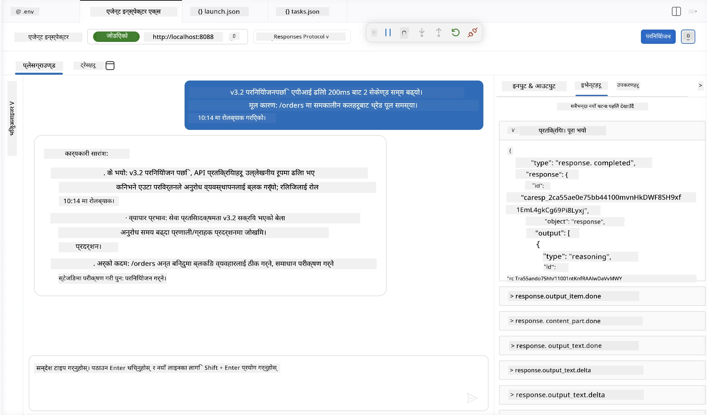

# मोड्युल ४ - स्थानीय रूपमा परीक्षण गर्नुहोस्

⏱️ ~१० मिनेट

यस मोड्युलमा, तपाईंले आफ्नो एजेन्टलाई स्थानीय रूपमा चलाउनुहुनेछ र **खुसी-पथ कार्यात्मक परीक्षणहरू** प्रयोग गरी यसले सही रूपमा काम गर्छ कि गर्दैन भनी प्रमाणित गर्नुहुनेछ। तपाईं एजेन्ट इन्स्पेक्टर (भिजुअल UI) वा सिधा HTTP कलहरू प्रयोग गरेर पुष्टि गर्नुहुनेछ कि एजेन्टले संरचित, सटीक प्रतिक्रिया पैदा गर्छ।

### स्थानीय परीक्षण प्रवाह



---

## विकल्प १: F5 थिच्नुहोस् - एजेन्ट इन्स्पेक्टरसँग डिबग गर्नुहोस् (सिफारिस गरिएको)

### डिबगर सुरू गर्नुहोस्

१. VS Code मा सिधै **executive-summary-agent/** फोल्डर खोल्नुहोस् (`File → Open Folder`)।
२. **Run and Debug** प्यानल खोल्नुहोस् (`Ctrl+Shift+D`)।
३. ड्रपडाउनबाट **Debug Local Agent Server** छनौट गर्नुहोस्।
४. **F5** थिच्नुहोस् (वा ▶ Start Debugging मा क्लिक गर्नुहोस्)।

> ⚠️ **महत्त्वपूर्ण: आफ्नो Python Interpreter छनौट गर्नुहोस्**
> यदि तपाईंले "ModuleNotFoundError" प्राप्त गर्नुहुन्छ वा डिबगर सुरु गर्न असफल भयो भने, तपाईंले VS Code लाई आफ्नै भर्चुअल वातावरण प्रयोग गर्न भन्नु पर्छ:
  > १. `Ctrl+Shift+P` थिच्नुहोस् र **Python: Select Interpreter** टाइप गर्नुहोस्।
  > २. आफ्नो प्रोजेक्टको `.venv` फोल्डरमा रहेको इन्टरप्रेटर चयन गर्नुहोस् (जस्तै Windows मा `.\.venv\Scripts\python.exe` )।
  > ३. डिबग सत्र पुनः सुरु गर्नुहोस्।
> यदि अझै पनि त्रुटिहरू आए भने, तपाईंले आफ्नो `tasks.json` फाइललाई निम्नानुसार म्यानुअली अपडेट गर्नुहोस्:
  > १. `.vscode/tasks.json` फाइलमा जानुहोस्
  > २. `Run Agent/Workflow HTTP Server` भनेर लेबल गरिएको कमाण्डमा जानुहोस्
  > ३. कमाण्ड मानलाई यसरी अपडेट गर्नुहोस्: `"value": "${workspaceFolder}/.venv/bin/python",`

### के हुन्छ

१. HTTP सर्वर `http://localhost:8088/responses` मा सुरु हुन्छ।
२. **एजेन्ट इन्स्पेक्टर** प्यानल स्वचालित रूपमा खुल्छ - परीक्षणको लागि एक भिजुअल च्याट इन्टरफेस।
३. `main.py` मा ब्रेकप्वाइन्ट सक्षम गरिएको हुन्छ।

टर्मिनल हेर्नुहोस्:
```
Starting executive summary hosted agent
Executive agent server running on http://localhost:8088
```

> **यदि एजेन्ट इन्स्पेक्टर खुल्दैन भने:** `Ctrl+Shift+P` थिच्नुहोस् → **Foundry Toolkit: Open Agent Inspector**।



> *स्क्रिनशटले पुरानो 'AI TOOLKIT' ब्रान्डिङ प्रदर्शन गर्न सक्छ जुन पहिलेको एक्सटेन्सन संस्करणबाट हो।*

---

## विकल्प २: टर्मिनल मार्फत परीक्षण गर्नुहोस् (वैकल्पिक)

एउटा टर्मिनलमा एजेन्ट सुरु गर्नुहोस्, अर्कोबाट अनुरोधहरू पठाउनुहोस्:

```bash
# टर्मिनल १: एजेन्ट सुरु गर्नुहोस्
cd executive-summary-agent/
source .venv/bin/activate
python main.py
```

```bash
# टर्मिनल २: परीक्षण पठाउनुहोस् (curl)
curl -sS -X POST http://localhost:8088/responses \
  -H "Content-Type: application/json" \
  -d '{"input": "The API latency increased due to thread pool exhaustion caused by sync calls in v3.2.", "stream": false}'
```

---

## परिदृश्य परीक्षणहरू: खुशी-पथ कार्यात्मक प्रमाणीकरण

तलका **सबै तीन** परिदृश्यहरू चलाउनुहोस्। यीले प्रमाणित गर्छन् कि तपाईंको एजेन्ट यथार्थपरक इनपुटहरूका लागि सहि, संरचित आउटपुट उत्पादन गर्छ।



### परिदृश्य १: IT घटना - API लगतिमा spike

**इनपुट:**
```
The API latency increased from 200ms to 2s after deploying v3.2.
Root cause: thread pool starvation from synchronous calls in /orders.
Rolled back at 10:14.
```

**अपेक्षित व्यवहार:**
- ✅ "Executive Summary" संरचना पालना गर्दछ (के भयो / व्यापार प्रभाव / अर्को कदम)
- ✅ कुनै प्राविधिक शब्दावली छैन (जस्तै "thread pool", "/orders", "v3.2" छैन)
- ✅ स्पष्ट रूपमा व्यापार प्रभाव बताउँछ (जस्तै, प्रयोगकर्ताहरूले ढिलाइ अनुभव गरे)
- ✅ अर्को कदम समावेश गर्दछ (जस्तै, मर्मत गरिएको, अनुगमन जारी)

---

### परिदृश्य २: डाटा पाइपलाइन - ETL विफलता

**इनपुट:**
```
The nightly ETL job failed because the upstream schema changed. APAC dashboards show missing data.
```

**अपेक्षित व्यवहार:**
- ✅ डाटा रिफ्रेस विफलताको साधारण भासामा सारांश दिन्छ
- ✅ APAC ड्यासबोर्डमा प्रभाव उल्लेख गरिएको छ
- ✅ मर्मतसम्भारको अर्को कदम समावेश गर्दछ
- ✅ "ETL", "schema" वा अन्य प्राविधिक शब्दहरू समावेश छैनन्

---

### परिदृश्य ३: सुरक्षा - प्रकट भएको प्रमाणपत्र

**इनपुट:**
```
Static analysis flagged a hardcoded secret in the repository.
The secret may have been exposed in commit history.
```

**अपेक्षित व्यवहार:**
- ✅ प्रमाणपत्र/सुरक्षा मुद्दा सजिलै बुझिने भाषामा वर्णन गरिएको
- ✅ सम्भावित जोखिम (अनधिकृत पहुँच) सम्बोधन गरिएको
- ✅ मर्मतसम्भार कार्य (प्रमाणपत्र रोटेसन, अडिट) उल्लेख गरिएको
- ✅ "static analysis", "commit history", वा "hardcoded" जस्ता शब्दहरू समावेश छैनन्

---

## प्रमाणीकरण मापदण्डहरू

प्रत्येक परिदृश्यको लागि, जाँच गर्नुहोस्:

| # | मापदण्ड | पास सर्त |
|---|---------|-----------|
| 1 | **संरचना** | प्रतिक्रिया "Executive Summary" ढाँचामा सबै तीन बुलेटहरू सहित |
| 2 | **सादा भाषा** | कुनै प्राविधिक शब्दावली छैन जुन कार्यकारीलाई बुझ्न गाह्रो होस् |
| 3 | **सटीकता** | सारांश इनपुटसँग मेल खान्छ - कुनै काल्पनिक विवरण छैन |
| 4 | **संक्षिप्तता** | प्रतिक्रिया १०० भन्दा कम शब्दहरूमा हुनुपर्छ |
| 5 | **अर्को कदम** | स्पष्ट कार्य वा न्यूनीकरण उल्लेख छ |

---

## डिबगिङ सुझावहरू

| समस्या | समाधान |
|--------|--------|
| एजेन्ट सुरु हुँदैन | `.env` मानहरू जाँच गर्नुहोस्, venv सक्रिय छ भनी सुनिश्चित गर्नुहोस्, `pip install -r requirements.txt` चलाउनुहोस् |
| प्रतिक्रिया खाली वा सामान्य छ | `main.py` का निर्देशनहरू पुनरावलोकन गर्नुहोस् - सुनिश्चित गर्नुहोस् आउटपुट ढाँचा निर्दिष्ट गरिएको छ |
| प्रतिक्रिया प्राविधिक शब्दावली समावेश छ | निर्देशनहरूमा "प्राविधिक शब्दहरू हटाउने" नियमहरू कडा गर्नुहोस् |
| एजेन्ट इन्स्पेक्टर खुल्दैन | `Ctrl+Shift+P` → **Foundry Toolkit: Open Agent Inspector** |
| टर्मिनलमा मोडेल त्रुटिहरू | `AZURE_AI_MODEL_DEPLOYMENT_NAME` ठीकसँग मेल खान्छ भनी सुनिश्चित गर्नुहोस् (केस-संवेदी) |

---

### ✅ चेकपोइन्ट

- [ ] एजेन्ट स्थानीय रूपमा त्रुटि बिना सुरु हुन्छ
- [ ] एजेन्ट इन्स्पेक्टर खुल्छ र च्याट इन्टरफेस देखाउँछ (यदि F5 प्रयोग गरिँदैछ भने)
- [ ] **परिदृश्य १** (IT घटना) - संरचित Executive Summary, कुनै प्राविधिक शब्दावली छैन
- [ ] **परिदृश्य २** (डाटा पाइपलाइन) - व्यापार प्रभावको साथ प्रासंगिक सारांश
- [ ] **परिदृश्य ३** (सुरक्षा चेतावनी) - उपयुक्त जोखिम संचार
- [ ] सबै प्रतिक्रियाहरू परिभाषित आउटपुट संरचनालाई पालन गर्छन्

> **आफ्ना प्रतिक्रियाहरू सुरक्षित गर्नुहोस्** (कपी वा स्क्रिनशट) - तपाईंले तिनीहरूलाई मोड्युल ०६ मा क्लाउड परिणामहरूसँग तुलना गर्नु हुनेछ।

---

**अघिल्लो:** [03 - Configure & Code](03-configure-and-code.md) · **अर्को:** [05 - Deploy to Foundry →](05-deploy-to-foundry.md)

---

<!-- CO-OP TRANSLATOR DISCLAIMER START -->
**अस्वीकरण**:
यो दस्तावेज़ AI अनुवाद सेवा [Co-op Translator](https://github.com/Azure/co-op-translator) प्रयोग गरेर अनुवाद गरिएको हो। हामी सही हुन प्रयास गर्छौं, तर कृपया जानकार हुनुस् कि स्वचालित अनुवादमा त्रुटिहरू वा अशुद्धताहरू हुन सक्छन्। मूल दस्तावेज़ यसको मूल भाषामा आधिकारिक स्रोत मानिनुपर्छ। महत्वपूर्ण जानकारीका लागि व्यावसायिक मानव अनुवाद सिफारिस गरिन्छ। यस अनुवादको प्रयोगबाट उत्पन्न कुनै पनि गलत बुझाइ वा त्रुटिको लागि हामी जिम्मेवार छैनौं।
<!-- CO-OP TRANSLATOR DISCLAIMER END -->