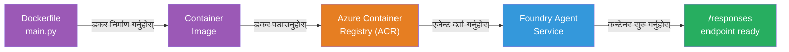
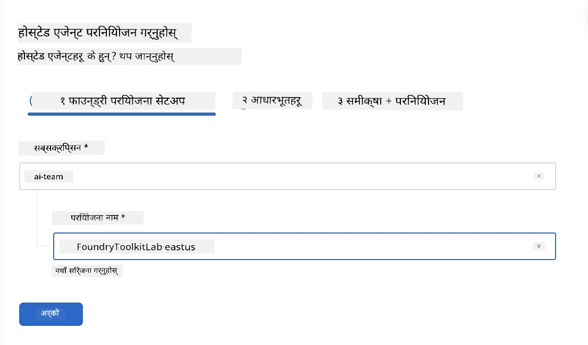
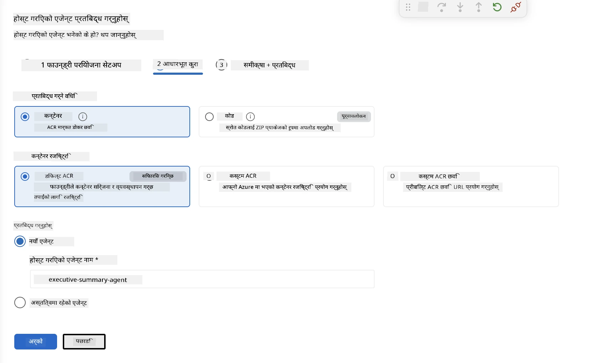
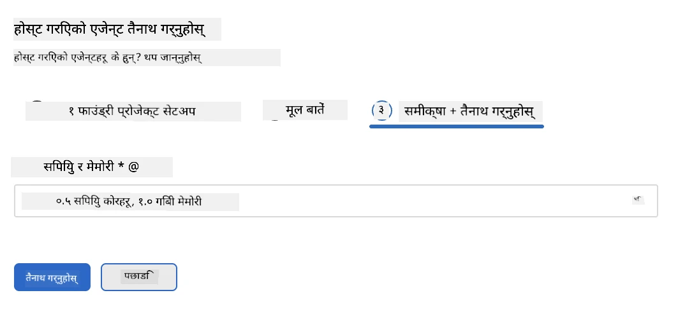
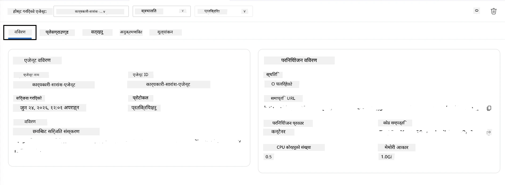

# मोड्युल ५ - फाउन्ड्री एजेन्ट सेवा मा डिप्लोइ गर्नुहोस्

⏱️ ~१० मिनेट

> ⚠️ **पाथ बी प्रयोगकर्ताहरूका लागि:** यो मोड्युलले फाउन्ड्री सदस्यता आवश्यक पर्छ। यदि तपाईं फाउन्ड्री लोकल प्रयोग गर्दै हुनुहुन्छ भने, [मोड्युल ०७ - सारांश](07-summary.md) मा जानुहोस्। तपाईंले सफलतापूर्वक स्थानीय विकास कार्यप्रवाह पूरा गर्नुभयो!

यस मोड्युलमा, तपाईंले तपाईंको स्थानीय रूपमा परीक्षण गरिएको एजेन्टलाई माइक्रोसफ्ट फाउन्ड्रीमा **होस्ट गरिएको एजेन्ट** को रूपमा डिप्लोइ गर्नुहुन्छ। डिप्लोइले कन्टेनर छवि बनाउँछ, यसलाई अजुर कन्टेनर रजिस्ट्रीमा पुश गर्दछ, र फाउन्ड्रीको व्यवस्थापित पूर्वाधारमा एजेन्ट सुरु गर्दछ।

### डिप्लोइमेन्ट पाइपलाइन

---

## पूर्वआवश्यकताहरू जाँच

डिप्लोइ गर्नु अघि, सुनिश्चित गर्नुहोस्:

- [ ] एजेन्टले [मोड्युल ०४](04-test-locally.md) का सबै ३ स्थानीय परिदृश्यहरू पार गरेको छ
- [ ] तपाईंसँग प्रोजेक्ट स्तरमा **एजुर AI प्रयोगकर्ता** भूमिका छ ([मोड्युल ०१, RBAC असाइन गर्नुहोस्](01-setup.md#deploy-a-model--assign-rbac))
- [ ] तपाई Azure मा VS कोडमा साइन इन हुनुहुन्छ (अकाउन्ट आइकनले तपाईंको नाम देखाउँछ)

---

## चरण १: डिप्लोइ सुरु गर्नुहोस्

### विकल्प ए: एजेन्ट इन्स्पेक्टरबाट डिप्लोइ गर्नुहोस् (सिफारिस गरिएको)

यदि एजेन्ट इन्स्पेक्टर खुला छ (परीक्षणबाट):
१. माथि-दायाँ कुनामा रहेको **डिप्लोइ** बटनमा क्लिक गर्नुहोस् (बादल आइकन ↑)।

### विकल्प बी: कमाण्ड प्यालेटबाट डिप्लोइ गर्नुहोस्

१. `Ctrl+Shift+P` थिच्नुहोस् → **Foundry Toolkit: Deploy Hosted Agent** चयन गर्नुहोस्।

---

## चरण २: डिप्लोइ कन्फिगर गर्नुहोस्

विजार्डले तपाईंबाट सोध्छ:

| सोधपुछ | चयन |
|--------|-----------|
| **सब्सक्रिप्शन** | तपाईंको अजुर सदस्यता |
| **लक्षित प्रोजेक्ट** | तपाईंको फाउन्ड्री प्रोजेक्ट (उदाहरण: `workshop-agents`) |

कन्फिगर गर्न **अर्को** क्लिक गर्नुहोस्।

| सोधपुछ | चयन |
|--------|-----------|
| **डिप्लोइ विधि** | कन्टेनर |
| **कन्टेनर रजिस्ट्री** | **डिफल्ट ACR** (माइक्रोसफ्ट फाउन्ड्रीले तपाईंको लागि एक बनाउँछ र व्यवस्थापन गर्दछ) |
| **डिप्लोइ गर्नुहोस्** | नयाँ एजेन्ट (नाम, `executive-summary-agent`) |

समीक्षा गरि डिप्लोइ गर्न **अर्को** क्लिक गर्नुहोस्।

| सोधपुछ | चयन |
|--------|-----------|
| **CPU र मेमोरी** | **०.२५ CPU कोर, ०.५ Gi मेमोरी** (वर्कशपका लागि पर्याप्त) |

---

## चरण ३: डिप्लोइ र अनुगमन गर्नुहोस्

१. **डिप्लोइ** क्लिक गर्नुहोस्।
२. **आउटपुट** प्यानल हेर्नुहोस् (ड्रपडाउनबाट **Microsoft Foundry** चयन गर्नुहोस्)।
३. डिप्लोइ यी चरणहरूमा चल्छ:
   - **डकर बनावट** - तपाईंको डकरफाइलबाट कन्टेनर बनाउँछ
   - **डकर पुश** - छवि ACR मा पुश गर्दछ (पहिलो डिप्लोइमा १–३ मिनेट)
   - **एजेन्ट दर्ता** - फाउन्ड्रीमा होस्ट गरिएको एजेन्ट बनाउँछ
   - **कन्टेनर सुरु** - प्रणाली-प्रबन्धित पहिचानसँग सुरु हुन्छ

४. पूरा भएपछि, सूचनाले देखाउँछ:
   > **my-agent सफलतापूर्वक डिप्लोइ भयो।** `लॉगहरू हेर्नुहोस्` `एजेन्ट चलाउनुहोस्`

५. एजेन्ट प्लेग्राउण्ड खोल्न **एजेन्ट चलाउनुहोस्** क्लिक गर्नुहोस्।

### डिप्लोइ स्थिति मानहरू

| स्थिति | अर्थ |
|--------|---------|
| **चलिरहेको** | कन्टेनर तयार, एजेन्ट प्रतिक्रिया दिइरहेको छ |
| **प्रतीक्षा** | कन्टेनर सुरु हुँदैछ - ३०–६० सेकेन्ड पर्खनुहोस् |
| **असफल** | लगहरू जाँच्नुहोस् (तल्लो समस्याबाट हेर्नुहोस्) |

---

## सामान्य डिप्लोइ त्रुटिहरू

| त्रुटि | मूल कारण | समाधान |
|-------|-----------|-----|
| `agents/write` अनुमति अस्वीकृत | प्रोजेक्ट स्तरमा **एजुर AI प्रयोगकर्ता** भूमिका अभाव | [मोड्युल ०१, RBAC असाइन गर्नुहोस्](01-setup.md#deploy-a-model--assign-rbac) |
| डकर चलिरहेको छैन | डकर डेस्कटप सुरु नगरिएको | डकर डेस्कटप सुरु गर्नुहोस् → `docker info` पुष्टि गर्नुहोस् |
| ACR प्राधिकरण | व्यवस्थापित पहिचानले छवि तान्न सक्दैन | [मोड्युल ०८ - समस्या समाधान](08-troubleshooting.md) हेर्नुहोस् |

---

### ✅ जाँच बिन्दु

- [ ] त्रुटि बिना डिप्लोइ पूरा भयो
- [ ] एजेन्ट फाउन्ड्री साइडबारमा **होस्टेड एजेन्टहरू (पूर्वावलोकन)** अन्तर्गत देखिन्छ
- [ ] कन्टेनर स्थिति **चलिरहेको** देखाउँछ
- [ ] एजेन्ट प्लेग्राउण्ड ट्याब खुल्यो जसले एजेन्ट विवरण र अन्त्यबिन्दु URL देखाउँछ

---

**अघिल्लो:** [०४ - स्थानीय रूपमा परीक्षण गर्नुहोस्](04-test-locally.md) · **अर्को:** [०६ - प्लेग्राउण्डमा पुष्टि गर्नुहोस् →](06-verify-in-playground.md)

---

<!-- CO-OP TRANSLATOR DISCLAIMER START -->
**अस्वीकरण**:
यो दस्तावेज़ AI अनुवाद सेवा [Co-op Translator](https://github.com/Azure/co-op-translator) प्रयोग गरेर अनुवाद गरिएको हो। हामी सही हुन प्रयास गर्छौं, तर कृपया जानकार हुनुस् कि स्वचालित अनुवादमा त्रुटिहरू वा अशुद्धताहरू हुन सक्छन्। मूल दस्तावेज़ यसको मूल भाषामा आधिकारिक स्रोत मानिनुपर्छ। महत्वपूर्ण जानकारीका लागि व्यावसायिक मानव अनुवाद सिफारिस गरिन्छ। यस अनुवादको प्रयोगबाट उत्पन्न कुनै पनि गलत बुझाइ वा त्रुटिको लागि हामी जिम्मेवार छैनौं।
<!-- CO-OP TRANSLATOR DISCLAIMER END -->