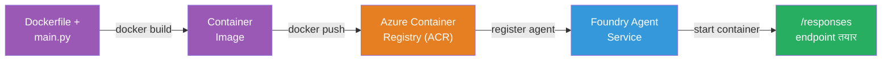
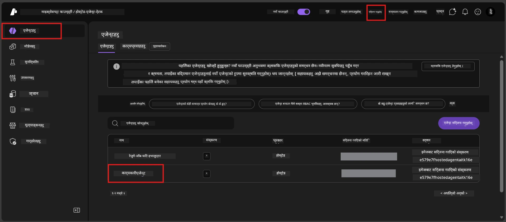

# Module 6 - Foundry Agent सेवा मा डिप्लोय गर्नुहोस्

यस मोड्युलमा, तपाईंले आफ्नो स्थानीय रूपमा परीक्षण गरिएको एजेन्टलाई Microsoft Foundry मा [**Hosted Agent**](https://learn.microsoft.com/azure/foundry/agents/concepts/hosted-agents) को रूपमा डिप्लोय गर्नुहुन्छ। डिप्लोयमेन्ट प्रक्रिया तपाईंको प्रोजेक्टबाट Docker कन्टेनर छवि बनाउँछ, यसलाई [Azure Container Registry (ACR)](https://learn.microsoft.com/azure/container-registry/container-registry-intro) मा पुश गर्छ, र [Foundry Agent Service](https://learn.microsoft.com/azure/foundry/agents/overview) मा एक होस्टेड एजेन्ट संस्करण सिर्जना गर्दछ।

### डिप्लोयमेन्ट पाइपलाइन


---

## आवश्यकताहरू जाँच

डिप्लोय गर्नु अघि, तलका प्रत्येक वस्तु सुनिश्चित गर्नुहोस्। यी स्किप गर्दा सबैभन्दा सामान्य कारण डिप्लोयमेन्ट असफलता हो।

1. **एजेन्टले स्थानीय स्मोक परीक्षणहरू पास गर्छ:**
   - तपाईंले [Module 5](05-test-locally.md) मा सबै ४ परीक्षणहरू पूरा गर्नुभएको छ र एजेन्टले सही प्रतिक्रिया दिएको छ।

2. **तपाईं सँग [Azure AI User](https://learn.microsoft.com/azure/foundry/concepts/rbac-foundry#built-in-roles) भूमिका छ:**
   - यो [Module 2, Step 3](02-create-foundry-project.md) मा निर्धारण गरिएको थियो। यदि निश्चित हुनुहुन्न भने, अहिले जाँच गर्नुहोस्:
   - Azure Portal → तपाईंको Foundry **प्रोजेक्ट** स्त्रोत → **Access control (IAM)** → **Role assignments** ट्याब → आफ्नो नाम खोज्नुहोस् → पुष्टि गर्नुहोस् कि **Azure AI User** सूचीमा छ।

3. **तपाईं VS Code मा Azure मा साइन इन हुनुहुन्छ:**
   - VS Code को तल-बायाँ कुनामा Accounts आइकन जाँच गर्नुहोस्। तपाईंको खाता नाम देखिनु पर्छ।

4. **(वैकल्पिक) Docker Desktop चलिरहेको छ:**
   - Docker तब मात्र आवश्यक हुन्छ जब Foundry विस्तारले तपाईंलाई स्थानीय निर्माण लागि सोध्छ। अधिकांश अवस्थामा, विस्तारले स्वचालित रूपमा डिप्लोयमेन्टको क्रममा कन्टेनर निर्माणहरू ह्यान्डल गर्छ।
   - यदि तपाईंले Docker इन्स्टल गर्नुभएको छ भने, यसले चलिरहेको छ जाँच्नुहोस्: `docker info`

---

## चरण १: डिप्लोयमेन्ट सुरु गर्नुहोस्

तपाईंको दुई तरिका छन् डिप्लोयमेन्ट गर्न - दुवैले उस्तै परिणाम ल्याउँछन्।

### विकल्प A: Agent Inspector बाट डिप्लोय गर्नुहोस् (सिफारिस गरिएको)

यदि तपाईं एजेन्टलाई डिबगर (F5) सँग चलाउँदै हुनुहुन्छ र Agent Inspector खुलेको छ भने:

1. Agent Inspector प्यानलको **दायाँ माथि कुनामा** हेर्नुहोस्।
2. **Deploy** बटन क्लिक गर्नुहोस् (बादल आइकन माथि तीर ↑ सहित)।
3. डिप्लोयमेन्ट विजार्ड खुल्छ।

### विकल्प B: Command Palette बाट डिप्लोय गर्नुहोस्

1. `Ctrl+Shift+P` थिचेर **Command Palette** खोल्नुहोस्।
2. टाइप गर्नुहोस्: **Microsoft Foundry: Deploy Hosted Agent** र चयन गर्नुहोस्।
3. डिप्लोयमेन्ट विजार्ड खुल्छ।

---

## चरण २: डिप्लोयमेन्ट कन्फिगर गर्नुहोस्

डिप्लोयमेन्ट विजार्ड तपाइँलाई कन्फिगरेसन मार्फत लैजान्छ। प्रत्येक सोधपुछ भर्नुहोस्:

### २.१ लक्ष्य प्रोजेक्ट चयन गर्नुहोस्

1. ड्रपडाउनले तपाईंको Foundry प्रोजेक्टहरू देखाउँछ।
2. Module 2 मा बनाएको प्रोजेक्ट चयन गर्नुहोस् (जस्तै, `workshop-agents`)।

### २.२ कन्टेनर एजेन्ट फाइल चयन गर्नुहोस्

1. तपाईंलाई एजेन्ट प्रवेश पोइन्ट चयन गर्न भनिनेछ।
2. **`main.py`** (Python) रोज्नुहोस् - यो फाइल विजार्डले तपाईंको एजेन्ट प्रोजेक्ट पहिचान गर्न प्रयोग गर्छ।

### २.३ स्रोतहरू कन्फिगर गर्नुहोस्

| सेटिङ | सिफारिस गरिएको मान | नोट्स |
|---------|------------------|-------|
| **CPU** | `0.25` | पूर्वनिर्धारित, कार्यशाला लागि पर्याप्त। उत्पादन कार्यभारका लागि बढाउनुहोस् |
| **Memory** | `0.5Gi` | पूर्वनिर्धारित, कार्यशाला लागि पर्याप्त |

यी मानहरू `agent.yaml` मा रहेका मानहरूसँग मेल खान्छ। तपाई पूर्वनिर्धारितहरू स्वीकार्न सक्नुहुन्छ।

---

## चरण ३: पुष्टि र डिप्लोय गर्नुहोस्

1. विजार्डले डिप्लोयमेन्ट सारांश देखाउँछ जसमा:
   - लक्ष्य प्रोजेक्ट नाम
   - एजेन्ट नाम (`agent.yaml` बाट)
   - कन्टेनर फाइल र स्रोतहरू
2. सारांश समीक्षा गरेर **Confirm and Deploy** (वा **Deploy**) क्लिक गर्नुहोस्।
3. प्रगति VS Code मा हेर्नुहोस्।

### डिप्लोयमेन्ट दौरान के हुन्छ (चरण-दर-चरण)

डिप्लोयमेन्ट बहु-चरण प्रक्रिया हो। VS Code को **Output** प्यानल (ड्रपडाउनबाट "Microsoft Foundry" चयन गर्नुहोस्) हेर्नुहोस्:

1. **Docker build** - VS Code ले तपाईंको `Dockerfile` बाट Docker कन्टेनर छवि बनाउँछ। तपाईंलाई Docker लेयर सन्देशहरू देखिनेछन्:
   ```
   Step 1/6 : FROM python:<version>-slim
   Step 2/6 : WORKDIR /app
   ...
   Successfully built abc123def456
   ```

2. **Docker push** - छवि Foundry प्रोजेक्टसँग सम्बन्धित **Azure Container Registry (ACR)** मा पुश गरिन्छ। पहिलो डिप्लोयमा १-३ मिनेट लाग्न सक्छ (आधार छवि >100MB छ)।

3. **एजेन्ट पंजीकरण** - Foundry Agent सेवा नयाँ होस्टेड एजेन्ट सिर्जना गर्छ (वा एजेन्ट पहिले देखि भए नयाँ संस्करण)। `agent.yaml` बाट एजेन्ट मेटाडाटा प्रयोग गरिन्छ।

4. **कन्टेनर सुरु** - कन्टेनर Foundry को प्रबन्धित पूर्वाधारमा सुरु हुन्छ। प्लेटफर्मले [प्रणाली-प्रबन्धित पहिचान](https://learn.microsoft.com/azure/foundry/agents/concepts/agent-identity) दिन्छ र `/responses` अन्तबिन्दु खोल्छ।

> **पहिलो डिप्लोय ढिलो हुन्छ** (Docker ले सबै लेयरहरू पुश गर्नुपर्ने हुन्छ)। पछि डिप्लोयहरू छिटो हुन्छन् किनकि Docker ले परिवर्तन नभएका लेयरहरू क्यास गर्दछ।

---

## चरण ४: डिप्लोयमेन्ट स्थिति जाँच गर्नुहोस्

डिप्लोयमेन्ट आदेश पूरा भएपछि:

1. एक्टिभिटी बारमा Foundry आइकन क्लिक गरेर **Microsoft Foundry** साइडबार खोल्नुहोस्।
2. तपाईंको प्रोजेक्ट अन्तर्गतको **Hosted Agents (Preview)** खण्ड विस्तार गर्नुहोस्।
3. तपाईंले एजेन्ट नाम देख्नुपर्नेछ (जस्तै `ExecutiveAgent` वा `agent.yaml` बाट नाम)।
4. **एजेन्ट नाममा क्लिक गर्नुहोस्** विस्तार गर्न।
5. एउटा वा धेरै **संस्करणहरू** (जस्तै `v1`) देख्नु हुनेछ।
6. संस्करणमा क्लिक गर्दा **Container Details** देखिन्छ।
7. **Status** फिल्ड जाँच्नुहोस्:

   | स्थिति | अर्थ |
   |--------|---------|
   | **Started** वा **Running** | कन्टेनर चलिरहेको छ र एजेन्ट तयार छ |
   | **Pending** | कन्टेनर सुरु हुँदैछ (३०-६० सेकेन्ड पर्खनुहोस्) |
   | **Failed** | कन्टेनर सुरु हुन सकेन (लगहरू जाँच्नुहोस् - तलका समस्या समाधान हेर्नुहोस्) |



> **यदि "Pending" २ मिनेटभन्दा बढी देखियो भने:** कन्टेनरले आधार छवि तानिरहेको हुन सक्छ। अलिकति बढी पर्खनुहोस्। यदि स्थिर रह्यो भने कन्टेनर लगहरू जाँच गर्नुहोस्।

---

## सामान्य डिप्लोयमेन्ट त्रुटिहरू र समाधानहरू

### त्रुटि १: अनुमति अस्वीकृत - `agents/write`

```
Error: lacks the required data action 
Microsoft.CognitiveServices/accounts/AIServices/agents/write 
to perform POST /api/projects/{projectName}/assistants operation.
```

**मूल कारण:** तपाईंलाई **प्रोजेक्ट** स्तरमा `Azure AI User` भूमिका छैन।

**चरण-दर-चरण समाधान:**

1. [https://portal.azure.com](https://portal.azure.com) खोल्नुहोस्।
2. खोज पट्टीमा तपाईंको Foundry **प्रोजेक्ट** नाम टाइप गर्नुहोस् र त्यसमा क्लिक गर्नुहोस्।
   - **महत्त्वपूर्ण:** सुनिश्चित गर्नुहोस् कि तपाईं **प्रोजेक्ट** स्रोतमा हुनुहुन्छ (प्रकार: "Microsoft Foundry project"), अभिभावक खाता/हब स्रोतमा होइन।
3. बायाँ नेभिगेशनमा **Access control (IAM)** क्लिक गर्नुहोस्।
4. **+ Add** → **Add role assignment** क्लिक गर्नुहोस्।
5. **Role** ट्याबमा, [**Azure AI User**](https://learn.microsoft.com/azure/foundry/concepts/rbac-foundry#built-in-roles) खोजेर चयन गर्नुहोस्। **Next** क्लिक गर्नुहोस्।
6. **Members** ट्याबमा, **User, group, or service principal** चयन गर्नुहोस्।
7. **+ Select members** क्लिक गरेर आफ्नो नाम/इमेल खोजी आफैँलाई चयन गर्नुहोस्, **Select** क्लिक गर्नुहोस्।
8. **Review + assign** → फेरि **Review + assign** क्लिक गर्नुहोस्।
9. भूमिका लागू हुने १-२ मिनेट पर्खनुहोस्।
10. चरण १ बाट **डिप्लोय पुनः प्रयास गर्नुहोस्**।

> भूमिका **प्रोजेक्ट** स्कोपमा हुनुपर्छ, केवल खाता स्कोपमा होइन। डिप्लोयमेन्ट असफलताका लागि यो सबैभन्दा सामान्य कारण हो।

### त्रुटि २: Docker चलिरहेको छैन

```
Error: Docker build failed / Cannot connect to Docker daemon
```

**समाधान:**
1. Docker Desktop सुरु गर्नुहोस् (तपाईंको Start मेनु वा सिस्टम ट्रेमा खोज्नुहोस्)।
2. "Docker Desktop is running" देखिन प्रतीक्षा गर्नुहोस् (३०-६० सेकेन्ड)।
3. जाँच्नुहोस्: टर्मिनलमा `docker info`।
4. **Windows विशेष:** Docker Desktop सेटिङमा WSL 2 ब्याकएन्ड सक्षम छ कि छैन हेर्नुहोस् → **General** → **Use the WSL 2 based engine**।
5. डिप्लोय पुनः प्रयास गर्नुहोस्।

### त्रुटि ३: ACR अनुमतिज्ञा - `AcrPullUnauthorized`

```
Error: AcrPullUnauthorized
```

**मूल कारण:** Foundry प्रोजेक्टको प्रबन्धित पहिचानलाई कन्टेनर रजिस्ट्रीमा पुल पहुँच छैन।

**समाधान:**
1. Azure Portal मा तपाईंको **[Container Registry](https://learn.microsoft.com/azure/container-registry/container-registry-intro)** मा जानुहोस् (Foundry प्रोजेक्ट जस्तै रिसोर्स समूहमा छ)।
2. **Access control (IAM)** → **Add** → **Add role assignment** मा जानुहोस्।
3. **[AcrPull](https://learn.microsoft.com/azure/container-registry/container-registry-roles)** भूमिका चयन गर्नुहोस्।
4. Members अन्तर्गत **Managed identity** चयन गरेर Foundry प्रोजेक्टको प्रबन्धित पहिचान खोज्नुहोस्।
5. **Review + assign** गर्नुहोस्।

> Foundry विस्तारले सामान्यतया यो स्वचालित रूपमा सेटअप गर्छ। यदि यो त्रुटि देखियो भने सेटअप असफल भएको हुन सक्छ।

### त्रुटि ४: कन्टेनर प्लेटफर्म असङ्गतता (Apple Silicon)

यदि Apple Silicon Mac (M1/M2/M3) बाट डिप्लोय गर्दै हुनुहुन्छ भने, कन्टेनर `linux/amd64` को लागि बनाइनु पर्छ:

```bash
docker build --platform linux/amd64 -t myagent:v1 .
```

> Foundry विस्तारले अधिकांश प्रयोगकर्ताका लागि यसलाई स्वचालित रूपमा ह्यान्डल गर्छ।

---

### चेकप्वाइन्ट

- [ ] डिप्लोयमेन्ट आदेश VS Code मा बिना त्रुटि सम्पन्न भयो
- [ ] Foundry साइडबारमा **Hosted Agents (Preview)** अन्तर्गत एजेन्ट देखियो
- [ ] तपाईंले एजेन्ट क्लिक गर्नुभयो → संस्करण चयन गर्नुभयो → **Container Details** देखें
- [ ] कन्टेनर स्थिति **Started** वा **Running** देखायो
- [ ] (यदि त्रुटिहरु भए) त्रुटि पहिचान गरियो, समाधान लागू गरियो, र सफलतापूर्वक पुनः डिप्लोय गरियो

---

**अघिल्लो:** [05 - Test Locally](05-test-locally.md) · **अर्को:** [07 - Verify in Playground →](07-verify-in-playground.md)

---

<!-- CO-OP TRANSLATOR DISCLAIMER START -->
**अस्वीकरण**:
यस दस्तावेजलाई AI अनुवाद सेवा [Co-op Translator](https://github.com/Azure/co-op-translator) प्रयोग गरी अनुवाद गरिएको हो। हामी सटीकताको लागि प्रयासरत छौं, तर कृपया ध्यान दिनुहोस् कि स्वचालित अनुवादमा त्रुटि वा असत्यता हुन सक्दछ। यसको लागि मूल भाषा मा रहेको मूल दस्तावेजलाई प्रामाणिक स्रोतको रूपमा मान्नु पर्दछ। महत्वपूर्ण जानकारीको लागि, पेशेवर मानव अनुवाद सिफारिश गरिन्छ। यस अनुवादको प्रयोगबाट उत्पन्न कुनै पनि गलतफहमी वा गलत व्याख्याको लागि हामी जिम्मेवार हुँदैनौं।
<!-- CO-OP TRANSLATOR DISCLAIMER END -->