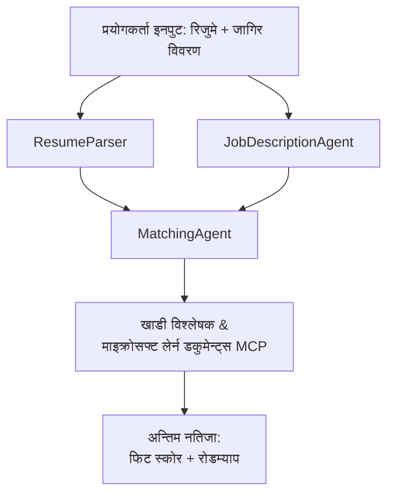

# PersonalCareerCopilot - रिजुमे → जागिर फिट मूल्यांकनकर्ता

एक बहु-एजेन्ट कार्यप्रवाह जसले रिजुमे कत्तिको राम्ररी जागिर विवरणसँग मेल खान्छ मूल्यांकन गर्दछ, त्यसपछि अन्तरहरू बन्द गर्न व्यक्तिगत अध्ययन रोडम्याप तयार पार्छ।

---

## एजेन्टहरू

| एजेन्ट | भूमिका | उपकरणहरू |
|-------|------|-------|
| **ResumeParser** | रिजुमे पाठबाट संरचित कौशल, अनुभव, प्रमाणपत्रहरू निकाल्छ | - |
| **JobDescriptionAgent** | जागिर विवरणबाट आवश्यक/प्राथमिकता दिइएका कौशल, अनुभव, प्रमाणपत्रहरू निकाल्छ | - |
| **MatchingAgent** | प्रोफाइल र आवश्यकताहरू तुलना गर्दछ → फिट स्कोर (0-100) + मेल खाने/नाघेको कौशलहरू | - |
| **GapAnalyzer** | Microsoft Learn स्रोतहरूसँग व्यक्तिगत अध्ययन रोडम्याप बनाउँछ | `search_microsoft_learn_for_plan` (MCP) |

## कार्यप्रवाह


---

## छिटो सुरु

### १. वातावरण तयार पार्नुहोस्

```powershell
cd workshop\lab02-multi-agent\PersonalCareerCopilot
python -m venv .venv
.\.venv\Scripts\Activate.ps1          # विन्डोज़ पावरशेल
# source .venv/bin/activate            # macOS / Linux
pip install -r requirements.txt
```

### २. प्रमाणपत्रहरू कन्फिगर गर्नुहोस्

उदाहरण env फाइल कपी गरेर आफ्नो Foundry परियोजना विवरणहरू भर्नुहोस्:

```powershell
cp .env.example .env
```

`.env` सम्पादन गर्नुहोस्:

```env
PROJECT_ENDPOINT=https://<your-account>.services.ai.azure.com/api/projects/<your-project>
MODEL_DEPLOYMENT_NAME=gpt-4.1-mini
```

| मान | कहाँ भेट्ने |
|-------|-----------------|
| `PROJECT_ENDPOINT` | Microsoft Foundry साइडबार VS Code मा → आफ्नो परियोजनामा राइट-क्लिक → **प्रोजेक्ट इन्डपोइन्ट कपी गर्नुहोस्** |
| `MODEL_DEPLOYMENT_NAME` | Foundry साइडबार → परियोजना विस्तार गर्नुहोस् → **मोडेलहरू + इन्डपोइन्टहरू** → डिप्लोइमेन्ट नाम |

### ३. स्थानीय रूपमा चलाउनुहोस्

```powershell
python -m debugpy --listen 127.0.0.1:5679 -m agentdev run main.py --verbose --port 8088
```

वा VS Code कार्य प्रयोग गर्नुहोस्: `Ctrl+Shift+P` → **Tasks: Run Task** → **Run Lab02 HTTP Server**।

### ४. Agent Inspector मार्फत परीक्षण गर्नुहोस्

Agent Inspector खोल्नुहोस्: `Ctrl+Shift+P` → **Foundry Toolkit: Open Agent Inspector**।

यो परीक्षण प्रॉम्प्ट पेस्ट गर्नुहोस्:

```
Resume:
Jane Doe
Senior Software Engineer with 5 years of experience in Python, Django, and AWS.
Built microservices handling 10K+ requests/second. Led a team of 4 developers.
Certifications: AWS Solutions Architect Associate.
Education: B.S. Computer Science, State University.

Job Description:
Senior Cloud Engineer at Contoso Ltd.
Required: Python, Azure, Kubernetes, Terraform, CI/CD pipelines.
Preferred: Go, monitoring (Prometheus/Grafana), cost optimization.
Experience: 5+ years in cloud infrastructure.
Certifications: Azure Solutions Architect Expert preferred.
```

**अपेक्षित:** फिट स्कोर (0-100), मेल खाने/नाघेको कौशलहरू, र Microsoft Learn यूआरएलहरू सहित व्यक्तिगत अध्ययन रोडम्याप।

### ५. Foundry मा डिप्लोय गर्नुहोस्

`Ctrl+Shift+P` → **Microsoft Foundry: Deploy Hosted Agent** → आफ्नो परियोजना चयन गर्नुहोस् → पुष्ट्याउनुहोस्।

---

## परियोजना संरचना

```
PersonalCareerCopilot/
├── .env.example        ← Template for environment variables
├── .env                ← Your credentials (git-ignored)
├── agent.yaml          ← Hosted agent definition (name, resources, env vars)
├── Dockerfile          ← Container image for Foundry deployment
├── main.py             ← 4-agent workflow (instructions, MCP tool, WorkflowBuilder)
└── requirements.txt    ← Python dependencies
```

## प्रमुख फाइलहरू

### `agent.yaml`

Foundry Agent Service को लागि होस्टेड एजेन्ट परिभाषित गर्दछ:
- `kind: hosted` - व्यवस्थापन गरिएको कन्टेनरको रूपमा चल्छ
- `protocols: [responses v1]` - `/responses` HTTP इन्डपोइन्ट प्रदर्शन गर्दछ
- `environment_variables` - `PROJECT_ENDPOINT` र `MODEL_DEPLOYMENT_NAME` डिप्लोइमेन्ट समयमा इन्जेक्ट गरिन्छ

### `main.py`

यसले समावेश गर्दछ:
- **एजेन्ट निर्देशनहरू** - चार `*_INSTRUCTIONS` स्थिरांक, प्रति एजेन्ट एक
- **MCP उपकरण** - `search_microsoft_learn_for_plan()` ले `https://learn.microsoft.com/api/mcp` लाई Streamable HTTP मार्फत कल गर्दछ
- **एजेन्ट सिर्जना** - `create_agents()` कन्टेक्स्ट म्यानेजर `AzureAIAgentClient.as_agent()` प्रयोग गरी
- **कार्यप्रवाह ग्राफ** - `create_workflow()` ले `WorkflowBuilder` प्रयोग गरी एजेन्टहरूलाई फ्यान-आउट/फ्यान-इन/क्रमिक ढाँचामा जोड्छ
- **सर्भर सुरूवात** - `from_agent_framework(agent).run_async()` पोर्ट 8088 मा

### `requirements.txt`

| प्याकेज | संस्करण | उद्देश्य |
|---------|---------|---------|
| `agent-framework-azure-ai` | `1.0.0rc3` | Microsoft Agent Framework का लागि Azure AI एकीकरण |
| `agent-framework-core` | `1.0.0rc3` | मुख्य रनटाइम (WorkflowBuilder सहित) |
| `azure-ai-agentserver-agentframework` | `1.0.0b16` | होस्टेड एजेन्ट सर्भर रनटाइम |
| `azure-ai-agentserver-core` | `1.0.0b16` | मुख्य एजेन्ट सर्भर अमूर्तता |
| `debugpy` | नयाँतम | Python डिबगिङ (VS Code मा F5 प्रयोग गरेर) |
| `agent-dev-cli` | `--pre` | स्थानीय विकास CLI + Agent Inspector ब्याकएण्ड |

---

## समस्या समाधान

| समस्या | समाधान |
|-------|-----|
| `RuntimeError: Missing required environment variable(s)` | `PROJECT_ENDPOINT` र `MODEL_DEPLOYMENT_NAME` सहित `.env` बनाउनुहोस् |
| `ModuleNotFoundError: No module named 'agent_framework'` | भर्चुअल वातावरण सक्रिय गरेर `pip install -r requirements.txt` चलाउनुहोस् |
| आउटपुटमा Microsoft Learn यूआरएलहरू छैनन् | `https://learn.microsoft.com/api/mcp` मा इन्टरनेट जडान जाँच्नुहोस् |
| केवल १ ग्याप कार्ड (काटिएको) | सुनिश्चित गर्नुहोस् `GAP_ANALYZER_INSTRUCTIONS` मा `CRITICAL:` ब्लक छ |
| पोर्ट 8088 प्रयोगमा छ | अन्य सर्भर बन्द गर्नुहोस्: `netstat -ano \| findstr :8088` |

विस्तृत समस्यासमाधानका लागि [Module 8 - Troubleshooting](../docs/08-troubleshooting.md) हेर्नुहोस्।

---

**पूर्ण मार्गदर्शन:** [Lab 02 Docs](../docs/README.md) · **फिर्ता जानुहोस्:** [Lab 02 README](../README.md) · [कार्यशाला गृह](../../../README.md)

---

<!-- CO-OP TRANSLATOR DISCLAIMER START -->
**अस्वीकरण**:  
यो दस्तावेज AI अनुवाद सेवा [Co-op Translator](https://github.com/Azure/co-op-translator) प्रयोग गरी अनुवाद गरिएको हो। हामी शुद्धताको लागि प्रयासरत छौं, तर कृपया जानकार हुनुहोस् कि स्वचालित अनुवादमा त्रुटि वा गलत जानकारीहरू हुन सक्छन्। मूल दस्तावेज यसको मूल भाषामा अधिकारिक स्रोत मानिनु पर्छ। महत्वपूर्ण जानकारीका लागि व्यावसायिक मानव अनुवाद सिफारिस गरिन्छ। यस अनुवादको प्रयोगबाट उत्पन्न कुनै पनि गलत बुझाइ वा व्याख्याको लागि हामी जिम्मेवार छैनौं।
<!-- CO-OP TRANSLATOR DISCLAIMER END -->