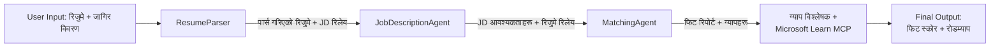

# PersonalCareerCopilot - रिजुमे → जागिर फिट मूल्याङ्कनकर्ता

एउटा workflow-पहिलो बहु-एजेन्ट एप्लिकेसन जसले रिजुमे र जागिर विवरण कति राम्रोसँग मेल खान्छ भनी मूल्याङ्कन गर्दछ, र त्यसपछि खाली ठाउँहरू बन्द गर्न व्यक्तिगत सिकाइ रोडम्याप तयार गर्छ।

---

## एजेन्टहरू

| एजेन्ट | भूमिका | उपकरणहरू |
|-------|------|-------|
| **ResumeParser** | रिजुमे पाठबाट संरचित सीपहरू, अनुभव, प्रमाणपत्रहरू निकाल्ने | - |
| **JobDescriptionAgent** | जागिर विवरणबाट आवश्यक/प्राथमिकता प्राप्त सीपहरू, अनुभव, प्रमाणपत्रहरू निकाल्ने | - |
| **MatchingAgent** | प्रोफाइल र आवश्यकताहरू तुलना गर्ने → फिट स्कोर (0-100) + मेल खाने/गुमेका सीपहरू | - |
| **GapAnalyzer** | माइक्रोसफ्ट लर्न स्रोतहरूसँग व्यक्तिगत सिकाइ रोडम्याप तयार गर्ने | `search_microsoft_learn_for_plan` (MCP) |

## कार्यप्रवाह


```mermaid
flowchart LR
    UserInput["User Input: रिजुमे + जागिर विवरण"] --> ResumeParser
    ResumeParser -- "पार्स गरिएको रिजुमे + JD रिलेय" --> JobDescriptionAgent
    JobDescriptionAgent -- "JD आवश्यकताहरू + रिजुमे रिलेय" --> MatchingAgent
    MatchingAgent -- "फिट रिपोर्ट + ग्यापहरू" --> GapAnalyzerMCP["ग्याप विश्लेषक +\nMicrosoft Learn MCP"]
    GapAnalyzerMCP --> FinalOutput["Final Output:\nफिट स्कोर + रोडम्याप"]
```

---

## छिटो सुरु

### 1. वातावरण सेट अप गर्नुहोस्

यो फोल्डर workflow-आधारित Lab 02 स्क्याफोल्डको सन्दर्भ कार्यान्वयन हो। यसको `main.py` ले अवस्थित प्रॉम्प्ट ब्लकहरू र `WorkflowBuilder` प्रयोग गरेर चार एजेन्टहरूलाई तारतम्यमा जोड्छ।

```powershell
cd workshop\lab02-multi-agent\PersonalCareerCopilot
python -m venv .venv
.\.venv\Scripts\Activate.ps1          # विन्डोज पावरशेल
# source .venv/bin/activate            # macOS / लिनक्स
pip install -r requirements.txt
```

### 2. साखहरू कन्फिगर गर्नुहोस्

यस फोल्डरमा `.env` फाइल बनाएर:

```powershell
copy .env .env.bak 2>$null; echo $null > .env
```

`.env` सम्पादन गर्नुहोस्:

```env
FOUNDRY_PROJECT_ENDPOINT=https://<your-account>.services.ai.azure.com/api/projects/<your-project>
AZURE_AI_MODEL_DEPLOYMENT_NAME=gpt-4.1-mini
```

| मान | कहाँ भेट्ने |
|-------|------------------|
| `FOUNDRY_PROJECT_ENDPOINT` | Foundry Toolkit साइडबार → आफ्नो प्रोजेक्टमा राइट-क्लिक गर्नुहोस् → **Copy Project Endpoint** |
| `AZURE_AI_MODEL_DEPLOYMENT_NAME` | Foundry साइडबार → प्रोजेक्ट विस्तार गर्नुहोस् → **Models + endpoints** → deployment नाम |

### 3. स्थानीय रूपमा चलाउनुहोस्

```powershell
python -m debugpy --listen 127.0.0.1:5679 main.py --port 8088
```

वा VS कोड टास्क प्रयोग गर्नुहोस्: `Ctrl+Shift+P` → **Tasks: Run Task** → **Run Agent HTTP Server**।

F5 डिबगिङका लागि, **Debug Local Agent HTTP Server** प्रयोग गर्नुहोस्।

### 4. एजेन्ट इन्स्पेक्टरसँग परीक्षण गर्नुहोस्

एजेन्ट इन्स्पेक्टर खोल्नुहोस्: `Ctrl+Shift+P` → **Foundry Toolkit: Open Agent Inspector**।

यो परीक्षण प्रॉम्प्ट पेस्ट गर्नुहोस्:

```
Resume:
Jane Doe
Senior Software Engineer with 5 years of experience in Python, Django, and AWS.
Built microservices handling 10K+ requests/second. Led a team of 4 developers.
Certifications: AWS Solutions Architect Associate.
Education: B.S. Computer Science, State University.

Job Description:
Senior Cloud Engineer at Contoso Ltd.
Required: Python, Azure, Kubernetes, Terraform, CI/CD pipelines.
Preferred: Go, monitoring (Prometheus/Grafana), cost optimization.
Experience: 5+ years in cloud infrastructure.
Certifications: Azure Solutions Architect Expert preferred.
```

**अपेक्षित:** फिट स्कोर (0-100), मेल खाने/गुमेका सीपहरू, र माइक्रोसफ्ट लर्न URL सहित व्यक्तिगत सिकाइ रोडम्याप।

### 5. Foundry मा डिप्लोय गर्नुहोस्

`Ctrl+Shift+P` → **Foundry Toolkit: Deploy Hosted Agent** → आफ्नो प्रोजेक्ट चयन गर्नुहोस् → पुष्टि गर्नुहोस्।

---

## प्रोजेक्ट संरचना

```
PersonalCareerCopilot/
├── .env                ← Your credentials (git-ignored)
├── agent.yaml          ← Hosted agent definition (name, resources, env vars)
├── Dockerfile          ← Container image for Foundry deployment
├── main.py             ← 4-agent workflow (instructions, MCP tool, WorkflowBuilder)
└── requirements.txt    ← Python dependencies
```

## मुख्य फाइलहरू

### `agent.yaml`

Foundry Agent Service का लागि होस्ट गरिएको एजेन्ट परिभाषित गर्दछ:
- `kind: hosted` - व्यवस्थापन गरिने कन्टेनरको रूपमा चल्छ
- `protocols` - `responses` प्रोटोकल `version: 1.0.0` सँग, `/responses` HTTP अन्तबिन्दु देखाउँछ
- `environment_variables` - यहाँ `AZURE_AI_MODEL_DEPLOYMENT_NAME` घोषणा गरिएको छ; `FOUNDRY_PROJECT_ENDPOINT` डिप्लोय समयमा स्वचालित रूपमा इन्जेक्ट हुन्छ

### `main.py`

समावेश गर्दछ:
- **एजेन्ट निर्देशनहरू** - चार `*_INSTRUCTIONS` स्थिरांक, प्रत्येक एजेन्टका लागि एउटा
- **MCP उपकरण** - `search_microsoft_learn_for_plan()` ले Streamable HTTP मार्फत `https://learn.microsoft.com/api/mcp` कल गर्छ
- **एजेन्ट सिर्जना** - चार `Agent()` + `AgentExecutor()` उदाहरणहरू एक `FoundryChatClient` साझा गर्दै
- **कार्यप्रवाह ग्राफ** - `WorkflowBuilder` एजेन्टहरूलाई अनुक्रमणिका पाइपलाइनमा जोड्दछ: ResumeParser → JD Agent → MatchingAgent → GapAnalyzer
- **सर्भर स्टार्टअप** - `ResponsesHostServer` पोर्ट 8088 मा चल्छ

### `requirements.txt`

| प्याकेज | उद्देश्य |
|---------|----------|
| `agent-framework-foundry` | मुख्य रनटाइम: `Agent`, `AgentExecutor`, `WorkflowBuilder`, `@tool`, `FoundryChatClient` |
| `agent-framework-foundry-hosting` | `ResponsesHostServer` + Foundry होस्टिङ्ग एकीकरण |
| `mcp<2,>=1.24.0` | GapAnalyzer का लागि MCP क्लाएन्ट (`streamable_http_client`) |
| `debugpy` | पायथन डिबगिङ (VS कोडमा F5) |

---

## समस्या समाधान

| समस्या | समाधान |
|-------|-----|
| `KeyError: 'FOUNDRY_PROJECT_ENDPOINT'` वा `KeyError: 'AZURE_AI_MODEL_DEPLOYMENT_NAME'` | `.env` फाइल बनाउनुहोस् जसमा दुबै `FOUNDRY_PROJECT_ENDPOINT` र `AZURE_AI_MODEL_DEPLOYMENT_NAME` सेट गरिएको हो |
| `ModuleNotFoundError: No module named 'agent_framework'` | भर्चुअल इन्भाइरोमेन्ट सक्रिय गरेर `pip install -r requirements.txt` चलाउनुहोस् |
| आउटपुटमा कुनै माइक्रोसफ्ट लर्न URL छैन | `https://learn.microsoft.com/api/mcp` लाई इन्टरनेट जडान जाँच गर्नुहोस् |
| केवल 1 खाली ठाउँ कार्ड (छोटो गरिएको) | सुनिश्चित गर्नुहोस् `GAP_ANALYZER_INSTRUCTIONS` मा `CRITICAL:` ब्लक समावेश छ |
| पोर्ट 8088 प्रयोगमा छ | अन्य सर्भरहरू बन्द गर्नुहोस्: `netstat -ano \| findstr :8088` |

विस्तृत समस्या समाधानका लागि [Module 8 - Troubleshooting](../docs/08-troubleshooting.md) हेर्नुहोस्।

---

**पूर्ण मार्गदर्शन:** [Lab 02 Docs](../docs/README.md) · **वापस जानुहोस्:** [Lab 02 README](../README.md) · [कार्यशाला गृहपृष्ठ](../../../README.md)

---

<!-- CO-OP TRANSLATOR DISCLAIMER START -->
**अस्वीकरण**:
यो दस्तावेज़ AI अनुवाद सेवा [Co-op Translator](https://github.com/Azure/co-op-translator) प्रयोग गरेर अनुवाद गरिएको हो। हामी सही हुन प्रयास गर्छौं, तर कृपया जानकार हुनुस् कि स्वचालित अनुवादमा त्रुटिहरू वा अशुद्धताहरू हुन सक्छन्। मूल दस्तावेज़ यसको मूल भाषामा आधिकारिक स्रोत मानिनुपर्छ। महत्वपूर्ण जानकारीका लागि व्यावसायिक मानव अनुवाद सिफारिस गरिन्छ। यस अनुवादको प्रयोगबाट उत्पन्न कुनै पनि गलत बुझाइ वा त्रुटिको लागि हामी जिम्मेवार छैनौं।
<!-- CO-OP TRANSLATOR DISCLAIMER END -->