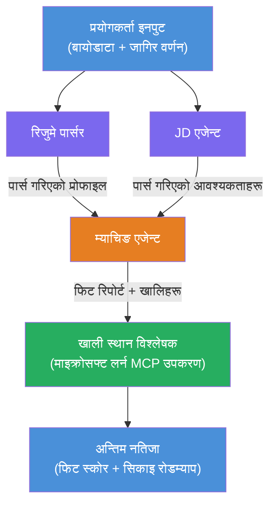

# ल्याब ०२ - बहु-एजेन्ट कार्यप्रवाह: रिजुमे → जागिर मिलान मूल्याङ्कनकर्ता

---

## तपाईंले के बनाउनुहुनेछ

एक **रिजुमे → जागिर मिलान मूल्याङ्कनकर्ता** - यस्तो बहु-एजेन्ट कार्यप्रवाह जहाँ चार विशेषज्ञ एजेन्टहरूले सहकार्य गरेर क्यान्डिडेटको रिजुमे जागिर विवरणसँग कति मेल खान्छ भनेर मूल्याङ्कन गर्छन्, अनि अन्तर पूर्ति गर्न व्यक्तिगत सिकाइ रोडम्याप बनाउँछन्।

### एजेन्टहरू

| एजेन्ट  | भूमिका |
|---------|---------|
| **रिजुमे पार्सर** | रिजुमे टेक्स्टबाट संरचित सीपहरू, अनुभव, प्रमाणपत्रहरू निकाल्छ |
| **जागिर विवरण एजेन्ट** | जागिर विवरणबाट आवश्यक/प्राथमिकता प्राप्त सीपहरू, अनुभव, प्रमाणपत्रहरू निकाल्छ |
| **मेल खाने एजेन्ट** | प्रोफाइल र आवश्यकताहरू तुलना गर्छ → फिट स्कोर (०–१००) + मेल खाने/अभाव भएका सीपहरू |
| **अन्तर विश्लेषक** | स्रोतहरू, समयरेखा, र छिटो-जीत परियोजनाहरू सहित व्यक्तिगत सिकाइ रोडम्याप तयार गर्छ |

### डेमो प्रवाह

**रिजुमे + जागिर विवरण** अपलोड गर्नुहोस् → **फिट स्कोर + अभाव भएका सीपहरू** प्राप्त गर्नुहोस् → **व्यक्तिगत सिकाइ रोडम्याप** प्राप्त गर्नुहोस्।

### कार्यप्रवाह वास्तुकला

> पहेँलो = समानान्तर एजेन्टहरू | सुन्तला = एकत्रीकरण बिन्दु | हरियो = उपकरणहरूसहित अन्तिम एजेन्ट। विस्तृत आरेख र डाटा प्रवाहका लागि हेर्नुहोस् [मोड्युल १ - वास्तुकला बुझ्नुहोस्](docs/01-understand-multi-agent.md) र [मोड्युल ४ - व्यवस्थापन ढाँचाहरू](docs/04-orchestration-patterns.md)।

### समेटिएका विषयहरू

- **WorkflowBuilder** प्रयोग गरेर बहु-एजेन्ट कार्यप्रवाह सिर्जना गर्ने
- एजेन्टहरूको भूमिका र व्यवस्थापन प्रवाह परिभाषित गर्ने (समानान्तर + अनुक्रमिक)
- एजेन्टहरू बीच सञ्चार ढाँचाहरू
- Agent Inspector सँग स्थानीय परीक्षण
- Foundry Agent Service मा बहु-एजेन्ट कार्यप्रवाह परिनियोजन गर्ने

---

## पूर्व आवश्यकताहरू

पहिले ल्याब ०१ सम्पन्न गर्नुहोस्:

- [ल्याब ०१ - एकल एजेन्ट](../lab01-single-agent/README.md)

---

## सुरु गर्न

पूर्ण सेटअप निर्देशनहरू, कोड हिँडाइ, र परीक्षण आदेशहरूका लागि हेर्नुहोस्:

- [ल्याब २ दस्तावेज - पूर्व आवश्यकताहरू](docs/00-prerequisites.md)
- [ल्याब २ दस्तावेज - पूर्ण सिकाइ मार्ग](docs/README.md)
- [PersonalCareerCopilot सञ्चालन गाइड](PersonalCareerCopilot/README.md)

## व्यवस्थापन ढाँचाहरू (एजेन्ट विकल्प)

ल्याब २ मा डिफल्ट **समानान्तर → एकत्रकर्ता → योजना बनाउने** प्रवाह समावेश छ, र दस्तावेजहरूले थप एजेन्ट व्यवहार देखाउन वैकल्पिक ढाँचाहरू वर्णन गर्छन्:

- **Fan-out/Fan-in संग तौलसहितको सहमति**
- **अन्तिम रोडम्याप अघि समीक्षक/आलोचक पास**
- **सशर्त मार्गनिर्देशक** (फिट स्कोर र अभाव भएका सीपहरू आधारित मार्ग चयन)

हेर्नुहोस् [docs/04-orchestration-patterns.md](docs/04-orchestration-patterns.md)।

---

**अघिल्लो:** [ल्याब ०१ - एकल एजेन्ट](../lab01-single-agent/README.md) · **फिर्ता जानुहोस्:** [कार्यशाला गृह](../../README.md)

---

<!-- CO-OP TRANSLATOR DISCLAIMER START -->
**अस्वीकरण**:
यस दस्तावेजलाई AI अनुवाद सेवा [Co-op Translator](https://github.com/Azure/co-op-translator) को प्रयोग गरी अनुवाद गरिएको छ। हामी सहीतालाई सुनिश्चित गर्न प्रयास गर्छौं, तर कृपया जानकार रहनुहोस् कि स्वचालित अनुवादमा त्रुटि वा गलत जानकारी हुनसक्छ। यसको मूल भाषा मा रहेको दस्तावेजलाई आधिकारिक स्रोत मान्नुपर्छ। महत्वपूर्ण जानकारीको लागि व्यावसायिक मानब अनुवाद सिफारिस गरिन्छ। यस अनुवादको प्रयोगबाट उत्पन्न कुनै पनि गलतफहमी वा गलत व्याख्याका लागि हामी जिम्मेवार छैनौं।
<!-- CO-OP TRANSLATOR DISCLAIMER END -->