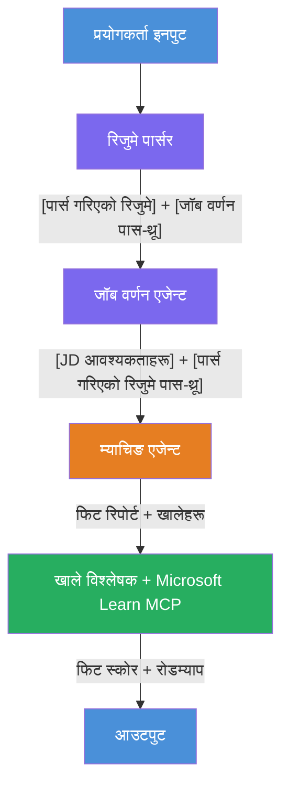

# ल्याब ०२ - बहु-एजेन्ट कार्यप्रवाह: रेजुमे → जागिर अनुकूल मूल्याङ्कनकर्ता

## अवलोकन

यस व्यावहारिक ल्याबमा, तपाईं VS कोडमा Foundry Toolkit प्रयोग गरी **वर्कफ्लो-प्रथम बहु-एजेन्ट एप्लिकेशन** निर्माण गर्नुहुनेछ र यसलाई Microsoft Foundry Agent Service मा तैनाथ गर्नुहुनेछ।

**तपाईंले कुन कुरा बनाउन सक्नुहुन्छ:** एक Resume → Job Fit Evaluator जसले रेजुमे र कामको विवरण पार्स गर्दछ, मेलखाताको स्कोर गर्दछ, र Microsoft Learn स्रोतहरू प्रयोग गरी व्यक्तिगत सिकाइ रोडम्याप उत्पादन गर्दछ।

---

## वास्तुकला

```mermaid
flowchart TD
    A["प्रयोगकर्ता इनपुट"] --> B["रिजुमे पार्सर"]
    B -->|"[पार्स गरिएको रिजुमे] + [जॉब वर्णन पास-थ्रू]"| C["जॉब वर्णन एजेन्ट"]
    C -->|"[JD आवश्यकताहरू] + [पार्स गरिएको रिजुमे पास-थ्रू]"| D["म्याचिङ एजेन्ट"]
    D -->|फिट रिपोर्ट + खालेहरू| E["खाले विश्लेषक + Microsoft Learn MCP"]
    E -->|फिट स्कोर + रोडम्याप| F["आउटपुट"]

    style A fill:#4A90D9,color:#fff
    style B fill:#7B68EE,color:#fff
    style C fill:#7B68EE,color:#fff
    style D fill:#E67E22,color:#fff
    style E fill:#27AE60,color:#fff
    style F fill:#4A90D9,color:#fff
```

**यो कसरी काम गर्छ:**
1. प्रयोगकर्ताले एक रेजुमे र काम विवरण पेस्ट गर्दछ।
2. **ResumeParser** ले रेजुमे पार्स गर्दछ र JD लाई शब्दशः `[JOB DESCRIPTION PASS-THROUGH]` खण्डमा प्रतिलिपि गर्दछ।
3. **JD Agent** ले पास-थ्रू बाट संरचित मागहरू निकाल्छ, त्यसपछि `[PARSED RESUME]` लाई अगाडि `[PARSED RESUME PASS-THROUGH]` को रूपमा पठाउँछ।
4. **MatchingAgent** ले `[PARSED RESUME PASS-THROUGH]` र `[JD REQUIREMENTS]` लाई तुलना गरेर फिट स्कोर उत्पादन गर्दछ।
5. **GapAnalyzer** ले ग्यापहरूलाई व्यावहारिक रोडम्यापमा परिवर्तन गर्छ र MCP मार्फत वास्तविक Microsoft Learn लिंकहरू ल्याउँछ।

---

## पूर्वापेक्षाहरू

पहिले ल्याब ०१ पूरा गर्नुहोस्:

- [Lab 01 - Single Agent](../lab01-single-agent/README.md)

---

## भाग १: क्रममा मोड्युलहरू पढ्नुहोस्

पूर्ण सिकाइ मार्ग हेर्नुहोस्:

- [Lab 2 Docs - Prerequisites](docs/00-prerequisites.md)
- [Lab 2 Docs - Full Learning Path](docs/README.md)
- [PersonalCareerCopilot run guide](PersonalCareerCopilot/README.md)

---

## भाग २: वर्कफ्लो बनाउनुहोस् र परीक्षण गर्नुहोस्

1. Foundry Toolkit विजार्डको प्रयोग गरेर वर्कफ्लो-आधारित प्रोजेक्ट स्क्याफोल्ड गर्नुहोस्।
2. `PersonalCareerCopilot/main.py` बाट प्रॉम्प्ट ब्लकहरू र वर्कफ्लो ग्राफ कपी गरेर आफ्नो वर्कस्पेसमा राख्नुहोस्।
3. एजेन्ट इन्स्पेक्टरसँग स्थानीय रूपमा चलाउनुहोस् र सबै चार एजेन्टहरू तथा MCP उपकरणको जाँच गर्नुहोस्।
4. स्थानीय परीक्षण पास भएपछि होस्ट गरिएको एजेन्टलाई Foundry मा तैनाथ गर्नुहोस्।

---

## समन्वय ढाँचाहरू

ल्याब ०२ मा पूर्वनिर्धारित **फ्यान-आउट → फ्यान-इन → अनुक्रमिक** प्रवाह समावेश छ, र दस्तावेजहरूले वैकल्पिक समन्वय ढाँचाहरू पनि प्रयोगको लागि वर्णन गर्दछ।

- **वजनयुक्त सहमति सहितको फ्यान-आउट/फ्यान-इन**
- **अन्तिम रोडम्याप अघि समीक्षक/आलोचक पास**
- **फिट स्कोर र हराएका सीपहरूमा आधारित सशर्त राउटर**

हेर्नुहोस् [docs/04-orchestration-patterns.md](docs/04-orchestration-patterns.md)।

---

**अघिल्लो:** [Lab 01 - Single Agent](../lab01-single-agent/README.md) · **फिर्ता जाने:** [Workshop Home](../../README.md)

---

<!-- CO-OP TRANSLATOR DISCLAIMER START -->
**अस्वीकरण**:
यो दस्तावेज़ AI अनुवाद सेवा [Co-op Translator](https://github.com/Azure/co-op-translator) प्रयोग गरेर अनुवाद गरिएको हो। हामी सही हुन प्रयास गर्छौं, तर कृपया जानकार हुनुस् कि स्वचालित अनुवादमा त्रुटिहरू वा अशुद्धताहरू हुन सक्छन्। मूल दस्तावेज़ यसको मूल भाषामा आधिकारिक स्रोत मानिनुपर्छ। महत्वपूर्ण जानकारीका लागि व्यावसायिक मानव अनुवाद सिफारिस गरिन्छ। यस अनुवादको प्रयोगबाट उत्पन्न कुनै पनि गलत बुझाइ वा त्रुटिको लागि हामी जिम्मेवार छैनौं।
<!-- CO-OP TRANSLATOR DISCLAIMER END -->