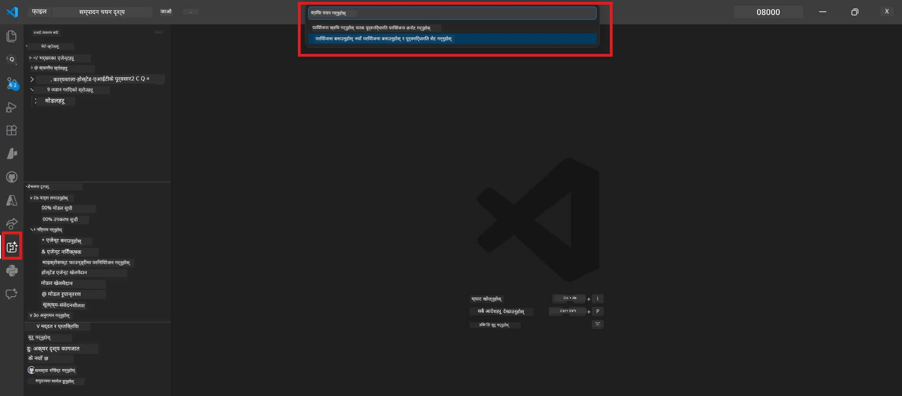

# Module 0 - पूर्वआवश्यकताहरू

Lab 02 सुरु गर्नु अघि, तपाईंसँग निम्न कुराहरू पूरा भएका छन् भन्ने सुनिश्चित गर्नुहोस्। यस लेबले सीधै Lab 01 मा आधारित छ - यो नछुटाउनुहोस्।

---

## 1. Lab 01 पूरा गर्नुहोस्

Lab 02 ले मान्छ कि तपाईंसँग पहिले नै:

- [x] [Lab 01 - Single Agent](../../lab01-single-agent/README.md) का सबै 8 मोड्युलहरू पूरा भइसकेको छ
- [x] Foundry Agent Service मा एकल एजेन्ट सफलतापूर्वक परिनियोजन गरिएको छ
- [x] एजेन्टले स्थानीय Agent Inspector र Foundry Playground दुबैमा काम गर्छ भन्ने प्रमाणित गरिएको छ

यदि तपाईले Lab 01 पूरा गर्नुभएको छैन भने, अहिले फर्केर त्यसलाई पूरा गर्नुहोस्: [Lab 01 Docs](../../lab01-single-agent/docs/00-prerequisites.md)

---

## 2. अवस्थित सेटअप जाँच गर्नुहोस्

Lab 01 का सबै उपकरणहरू अझै इन्स्टल र काम गरिरहेका हुनुपर्छ। यी छिटो जाँचहरू गर्नुहोस्:

### 2.1 Azure CLI

```powershell
az account show --query "{name:name, id:id}" --output table
```

अपेक्षित: तपाईँको सदस्यता नाम र ID देखाउँछ। यदि यो असफल भयो भने, [`az login`](https://learn.microsoft.com/cli/azure/authenticate-azure-cli-interactively) चलाउनुहोस्।

### 2.2 VS Code एक्सटेन्सनहरू

1. `Ctrl+Shift+P` थिच्नुहोस् → टाइप गर्नुहोस् **"Microsoft Foundry"** → तपाईलाई कमान्डहरू देखिन्छन् भन्ने पुष्टि गर्नुहोस् (जस्तै, `Microsoft Foundry: Create a New Hosted Agent`)।
2. `Ctrl+Shift+P` थिच्नुहोस् → टाइप गर्नुहोस् **"Foundry Toolkit"** → तपाईलाई कमान्डहरू देखिन्छन् भन्ने पुष्टि गर्नुहोस् (जस्तै, `Foundry Toolkit: Open Agent Inspector`)।

### 2.3 Foundry प्रोजेक्ट र मोडेल

1. VS Code Activity Bar मा **Microsoft Foundry** आइकन क्लिक गर्नुहोस्।
2. तपाईँको प्रोजेक्ट सूचीमा छ भन्ने पुष्टि गर्नुहोस् (जस्तै, `workshop-agents`)।
3. प्रोजेक्ट विस्तार गर्नुहोस् → एक परिनियोजित मोडेल छ भन्ने प्रमाणित गर्नुहोस् (जस्तै, `gpt-4.1-mini`) जसको स्थिति **Succeeded** छ।

> **यदि तपाईँको मोडेल परिनियोजन समाप्त भएको छ भने:** केही नि:शुल्क तहका परिनियोजनहरू स्वचालित रूपमा समाप्त हुन्छन्। [Model Catalog](https://learn.microsoft.com/azure/foundry/foundry-models/concepts/models-sold-directly-by-azure) बाट पुनः परिनियोजन गर्नुहोस् (`Ctrl+Shift+P` → **Microsoft Foundry: Open Model Catalog**)।



### 2.4 RBAC भूमिका

तपाईंसँग Foundry प्रोजेक्टमा **Azure AI User** छ कि छैन भनेर प्रमाणित गर्नुहोस्:

1. [Azure Portal](https://portal.azure.com) → तपाईँको Foundry **प्रोजेक्ट** स्रोत → **Access control (IAM)** → **[Role assignments](https://learn.microsoft.com/azure/foundry/concepts/rbac-foundry)** ट्याब।
2. तपाइँको नाम खोज्नुहोस् → पुष्टि गर्नुहोस् कि **[Azure AI User](https://aka.ms/foundry-ext-project-role)** सूचीमा छ।

---

## 3. बहु-एजेन्ट अवधारणाहरू बुझ्नुहोस् (Lab 02 का लागि नयाँ)

Lab 02 ले Lab 01 मा समेटिएका नभएका अवधारणाहरू प्रस्तुत गर्दछ। अघि बढ्नु अघि यी पढ्नुहोस्:

### 3.1 बहु-एजेन्ट वर्कफ्लो के हो?

एउटा एजेन्टले सबै कुरा गर्ने सट्टा, **बहु-एजेन्ट वर्कफ्लो** ले कामलाई धेरै विशेषीकृत एजेन्टहरूमा विभाजन गर्छ। प्रत्येक एजेन्टसँग हुन्छ:

- आफ्नो **निर्देशनहरू** (सिस्टम प्रम्प्ट)
- आफ्नो **भूमिका** (के उसको जिम्मेवारी हो)
- वैकल्पिक **उपकरणहरू** (फङ्सनहरू जुन यसले कल गर्न सक्छ)

एजेन्टहरू एक **अर्केस्ट्रेशन ग्राफ** मार्फत सञ्चार गर्छन् जसले उनीहरूको बीच डाटा कसरी 흐र्छ भनेर परिभाषित गर्छ।

### 3.2 WorkflowBuilder

`agent_framework` बाट [`WorkflowBuilder`](https://learn.microsoft.com/agent-framework/workflows/agents-in-workflows) क्लासले एजेन्टहरूलाई जोड्ने SDK कम्पोनेन्ट हो:

```python
from agent_framework import WorkflowBuilder

workflow = (
    WorkflowBuilder(
        name="MyWorkflow",
        start_executor=agent_a,
        output_executors=[agent_d],
    )
    .add_edge(agent_a, agent_b)
    .add_edge(agent_a, agent_c)
    .add_edge(agent_b, agent_d)
    .add_edge(agent_c, agent_d)
    .build()
)
```

- **`start_executor`** - पहिलो एजेन्ट जसले प्रयोगकर्ता इनपुट प्राप्त गर्दछ
- **`output_executors`** - एजेन्ट(हरू) जसको आउटपुट अन्तिम प्रतिक्रिया बन्छ
- **`add_edge(source, target)`** - `target` ले `source` को आउटपुट प्राप्त गर्छ भन्ने परिभाषित गर्छ

### 3.3 MCP (Model Context Protocol) उपकरणहरू

Lab 02 ले एक **MCP उपकरण** प्रयोग गर्दछ जुन Microsoft Learn API कल गरेर सिकाइ स्रोतहरू ल्याउँछ। [MCP (Model Context Protocol)](https://modelcontextprotocol.io/introduction) एक मानकीकृत प्रोटोकल हो जसले AI मोडेलहरूलाई बाह्य डाटा स्रोत र उपकरणसँग जडान गर्दछ।

| पद | परिभाषा |
|------|-----------|
| **MCP सर्भर** | एउटा सेवा जुन [MCP प्रोटोकल](https://learn.microsoft.com/azure/foundry/agents/how-to/tools/model-context-protocol) मार्फत उपकरण/स्रोतहरू उपलब्ध गराउँछ |
| **MCP क्लाएन्ट** | तपाईँको एजेन्ट कोड जुन MCP सर्भरमा जडान हुन्छ र यसको उपकरणहरू कल गर्छ |
| **[Streamable HTTP](https://learn.microsoft.com/agent-framework/agents/tools/hosted-mcp-tools)** | MCP सर्भर सँग सञ्चार गर्न प्रयोग गरिएको यातायात विधि |

### 3.4 Lab 02 र Lab 01 बीच के फरक छ

| पक्ष | Lab 01 (एकल एजेन्ट) | Lab 02 (बहु-एजेन्ट) |
|--------|----------------------|---------------------|
| एजेन्टहरू | 1 | 4 (विशेषीकृत भूमिकाहरू) |
| अर्केस्ट्रेशन | छैन | WorkflowBuilder (समानान्तर + अनुक्रमिक) |
| उपकरणहरू | वैकल्पिक `@tool` फङ्सन | MCP उपकरण (बाह्य API कल) |
| जटिलता | सरल प्रम्प्ट → प्रतिक्रिया | रिजुमे + JD → फिट स्कोर → रोडमैप |
| सन्दर्भ प्रवाह | प्रत्यक्ष | एजेन्ट देखि एजेन्ट हस्तान्तरण |

---

## 4. Lab 02 को कार्यशाला भण्डारण संरचना

Lab 02 का फाइलहरू कहाँ छन् भनेर सुनिश्चित गर्नुहोस्:

```
workshop/
└── lab02-multi-agent/
    ├── README.md                       ← Lab overview
    ├── docs/                           ← You are here
    │   ├── README.md                   ← Learning path index
    │   ├── 00-prerequisites.md         ← This file
    │   ├── 01-understand-multi-agent.md
    │   ├── ...
    │   └── 08-troubleshooting.md
    └── PersonalCareerCopilot/          ← The agent project
        ├── agent.yaml                  ← Agent definition
        ├── main.py                     ← 4-agent workflow code
        ├── Dockerfile                  ← Container configuration
        └── requirements.txt            ← Python dependencies
```

---

### चेकपोइन्ट

- [ ] Lab 01 पूर्ण रूपमा पूरा भइसकेको छ (सबै 8 मोड्युल, एजेन्ट परिनियोजित र प्रमाणित)
- [ ] `az account show` ले तपाइँको सदस्यता देखाउँछ
- [ ] Microsoft Foundry र Foundry Toolkit एक्सटेन्सनहरू इन्स्टल र प्रतिक्रिया दिइरहेका छन्
- [ ] Foundry प्रोजेक्टमा परिनियोजित मोडेल छ (जस्तै, `gpt-4.1-mini`)
- [ ] तपाइँसँग प्रोजेक्टमा **Azure AI User** भूमिका छ
- [ ] माथि बहु-एजेन्ट अवधारणाहरूको खण्ड पढ्नु भएको छ र WorkflowBuilder, MCP, र एजेन्ट अर्केस्ट्रेशन बुझ्नु भएको छ

---

**अर्को:** [01 - बहु-एजेन्ट संरचना बुझ्नुहोस् →](01-understand-multi-agent.md)

---

<!-- CO-OP TRANSLATOR DISCLAIMER START -->
**अस्वीकरण**:  
यो कागजात [Co-op Translator](https://github.com/Azure/co-op-translator) नामक AI अनुवाद सेवाको प्रयोग गरी अनुवाद गरिएको हो। हामी शुद्धताका लागि प्रयासरत छौं, तर कृपया बुझ्नुहोस् कि स्वचालित अनुवादमा त्रुटिहरू वा अन्योलहरू हुन सक्छन्। मूल कागजातलाई त्यसको मातृभाषामा अधिकारिक स्रोत मानिनुपर्छ। महत्वपूर्ण जानकारीको लागि व्यावसायिक मानव अनुवाद सिफारिस गरिन्छ। यस अनुवादको प्रयोगबाट उत्पन्न हुने कुनै पनि गलतफहमी वा गलत व्याख्याका लागि हामी जिम्मेवार छैनौं।
<!-- CO-OP TRANSLATOR DISCLAIMER END -->