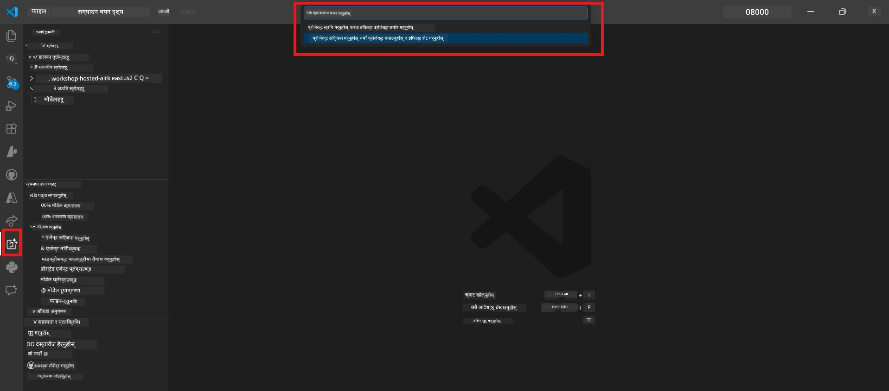

# मोड्युल ० - परिचय

⏱️ ~१० मिनेट

> [!WARNING]
> **पूर्वावलोकन र सीमाहरू:** [Hosted Agents](https://learn.microsoft.com/azure/foundry/agents/concepts/hosted-agents) हाल **सार्वजनिक पूर्वावलोकन** मा छन् - उत्पादन कार्यभारका लागि सिफारिस गरिएको छैन। यो कार्यशालामा देखाइएका केही विशेषताहरू सेवा GA तर्फ बढ्दै गर्दा परिवर्तन हुन सक्छन्।

## तपाईंले के निर्माण गर्नुहुनेछ

यस प्रयोगशालामा, तपाईंले Lab 01 को एकल-एजेन्ट सीपहरूलाई विस्तार गर्दै एक **बहु-एजेन्ट वर्कफ्लो** निर्माण गर्नुहुन्छ - Resume → Job Fit Evaluator।

तपाईंले एउटा **रिजुमे** र एउटा **रोजगारी विवरण** टाँस्नुहुन्छ। चार विशेषज्ञ एजेन्टहरूले इनपुटलाई क्रमशः प्रशोधन गर्छन्, र पछि फर्काउनेछन्:
- एउटा फिट स्कोर (०–१०० स्कोर ब्रेकडाउनसहित)
- एउटा सीप र प्रमाणपत्रको अन्तर सूची
- प्रत्येक अन्तरका लागि वास्तविक Microsoft Learn लिङ्कसहित व्यक्तिगत अध्ययन रोडम्याप

**वर्कफ्लोले प्रयोग गर्दछ:**
- **Microsoft Agent Framework** - `WorkflowBuilder` क्रमशः पाइपलाइन सम्हाल्न
- **Foundry Toolkit for VS Code** - स्क्याफोल्डिङ, स्थानीय रूपमा परीक्षण, परिनियोजन
- **एआई मोडेल** (जस्तै, `gpt-4.1-mini`) - सबै चार एजेन्टहरूले प्रयोग गर्ने
- **Microsoft Learn MCP सर्भर** - प्रत्येक सीप अन्तरका लागि वास्तविक अध्ययन स्रोत लिङ्कहरू प्रदान गर्ने

---

## तपाईंको बाटो चुन्नुहोस्

> ⚠️ **अनि Lab 01 मा उपयोग गरेको त्यसै बाटोसँग अगाडि बढ्नुहोस्।**

<details open>
<summary><strong>🅰️ बाटो ए - Azure क्लाउड (Azure सदस्यता आवश्यक)</strong></summary>

| | विवरणहरू |
|---|---|
| **कसका लागि हो?** | तपाईंले Lab 01 Azure सदस्यता प्रयोग गरेर सम्पन्न गर्नुभयो |
| **मोडेल** | Foundry मार्फत Azure OpenAI (जस्तै, `gpt-4.1-mini`) |
| **सम्भावित मोड्युलहरू** | सबै मोड्युलहरू (००–०९) |
| **क्लाउडमा परिनियोजन?** | ✅ हो - पूर्ण अन्त-देखि-अन्त परिनियोजन |

</details>

<details open>
<summary><strong>🅱️ बाटो B - Foundry Local (Azure सदस्यता आवश्यक छैन)</strong></summary>

| | विवरणहरू |
|---|---|
| **कसका लागि हो?** | तपाईंले Foundry Local प्रयोग गरेर Lab 01 सम्पन्न गर्नुभयो |
| **मोडेल** | Foundry Local (निःशुल्क, तपाइँको कम्प्युटरमा चल्छ) |
| **सम्भावित मोड्युलहरू** | मोड्युल ००–०५ (०६–०७ छाडी - परिनियोजन र क्लाउड प्रमाणिकरण) |
| **क्लाउडमा परिनियोजन?** | ❌ होइन - स्थानीय परीक्षण मात्र Agent Inspector मार्फत |

</details>

---

## Lab 01 जाँच

Lab 02 ले सिधै Lab 01 माथि निर्माण गर्छ। यहाँ सुरु गर्नु अघि पहिले Lab 01 पूरा गर्नुहोस्।

Lab 01 अझै गर्नुभएको छैन? यहाँबाट सुरु गर्नुहोस्: [Lab 01 - परिचय](../../lab01-single-agent/docs/00-prerequisites.md)

<details open>
<summary><strong>🅰️ बाटो ए - Azure क्लाउड</strong></summary>

```powershell
az account show --query "{name:name, id:id}" --output table
```

यदि असफल भयो भने, `az login` चलाउनुहोस्। त्यसपछि VS Code मा जाँच गर्नुहोस्:

१. `Ctrl+Shift+P` → टाइप गर्नुहोस् **Foundry Toolkit** → आदेशहरू देखिन्छन् सुनिश्चित गर्नुहोस्।
२. **Foundry Toolkit** आइकनमा क्लिक गर्नुहोस् → तपाईंको प्रोजेक्ट र परिनियोजित मोडेल **सफल भयो** देखिन्छ।



> **RBAC:** तपाईंले Lab 01 मा **Foundry User** तोक्नुभएको छ। पुन: तोक्न आवश्यक परेमा हेर्नुहोस् [Lab 01, मोड्युल १](../../lab01-single-agent/docs/01-setup.md#deploy-a-model--assign-rbac)। यो भूमिकाको नाम पहिले **Azure AI User** थियो - समान अनुमति।

</details>

<details open>
<summary><strong>🅱️ बाटो B - Foundry Local</strong></summary>

```powershell
Invoke-WebRequest -Uri "http://localhost:5273/v1/health" -UseBasicParsing | Select-Object StatusCode
```

अपेक्षित: `StatusCode: 200`। यदि होइन भने, Foundry Toolkit साइडबारबाट Foundry Local पुनः सुरु गर्नुहोस्।

> सबै inference तपाइँको कम्प्युटरमै चल्छ। एक मात्र बाह्य कल MCP उपकरण `https://learn.microsoft.com/api/mcp` तर्फ जान्छ।

</details>

---

## Lab 02 मा के नयाँ छ

| | Lab 01 | Lab 02 |
|--|--------|--------|
| एजेन्टहरू | 1 | 4 (WorkflowBuilder सँग श्रृंखलाबद्ध) |
| स्क्याफोल्ड ढाँचा | आधारभूत - Agent Framework | वर्कफ्लोहरू - Agent Framework |
| नयाँ प्याकेज | - | `mcp` |
| समन्वय | एकल संवादात्मक एजेन्ट | क्रमशः पाइपलाइन (WorkflowBuilder) |
| नयाँ उपकरण | - | `search_microsoft_learn_for_plan` (MCP) |

---

**अर्को:** [०१ - वास्तुकला बुझ्नुहोस् →](01-understand-multi-agent.md)

---

<!-- CO-OP TRANSLATOR DISCLAIMER START -->
**अस्वीकरण**:
यो दस्तावेज़ AI अनुवाद सेवा [Co-op Translator](https://github.com/Azure/co-op-translator) प्रयोग गरेर अनुवाद गरिएको हो। हामी सही हुन प्रयास गर्छौं, तर कृपया जानकार हुनुस् कि स्वचालित अनुवादमा त्रुटिहरू वा अशुद्धताहरू हुन सक्छन्। मूल दस्तावेज़ यसको मूल भाषामा आधिकारिक स्रोत मानिनुपर्छ। महत्वपूर्ण जानकारीका लागि व्यावसायिक मानव अनुवाद सिफारिस गरिन्छ। यस अनुवादको प्रयोगबाट उत्पन्न कुनै पनि गलत बुझाइ वा त्रुटिको लागि हामी जिम्मेवार छैनौं।
<!-- CO-OP TRANSLATOR DISCLAIMER END -->