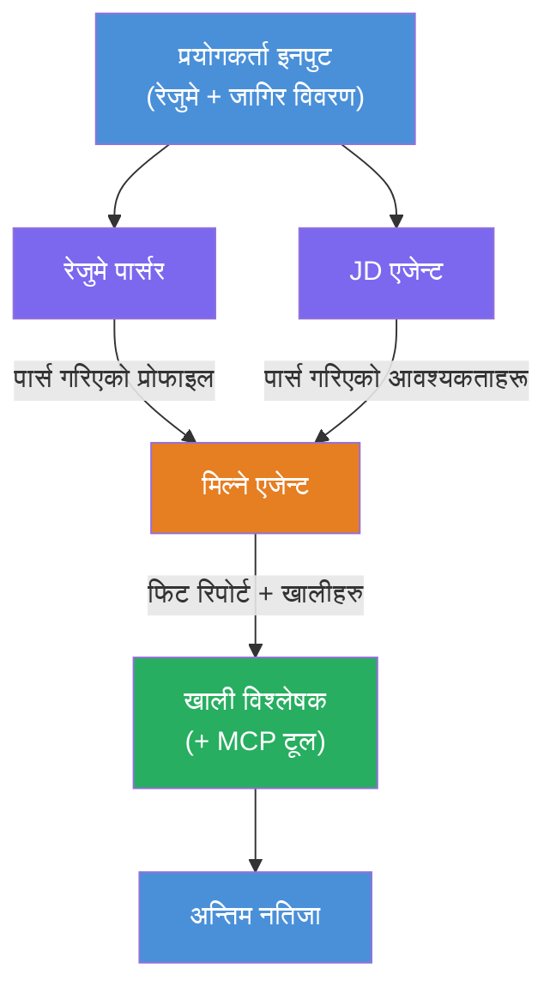
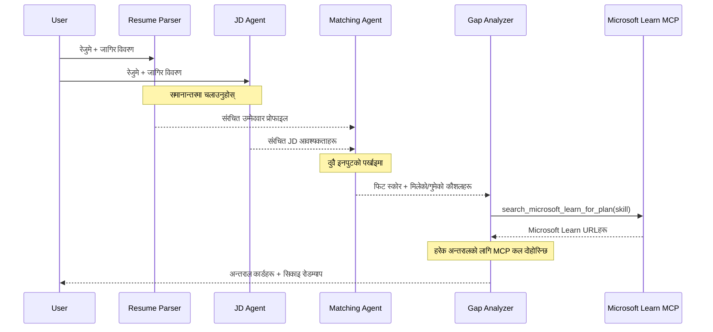
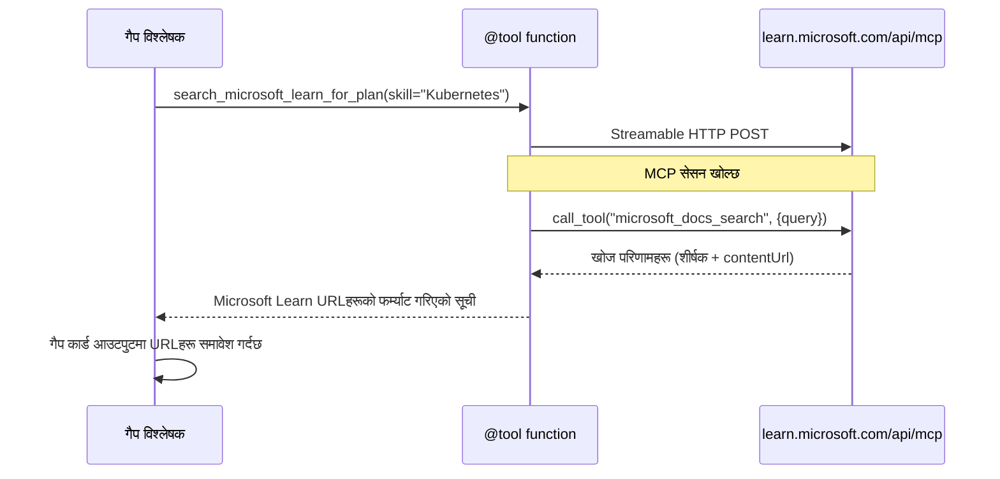

# Module 1 - बहु-एजेन्ट आर्किटेक्चर बुझ्नुहोस्

यस मोड्युलमा, तपाईंले कुनै पनि कोड लेख्नु अघि Resume → Job Fit Evaluator को आर्किटेक्चर सिक्नुहुन्छ। अर्द्धसंयोजन ग्राफ, एजेन्टका भूमिकाहरू, र डाटा प्रवाह बुझ्नु [बहु-एजेन्ट वर्कफ्लोहरू](https://learn.microsoft.com/azure/architecture/ai-ml/idea/multiple-agent-workflow-automation) लाई डिबग र विस्तार गर्न महत्वपूर्ण छ।

---

## यसले समाधान गर्ने समस्या

रिजुमे लाई जागिर वर्णनसँग मेल खुवाउने कार्यमा विभिन्न फरक कौशलहरू संलग्न हुन्छन्:

1. **पार्सिङ** - असंरचित पाठ (रिजुमे) बाट संरचित डाटा निकाल्नु
2. **विश्लेषण** - जागिर वर्णनबाट आवश्यकताहरू निकाल्नु
3. **तुलना** - दुवैबीच मिलानको स्कोर निर्धारण गर्नु
4. **योजना बनाउने** - कमजोरी पुर्याउन सिकाइ योजना तयार पार्नु

एकै एजेन्टले यी चारवटा कार्यहरू एउटै प्रॉम्प्टमा गर्दा प्रायः:
- अपूरो निकासी (स्कोरमा जानको लागि पार्सिङ छिटो गरिन्छ)
- सतही स्कोरिङ (साक्ष्यमा आधारित विभाजन छैन)
- सामान्य योजना (विशिष्ट कमजोरीहरूका लागि अनुकूलित छैन)

**चार विशेषज्ञ एजेन्टहरू** मा विभाजन गरेर, प्रत्येकले आफ्नो कार्यमा केन्द्रित निर्देशनका साथ काम गर्दछ, जसले हरेक चरणमा उच्च गुणस्तरको नतिजा उत्पादन गर्छ।

---

## चार एजेन्टहरू

प्रत्येक एजेन्ट एक पूर्ण [Microsoft Foundry](https://learn.microsoft.com/azure/foundry/agents/concepts/hosted-agents) एजेन्ट हो जुन `AzureAIAgentClient.as_agent()` मार्फत सिर्जना गरिएको छ। उनीहरूले एउटै मोडेल परिनियोजन साझा गर्छन् तर फरक निर्देशनहरू र (वैकल्पिक रूपमा) फरक उपकरण हुन्छन्।

| # | एजेन्ट नाम | भूमिका | इनपुट | आउटपुट |
|---|-----------|--------|--------|---------|
| 1 | **ResumeParser** | रिजुमे पाठबाट संरचित प्रोफाइल निकाल्छ | कच्चा रिजुमे पाठ (प्रयोगकर्ताबाट) | उम्मेदवार प्रोफाइल, प्राविधिक कौशल, नरम कौशल, प्रमाणपत्रहरू, डोमेन अनुभव, उपलब्धिहरू |
| 2 | **JobDescriptionAgent** | जागिर विवरणबाट संरचित आवश्यकताहरू निकाल्छ | कच्चा जागिर विवरण पाठ (प्रयोगकर्ताबाट, ResumeParser मार्फत पठाइएको) | भूमिका अवलोकन, आवश्यक कौशलहरू, रोजाइका कौशलहरू, अनुभव, प्रमाणपत्रहरू, शिक्षा, जिम्मेवारीहरू |
| 3 | **MatchingAgent** | साक्ष्यमा आधारित फिट स्कोर गणना गर्छ | ResumeParser + JobDescriptionAgent का आउटपुटहरू | फिट स्कोर (0-100 ब्रेकडाउन सहित), मिलेका कौशल, अभावमा रहेका कौशल, ग्यापहरू |
| 4 | **GapAnalyzer** | व्यक्तिगत सिकाइ रोडम्याप बनाउँछ | MatchingAgent को आउटपुट | ग्याप कार्डहरू (प्रत्येक कौशलको लागि), सिकाइ क्रम, समयरेखा, Microsoft Learn बाट स्रोतहरू |

---

## अर्द्धसंयोजन ग्राफ

वर्कफ्लोले **समानान्तर फ्यान-आउट** followed by **क्रमिक संकलन** प्रयोग गर्छ:


> **लेजेन्ड:** बैजनी = समानान्तर एजेन्टहरू, सुन्तला = संकलन बिन्दु, हरियो = उपकरण सहित अन्तिम एजेन्ट

### डाटा कसरी बग्छ


1. **प्रयोगकर्ताले पठाउँछ** रिजुमे र जागिर वर्णनसहित सन्देश।
2. **ResumeParser** ले पूर्ण प्रयोगकर्ता इनपुट प्राप्त गरी संरचित उम्मेदवार प्रोफाइल निकाल्छ।
3. **JobDescriptionAgent** समानान्तर रूपमा प्रयोगकर्ता इनपुट प्राप्त गरी संरचित आवश्यकताहरू निकाल्छ।
4. **MatchingAgent** ले दुबै ResumeParser र JobDescriptionAgent बाट आउटपुटहरू प्राप्त गर्छ (फ्रेमवर्कले दुबै पूरा हुन कुर्दछ त्यसपछि MatchingAgent चलाउँछ)।
5. **GapAnalyzer** ले MatchingAgent को आउटपुट प्राप्त गरी प्रत्येक ग्यापको लागि **Microsoft Learn MCP उपकरण** मार्फत वास्तविक सिकाइ स्रोतहरू प्राप्त गर्छ।
6. अन्तिम आउटपुट GapAnalyzer को प्रतिक्रिया हो, जसमा फिट स्कोर, ग्याप कार्डहरू, र पूर्ण सिकाइ रोडम्याप हुन्छ।

### किन समानान्तर फ्यान-आउट महत्वपूर्ण छ

ResumeParser र JobDescriptionAgent दुबै एक अर्कामा निर्भर नभएकाले **समानान्तर** चल्छन्। यसले:
- कुल प्रतीक्षा समय घटाउँछ (दुवै एकै समयमा चल्छन्, लगातार नभएर)
- स्वाभाविक विभाजन हो (रिजुमे पार्सिङ र JD पार्सिङ स्वतन्त्र कार्य हुन्)
- सामान्य बहु-एजेन्ट नमूनाको प्रदर्शन गर्छ: **फ्यान-आउट → समेकन → कार्यान्वयन**

---

## कोडमा WorkflowBuilder

माथिको ग्राफ जुन [`WorkflowBuilder`](https://learn.microsoft.com/agent-framework/workflows/agents-in-workflows) API कलहरू `main.py` मा यसरी नक्साङ्कित हुन्छ:

```python
from agent_framework import WorkflowBuilder

workflow = (
    WorkflowBuilder(
        name="ResumeJobFitEvaluator",
        start_executor=resume_parser,       # प्रयोगकर्ताबाट इनपुट प्राप्त गर्ने पहिलो एजेन्ट
        output_executors=[gap_analyzer],     # अन्तिम एजेन्ट जसको आउटपुट फर्काइन्छ
    )
    .add_edge(resume_parser, jd_agent)      # रिजुमेपार्सर → जागिरवर्णन एजेन्ट
    .add_edge(resume_parser, matching_agent) # रिजुमेपार्सर → मेल खाने एजेन्ट
    .add_edge(jd_agent, matching_agent)      # जागिरवर्णन एजेन्ट → मेल खाने एजेन्ट
    .add_edge(matching_agent, gap_analyzer)  # मेल खाने एजेन्ट → अन्तराल विश्लेषक
    .build()
)
```

**किनाराहरू बुझ्नुहोस्:**

| किनारा | यसको अर्थ |
|--------|------------|
| `resume_parser → jd_agent` | JD एजेन्टले ResumeParser को आउटपुट प्राप्त गर्छ |
| `resume_parser → matching_agent` | MatchingAgent ले ResumeParser को आउटपुट पाउँछ |
| `jd_agent → matching_agent` | MatchingAgent ले JD एजेन्टको आउटपुट पनि पाउँछ (दुवै कुर्दछ) |
| `matching_agent → gap_analyzer` | GapAnalyzer ले MatchingAgent को आउटपुट पाउँछ |

`matching_agent` लाई दुईवटा इनकमिंग किनारा छन् (`resume_parser` र `jd_agent`), त्यसैले फ्रेमवर्कले दुवै पूरा हुन कुर्दछ त्यसपछि मात्र MatchingAgent चलाउँछ।

---

## MCP उपकरण

GapAnalyzer एजेन्टसँग एउटा उपकरण छ: `search_microsoft_learn_for_plan`। यो एक **[MCP उपकरण](https://learn.microsoft.com/agent-framework/agents/tools/hosted-mcp-tools)** हो जसले Microsoft Learn API लाई कल गरेर चयनित सिकाइ स्रोतहरू ल्याउँछ।

### यो कसरी काम गर्छ

```python
@tool
async def search_microsoft_learn_for_plan(
    skill: str, role: str = "", max_results: int = 5
) -> str:
    """Search Microsoft Learn MCP and return curated official links."""
    # Streamable HTTP मार्फत https://learn.microsoft.com/api/mcp सँग जडान हुन्छ
    # MCP सर्भरमा 'microsoft_docs_search' उपकरण कल गर्छ
    # Microsoft Learn URL हरूको प्रारूपित सूची फर्काउँछ
```

### MCP कल प्रवाह


1. GapAnalyzer ले कुनै कौशल (जस्तै, "Kubernetes") को लागि सिकाइ स्रोतहरू आवश्यक ठान्छ
2. फ्रेमवर्कले `search_microsoft_learn_for_plan(skill="Kubernetes")` कल गर्छ
3. फंक्शनले [Streamable HTTP](https://learn.microsoft.com/agent-framework/agents/tools/hosted-mcp-tools) कनेक्शन खोल्छ `https://learn.microsoft.com/api/mcp` मा
4. यसले [MCP सर्भर](https://learn.microsoft.com/azure/foundry/agents/how-to/tools/model-context-protocol) मा `microsoft_docs_search` उपकरण कल गर्छ
5. MCP सर्भरले खोज परिणामहरू (शीर्षक + URL) फर्काउँछ
6. फंक्शनले परिणामहरूलाई स्ट्रिङमा फर्म्याट गरेर फर्काउँछ
7. GapAnalyzer ले फर्काइएका URL हरूलाई आफ्नो ग्याप कार्ड आउटपुटमा प्रयोग गर्छ

### अपेक्षित MCP लगहरू

जब उपकरण चल्छ, निम्न लगहरू देखिने छन्:

```
GET https://learn.microsoft.com/api/mcp → 405 (Method Not Allowed)
POST https://learn.microsoft.com/api/mcp → 200
DELETE https://learn.microsoft.com/api/mcp → 405 (Method Not Allowed)
```

**यी सामान्य हुन्।** MCP क्लाइन्टले प्रारम्भिकमा GET र DELETE अनुरोधहरू पठाउँछ - तीमा 405 फर्क्नु अपेक्षित व्यवहार हो। वास्तविक उपकरण कल POST बाट हुन्छ र 200 फर्काउँछ। POST कल असफल भए मात्र चिन्ता गर्नुहोस्।

---

## एजेन्ट सिर्जना ढाँचा

हरेक एजेन्ट **[`AzureAIAgentClient.as_agent()`](https://learn.microsoft.com/python/api/overview/azure/ai-agents-readme) असिंक्रोनस कन्टेक्स्ट म्यानेजर** प्रयोग गरी सिर्जना गरिन्छ। यो Foundry SDK को एजेन्टहरू स्वतः cleanup गरिने ढाँचा हो:

```python
async with (
    get_credential() as credential,
    AzureAIAgentClient(
        project_endpoint=PROJECT_ENDPOINT,
        model_deployment_name=MODEL_DEPLOYMENT_NAME,
        credential=credential,
    ).as_agent(
        name="ResumeParser",
        instructions=RESUME_PARSER_INSTRUCTIONS,
    ) as resume_parser,
    # ... प्रत्येक एजेन्टका लागि दोहोर्याउनुहोस् ...
):
    # यहाँ सबै ४ एजेन्टहरू अवस्थित छन्
    workflow = create_workflow(resume_parser, jd_agent, matching_agent, gap_analyzer)
```

**मुख्य बुँदाहरू:**
- प्रत्येक एजेन्टलाई आफ्नै `AzureAIAgentClient` इन्स्टेन्स प्राप्त हुन्छ (SDK ले एजेन्ट नाम क्लाइन्ट प्रस्तुत दायरामा हुन आवश्यक छ)
- सबै एजेन्टहरू एउटै `credential`, `PROJECT_ENDPOINT`, र `MODEL_DEPLOYMENT_NAME` साझा गर्छन्
- `async with` ब्लकले सर्भर बन्द हुँदा सबै एजेन्टहरू cleanup सुनिश्चित गर्छ
- GapAnalyzer लाई विशेष रूपमा `tools=[search_microsoft_learn_for_plan]` पनि प्राप्त हुन्छ

---

## सर्भर स्टार्टअप

एजेन्टहरू सिर्जना गरी वर्कफ्लो तयार गरेपछि, सर्भर सुरु हुन्छ:

```python
from azure.ai.agentserver.agentframework import from_agent_framework

agent = create_workflow(resume_parser, jd_agent, matching_agent, gap_analyzer)
await from_agent_framework(agent).run_async()
```

`from_agent_framework()` ले वर्कफ्लो HTTP सर्भरको रूपमा र्याप गरेर `/responses` अन्तर्वार्ता पोर्ट 8088 मा एक्स्पोज गर्छ। यो Lab 01 जस्तै ढाँचा हो, तर "एजेन्ट" अब सम्पूर्ण [वर्कफ्लो ग्राफ](https://learn.microsoft.com/agent-framework/workflows/as-agents) हो।

---

### चेकप्वाइन्ट

- [ ] तपाईं ४-एजेन्ट आर्किटेक्चर र प्रत्येक एजेन्टको भूमिका बुझ्नुभयो
- [ ] तपाईं डाटा प्रवाह ट्रेस गर्न सक्नुहुन्छ: प्रयोगकर्ता → ResumeParser → (समानान्तर) JD एजेन्ट + MatchingAgent → GapAnalyzer → आउटपुट
- [ ] तपाईं बुझ्नुभयो किन MatchingAgent ले ResumeParser र JD एजेन्ट दुवैलाई कुर्दछ (दुई इनकमिंग किनारा)
- [ ] तपाईंले MCP उपकरण बुझ्नुभयो: के गर्छ, कसरी कल हुन्छ, र GET 405 लगहरू सामान्य हो
- [ ] तपाईंले `AzureAIAgentClient.as_agent()` ढाँचालाई बुझ्नुभयो र किन प्रत्येक एजेन्टसँग आफ्नै क्लाइन्ट छ
- [ ] तपाईं `WorkflowBuilder` कोड पढेर यसलाई भिजुअल ग्राफसँग नक्साङ्कित गर्न सक्नुहुन्छ

---

**अघिल्लो:** [00 - Prerequisites](00-prerequisites.md) · **अर्को:** [02 - Scaffold the Multi-Agent Project →](02-scaffold-multi-agent.md)

---

<!-- CO-OP TRANSLATOR DISCLAIMER START -->
**अस्वीकरण**:  
यस दस्तावेजलाई AI अनुवाद सेवा [Co-op Translator](https://github.com/Azure/co-op-translator) द्वारा अनुवाद गरिएको छ। हामी शुद्धताका लागि प्रयास गर्छौं, तर कृपया बुझ्नुहोस् कि स्वचालित अनुवादमा त्रुटिहरू वा अपरिष्कृतता हुन सक्छ। मूल भाषामा रहेको दस्तावेजलाई आधिकारिक स्रोत मानिनुपर्छ। महत्वपूर्ण जानकारीको लागि व्यावसायिक मानवीय अनुवाद सिफारिस गरिन्छ। यस अनुवादको प्रयोगबाट उत्पन्न कुनै पनि गलतफहमी वा गलत व्याख्याबारे हामी जिम्मेवार छैनौं।
<!-- CO-OP TRANSLATOR DISCLAIMER END -->