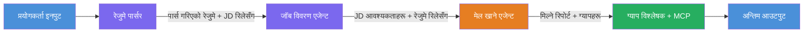

# मोड्युल १ - वास्तुकला बुझ्नुहोस्

⏱️ ~५ मिनेट

कुनै पनि कोड लेख्नुअघि, तपाईं के बनाउँदै हुनुहुन्छ र यो कसरी काम गर्छ भन्ने एक छिटो अवलोकन यहाँ छ।

---

## तपाईं के बनाउँदै हुनुहुन्छ

तपाईंले एउटा **रेजुमे** र एउटा **कामको विवरण** टाँस्नुहुन्छ। वर्कफ्लोले फिर्ता गर्छ:

- फिट स्कोर (०–१०० सहित ब्रेकडाउन)
- सीप र प्रमाणपत्र अन्तरहरूको सूची
- प्रत्येक अन्तरका लागि Microsoft Learn लिंकहरूसहित व्यक्तिगत सिकाइ रोडम्याप

---

## चार एजेन्टहरू

एकल एजेन्टले सबै प्रक्रियाहरू एकैचोटि पार्स, स्कोर, र योजना बनाउन खोज्दा छिटो गर्ने र सतही नतिजा दिने गर्दछ। चार विशेष एजेन्टहरूमा काम विभाजन गर्दा राम्रो परिणाम आउँछ:

| एजेन्ट | यो के गर्छ |
|-------|-------------|
| **ResumeParser** | रिजुमे पार्स गर्छ; JD लाई शब्दशः `[JOB DESCRIPTION PASS-THROUGH]` मा कपी गर्छ ताकि तलका एजेन्टहरूले प्रयोग गर्न सकून् |
| **JobDescriptionAgent** | पास-थ्रूबाट JD आवश्यकताहरू निकाल्छ; `[PARSED RESUME]` लाई अगाडि `[PARSED RESUME PASS-THROUGH]` का रूपमा पठाउँछ |
| **MatchingAgent** | दुबै लेबल गरिएका भागहरू तुलना गर्छ; ०–१०० फिट स्कोर र अन्तर सूची उत्पादन गर्छ |
| **GapAnalyzer** | सिकाइ रोडम्याप बनाउँछ; प्रत्येक अन्तरका लागि Microsoft Learn खोज्छ |

---

## समन्वय ग्राफ

वर्कफ्लो एक **परस्पर साङ्गोपाङ्ग पाइपलाइन** हो - प्रत्येक एजेन्टले आफ्नो आउटपुट अर्को एजेन्टलाई पास गर्छ:


```mermaid
flowchart LR
    A["प्रयोगकर्ता इनपुट"] --> B["रेजुमे पार्सर"]
    B -- "पार्स गरिएको रेजुमे + JD रिलेसँग" --> C["जॉब विवरण एजेन्ट"]
    C -- "JD आवश्यकताहरू + रेजुमे रिलेसँग" --> D["मेल खाने एजेन्ट"]
    D -- "मिल्ने रिपोर्ट + ग्यापहरू" --> E["ग्याप विश्लेषक + MCP"]
    E --> F["अन्तिम आउटपुट"]

    style A fill:#4A90D9,color:#fff
    style B fill:#7B68EE,color:#fff
    style C fill:#7B68EE,color:#fff
    style D fill:#E67E22,color:#fff
    style E fill:#27AE60,color:#fff
    style F fill:#4A90D9,color:#fff
```

१. **ResumeParser** ले प्रयोगकर्ताको इनपुट प्राप्त गर्छ, रिजुमे पार्स गर्छ, र JD लाई `[JOB DESCRIPTION PASS-THROUGH]` मा कपी गर्छ।
२. **JD Agent** ले संरचित आवश्यकताहरू निकाल्छ र `[PARSED RESUME PASS-THROUGH]` अगाडि पठाउँछ।
३. **MatchingAgent** ले दुबै भागहरू तुलना गर्छ र फिट स्कोर र अन्तर सूची उत्पादन गर्छ।
४. **GapAnalyzer** ले रोडम्याप बनाउँछ र प्रत्येक अन्तरका लागि Microsoft Learn MCP टुल कल गर्छ।

---

## यो कोडसँग कसरी मेल खान्छ

`main.py` मा तपाईं यस ग्राफलाई `WorkflowBuilder` द्वारा वर्णन गर्नुहुन्छ:

```python
workflow_agent = (
    WorkflowBuilder(
        start_executor=resume_executor,       # प्रयोगकर्ता इनपुट प्राप्त गर्ने पहिलो एजेन्ट
        output_executors=[gap_executor],      # अन्तिम एजेन्ट - यसको आउटपुट जवाफ हो
    )
    .add_edge(resume_executor, jd_executor)       # ResumeParser → JD एजेन्ट
    .add_edge(jd_executor, matching_executor)     # JD एजेन्ट → MatchingAgent
    .add_edge(matching_executor, gap_executor)    # MatchingAgent → GapAnalyzer
    .build()
    .as_agent()
)
```

प्रत्येक `Agent` लाई `AgentExecutor` मा रैप गरिएको छ। `add_edge()` कलहरूले एक कडाइले अनुक्रमिक पाइपलाइन परिभाषित गर्छ - प्रत्येक एजेन्टले केवल आफ्नै सिधा अघिल्लो एजेन्टको आउटपुट पाउँछ।

> `context_mode="last_agent"` भन्नाले प्रत्येक एक्जिक्युटरले आफ्नो सिधा अघिल्लो एजेन्टको आउटपुट मात्र देख्छ। ResumeParser र JD Agent ले डेटा अगाडि पठाउँछन् लेबल गरिएका भागहरूमा ताकि प्रत्येक तलको एजेन्टले ठ्याक्कै आवश्यक कुरा प्राप्त गरोस्।

---

## MCP टुल

GapAnalyzer सँग एउटा टुल छ: `search_microsoft_learn_for_plan`। यसले `https://learn.microsoft.com/api/mcp` मा जडान गर्छ र प्रत्येक सीप अन्तरका लागि वास्तविक Microsoft Learn लिंकहरू फिर्ता गर्छ।

जब टुल चल्छ तपाईंले यी लगहरू देख्नुहुनेछ - सबै अपेक्षित छन्:

```
GET  https://learn.microsoft.com/api/mcp → 405   ← connection probe, normal
POST https://learn.microsoft.com/api/mcp → 200   ← actual tool call
DELETE https://learn.microsoft.com/api/mcp → 405 ← cleanup probe, normal
```

`POST` ले त्रुटि फिर्ता गरेमा मात्र चिन्ता गर्नुहोस्।

---

**अघिल्लो:** [00 - पूर्वआवश्यकताहरू](00-prerequisites.md) · **अर्को:** [02 - प्रोजेक्टको ढाँचा तयार पार्ने →](02-scaffold-multi-agent.md)

---

<!-- CO-OP TRANSLATOR DISCLAIMER START -->
**अस्वीकरण**:
यो दस्तावेज़ AI अनुवाद सेवा [Co-op Translator](https://github.com/Azure/co-op-translator) प्रयोग गरेर अनुवाद गरिएको हो। हामी सही हुन प्रयास गर्छौं, तर कृपया जानकार हुनुस् कि स्वचालित अनुवादमा त्रुटिहरू वा अशुद्धताहरू हुन सक्छन्। मूल दस्तावेज़ यसको मूल भाषामा आधिकारिक स्रोत मानिनुपर्छ। महत्वपूर्ण जानकारीका लागि व्यावसायिक मानव अनुवाद सिफारिस गरिन्छ। यस अनुवादको प्रयोगबाट उत्पन्न कुनै पनि गलत बुझाइ वा त्रुटिको लागि हामी जिम्मेवार छैनौं।
<!-- CO-OP TRANSLATOR DISCLAIMER END -->