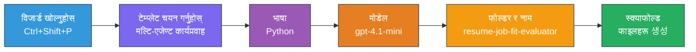
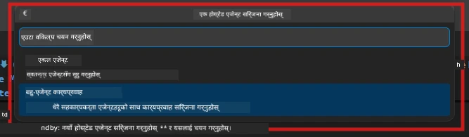

# मोड्युल २ - मल्टि-एजेन्ट परियोजना स्क्याफोल्ड गर्नुहोस्

यस मोड्युलमा, तपाईंले [Microsoft Foundry एक्सटेन्सन](https://marketplace.visualstudio.com/items?itemName=TeamsDevApp.vscode-ai-foundry) प्रयोग गरेर **मल्टि-एजेन्ट workflow परियोजना स्क्याफोल्ड गर्नुहुन्छ**। एक्सटेन्सनले सम्पूर्ण परियोजना संरचना जेनरेट गर्छ - `agent.yaml`, `main.py`, `Dockerfile`, `requirements.txt`, `.env`, र डिबग कन्फिगरेसन। त्यसपछि तपाईं यी फाइलहरू मोड्युल ३ र ४ मा अनुकूलन गर्नुहुन्छ।

> **टिप्पणी:** यस प्रयोगशालामा रहेको `PersonalCareerCopilot/` फोल्डर एक पुरा, कार्यरत कस्टमाइज गरिएको मल्टि-एजेन्ट परियोजनाको उदाहरण हो। तपाईं ताजा परियोजना स्क्याफोल्ड गर्न सक्नुहुन्छ (सिक्नका लागि सिफारिस गरिन्छ) वा प्रत्यक्ष रूपमा अवस्थित कोड अध्ययन गर्न सक्नुहुन्छ।

---

## चरण १: Create Hosted Agent विजार्ड खोल्नुहोस्


१. `Ctrl+Shift+P` थिचेर **Command Palette** खोल्नुहोस्।
२. टाइप गर्नुहोस्: **Microsoft Foundry: Create a New Hosted Agent** र चयन गर्नुहोस्।
३. Hosted agent सिर्जना विजार्ड खुल्छ।

> **वैकल्पिक:** Activity Bar मा रहेको **Microsoft Foundry** आइकनमा क्लिक गर्नुहोस् → **Agents** को छेउमा रहेको **+** आइकनमा क्लिक गर्नुहोस् → **Create New Hosted Agent**।

---

## चरण २: मल्टि-एजेन्ट workflow टेम्प्लेट छान्नुहोस्

विजार्डले तपाईंलाई टेम्प्लेट छान्न भन्छ:

| टेम्प्लेट | विवरण | प्रयोग गर्ने समय |
|----------|-------------|-------------|
| सिंगल एजेन्ट | एक एजेन्ट निर्देशन र वैकल्पिक उपकरणहरूसँग | प्रयोगशाला ०१ |
| **मल्टि-एजेन्ट workflow** | बहु एजेन्टहरू जुन WorkflowBuilder मार्फत सहकार्य गर्छन् | **यो प्रयोगशाला (प्रयोगशाला ०२)** |

१. **मल्टि-एजेन्ट workflow** छान्नुहोस्।
२. **Next** क्लिक गर्नुहोस्।



---

## चरण ३: प्रोग्रामिङ भाषा छान्नुहोस्

१. **Python** छान्नुहोस्।
२. **Next** क्लिक गर्नुहोस्।

---

## चरण ४: आफ्नो मोडेल छान्नुहोस्

१. विजार्डले Foundry परियोजनामा डिप्लोय गरिएको मोडेलहरू देखाउँछ।
२. प्रयोगशाला ०१ मा प्रयोग गरिएको उही मोडेल छान्नुहोस् (जस्तै, **gpt-4.1-mini**)।
३. **Next** क्लिक गर्नुहोस्।

> **टिप:** [`gpt-4.1-mini`](https://learn.microsoft.com/azure/foundry/foundry-models/concepts/models-sold-directly-by-azure#gpt-41-series) विकासका लागि सिफारिस गरिएको मोडेल हो - यो छिटो, सस्तो र मल्टि-एजेन्ट workflow राम्रोसँग ह्यान्डल गर्छ। उत्पादन डिप्लोयमेन्टको लागि उच्च गुणस्तर चाहिएको खण्डमा `gpt-4.1` मा स्विच गर्नुहोस्।

---

## चरण ५: फोल्डर स्थान र एजेन्ट नाम छान्नुहोस्

१. फाइल डायलग खुल्छ। लक्ष्य फोल्डर छान्नुहोस्:
   - कार्यशाला रिपोको साथमा अघि बढ्दै हुनुहुन्छ भने: `workshop/lab02-multi-agent/` मा जानुहोस् र नयाँ सबफोल्डर बनाउनुहोस्
   - नयाँबाट सुरु गर्दै हुनुहुन्छ भने: कुनै पनि फोल्डर छान्नुहोस्
२. Hosted एजेन्टको लागि **नाम** प्रविष्ट गर्नुहोस् (जस्तै, `resume-job-fit-evaluator`)।
३. **Create** क्लिक गर्नुहोस्।

---

## चरण ६: स्क्याफोल्डिङ पूरा हुन कुर्नुहोस्

१. VS Code ले नयाँ विन्डो खोल्छ (वा हालको विन्डो अपडेट हुन्छ) स्क्याफोल्ड गरिएको परियोजनासहित।
२. तपाईंले यो फाइल संरचना हेर्न सक्नुहुन्छ:

```
resume-job-fit-evaluator/
├── .env                ← Environment variables (placeholders)
├── .vscode/
│   └── launch.json     ← Debug configuration
├── agent.yaml          ← Agent definition (kind: hosted)
├── Dockerfile          ← Container configuration
├── main.py             ← Multi-agent workflow code (scaffold)
└── requirements.txt    ← Python dependencies
```

> **कार्यशाला नोट:** कार्यशाला रिपोजिटोरीमा `.vscode/` फोल्डर **workspace root** मा हुन्छ जहाँ साझा `launch.json` र `tasks.json` हुन्छ। Lab 01 र Lab 02 को डिबग कन्फिगरेसन दुबै समावेश छन्। F5 थिच्दा, ड्रपडाउनबाट **"Lab02 - Multi-Agent"** छनोट गर्नुहोस्।

---

## चरण ७: स्क्याफोल्ड गरिएको फाइलहरू बुझ्नुहोस् (मल्टि-एजेन्ट विशेषताहरू)

मल्टि-एजेन्ट स्क्याफोल्डले सिंगल-एजेन्ट स्क्याफोल्डबाट केही मुख्य तरिकाले भिन्न हुन्छ:

### ७.१ `agent.yaml` - एजेन्ट परिभाषा

```yaml
kind: hosted
name: resume-job-fit-evaluator
description: >
  A multi-agent workflow that evaluates resume-to-job fit.
metadata:
  authors:
    - Microsoft
  tags:
    - Multi-Agent Workflow
    - Resume Evaluator
protocols:
  - protocol: responses
    version: v1
environment_variables:
  - name: PROJECT_ENDPOINT
    value: ${PROJECT_ENDPOINT}
  - name: MODEL_DEPLOYMENT_NAME
    value: ${MODEL_DEPLOYMENT_NAME}
```

**Lab 01 बाट मुख्य भिन्नता:** `environment_variables` सेक्सनमा MCP endpoints वा अन्य उपकरण कन्फिगरेसनका लागि अतिरिक्त भेरिएबलहरू समावेश हुन सक्छन्। `name` र `description` मल्टि-एजेन्ट प्रयोग केसलाई प्रतिबिम्बित गर्छन्।

### ७.२ `main.py` - मल्टि-एजेन्ट workflow कोड

स्क्याफोल्डमा समावेश छ:
- **धेरै एजेन्ट निर्देशन स्ट्रिङहरू** (हरेक एजेन्टका लागि एक `const`)
- **धेरै [`AzureAIAgentClient.as_agent()`](https://learn.microsoft.com/python/api/overview/azure/ai-agents-readme) कन्टेक्स्ट म्यानेजरहरू** (हरेक एजेन्टका लागि एउटै)
- **[`WorkflowBuilder`](https://learn.microsoft.com/agent-framework/workflows/agents-in-workflows)** एजेन्टहरूलाई जोड्न
- **`from_agent_framework()`** द्वारा workflow लाई HTTP endpoint को रूपमा सेवा गर्ने

```python
from agent_framework import WorkflowBuilder, tool
from agent_framework.azure import AzureAIAgentClient
from azure.ai.agentserver.agentframework import from_agent_framework
```

थप आयात [`WorkflowBuilder`](https://learn.microsoft.com/agent-framework/workflows/agents-in-workflows) Lab 01 सँग तुलना गर्दा नयाँ हो।

### ७.३ `requirements.txt` - अतिरिक्त निर्भरता

मल्टि-एजेन्ट परियोजनाले Lab 01 का आधार प्याकेजहरू प्रयोग गर्छ साथै कुनै पनि MCP-सम्बन्धित प्याकेजहरू:

```
agent-framework-azure-ai==1.0.0rc3
agent-framework-core==1.0.0rc3
azure-ai-agentserver-agentframework==1.0.0b16
azure-ai-agentserver-core==1.0.0b16
debugpy
agent-dev-cli --pre
```

> **महत्वपूर्ण भर्सन नोट:** `agent-dev-cli` प्याकेजलाई `requirements.txt` मा नवीनतम पूर्वावलोकन संस्करण इन्स्टल गर्न `--pre` फ्ल्याग आवश्यक छ। यो Agent Inspector सँग `agent-framework-core==1.0.0rc3` को सहभागिताका लागि आवश्यक छ। भर्सन विवरणका लागि [मोड्युल ८ - समस्यासँग जुध्ने](08-troubleshooting.md) हेर्नुहोस्।

| प्याकेज | भर्सन | प्रयोजन |
|---------|---------|---------|
| [`agent-framework-azure-ai`](https://learn.microsoft.com/agent-framework/overview/) | `1.0.0rc3` | [Microsoft Agent Framework](https://github.com/microsoft/agent-framework) को लागि Azure AI एकीकरण |
| [`agent-framework-core`](https://learn.microsoft.com/agent-framework/overview/) | `1.0.0rc3` | कोर रनटाइम (WorkflowBuilder समावेश) |
| `azure-ai-agentserver-agentframework` | `1.0.0b16` | Hosted agent सर्भर रनटाइम |
| `azure-ai-agentserver-core` | `1.0.0b16` | कोर एजेन्ट सर्भर अब्स्ट्र्याक्सनहरू |
| `debugpy` | नवीनतम | Python डिबगिङ (VS Code मा F5) |
| `agent-dev-cli` | `--pre` | स्थानीय डभ CLI + एजेन्ट इन्स्पेक्टर बैकएन्ड |

### ७.४ `Dockerfile` - Lab 01 सँग समान

Dockerfile Lab 01 जस्तै छ - यसले फाइलहरू कपी गर्छ, `requirements.txt` बाट निर्भरता इन्स्टल गर्छ, पोर्ट ८०८८ एक्सपोज गर्छ, र `python main.py` चलाउँछ।

```dockerfile
FROM python:3.14-slim
WORKDIR /app
COPY ./ .
RUN pip install --upgrade pip && \
    if [ -f requirements.txt ]; then \
        pip install -r requirements.txt; \
    else \
      echo "No requirements.txt found" >&2; exit 1; \
    fi
EXPOSE 8088
CMD ["python", "main.py"]
```

---

### चेकपोइन्ट

- [ ] स्क्याफोल्ड विजार्ड पूरा भयो → नयाँ परियोजना संरचना देखिन्छ
- [ ] तपाईं सबै फाइलहरू देख्न सक्नुहुन्छ: `agent.yaml`, `main.py`, `Dockerfile`, `requirements.txt`, `.env`
- [ ] `main.py` मा `WorkflowBuilder` आयात समावेश छ (मल्टि-एजेन्ट टेम्प्लेट छानिएको पुष्टि)
- [ ] `requirements.txt` मा `agent-framework-core` र `agent-framework-azure-ai` दुबै छन्
- [ ] तपाईं मल्टि-एजेन्ट स्क्याफोल्ड कसरी सिंगल-एजेन्ट स्क्याफोल्डबाट भिन्न हुन्छ बुझ्नुहुन्छ (धेरै एजेन्टहरू, WorkflowBuilder, MCP उपकरणहरू)

---

**अघिल्लो:** [०१ - मल्टि-एजेन्ट आर्किटेक्चर बुझ्नुहोस्](01-understand-multi-agent.md) · **अर्को:** [०३ - एजेन्टहरू र वातावरण कन्फिगर गर्नुहोस् →](03-configure-agents.md)

---

<!-- CO-OP TRANSLATOR DISCLAIMER START -->
**अस्वीकरण**:  
यस दस्तावेजलाई AI अनुवाद सेवा [Co-op Translator](https://github.com/Azure/co-op-translator) को प्रयोग गरी अनुवाद गरिएको हो। हामी शुद्धताका लागि प्रयास गर्छौं, तर कृपया ध्यान दिनुहोस् कि स्वचालित अनुवादमा त्रुटि वा अशुद्धता हुनसक्छ। मूल दस्तावेज आफ्नो मातृभाषामा नै अधिकारिक स्रोत मानिनुपर्छ। महत्वपूर्ण जानकारीका लागि व्यावसायिक मानवीय अनुवाद सिफारिस गरिन्छ। यस अनुवादको प्रयोगबाट उत्पन्न हुने कुनै पनि गलतफहमी वा गलत व्याख्याका लागि हामी जिम्मेवार हुँदैनौं।
<!-- CO-OP TRANSLATOR DISCLAIMER END -->