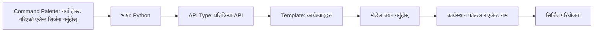
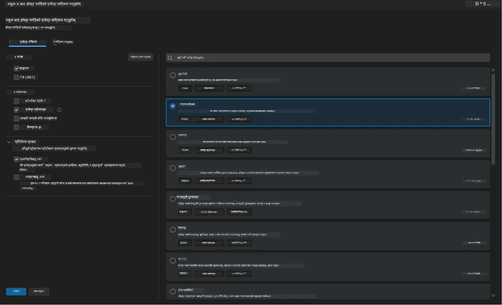
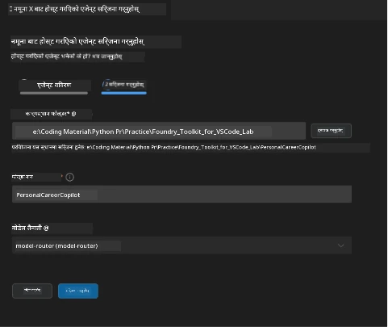

# मोड्युल २ - बहु-एजेन्ट प्रोजेक्टको लागि स्क्याफोल्ड बनाउनुस्

⏱️ ~५ मिनेट

यस मोड्युलमा, तपाईं [Foundry Toolkit for VS Code](https://aka.ms/foundrytk) प्रयोग गरेर **बहु-एजेन्ट प्रोजेक्टको स्क्याफोल्ड बनाउनुहुन्छ**। विजार्डले `agent.yaml`, `main.py`, `Dockerfile`, `requirements.txt`, `.env`, र VS Code डिबग कन्फिगरेसन उत्पन्न गर्छ - त्यसैले तपाईं मोड्युल 3 मा ४-एजेन्ट वर्कफ्लो जडान गर्नमा ध्यान केन्द्रित गर्न सक्नुहुन्छ।

> **मुख्य अवधारणा:** स्क्याफोल्ड एउटा कार्यरत स्टब हो जसमा एउटा एजेन्ट हुन्छ। तपाईं प्लेसहोल्डर लॉजिकलाई मोड्युल 3 मा `WorkflowBuilder` ग्राफले प्रतिस्थापन गर्नुहुन्छ। तपाईंले ब्वाइलरप्लेट शून्यबाट लेख्नु पर्दैन।

> **सन्दर्भ कार्यान्वयन:** [`PersonalCareerCopilot/`](../../../../../workshop/lab02-multi-agent/PersonalCareerCopilot) एउटा पूर्ण कार्यरत उदाहरण हो। तपाईंको कामसँग तुलना गर्न यो प्रयोग गर्नुहोस्।

### स्क्याफोल्ड विजार्ड प्रवाह


```mermaid
flowchart LR
    A[Command Palette: नयाँ होस्ट गरिएको एजेन्ट सिर्जना गर्नुहोस्] --> B[भाषा: Python]
    B --> C[API Type: प्रतिक्रिया API]
    C --> D[Template: कार्यप्रवाहहरू]
    D --> E[मोडेल चयन गर्नुहोस्]
    E --> F[कार्यस्थान फोल्डर र एजेन्ट नाम]
    F --> G[सिर्जित परियोजना]
```

---

## चरण १: Create Hosted Agent विजार्ड खोल्नुहोस्

१. `Ctrl+Shift+P` थिचेर **Command Palette** खोल्नुहोस्।
२. टाइप गर्नुहोस्: **Foundry Toolkit: Create a New Hosted Agent** र चयन गर्नुहोस्।
३. विजार्ड **Agent Details** ट्याबमा खुल्छ।

> **वैकल्पिक:** Activity Bar मा रहेको **Foundry Toolkit** आइकनमा क्लिक गर्नुहोस् → **Hosted Agents** को छेउमा रहेको **+** आइकनमा क्लिक गर्नुहोस् → **Create New Hosted Agent**।

---

## चरण २: सेटिङहरू छनौट गर्नुहोस्



१. बायाँ नेभिगेसन/विकल्प सेक्सनमा निम्न छनौट गर्नुहोस्:

| मेनु | चयन | टिप्पणीहरू |
|--------|-----------|-------|
| **Language** | Python | C# (.NET) पनि समर्थित छ |
| **Framework** | Agent Framework | `Agent`, `AgentExecutor`, `WorkflowBuilder` प्रदान गर्छ |
| **API type** | Response API | `POST /responses` - प्लेटफर्म-प्रबन्धित इतिहास, स्ट्रिमिंग समर्थन |
| **Template** | **Workflows** | अनुरोधहरूलाई श्रृंखलाबद्ध रूपमा धेरै एजेन्टमार्फत प्रक्रिया गर्छ |

२. चयन गरेपछि, **Next** मा क्लिक गर्नुहोस्



३. अर्को विन्डोमा निम्न छनौट गर्नुहोस्:

| मेनु | चयन | टिप्पणीहरू |
|--------|-----------|-------|
| **Workspace folder** | लक्षित फोल्डर ब्राउज गर्नुहोस् | जस्तै यस रिपोमा `workshop/lab02-multi-agent/` |
| **Agent name** | `PersonalCareerCopilot` | यो प्रोजेक्ट डाइरेक्टरी नाम हुनेछ |
| **Model Deployment** | तपाईँले परिनियोजित मोडेल चयन गर्नुहोस् | जस्तै Lab 01 बाट `gpt-4.1-mini` |

४. प्रोजेक्ट स्क्याफोल्ड गर्न **Create** मा क्लिक गर्नुहोस्। VS Code ले फाइलहरू उत्पन्न गर्छ र फोल्डर खोल्छ।

> **सुझाव:** [`gpt-4.1-mini`](https://learn.microsoft.com/azure/foundry/foundry-models/concepts/models-sold-directly-by-azure#gpt-41-series) बहु-एजेन्ट विकासका लागि गति र गुणस्तर दुबै सन्तुलित गर्छ।

---

## चरण ३: उत्पन्न गरिएको प्रोजेक्ट निरीक्षण गर्नुहोस्

स्क्याफोल्ड पूरा भएपछि, Explorer (`Ctrl+Shift+E`) मा यी फाइलहरू देखिन्छन् कि भनेर जाँच गर्नुहोस्:

```
📂 <your-agent-name>/
├── .azdignore          ← Files excluded from Azure Developer CLI deployments
├── .dockerignore       ← Files excluded from Docker builds
├── .env                ← Environment variables (placeholders - fill in Module 3)
├── .vscode/
│   ├── launch.json     ← Debug config (F5 → run + Agent Inspector)
│   └── tasks.json      ← VS Code task definitions
├── agent.yaml          ← Agent definition (kind: hosted, protocol: responses)
├── Dockerfile          ← Container config for deployment
├── main.py             ← Stub agent entry point (replace with WorkflowBuilder in Module 3)
└── requirements.txt    ← Python dependencies
```

> **महत्त्वपूर्ण:** यो स्क्याफोल्ड गरिएको फोल्डर सिधै VS Code मा खोल्नुहोस् ताकि `.vscode/launch.json` र `tasks.json` ले F5 डिबगिङको लागि ठीकसँग काम गरोस्।

### प्रमुख फाइलहरू व्याख्या

| फाइल | उद्देश्य |
|------|---------|
| `agent.yaml` | `kind: hosted` घोषणा गर्छ, env var म्याप गर्छ, `/responses` प्रोटोकल निर्धारण गर्छ |
| `main.py` | स्टब: एउटा `FoundryChatClient` → `Agent` → `ResponsesHostServer`। तपाईं यो मोड्युल 3 मा ४ एजेन्ट + `WorkflowBuilder` ले प्रतिस्थापन गर्नुहुन्छ |
| `Dockerfile` | `python:3.12-slim`, `requirements.txt` स्थापना गर्छ, पोर्ट ८०८८ खोल्छ, `python main.py` चलाउँछ |
| `requirements.txt` | `agent-framework-foundry`, `agent-framework-foundry-hosting`, `mcp<2,>=1.24.0`, `debugpy` |

> **सन्दर्भ:** सम्पूर्ण उत्पन्न सामग्रीको लागि [`PersonalCareerCopilot/agent.yaml`](../../../../../workshop/lab02-multi-agent/PersonalCareerCopilot/agent.yaml) र [`PersonalCareerCopilot/requirements.txt`](../../../../../workshop/lab02-multi-agent/PersonalCareerCopilot/requirements.txt) हेर्नुहोस्।

---

### ✅ जाँच बिन्दु

- [ ] स्क्याफोल्ड विजार्ड पूरा भयो - नयाँ प्रोजेक्ट फोल्डर Explorer मा देखिन्छ
- [ ] सबै अपेक्षित फाइलहरू छन्: `agent.yaml`, `main.py`, `Dockerfile`, `requirements.txt`, `.env`
- [ ] `agent.yaml` मा `kind: hosted` र `protocol: responses` देखिन्छ
- [ ] `main.py` ले `Agent`, `FoundryChatClient`, `ResponsesHostServer` इम्पोर्ट गर्छ
- [ ] स्क्याफोल्ड गरिएको फोल्डर VS Code वर्कस्पेस रूटको रूपमा खुला छ
- [ ] तपाईँ बुझ्नुहुन्छ `main.py` स्टब हो - `WorkflowBuilder` मोड्युल 3 मा थपिनेछ

---

**अघिल्लो:** [०१ - बहु-एजेन्ट आर्किटेक्चर बुझ्नुहोस्](01-understand-multi-agent.md) · **अर्को:** [०३ - एजेन्ट र वातावरण कन्फिगर गर्नुहोस् →](03-configure-agents.md)

---

<!-- CO-OP TRANSLATOR DISCLAIMER START -->
**अस्वीकरण**:
यो दस्तावेज़ AI अनुवाद सेवा [Co-op Translator](https://github.com/Azure/co-op-translator) प्रयोग गरेर अनुवाद गरिएको हो। हामी सही हुन प्रयास गर्छौं, तर कृपया जानकार हुनुस् कि स्वचालित अनुवादमा त्रुटिहरू वा अशुद्धताहरू हुन सक्छन्। मूल दस्तावेज़ यसको मूल भाषामा आधिकारिक स्रोत मानिनुपर्छ। महत्वपूर्ण जानकारीका लागि व्यावसायिक मानव अनुवाद सिफारिस गरिन्छ। यस अनुवादको प्रयोगबाट उत्पन्न कुनै पनि गलत बुझाइ वा त्रुटिको लागि हामी जिम्मेवार छैनौं।
<!-- CO-OP TRANSLATOR DISCLAIMER END -->