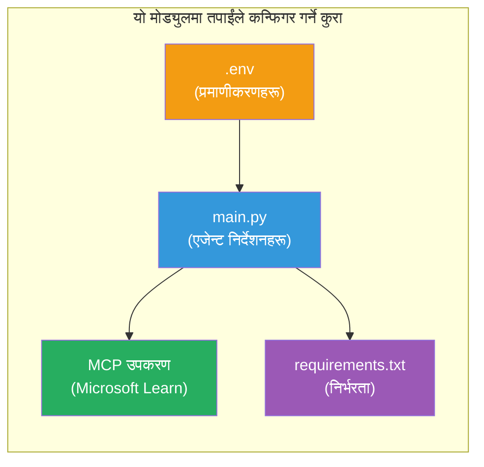

# Module 3 - एजेन्टहरू, MCP उपकरण र वातावरण कन्फिगर गर्नुहोस्

यस मोड्युलमा, तपाईंले तयार पारिएको बहु-एजेन्ट परियोजनालाई अनुकूलन गर्नुहुन्छ। तपाईंले सबै चार एजेन्टहरूका लागि निर्देशनहरू लेख्नुहुनेछ, Microsoft Learn का लागि MCP उपकरण सेट अप गर्नुहुनेछ, वातावरण भेरिएबलहरू कन्फिगर गर्नुहुनेछ, र निर्भरता स्थापना गर्नुहुनेछ।


> **सन्दर्भ:** सम्पूर्ण कार्यशील कोड [`PersonalCareerCopilot/main.py`](../../../../../workshop/lab02-multi-agent/PersonalCareerCopilot/main.py) मा छ। तपाईंले आफ्नो आफ्नै परियोजना बनाउँदा यसलाई सन्दर्भको रूपमा प्रयोग गर्नुहोस्।

---

## चरण १: वातावरण भेरिएबलहरू कन्फिगर गर्नुहोस्

१. तपाईंको परियोजनाको रुटमा रहेको **`.env`** फाइल खोल्नुहोस्।  
२. Foundry परियोजनाका विवरण भर्नुहोस्:

   ```env
   PROJECT_ENDPOINT=https://<your-account>.services.ai.azure.com/api/projects/<your-project>
   MODEL_DEPLOYMENT_NAME=gpt-4.1-mini
   ```

३. फाइल सेभ गर्नुहोस्।

### यी मानहरू कहाँ पाउने

| मान | कसरी पाउने |
|-------|---------------|
| **परियोजना इन्डपोइन्ट** | Microsoft Foundry साइडबार → तपाईंको परियोजना क्लिक गर्नुहोस् → विवरण दृश्यमा इन्डपोइन्ट URL |
| **मोडेल तैनाथी नाम** | Foundry साइडबार → परियोजना विस्तार गर्नुहोस् → **Models + endpoints** → परिनियोजित मोडेलको छेउको नाम |

> **सुरक्षा:** कहिल्यै `.env` लाई भर्सन कन्ट्रोलमा कमिट नगर्नुहोस्। यदि पहिलेबाट नभए `.gitignore` मा थप्नुहोस्।

### वातावरण भेरिएबल नक्सांकन

बहु-एजेन्ट `main.py` ले दुबै मानक र कार्यशाला-विशिष्ट env भेरिएबल नामहरू पढ्छ:

```python
PROJECT_ENDPOINT = os.getenv("AZURE_AI_PROJECT_ENDPOINT") or os.getenv("PROJECT_ENDPOINT")
MODEL_DEPLOYMENT_NAME = os.getenv(
    "AZURE_AI_MODEL_DEPLOYMENT_NAME",
    os.getenv("MODEL_DEPLOYMENT_NAME", "gpt-4.1-mini"),
)
MICROSOFT_LEARN_MCP_ENDPOINT = os.getenv(
    "MICROSOFT_LEARN_MCP_ENDPOINT", "https://learn.microsoft.com/api/mcp"
)
```

MCP इन्डपोइन्टको व्यवहार्य पूर्वनिर्धारित मान छ - तपाईंले यसलाई `.env` मा सेट गर्नु आवश्यक छैन जबसम्म तपाईं यसलाई ओभरराइड गर्न चाहनुहुन्न।

---

## चरण २: एजेन्ट निर्देशनहरू लेख्नुहोस्

यो सबैभन्दा महत्त्वपूर्ण चरण हो। प्रत्येक एजेन्टले आफ्नो भूमिका, आउटपुट फर्म्याट, र नियमसँग सावधानीपूर्वक तयार गरिएका निर्देशनहरू चाहिन्छ। `main.py` खोल्नुहोस् र निर्देशन स्थिरांकहरू सिर्जना (वा संशोधन) गर्नुहोस्।

### २.१ रिजुमे पार्सर एजेन्ट

```python
RESUME_PARSER_INSTRUCTIONS = """\
You are the Resume Parser.
Extract resume text into a compact, structured profile for downstream matching.

Output exactly these sections:
1) Candidate Profile
2) Technical Skills (grouped categories)
3) Soft Skills
4) Certifications & Awards
5) Domain Experience
6) Notable Achievements

Rules:
- Use only explicit or strongly implied evidence.
- Do not invent skills, titles, or experience.
- Keep concise bullets; no long paragraphs.
- If input is not a resume, return a short warning and request resume text.
"""
```

**किन यी खण्डहरू?** MatchingAgent लाई स्कोर गर्न संरचित डाटा चाहिन्छ। सुसंगत खण्डहरूले एजेन्टहरूबीच ह्याण्डअफ विश्वसनीय बनाउँछ।

### २.२ जागिरको विवरण एजेन्ट

```python
JOB_DESCRIPTION_INSTRUCTIONS = """\
You are the Job Description Analyst.
Extract a structured requirement profile from a JD.

Output exactly these sections:
1) Role Overview
2) Required Skills
3) Preferred Skills
4) Experience Required
5) Certifications Required
6) Education
7) Domain / Industry
8) Key Responsibilities

Rules:
- Keep required vs preferred clearly separated.
- Only use what the JD states; do not invent hidden requirements.
- Flag vague requirements briefly.
- If input is not a JD, return a short warning and request JD text.
"""
```

**किन आवश्यक र प्राथमिक छुट्याउनु?** MatchingAgent ले फरक तौल प्रयोग गर्दछ (आवश्यक सीप = ४० अंक, प्राथमिक सीप = १० अंक)।

### २.३ मिलान एजेन्ट

```python
MATCHING_AGENT_INSTRUCTIONS = """\
You are the Matching Agent.
Compare parsed resume output vs JD output and produce an evidence-based fit report.

Scoring (100 total):
- Required Skills 40
- Experience 25
- Certifications 15
- Preferred Skills 10
- Domain Alignment 10

Output exactly these sections:
1) Fit Score (with breakdown math)
2) Matched Skills
3) Missing Skills
4) Partially Matched
5) Experience Alignment
6) Certification Gaps
7) Overall Assessment

Rules:
- Be objective and evidence-only.
- Keep partial vs missing separate.
- Keep Missing Skills precise; it feeds roadmap planning.
"""
```

**किन स्पष्ट स्कोरिङ?** पुनरुत्पादनीय स्कोरिङले रनहरू तुलना गर्न र समस्या समाधान गर्न सक्षम बनाउँछ। १०० अङ्कको स्केल अन्तिम प्रयोगकर्तालाई बुझ्न सजिलो छ।

### २.४ अन्तर विश्लेषक एजेन्ट

```python
GAP_ANALYZER_INSTRUCTIONS = """\
You are the Gap Analyzer and Roadmap Planner.
Create a practical upskilling plan from the matching report.

Microsoft Learn MCP usage (required):
- For EVERY High and Medium priority gap, call tool `search_microsoft_learn_for_plan`.
- Use returned Learn links in Suggested Resources.
- Prefer Microsoft Learn for free resources.

CRITICAL: You MUST produce a SEPARATE detailed gap card for EVERY skill listed in
the Missing Skills and Certification Gaps sections of the matching report. Do NOT
skip or combine gaps. Do NOT summarize multiple gaps into one card.

Output format:
1) Personalized Learning Roadmap for [Role Title]
2) One DETAILED card per gap (produce ALL cards, not just the first):
   - Skill
   - Priority (High/Medium/Low)
   - Current Level
   - Target Level
   - Suggested Resources (include Learn URL from tool results)
   - Estimated Time
   - Quick Win Project
3) Recommended Learning Order (numbered list)
4) Timeline Summary (week-by-week)
5) Motivational Note

Rules:
- Produce every gap card before writing the summary sections.
- Keep it specific, realistic, and actionable.
- Tailor to candidate's existing stack.
- If fit >= 80, focus on polish/interview readiness.
- If fit < 40, be honest and provide a staged path.
"""
```

**किन "CRITICAL" जोड?** सबै अन्तर कार्डहरू उत्पादन गर्न explicit निर्देशनहरू नहुँदा, मोडेल सामान्यतया १-२ कार्ड मात्र सिर्जना गरी बाँकीलाई सारांश गर्छ। "CRITICAL" ब्लकले यो कटौती रोक्छ।

---

## चरण ३: MCP उपकरण परिभाषित गर्नुहोस्

GapAnalyzer ले [Microsoft Learn MCP सर्भर](https://learn.microsoft.com/azure/foundry/agents/how-to/tools/model-context-protocol) लाई कल गर्ने उपकरण प्रयोग गर्दछ। यसलाई `main.py` मा थप्नुहोस्:

```python
import json
from agent_framework import tool
from mcp.client.session import ClientSession
from mcp.client.streamable_http import streamable_http_client

@tool
async def search_microsoft_learn_for_plan(
    skill: str, role: str = "", max_results: int = 5
) -> str:
    """Search Microsoft Learn MCP and return curated official links for roadmap planning."""
    query = " ".join(part for part in [skill, role, "learning path module"] if part).strip()
    query = query or "job skills learning path"

    try:
        async with streamable_http_client(MICROSOFT_LEARN_MCP_ENDPOINT) as (
            read_stream, write_stream, _,
        ):
            async with ClientSession(read_stream, write_stream) as session:
                await session.initialize()
                result = await session.call_tool(
                    "microsoft_docs_search", {"query": query}
                )

        if not result.content:
            return (
                "No results returned from Microsoft Learn MCP. "
                "Fallback: https://learn.microsoft.com/training/support/catalog-api"
            )

        payload_text = getattr(result.content[0], "text", "")
        data = json.loads(payload_text) if payload_text else {}
        items = data.get("results", [])[:max(1, min(max_results, 10))]

        if not items:
            return f"No direct Microsoft Learn results found for '{skill}'."

        lines = [f"Microsoft Learn resources for '{skill}':"]
        for i, item in enumerate(items, start=1):
            title = item.get("title") or item.get("url") or "Microsoft Learn Resource"
            url = item.get("url") or item.get("link") or ""
            lines.append(f"{i}. {title} - {url}".rstrip(" -"))
        return "\n".join(lines)
    except Exception as ex:
        return (
            f"Microsoft Learn MCP lookup unavailable. Reason: {ex}. "
            "Fallbacks: https://learn.microsoft.com/api/mcp"
        )
```

### उपकरण कसरी काम गर्छ

| चरण | के हुन्छ |
|------|-------------|
| १ | GapAnalyzer ले कुनै सीपका लागि स्रोतहरू चाहिन्छ भनेर निर्णय गर्छ (जस्तै, "Kubernetes") |
| २ | फ्रेमवर्कले `search_microsoft_learn_for_plan(skill="Kubernetes")` कल गर्छ |
| ३ | फङ्सनले [Streamable HTTP](https://learn.microsoft.com/agent-framework/agents/tools/hosted-mcp-tools) कनेक्सन खोल्छ `https://learn.microsoft.com/api/mcp` मा |
| ४ | [MCP सर्भर](https://learn.microsoft.com/azure/foundry/agents/how-to/tools/model-context-protocol) मा `microsoft_docs_search` कल गर्छ |
| ५ | MCP सर्भरले खोज परिणामहरू (शीर्षक + URL) फर्काउँछ |
| ६ | फङ्सनले परिणामहरूलाई क्रमानुसार सूची बनाएर फर्म्याट गर्छ |
| ७ | GapAnalyzer ले URL हरूलाई अन्तर कार्डमा समावेश गर्छ |

### MCP निर्भरताहरू

MCP क्लाइंट पुस्तकालयहरू [`agent-framework-core`](https://learn.microsoft.com/agent-framework/overview/) मार्फत ट्रान्जेटिभली समावेश छन्। तपाईंले `requirements.txt` मा अलग्गै थप्न आवश्यक छैन। इम्पोर्ट त्रुटि आएमा पुष्टि गर्नुहोस्:

```powershell
pip list | Select-String "mcp"
```

अपेक्षित: `mcp` प्याकेज इन्स्टल गरिएको छ (संस्करण १.x वा पछि)।

---

## चरण ४: एजेन्टहरू र workflow तार जोड्नुहोस्

### ४.१ सन्दर्भ व्यवस्थापकहरूसँग एजेन्टहरू सिर्जना गर्नुहोस्

```python
from contextlib import asynccontextmanager

@asynccontextmanager
async def create_agents():
    async with (
        get_credential() as credential,
        AzureAIAgentClient(
            project_endpoint=PROJECT_ENDPOINT,
            model_deployment_name=MODEL_DEPLOYMENT_NAME,
            credential=credential,
        ).as_agent(
            name="ResumeParser",
            instructions=RESUME_PARSER_INSTRUCTIONS,
        ) as resume_parser,
        AzureAIAgentClient(
            project_endpoint=PROJECT_ENDPOINT,
            model_deployment_name=MODEL_DEPLOYMENT_NAME,
            credential=credential,
        ).as_agent(
            name="JobDescriptionAgent",
            instructions=JOB_DESCRIPTION_INSTRUCTIONS,
        ) as jd_agent,
        AzureAIAgentClient(
            project_endpoint=PROJECT_ENDPOINT,
            model_deployment_name=MODEL_DEPLOYMENT_NAME,
            credential=credential,
        ).as_agent(
            name="MatchingAgent",
            instructions=MATCHING_AGENT_INSTRUCTIONS,
        ) as matching_agent,
        AzureAIAgentClient(
            project_endpoint=PROJECT_ENDPOINT,
            model_deployment_name=MODEL_DEPLOYMENT_NAME,
            credential=credential,
        ).as_agent(
            name="GapAnalyzer",
            instructions=GAP_ANALYZER_INSTRUCTIONS,
            tools=[search_microsoft_learn_for_plan],
        ) as gap_analyzer,
    ):
        yield resume_parser, jd_agent, matching_agent, gap_analyzer
```

**मुख्य बुँदाहरू:**
- प्रत्येक एजेन्टसँग आफ्नो `AzureAIAgentClient` उदाहरण छ
- केवल GapAnalyzer ले `tools=[search_microsoft_learn_for_plan]` पाउँछ
- `get_credential()` ले Azure मा [`ManagedIdentityCredential`](https://learn.microsoft.com/python/api/overview/azure/identity-readme#managed-identity-support), लोकलमा [`DefaultAzureCredential`](https://learn.microsoft.com/azure/developer/python/sdk/authentication/credential-chains#defaultazurecredential-overview) फर्काउँछ

### ४.२ workflow ग्राफ बनाउनुहोस्

```python
def create_workflow(resume_parser, jd_agent, matching_agent, gap_analyzer):
    workflow = (
        WorkflowBuilder(
            name="ResumeJobFitEvaluator",
            start_executor=resume_parser,
            output_executors=[gap_analyzer],
        )
        .add_edge(resume_parser, jd_agent)
        .add_edge(resume_parser, matching_agent)
        .add_edge(jd_agent, matching_agent)
        .add_edge(matching_agent, gap_analyzer)
        .build()
    )
    return workflow.as_agent()
```

> `.as_agent()` ढाँचालाई बुझ्न [एजेन्टको रूपमा workflows](https://learn.microsoft.com/agent-framework/workflows/as-agents) हेर्नुहोस्।

### ४.३ सर्भर सुरु गर्नुहोस्

```python
async def main() -> None:
    validate_configuration()
    async with create_agents() as (resume_parser, jd_agent, matching_agent, gap_analyzer):
        agent = create_workflow(resume_parser, jd_agent, matching_agent, gap_analyzer)
        from azure.ai.agentserver.agentframework import from_agent_framework
        await from_agent_framework(agent).run_async()

if __name__ == "__main__":
    asyncio.run(main())
```

---

## चरण ५: भर्चुअल वातावरण सिर्जना र सक्रिय गर्नुहोस्

### ५.१ वातावरण सिर्जना गर्नुहोस्

```powershell
cd workshop\lab02-multi-agent\PersonalCareerCopilot
python -m venv .venv
```

### ५.२ सक्रिय गर्नुहोस्

**PowerShell (Windows):**
```powershell
.\.venv\Scripts\Activate.ps1
```

**macOS/Linux:**
```bash
source .venv/bin/activate
```

### ५.३ निर्भरता स्थापना गर्नुहोस्

```powershell
pip install -r requirements.txt
```

> **नोट:** `requirements.txt` मा रहेको `agent-dev-cli --pre` लाइनले नवीनतम प्रिभ्यू संस्करण इन्स्टल गर्छ। यो `agent-framework-core==1.0.0rc3` सँग मिल्दोजुल्दो हुन आवश्यक छ।

### ५.४ स्थापना पुष्टि गर्नुहोस्

```powershell
pip list | Select-String "agent-framework|agentserver|agent-dev"
```

अपेक्षित आउटपुट:  
```
agent-dev-cli                  0.0.1b260316
agent-framework-azure-ai       1.0.0rc3
agent-framework-core            1.0.0rc3
azure-ai-agentserver-agentframework 1.0.0b16
azure-ai-agentserver-core      1.0.0b16
```

> **यदि `agent-dev-cli` ले पुरानो संस्करण देखाउँछ** (जस्तै, `0.0.1b260119`), Agent Inspector ले 403/404 त्रुटिहरू देखाउनेछ। अपडेट गर्नुहोस्: `pip install agent-dev-cli --pre --upgrade`

---

## चरण ६: प्रमाणीकरण पुष्टि गर्नुहोस्

Lab 01 बाटै सोही प्रमाणीकरण जाँचना चलाउनुहोस्:

```powershell
az account show --query "{name:name, id:id}" --output table
```

यदि असफल भयो भने, [`az login`](https://learn.microsoft.com/cli/azure/authenticate-azure-cli-interactively) चलाउनुहोस्।

बहु-एजेन्ट workflows मा सबै चार एजेन्टहरूले एउटै क्रेडेन्सियल साझा गर्छन्। यदि एकको लागि प्रमाणीकरण काम गर्छ भने सबैका लागि काम गर्छ।

---

### चेकप्वाइंट

- [ ] `.env` मा वैध `PROJECT_ENDPOINT` र `MODEL_DEPLOYMENT_NAME` मानहरू छन्  
- [ ] सबै ४ एजेन्ट निर्देशन स्थिरांकहरू `main.py` मा परिभाषित छन् (ResumeParser, JD Agent, MatchingAgent, GapAnalyzer)  
- [ ] `search_microsoft_learn_for_plan` MCP उपकरण GapAnalyzer सँग परिभाषित र दर्ता गरिएको छ  
- [ ] `create_agents()` ले सबै ४ एजेन्टहरूलाई व्यक्तिगत `AzureAIAgentClient` उदाहरणहरू सहित सिर्जना गर्छ  
- [ ] `create_workflow()` ले `WorkflowBuilder` प्रयोग गरी सही ग्राफ बनाउँछ  
- [ ] भर्चुअल वातावरण सिर्जना र सक्रिय गरिएको छ (`(.venv)` देखिने)  
- [ ] `pip install -r requirements.txt` त्रुटिविहीन पूरा भयो  
- [ ] `pip list` ले सबै अपेक्षित प्याकेजहरू सही संस्करणमा देखाउँछ (rc3 / b16)  
- [ ] `az account show` ले तपाईंको सदस्यता जानकारी फर्काउँछ  

---

**अघिल्लो:** [02 - Scaffold Multi-Agent Project](02-scaffold-multi-agent.md) · **अर्को:** [04 - Orchestration Patterns →](04-orchestration-patterns.md)

---

<!-- CO-OP TRANSLATOR DISCLAIMER START -->
**अस्वीकरण**:  
यस दस्तावेजलाई AI अनुवाद सेवा [Co-op Translator](https://github.com/Azure/co-op-translator) प्रयोग गरी अनुवाद गरिएको हो। हामी शुद्धताका लागि प्रयास गर्छौं भने पनि, कृपया जानकार हुनुहोस् कि स्वचालित अनुवादमा त्रुटिहरू वा अशुद्धताहरू हुन सक्छन्। मूल दस्तावेज यसको स्थानीय भाषामा आधिकारिक स्रोत मानिनुपर्छ। महत्वपूर्ण जानकारीका लागि, पेशेवर मानवीय अनुवाद सिफारिस गरिन्छ। यस अनुवादको प्रयोगले उत्पन्न कुनै पनि गलतफहमी वा गलत व्याख्याका लागि हामी जिम्मेवार छैनौं।
<!-- CO-OP TRANSLATOR DISCLAIMER END -->