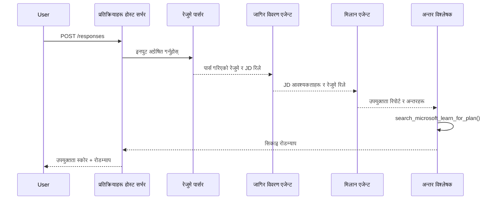

# मोड्युल ३ - निर्देशनहरू कन्फिगर गर्नुहोस्, वातावरण र निर्भरता स्थापना गर्नुहोस्

⏱️ ~१५ मिनेट

यस मोड्युलमा, तपाईंले स्क्याफोल्ड गरिएको स्टबलाई **तपाईंको** बहु-एजेन्ट कार्यप्रवाहमा रूपान्तरण गर्नुहुन्छ - वातावरण भेरिएबलहरू सेट गरेर, एजेन्ट निर्देशनहरू लेखेर, MCP उपकरण थपेर, कार्यप्रवाह ग्राफ तारेर, र निर्भरता स्थापना गरेर।

> **सन्दर्भ:** पूर्ण काम गर्ने कोड [`PersonalCareerCopilot/main.py`](../../../../../workshop/lab02-multi-agent/PersonalCareerCopilot/main.py) मा छ। आफ्नै कार्यप्रवाह ग्राफ र प्रॉम्प्ट ब्लकहरू निर्माण गर्दा यसलाई सन्दर्भको रूपमा प्रयोग गर्नुहोस्।

---

## चार एजेन्टहरूले कसरी मिलेर काम गर्छन्


```mermaid
sequenceDiagram
    participant User
    participant Server as प्रतिक्रियाहरू होस्ट सर्भर
    participant RP as रेजुमे पार्सर
    participant JD as जागिर विवरण एजेन्ट
    participant MA as मिलान एजेन्ट
    participant GA as अन्तर विश्लेषक

    User->>Server: POST /responses
    Server->>RP: इनपुट अग्रेषित गर्नुहोस्
    RP-->>JD: पार्स गरिएको रेजुमे र JD रिले
    JD-->>MA: JD आवश्यकताहरू र रेजुमे रिले
    MA-->>GA: उपयुक्तता रिपोर्ट र अन्तरहरू
    GA->>GA: search_microsoft_learn_for_plan()
    GA-->>Server: सिकाइ रोडम्याप
    Server-->>User: उपयुक्तता स्कोर + रोडम्याप
```

---

## चरण १: वातावरण भेरिएबलहरू कन्फिगर गर्नुहोस्

१. आफ्नो प्रोजेक्ट रुटमा रहेको **`.env`** फाइल खोल्नुहोस् (स्क्याफोल्ड विजार्डले सिर्जना गरेको)।
२. प्लेसहोल्डरहरूलाई तपाईंको वास्तविक मानहरू (Lab 01 बाट) ले प्रतिस्थापन गर्नुहोस्।

<details open>
<summary><strong>🅰️ बाटो A - Foundry सदस्यता</strong></summary>

```env
FOUNDRY_PROJECT_ENDPOINT=https://<your-account>.services.ai.azure.com/api/projects/<your-project>
AZURE_AI_MODEL_DEPLOYMENT_NAME=gpt-4.1-mini
```

> **मूल्यहरू कहाँ पाउने:** हेर्नुहोस् [Lab 01, Module 1](../../lab01-single-agent/docs/01-setup.md#deploy-a-model--assign-rbac)।

</details>

<details open>
<summary><strong>🅱️ बाटो B - Foundry Local</strong></summary>

```env
FOUNDRY_PROJECT_ENDPOINT=http://localhost:5273/v1
AZURE_AI_MODEL_DEPLOYMENT_NAME=phi-4-mini
```

> सबै अनुमान तपाईंको मेसिनमा चल्छ - कुनै डाटा तपाईंको उपकरण छोड्दैन। सटीक मोडेल उपनाम पुष्टि गर्न `foundry model list` चलाउनुहोस्। एक मात्र बाहिरी अनुरोध MCP उपकरण कल हो `https://learn.microsoft.com/api/mcp`।

> **मूल्यहरू कहाँ पाउने:** हेर्नुहोस् [Lab 01, Module 1 - local path](../../lab01-single-agent/docs/01-setup.md#step-2-set-up-based-on-your-access)।

</details>

> **सुरक्षा:** `.env` लाई कहिल्यै संस्करण नियन्त्रणमा कमिट नगर्नुहोस्। यो पहिले नै `.gitignore` मा हुनुपर्छ।

---

## चरण २: एजेन्ट निर्देशनहरू लेख्नुहोस्

निर्देशनहरूले प्रत्येक एजेन्टको भूमिका, आउटपुट प्रारूप, र नियमहरू परिभाषित गर्छन्। `main.py` खोल्नुहोस् र चार निर्देशन स्थिराङ्कहरू परिभाषित (वा प्रतिस्थापन) गर्नुहोस् - पूर्ण स्ट्रिंगहरू [`PersonalCareerCopilot/main.py`](../../../../../workshop/lab02-multi-agent/PersonalCareerCopilot/main.py) मा छन्।

### २.१ `RESUME_PARSER_INSTRUCTIONS`
रिजुमेलाई संरचित उम्मेदवार प्रोफाइलमा पार्स गर्छ **र** जागिर विवरणलाई ठ्याक्कै `[JOB DESCRIPTION PASS-THROUGH]` मा कपी गर्छ। दुवै लेबल गरिएका खण्डहरू आउटपुटमा देखिनु पर्छ।

> **पास-थ्रुको कारण के हो?** `context_mode="last_agent"` सँग, ResumeParser नै मात्र एजेन्ट हो जसले मूल प्रयोगकर्ता सन्देश देख्छ। यदि यसले JD अघि कपी गरेन भने, तलका एजेन्टहरूले कहिल्यै देख्दैनन्।

### २.२ `JOB_DESCRIPTION_INSTRUCTIONS`
ResumeParser को आउटपुटबाट `[PARSED RESUME]` र `[JOB DESCRIPTION PASS-THROUGH]` पढ्छ। `[JD REQUIREMENTS]` (संरचित आवश्यकताहरू) र `[PARSED RESUME PASS-THROUGH]` (MatchingAgent का लागि शब्दशः रिजुमे कपी) आउटपुट गर्दछ।

### २.३ `MATCHING_AGENT_INSTRUCTIONS`
`[JD REQUIREMENTS]` र `[PARSED RESUME PASS-THROUGH]` पढ्छ। स्कोर्ड फिट रिपोर्ट (०–१००) निर्माण गर्छ जसमा गणितीय ब्याख्या, मिलेका सीपहरू, छुटेका सीपहरू, र अनुभव तालमेल समावेश हुन्छ।

### २.४ `GAP_ANALYZER_INSTRUCTIONS`
फिट रिपोर्ट पढ्छ। **हरेक** छुटेका सीपका लागि `search_microsoft_learn_for_plan` बोलाएर Microsoft Learn स्रोतहरू ल्याउँछ। प्रत्येक सीपका लागि एउटा विस्तृत ग्याप कार्ड र हप्ताभरि सिकाइ रोडम्याप उत्पादन गर्छ।

---

## चरण ३: MCP उपकरण थप्नुहोस्

GapAnalyzer ले [Microsoft Learn MCP सर्भर](https://learn.microsoft.com/azure/foundry/agents/how-to/tools/model-context-protocol) लाई कल गरेर प्रत्येक सीप ग्यापका लागि वास्तविक सिकाइ स्रोतहरू ल्याउँछ। पूर्ण `search_microsoft_learn_for_plan` फंक्शन [`PersonalCareerCopilot/main.py`](../../../../../workshop/lab02-multi-agent/PersonalCareerCopilot/main.py) मा छ।

एजेन्ट सिर्जना गर्दा GapAnalyzer मा उपकरण दर्ता गर्नुहोस्:

```python
gap_analyzer = Agent(
    client=client,
    instructions=GAP_ANALYZER_INSTRUCTIONS,
    name="GapAnalyzer",
    tools=[search_microsoft_learn_for_plan],
)
```

> पूर्ण `WorkflowBuilder` ग्राफ `FoundryChatClient`, `AgentExecutor`, र सबै `add_edge()` कलहरूसँग [`PersonalCareerCopilot/main.py`](../../../../../workshop/lab02-multi-agent/PersonalCareerCopilot/main.py) मा हेर्नुहोस्।

---

## चरण ४: भर्चुअल वातावरण सिर्जना र निर्भरता स्थापना गर्नुहोस्

> ⚠️ **यो चरण नछुटाउनुहोस्।** निर्भरता स्थापना नगरी F5 डिबगिङ असफल हुन्छ।

### ४.१ भर्चुअल वातावरण सिर्जना गर्नुहोस्

```powershell
python -m venv .venv
```

### ४.२ यसलाई सक्रिय गर्नुहोस्

| OS | कमाण्ड |
|----|---------|
| **Windows (PowerShell)** | `.\.venv\Scripts\Activate.ps1` |
| **Windows (CMD)** | `.venv\Scripts\activate.bat` |
| **macOS / Linux** | `source .venv/bin/activate` |

तपाईँको टर्मिनल प्रॉम्प्टमा `(.venv)` देखिनुपर्छ।

### ४.३ निर्भरता स्थापना गर्नुहोस्

```powershell
pip install -r requirements.txt
```

### ४.४ जाँच गर्नुहोस्

```powershell
pip list | Select-String "agent-framework|mcp|debugpy"
```

अपेक्षित: `agent-framework-foundry`, `agent-framework-foundry-hosting`, `mcp`, र `debugpy` सूचीकृत छन्।

---

## चरण ५: प्रमाणीकरण जाँच गर्नुहोस्

<details open>
<summary><strong>🅰️ बाटो A - Azure प्रमाणपत्र</strong></summary>

```powershell
az account show --query "{name:name, id:id}" --output table
```

यदि असफल भयो भने, [`az login`](https://learn.microsoft.com/cli/azure/authenticate-azure-cli-interactively) चलाउनुहोस्।

सबै चार एजेन्टहरू एक `FoundryChatClient` र एक `DefaultAzureCredential` साझेदारी गर्छन्। एकको लागि प्रमाणिकरण ठीक भएमा सबैका लागि हुन्छ।

</details>

<details open>
<summary><strong>🅱️ बाटो B - Foundry Local</strong></summary>

स्थानीय परीक्षणका लागि प्रमाणीकरण आवश्यक पर्दैन।

</details>

---

### ✅ जाँचको बिन्दु

> मोड्युल ०४ मा अगाडि बढ्नु अघि: **(१)** तपाईँको प्रॉम्प्टमा `(.venv)` देखिनुपर्छ र **(२)** `pip install -r requirements.txt` सफलतापूर्वक पूरा हुनुपर्छ।

- [ ] `.env` मा मान्य अन्त्यबिन्दु र मोडेल डिप्लोइमेन्ट नाम छ (प्लेसहोल्डर होइन)
- [ ] सबै ४ एजेन्ट निर्देशन स्थिराङ्कहरू `main.py` मा परिभाषित छन् (ResumeParser, JD Agent, MatchingAgent, GapAnalyzer)
- [ ] `search_microsoft_learn_for_plan` MCP उपकरण परिभाषित र GapAnalyzer मा दर्ता गरिएको छ
- [ ] `FoundryChatClient` + ४ `Agent` + ४ `AgentExecutor` वस्तुहरू `main()` मा सिर्जना गरिएको छ
- [ ] `WorkflowBuilder` ले सबै ३ `add_edge()` कलहरूसँग सही अनुक्रमिक ग्राफ निर्माण गर्छ
- [ ] भर्चुअल वातावरण सिर्जना र सक्रिय गरिएको छ (`(.venv)` प्रॉम्प्टमा देखिन्छ)
- [ ] `pip install -r requirements.txt` त्रुटिबिहीन पूरा भयो
- [ ] **बाटो A:** `az account show` सफल भयो वा VS Code खाताहरू आइकनले साइन-इन गरिएको खाता देखाउँछ

---

**अघिल्लो:** [०२ - बहु-एजेन्ट प्रोजेक्ट स्क्याफोल्ड गर्नुहोस्](02-scaffold-multi-agent.md) · **अर्को:** [०४ - व्यवस्थापन ढाँचाहरू →](04-orchestration-patterns.md)

---

<!-- CO-OP TRANSLATOR DISCLAIMER START -->
**अस्वीकरण**:
यो दस्तावेज़ AI अनुवाद सेवा [Co-op Translator](https://github.com/Azure/co-op-translator) प्रयोग गरेर अनुवाद गरिएको हो। हामी सही हुन प्रयास गर्छौं, तर कृपया जानकार हुनुस् कि स्वचालित अनुवादमा त्रुटिहरू वा अशुद्धताहरू हुन सक्छन्। मूल दस्तावेज़ यसको मूल भाषामा आधिकारिक स्रोत मानिनुपर्छ। महत्वपूर्ण जानकारीका लागि व्यावसायिक मानव अनुवाद सिफारिस गरिन्छ। यस अनुवादको प्रयोगबाट उत्पन्न कुनै पनि गलत बुझाइ वा त्रुटिको लागि हामी जिम्मेवार छैनौं।
<!-- CO-OP TRANSLATOR DISCLAIMER END -->