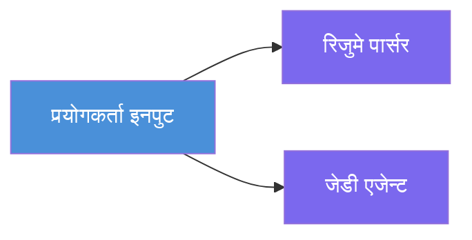
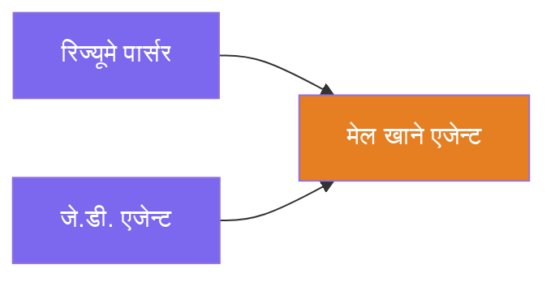
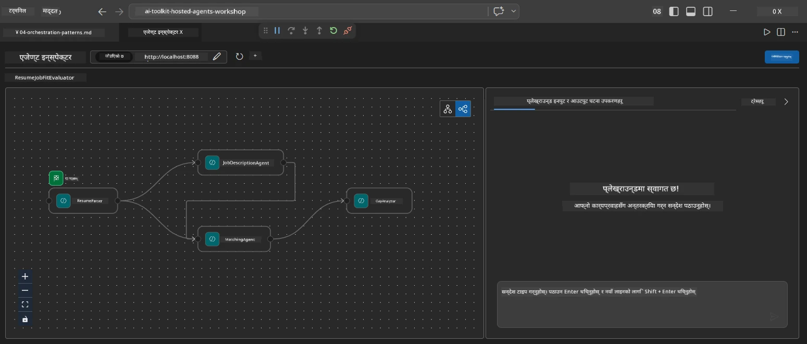
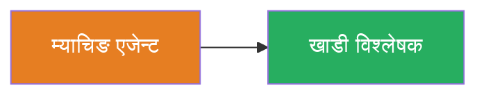
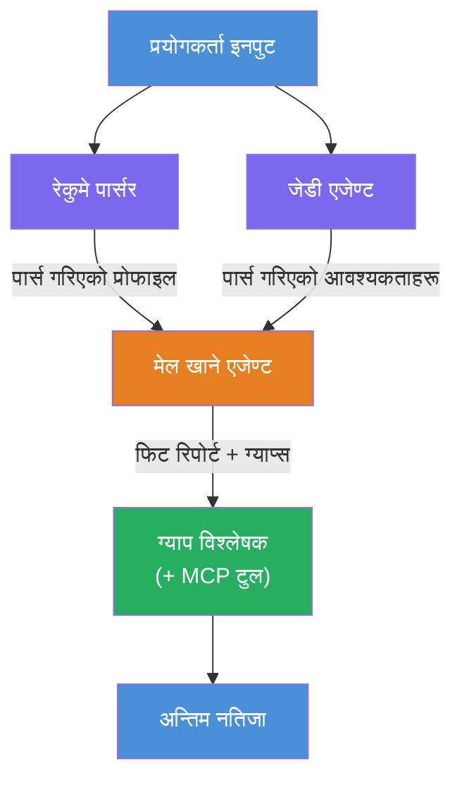
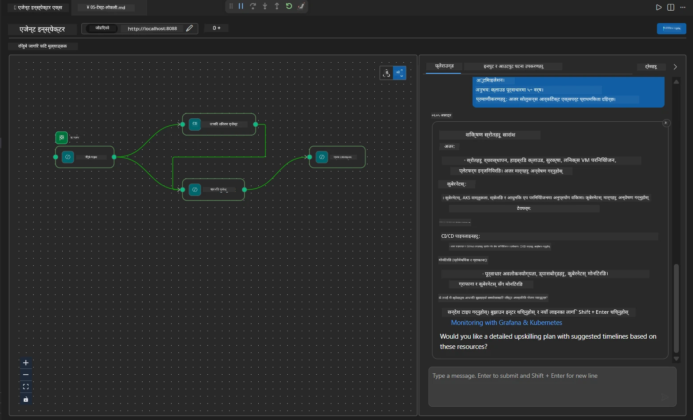

# Module 4 - समन्वय ढाँचा

यस मोड्युलमा, तपाईं रिजुमे जागिर फिट मूल्यांकनकर्ता मा प्रयोग गरिएका समन्वय ढाँचाहरू अन्वेषण गर्नुहुन्छ र workflow ग्राफलाई कसरी पढ्ने, परिमार्जन गर्ने, र विस्तार गर्ने सिक्नुहुन्छ। यी ढाँचाहरू बुझ्न डेटा फ्लो समस्याहरू डिबग गर्न र तपाईंको आफ्नै [बहु-एजेन्ट workflow](https://learn.microsoft.com/agent-framework/workflows/) निर्माण गर्न अत्यावश्यक छ।

---

## ढाँचा १: फ्यान-आउट (समानान्तर विभाजन)

workflow मा पहिलो ढाँचा **फ्यान-आउट** हो - एकल इनपुट एउटै समयमा बहु एजेन्टहरूलाई पठाइन्छ।


कोडमा, यो हुन्छ किनभने `resume_parser` `start_executor` हो - यसले प्रयोगकर्ताको सन्देश पहिलो प्राप्त गर्छ। त्यसपछि, किनभने दुवै `jd_agent` र `matching_agent`सँग `resume_parser` बाट एजहरू छन्, framework ले `resume_parser` को आउटपुट दुवै एजेन्टहरूलाई पठाउँछ:

```python
.add_edge(resume_parser, jd_agent)         # ResumeParser उत्पादन → JD एजेन्ट
.add_edge(resume_parser, matching_agent)   # ResumeParser उत्पादन → मिल्ने एजेन्ट
```

**किन यो काम गर्छ:** ResumeParser र JD Agent ले एउटै इनपुटका विभिन्न पक्षहरू प्रक्रिया गर्छन्। तिनीहरूलाई समानान्तर चलाउँदा कुल ढिलाइ कम हुन्छ जुन क्रमागत चलाउँदा बढी हुन्छ।

### फ्यान-आउट कहिलेकाहीं प्रयोग गर्ने

| प्रयोग केस | उदाहरण |
|----------|---------|
| स्वतन्त्र उपकार्यहरू | रिजुमे पार्सिङ विरुद्ध JD पार्सिङ |
| पुनरावृत्ति / मतदान | दुई एजेन्टले एउटै डेटा विश्लेषण गर्छन्, तेस्रोले सबैभन्दा राम्रो उत्तर चयन गर्छ |
| बहु-ढाँचा आउटपुट | एउटा एजेन्टले टेक्स्ट जनरेट गर्छ, अर्कोले संरचित JSON जनरेट गर्छ |

---

## ढाँचा २: फ्यान-इन (समाहरण)

दोश्रो ढाँचा हो **फ्यान-इन** - धेरै एजेन्टहरूको आउटपुट संकलित गरिन्छ र एउटै डाउनस्ट्रीम एजेन्टलाई पठाइन्छ।


कोडमा:

```python
.add_edge(resume_parser, matching_agent)   # ResumeParser आउटपुट → MatchingAgent
.add_edge(jd_agent, matching_agent)        # JD Agent आउटपुट → MatchingAgent
```

**मुख्य व्यवहार:** जब एजेन्टसँग **दुई वा बढी इनकमिङ एजहरू** हुन्छन्, framework ले स्वतः सबै माथिल्लो एजेन्टहरू पूरा हुने सम्म पर्खन्छ र त्यसपछि डाउनस्ट्रीम एजेन्ट चलाउँछ। MatchingAgent ले ResumeParser र JD Agent दुवै समाप्त भएपछि मात्र सुरु गर्छ।

### MatchingAgent के प्राप्त गर्छ

framework ले सबै माथिल्ला एजेन्टहरूको आउटपुटहरू जोड्छ। MatchingAgent को इनपुट यस प्रकार देखिन्छ:

```
[ResumeParser output]
---
Candidate Profile:
  Name: Jane Doe
  Technical Skills: Python, Azure, Kubernetes, ...
  ...

[JobDescriptionAgent output]
---
Role Overview: Senior Cloud Engineer
Required Skills: Python, Azure, Terraform, ...
...
```

> **सूचना:** सही जोडाइ ढाँचा framework संस्करणमा निर्भर गर्दछ। एजेन्टको निर्देशनहरू संरचित र असंरचित माथिल्लो आउटपुट दुवैलाई ह्यान्डल गर्न लेखिएको हुनुपर्छ।



---

## ढाँचा ३: अनुक्रमिक शृंखला

तेस्रो ढाँचा हो **अनुक्रमिक चेनिङ** - एउटै एजेन्टको आउटपुटले सिधै अर्कोमा फिड हुन्छ।


कोडमा:

```python
.add_edge(matching_agent, gap_analyzer)    # MatchingAgent आउटपुट → GapAnalyzer
```

यो सबैभन्दा सरल ढाँचा हो। GapAnalyzer ले MatchingAgent को फिट स्कोर, मिल्ने/नमिल्ने सीपहरू, र ग्यापहरू प्राप्त गर्छ। त्यसपछि यो [MCP उपकरण](https://learn.microsoft.com/azure/foundry/agents/how-to/tools/model-context-protocol) प्रत्येक ग्याप लागि Microsoft Learn स्रोतहरू ल्याउन कल गर्छ।

---

## सम्पूर्ण ग्राफ

तीनै ढाँचाहरूलाई संयुक्त गर्दा पूरा workflow तयार हुन्छ:


### कार्यान्वयन समयरेखा

```mermaid
gantt
    title एजेन्ट कार्यान्वयन समयरेखा
    dateFormat X
    axisFormat %s

    section समानान्तर
    Resume Parser       :rp, 0, 3
    JD Agent            :jd, 0, 2

    section अनुक्रमिक
    Matching Agent      :ma, 3, 5
    Gap Analyzer        :ga, 5, 9
```


> कुल समय लगभग `max(ResumeParser, JD Agent) + MatchingAgent + GapAnalyzer` हुन्छ। GapAnalyzer सर्वसाधारण रूपमा सबैभन्दा ढिलो हुन्छ किनभने यसले धेरै MCP उपकरण कलहरू गर्छ (प्रत्येक ग्यापका लागि एक पटक)।

---

## WorkflowBuilder कोड पढ्ने तरिका

यहाँ `main.py` बाट पूरा `create_workflow()` फंक्शन छ, व्याख्यासहित:

```python
def create_workflow(resume_parser, jd_agent, matching_agent, gap_analyzer):
    workflow = (
        WorkflowBuilder(
            name="ResumeJobFitEvaluator",

            # प्रयोगकर्ता इनपुट प्राप्त गर्ने पहिलो एजेन्ट
            start_executor=resume_parser,

            # एजेन्ट(हरू) जसको आउटपुट अन्तिम प्रतिक्रिया हुन्छ
            output_executors=[gap_analyzer],
        )
        # फ्यान-आउट: ResumeParser को आउटपुट दुबै JD Agent र MatchingAgent मा जान्छ
        .add_edge(resume_parser, jd_agent)
        .add_edge(resume_parser, matching_agent)

        # फ्यान-इन: MatchingAgent ले दुबै ResumeParser र JD Agent को प्रतीक्षा गर्दछ
        .add_edge(jd_agent, matching_agent)

        # सिक्वेन्सियल: MatchingAgent को आउटपुट GapAnalyzer लाई फिड गर्दछ
        .add_edge(matching_agent, gap_analyzer)

        .build()
    )
    return workflow.as_agent()
```

### एज सारांश तालिका

| # | एज | ढाँचा | प्रभाव |
|---|------|---------|--------|
| 1 | `resume_parser → jd_agent` | फ्यान-आउट | JD Agent ले ResumeParser को आउटपुट (र मूल प्रयोगकर्ता इनपुट) प्राप्त गर्छ |
| 2 | `resume_parser → matching_agent` | फ्यान-आउट | MatchingAgent ले ResumeParser को आउटपुट प्राप्त गर्छ |
| 3 | `jd_agent → matching_agent` | फ्यान-इन | MatchingAgent ले JD Agent को आउटपुट पनि प्राप्त गर्छ (दुवैको पर्खाइ) |
| 4 | `matching_agent → gap_analyzer` | अनुक्रमिक | GapAnalyzer ले फिट रिपोर्ट + ग्याप सूची प्राप्त गर्छ |

---

## ग्राफ परिमार्जन

### नयाँ एजेन्ट थप्ने

पाँचौं एजेन्ट थप्न (जस्तै **InterviewPrepAgent** जसले ग्याप विश्लेषणमा आधारित अन्तरवार्ता प्रश्नहरू उत्पादन गर्छ):

```python
# 1. निर्देशनहरू परिभाषित गर्नुहोस्
INTERVIEW_PREP_INSTRUCTIONS = """\
You are the Interview Prep Agent.
Given a gap analysis and fit report, generate 10 targeted interview questions
the candidate should prepare for.
"""

# 2. एजेन्ट सिर्जना गर्नुहोस् (async with ब्लक भित्र)
AzureAIAgentClient(
    project_endpoint=PROJECT_ENDPOINT,
    model_deployment_name=MODEL_DEPLOYMENT_NAME,
    credential=credential,
).as_agent(
    name="InterviewPrepAgent",
    instructions=INTERVIEW_PREP_INSTRUCTIONS,
) as interview_prep,

# 3. create_workflow() मा एजहरू थप्नुहोस्
.add_edge(matching_agent, interview_prep)   # फिट रिपोर्ट प्राप्त गर्दछ
.add_edge(gap_analyzer, interview_prep)     # साथै ग्याप कार्डहरू प्राप्त गर्दछ

# 4. output_executors अपडेट गर्नुहोस्
output_executors=[interview_prep],  # अब अन्तिम एजेन्ट
```

### कार्यान्वयन क्रम परिवर्तन गर्ने

JD Agent लाई ResumeParser पछि चलाउन (समानान्तरको सट्टा अनुक्रमिक):

```python
# हटाउनुहोस्: .add_edge(resume_parser, jd_agent) ← पहिले नै छ, राख्नुहोस्
# jd_agent लाई सिधै प्रयोगकर्ता इनपुट प्राप्त नगरीकन अप्रत्यक्ष समानान्तरता हटाउनुहोस्
# start_executor ले पहिले resume_parser लाई पठाउँछ, र jd_agent ले मात्र प्राप्त गर्छ
# resume_parser को आउटपुट एज मार्फत। यसले तिनीहरूलाई अनुक्रमिक बनाउन सक्छ।
```

> **महत्वपूर्ण:** `start_executor` मात्र एजेन्ट हो जसले काँचो प्रयोगकर्ता इनपुट प्राप्त गर्छ। सबै अन्य एजेन्टहरूले माथिल्लो एजबाट आउटपुट प्राप्त गर्छन्। यदि तपाईं एजेन्टलाई पनि काँचो प्रयोगकर्ता इनपुट प्राप्त गराउन चाहनुहुन्छ भने, त्यसका लागि `start_executor` बाट एज हुनुपर्छ।

---

## सामान्य ग्राफ त्रुटिहरू

| त्रुटि | लक्षण | समाधान |
|---------|---------|-----|
| `output_executors` मा एजसम्म एज नभएको | एज सञ्चालन गर्छ तर आउटपुट खाली | सुनिश्चित गर्नुहोस् `start_executor` बाट `output_executors` का सबै एजहरूमा पथ छ |
| वृत्ताकार निर्भरता | अनन्त लूप वा टाइमआउट | जाँच गर्नुहोस् कुनै एज माथिल्लो एजमा फिडब्याक नगरेको छ |
| `output_executors` मा एज छ तर कुनै इनकमिङ एज छैन | आउटपुट खाली | कम्तिमा एउटा `add_edge(source, that_agent)` थप्नुहोस् |
| फ्यान-इन बिना धेरै `output_executors` | आउटपुटमा केवल एउटा एजेन्टको प्रतिक्रिया हुन्छ | एकल आउटपुट एजेन्ट प्रयोग गर्नुहोस् जसले समाहित गर्छ, वा धेरै आउटपुट स्वीकार गर्नुहोस् |
| `start_executor` हराएको | निर्माण समयमा `ValueError` | सधैं `WorkflowBuilder()` मा `start_executor` उल्लेख गर्नुहोस् |

---

## ग्राफ डिबग गर्ने तरिका

### Agent Inspector प्रयोग गरेर

1. स्थानीय रूपमा एजेन्ट सुरु गर्नुहोस् (F5 वा टर्मिनल - हेर्नुहोस् [Module 5](05-test-locally.md) )।
2. Agent Inspector खोल्नुहोस् (`Ctrl+Shift+P` → **Foundry Toolkit: Open Agent Inspector**)।
3. परीक्षण सन्देश पठाउनुहोस्।
4. Inspector को प्रतिक्रिया प्यानलमा, **स्ट्रीमिङ आउटपुट** खोज्नुहोस् - यसले प्रत्येक एजेन्टको योगदान अनुक्रममा देखाउँछ।



### लगिङ प्रयोग गरेर

`main.py` मा लगिङ थपेर डेटा फ्लो ट्रेस गर्नुहोस्:

```python
import logging
logger = logging.getLogger("resume-job-fit")

# create_workflow() मा, निर्माण पछि:
logger.info("Workflow graph built with edges: RP→JD, RP→MA, JD→MA, MA→GA")
```

सर्भर लगहरूले एजेन्ट कार्यान्वयन क्रम र MCP उपकरण कलहरू देखाउँछन्:

```
INFO:resume-job-fit:Starting Resume -> Job Fit Evaluator HTTP server...
INFO:resume-job-fit:Server running on http://localhost:8088
INFO:agent_framework:Executing agent: ResumeParser
INFO:agent_framework:Executing agent: JobDescriptionAgent
INFO:agent_framework:Waiting for upstream agents: ResumeParser, JobDescriptionAgent
INFO:agent_framework:Executing agent: MatchingAgent
INFO:agent_framework:Executing agent: GapAnalyzer
INFO:agent_framework:Tool call: search_microsoft_learn_for_plan(skill="Kubernetes")
POST https://learn.microsoft.com/api/mcp → 200
INFO:agent_framework:Tool call: search_microsoft_learn_for_plan(skill="Terraform")
POST https://learn.microsoft.com/api/mcp → 200
```

---

### उपलब्धि

- [ ] तपाईं workflow मा तीन समन्वय ढाँचाहरू: फ्यान-आउट, फ्यान-इन, र अनुक्रमिक शृंखला पहिचान गर्न सक्नुहुन्छ
- [ ] तपाईं बुझ्नुहुन्छ कि बहु इनकमिङ एजहरू भएका एजेन्टहरूले सबै माथिल्लो एजेन्टहरू पूरा हुने पर्खन्छन्
- [ ] तपाईं `WorkflowBuilder` कोड पढेर हरेक `add_edge()` कललाई दृश्य ग्राफमा नक्सांकन गर्न सक्नुहुन्छ
- [ ] तपाईं कार्यान्वयन समयरेखा बुझ्नुहुन्छ: पहिले समानान्तर एजेन्टहरू, त्यसपछि समाहरण, अनि अनुक्रमिक चालु हुन्छ
- [ ] तपाईं ग्राफमा नयाँ एजेन्ट कसरी थप्ने भनेर जान्नुहुन्छ (निर्देशहरू परिभाषित गर्ने, एजेन्ट बनाउने, एजहरू थप्ने, आउटपुट अपडेट गर्ने)
- [ ] तपाईं सामान्य ग्राफ त्रुटिहरू र तिनका लक्षणहरू पहिचान गर्न सक्नुहुन्छ

---

**अघिल्लो:** [03 - एजेन्ट र वातावरण कन्फिगर गर्ने](03-configure-agents.md) · **अर्को:** [05 - स्थानीय परीक्षण →](05-test-locally.md)

---

<!-- CO-OP TRANSLATOR DISCLAIMER START -->
**अस्वीकरण**:  
यो दस्तावेज AI अनुवाद सेवा [Co-op Translator](https://github.com/Azure/co-op-translator) प्रयोग गरेर अनुवाद गरिएको हो। हामी शुद्धताको लागि प्रयासरत छौं भने, कृपया ध्यान दिनुहोस् कि स्वचालित अनुवादमा त्रुटिहरू वा असत्यताहरू रहन सक्छन्। मूल दस्तावेज यसको मातृ भाषामा नै अधिकारिक स्रोत मानिनुपर्छ। अत्यन्त महत्वपूर्ण जानकारीका लागि, व्यावसायिक मानव अनुवाद सिफारिस गरिन्छ। यस अनुवाद प्रयोगबाट उत्पन्न हुने कुनै पनि भ्रम वा गलत व्याख्याका लागि हामी जिम्मेवार छैनौं।
<!-- CO-OP TRANSLATOR DISCLAIMER END -->