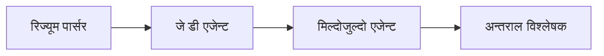
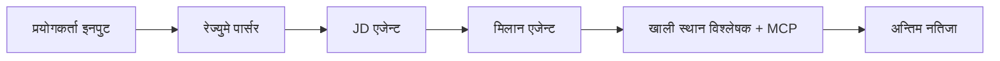

# मोड्युल 4 - सम्पन्नता ढाँचाहरू

⏱️ ~१० मिनेट

यस मोड्युलमा, तपाईं Resume Job Fit Evaluator मा प्रयोग भएका सम्पन्नता ढाँचाहरू अन्वेषण गर्नुहुन्छ र कसरी कार्यप्रवाह ग्राफ पढ्ने, परिमार्जन गर्ने र विस्तार गर्ने सिक्नुहुन्छ। यी ढाँचाहरू बुझ्न डाटा फ्लो समस्याहरूको डिबग गर्न र आफ्नै [मल्टि-एजेन्ट कार्यप्रवाहहरू](https://learn.microsoft.com/agent-framework/workflows/) निर्माण गर्न आवश्यक छ।

---

## ढाँचा १: अनुक्रमिक श्रृंखला

कार्यप्रवाहमा मौलिक ढाँचा हो **अनुक्रमिक श्रृंखला** - प्रत्येक एजेन्टको आउटपुट सिधै अर्कोमा जान्छ।


```mermaid
flowchart LR
    RP[रिज्यूम पार्सर] --> JD[जे डी एजेन्ट]
    JD --> MA[मिल्दोजुल्दो एजेन्ट]
    MA --> GA[अन्तराल विश्लेषक]
```

कोडमा, प्रत्येक `add_edge()` कल श्रृंखलामा एउटा कदम सिर्जना गर्दछ:

```python
.add_edge(resume_executor, jd_executor)       # रिजुमे पार्सर आउटपुट → जे डी एजेन्ट
.add_edge(jd_executor, matching_executor)     # जे डी एजेन्ट आउटपुट → म्याचिंग एजेन्ट
.add_edge(matching_executor, gap_executor)    # म्याचिंग एजेन्ट आउटपुट → ग्याप एनालाइजर
```

> **किन अनुक्रमिक, फ्यान-आउट/फ्यान-इन होइन?** `WorkflowBuilder` ले आउने एजहरूका लागि **OR-सिमान्टिक्स** प्रयोग गर्छ: कुनैपनि पहिलेको एजेन्टले सफलता पाएपछि तलको कार्यान्वयनकर्ताले काम सुरु गर्छ। यदि `matching_executor` लाई दुईवटा इन्पुट एजहरू थिए (`resume_executor` र `jd_executor` बाट दुबै), यो दुई पटक ट्रिगर हुन्थ्यो - एक पटक ResumeParser समाप्त हुँदा र अर्को पटक JD Agent समाप्त हुँदा - जसले GapAnalyzer लाई पनि दुई पटक चलाउँछ र आउटपुट पनि दुई पटक देखा पर्छ। अनुक्रमिक पाइपलाइनले यसलाई पूर्णरुपले रोक्छ।

## ढाँचा २: सामग्री रिले

किनकि `context_mode="last_agent"` को अर्थ प्रत्येक कार्यान्वयनकर्ताले केवल आफ्नो **प्रत्यक्ष पूर्ववर्तीको आउटपुट** मात्र देख्छ, अनुक्रमिक श्रृंखलाका एजेन्टहरूले स्पष्ट रूपमा कुनै पनि डाटा जुन तलका एजेन्टहरूले आवश्यक छ अगाडि पठाउनुपर्छ।

यस कार्यप्रवाहमा:
- **ResumeParser** ले JD लाई शब्दशः `[JOB DESCRIPTION PASS-THROUGH]` मा प्रतिलिपि गर्छ (जसले JD Agent लाई यसलाई फेला पार्न मद्दत गर्छ)।
- **JD Agent** ले `[PARSED RESUME]` लाई शब्दशः `[PARSED RESUME PASS-THROUGH]` मा प्रतिलिपि गर्छ (जसले MatchingAgent लाई दुवै प्रोफाइल तुलना गर्न अनुमति दिन्छ)।

```
ResumeParser output
└─ [PARSED RESUME]               ← extracted by JD Agent
└─ [JOB DESCRIPTION PASS-THROUGH] ← extracted by JD Agent

JD Agent output
└─ [JD REQUIREMENTS]             ← extracted by MatchingAgent
└─ [PARSED RESUME PASS-THROUGH]  ← extracted by MatchingAgent
```

प्रत्येक रिले सेक्सनलाई **शब्दशः** प्रतिलिपि गर्नुपर्छ - सारांश वा परिभाषा गर्दा तलको निर्भर एजेन्ट बिग्रन्छ।

---

## पूरा ग्राफ

अनुक्रमिक श्रृंखला र सामग्री रिले ढाँचाहरू मिलाएर पूर्ण कार्यप्रवाह उत्पादन हुन्छ:


```mermaid
flowchart LR
    U[प्रयोगकर्ता इनपुट] --> RP[रेज्युमे पार्सर]
    RP --> JD[JD एजेन्ट]
    JD --> MA[मिलान एजेन्ट]
    MA --> GA[खाली स्थान विश्लेषक + MCP]
    GA --> O[अन्तिम नतिजा]
```

एजेन्ट इन्स्पेक्टरले एजेन्ट स्थानीय रूपमा चलिरहेको बेला यो उही ग्राफ संरचना देखाउँछ। [Module 5 - Test Locally](05-test-locally.md) मा स्क्रिनशटहरू हेर्नुहोस्।

---

## WorkflowBuilder कोड पढ्ने

पूरा `create_workflow()` फङ्सन [`PersonalCareerCopilot/main.py`](../../../../../workshop/lab02-multi-agent/PersonalCareerCopilot/main.py) मा छ। तीनवटा `add_edge()` कलहरूले अनुक्रमिक पाइपलाइन बनाउँछन्:

| # | एज | प्रभाव |
|---|------|--------|
| १ | `resume_executor → jd_executor` | JD Agent ले `[PARSED RESUME]` + `[JOB DESCRIPTION PASS-THROUGH]` प्राप्त गर्छ |
| २ | `jd_executor → matching_executor` | MatchingAgent ले `[JD REQUIREMENTS]` + `[PARSED RESUME PASS-THROUGH]` प्राप्त गर्छ |
| ३ | `matching_executor → gap_executor` | GapAnalyzer ले फिट रिपोर्ट + ग्याप सूची प्राप्त गर्छ |

---

## ग्राफ परिमार्जन गर्ने

### नयाँ एजेन्ट थप्ने

GapAnalyzer पछि एउटा पाँचौं एजेन्ट थप्न (जस्तै **InterviewPrepAgent**):

१. `INTERVIEW_PREP_INSTRUCTIONS` स्थिरांक परिभाषित गर्नुहोस्।
२. `Agent` + `AgentExecutor` वस्तुहरू सिर्जना गर्नुहोस् (पहिलेका चारजस्तै ढाँचा)।
३. `WorkflowBuilder` मा `.add_edge(gap_executor, interview_exec)` थप्नुहोस्।
४. `output_executors=[interview_exec]` अद्यावधिक गर्नुहोस्।

> **महत्वपूर्ण:** `start_executor` मात्र कच्चा प्रयोगकर्ता इनपुट प्राप्त गर्ने एक मात्र एजेन्ट हो। सबै अन्य एजेन्टहरूले आफ्नो माथिको एजबाट आउटपुट प्राप्त गर्छन्।

---

## साधारण ग्राफ त्रुटिहरू

| त्रुटि | लक्षण | समाधान |
|---------|---------|-----|
| `output_executors` मा एज नजोडिएको | एजेन्ट चल्छ तर आउटपुट खाली हुन्छ | सुनिश्चित गर्नुहोस् `start_executor` बाट `output_executors` का सबै एजेन्टहरूमा बाटो छ |
| वृत्ताकार निर्भरता | अनन्त लूप वा टाइमआउट | जाँच गर्नुहोस् कुनै एजेन्टले माथिको एजेन्टलाई फिर्ता डाटा नदिएको होस् |
| `output_executors` मा एजेन्ट भए पनि कुनै इनकमिङ एज छैन | खाली आउटपुट | कम्तीमा एक `add_edge(source, that_agent)` थप्नुहोस् |
| धेरै `output_executors` बिना फ्यान-इन | आउटपुटमा एक मात्र एजेन्टको प्रतिक्रिया हुन्छ | एउटै आउटपुट एजेन्ट प्रयोग गर्नुहोस् जसले समेट्ने काम गर्छ, वा धेरै आउटपुट स्वीकार्नुहोस् |
| `start_executor` हराएको | निर्माण समयमा `ValueError` | सधैं `WorkflowBuilder()` मा `start_executor` निर्दिष्ट गर्नुहोस् |

---

## ग्राफ डिबग गर्ने

### Agent Inspector प्रयोग गर्ने

१. एजेन्ट स्थानीय रूपमा F5 प्रेस गरेर सुरु गर्नुहोस्।
२. Agent Inspector खोल्नुहोस् (`Ctrl+Shift+P` → **Foundry Toolkit: Open Agent Inspector**)।
३. परीक्षण सन्देश पठाउनुहोस्।
४. Inspector को प्रतिक्रिया प्यानलमा **स्ट्रीमिङ आउटपुट** खोज्नुहोस् - यसले प्रत्येक एजेन्टको योगदान अनुक्रममा देखाउँछ।


### लगिङ प्रयोग गर्ने

`main.py` मा लगिङ थपेर डाटा फ्लो ट्रेस गर्नुहोस्:

```python
import logging
logger = logging.getLogger("resume-job-fit")

# main() मा, workflow बनाएकोपछि:
logger.info("Workflow graph built with edges: RP→JD, JD→MA, MA→GA")
```

सर्भर लगहरूले एजेन्टको कार्यान्वयन क्रम र MCP टुल कलहरू देखाउँछन्:

```
INFO:agent_framework:Executing agent: ResumeParser
INFO:agent_framework:Executing agent: JobDescriptionAgent
INFO:agent_framework:Executing agent: MatchingAgent
INFO:agent_framework:Executing agent: GapAnalyzer
INFO:agent_framework:Tool call: search_microsoft_learn_for_plan(skill="Kubernetes")
POST https://learn.microsoft.com/api/mcp → 200
INFO:agent_framework:Tool call: search_microsoft_learn_for_plan(skill="Terraform")
POST https://learn.microsoft.com/api/mcp → 200
```

---

### चेकप्वाइन्ट

- [ ] तपाईं कार्यप्रवाहमा दुई सम्पन्नता ढाँचाहरू: अनुक्रमिक श्रृंखला र सामग्री रिले छुट्याउन सक्नुहुन्छ
- [ ] तपाईं बुझ्नुहुन्छ किन `context_mode="last_agent"` ले एजेन्टहरू बीच स्पष्ट डाटा रिले आवश्यक पर्छ
- [ ] तपाईं `WorkflowBuilder` कोड पढ्न र प्रत्येक `add_edge()` कललाई दृश्य ग्राफसँग मिलाउन सक्नुहुन्छ
- [ ] तपाईं पाइपलाइनको अन्त्यमा नयाँ एजेन्ट कसरी थप्ने जान्नुहुन्छ
- [ ] तपाईं सामान्य ग्राफ गल्तीहरू र तिनीहरूको लक्षणहरू छुट्याउन सक्नुहुन्छ

---

**अघिल्लो:** [03 - Configure Agents & Environment](03-configure-agents.md) · **अर्को:** [05 - Test Locally →](05-test-locally.md)

---

<!-- CO-OP TRANSLATOR DISCLAIMER START -->
**अस्वीकरण**:
यो दस्तावेज़ AI अनुवाद सेवा [Co-op Translator](https://github.com/Azure/co-op-translator) प्रयोग गरेर अनुवाद गरिएको हो। हामी सही हुन प्रयास गर्छौं, तर कृपया जानकार हुनुस् कि स्वचालित अनुवादमा त्रुटिहरू वा अशुद्धताहरू हुन सक्छन्। मूल दस्तावेज़ यसको मूल भाषामा आधिकारिक स्रोत मानिनुपर्छ। महत्वपूर्ण जानकारीका लागि व्यावसायिक मानव अनुवाद सिफारिस गरिन्छ। यस अनुवादको प्रयोगबाट उत्पन्न कुनै पनि गलत बुझाइ वा त्रुटिको लागि हामी जिम्मेवार छैनौं।
<!-- CO-OP TRANSLATOR DISCLAIMER END -->