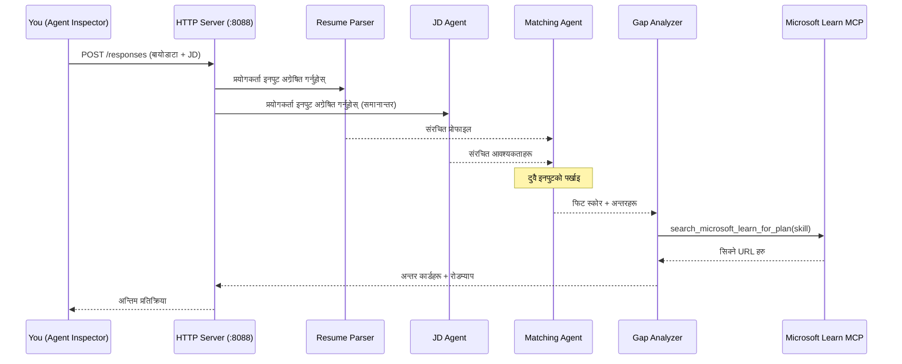
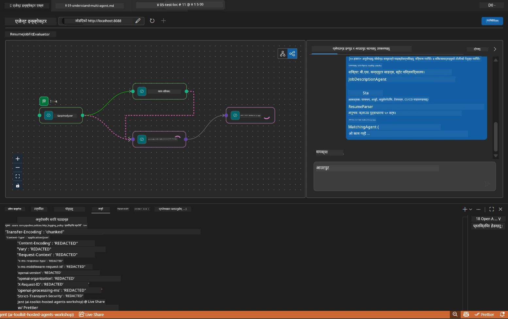

# Module 5 - स्थानीय रूपमा परीक्षण गर्नुहोस् (मल्टि-एजेण्ट)

यस मोड्युलमा, तपाईं मल्टि-एजेण्ट वर्कफ्लो स्थानीय रूपमा चलाउनुहुन्छ, Agent Inspector सँग परीक्षण गर्नुहुन्छ, र Foundry मा डिप्लोय गर्नु अघि सबै चार एजेण्ट र MCP उपकरणले सही काम गर्छन् भनी पुष्टि गर्नुहुन्छ।

### स्थानीय परीक्षण रनको क्रममा के हुन्छ


---

## चरण 1: एजेण्ट सर्भर सुरु गर्नुहोस्

### विकल्प A: VS Code टास्क प्रयोग गर्दै (सिफारिस गरिएको)

1. `Ctrl+Shift+P` थिच्नुहोस् → **Tasks: Run Task** टाइप गर्नुहोस् → **Run Lab02 HTTP Server** चयन गर्नुहोस्।
2. टास्कले पोर्ट `5679` मा debugpy संलग्न गरेर र पोर्ट `8088` मा एजेण्टसहित सर्भर सुरु गर्छ।
3. आउटपुट देखिन सम्म पर्खनुहोस्:

```
INFO:resume-job-fit:Starting Resume -> Job Fit Evaluator HTTP server...
INFO:resume-job-fit:Server running on http://localhost:8088
```

### विकल्प B: टर्मिनलबाट म्यानुअली प्रयोग गर्दै

```powershell
cd workshop\lab02-multi-agent\PersonalCareerCopilot
```

भर्चुअल वातावरण सक्रिय गर्नुहोस्:

**PowerShell (Windows):**
```powershell
.\.venv\Scripts\Activate.ps1
```

**macOS/Linux:**
```bash
source .venv/bin/activate
```

सर्भर सुरु गर्नुहोस्:

```powershell
python -m debugpy --listen 127.0.0.1:5679 -m agentdev run main.py --verbose --port 8088
```

### विकल्प C: F5 प्रयोग गर्दै (debug मोड)

1. `F5` थिच्नुहोस् वा **Run and Debug** (`Ctrl+Shift+D`) मा जानुहोस्।
2. ड्रपडाउनबाट **Lab02 - Multi-Agent** लन्च कन्फिगरेसन चयन गर्नुहोस्।
3. सर्भर पूर्ण ब्रेकपोइन्ट सपोर्टका साथ सुरु हुन्छ।

> **टिप:** Debug मोडले तपाईंलाई `search_microsoft_learn_for_plan()` भित्र ब्रेकपोइन्ट सेट गर्न वा प्रत्येक एजेण्टले के प्राप्त गर्छ हेर्न एजेन्ट निर्देशन स्ट्रिङहरू भित्र ब्रेकपोइन्ट राख्न अनुमति दिन्छ।

---

## चरण 2: Agent Inspector खोल्नुहोस्

1. `Ctrl+Shift+P` थिच्नुहोस् → **Foundry Toolkit: Open Agent Inspector** टाइप गर्नुहोस्।
2. Agent Inspector ब्राउजर ट्याबमा `http://localhost:5679` मा खुल्छ।
3. तपाईंले एजेण्ट इन्टरफेस मेसेजहरू स्वीकार्न तयार देख्नु पर्छ।

> **यदि Agent Inspector खुल्दैन भने:** सर्भर पूर्ण रूपमा सुरु भएको छ भनी सुनिश्चित गर्नुहोस् ("Server running" लग देख्नुहोस्)। यदि पोर्ट 5679 व्यस्त छ भने, [Module 8 - Troubleshooting](08-troubleshooting.md) हेर्नुहोस्।

---

## चरण 3: स्मोक टेस्टहरू चलाउनुहोस्

यी तीन परीक्षणहरू क्रमबद्ध रूपमा चलाउनुहोस्। प्रत्येकले वर्कफ्लोको बिस्तारै अधिक भाग परीक्षण गर्छ।

### परीक्षण १: आधारभूत रिजुमे + जागिर विवरण

Agent Inspector मा निम्न टाँस्नुहोस्:

```
Resume:
Jane Doe
Senior Software Engineer with 5 years of experience in Python, Django, and AWS.
Built microservices handling 10K+ requests/second. Led a team of 4 developers.
Certifications: AWS Solutions Architect Associate.
Education: B.S. Computer Science, State University.

Job Description:
Senior Cloud Engineer at Contoso Ltd.
Required: Python, Azure, Kubernetes, Terraform, CI/CD pipelines.
Preferred: Go, monitoring (Prometheus/Grafana), cost optimization.
Experience: 5+ years in cloud infrastructure.
Certifications: Azure Solutions Architect Expert preferred.
```

**अपेक्षित आउटपुट संरचना:**

उत्तरमा सबै चार एजेण्टहरूबाट क्रमबद्ध रूपमा आउटपुट हुनु पर्छ:

1. **Resume Parser आउटपुट** - वर्गीकृत कौशलहरू सहित संरचित उम्मेदवार प्रोफाइल
2. **JD Agent आउटपुट** - आवश्यक र प्राथमिकता कौशल अलग्गै भएका संरचित आवश्यकताहरू
3. **Matching Agent आउटपुट** - फिट स्कोर (0-100) सहित विवरण, मेल खाने कौशल, हराएका कौशल, अन्तरहरू
4. **Gap Analyzer आउटपुट** - प्रत्येक हराएको कौशलका लागि व्यक्तिगत अन्तर कार्डहरू, प्रत्येकसँग Microsoft Learn URL हरू



### परीक्षण १ मा के पुष्टि गर्ने

| जाँच | अपेक्षित | पास? |
|-------|----------|-------|
| उत्तरमा फिट स्कोर छ | 0-100 बीच संख्या र विवरण सहित | |
| मेल खाने कौशलहरू सूचीकृत छन् | Python, CI/CD (आंशिक), आदि | |
| हराएका कौशलहरू सूचीकृत छन् | Azure, Kubernetes, Terraform, आदि | |
| प्रत्येक हराएको कौशलको लागि अन्तर कार्डहरू छन् | प्रत्येक कौशलको लागि एक कार्ड | |
| Microsoft Learn URL हरू छन् | वास्तविक `learn.microsoft.com` लिंकहरू | |
| उत्तरमा कुनै त्रुटि सन्देश छैन | सफा संरचित उत्तर | |

### परीक्षण २: MCP उपकरण कार्यान्वयन जाँच गर्नुहोस्

परीक्षण १ चल्दा, **सर्भर टर्मिनल** मा MCP लग इन्ट्रीहरू जाँच गर्नुहोस्:

```
GET https://learn.microsoft.com/api/mcp → 405 (Method Not Allowed)
POST https://learn.microsoft.com/api/mcp → 200
DELETE https://learn.microsoft.com/api/mcp → 405 (Method Not Allowed)
```

| लग इन्ट्री | अर्थ | अपेक्षित? |
|-----------|---------|-----------|
| `GET ... → 405` | MCP क्लाइंटले सुरुवातमा GET को साथ परीक्षण गर्छ | हो - सामान्य |
| `POST ... → 200` | Microsoft Learn MCP सर्भरलाई वास्तविक टूल कल | हो - यो वास्तविक कल हो |
| `DELETE ... → 405` | सफाई क्रममा MCP क्लाइंटले DELETE को साथ परीक्षण गर्छ | हो - सामान्य |
| `POST ... → 4xx/5xx` | टूल कल असफल भयो | होइन - हेर्नुहोस् [Troubleshooting](08-troubleshooting.md) |

> **मुख्य कुरा:** `GET 405` र `DELETE 405` लाइनहरू **अपेक्षित व्यवहार** हुन्। केवल `POST` कलहरूले गैर-200 स्थिति कोड फर्काएमा चिन्ता लिनुहोस्।

### परीक्षण ३: किनार मामिला - उच्च फिट उम्मेदवार

JD सँग नजिकै मेल खाने रिजुमे टाँस्नुहोस् ताकि GapAnalyzer ले उच्च फिट केसहरू ठीकसँग व्यवहार गर्छ भनी जाँच गर्न:

```
Resume:
Alex Chen
Senior Cloud Engineer with 7 years of experience.
Skills: Python, Azure (AKS, Functions, DevOps), Kubernetes, Terraform, CI/CD (GitHub Actions, Azure Pipelines), Go, Prometheus, Grafana, cost optimization.
Certifications: Azure Solutions Architect Expert, Azure DevOps Engineer Expert.
Led infrastructure migration to Azure for 3 enterprise clients.
Education: M.S. Computer Science, Tech University.

Job Description:
Senior Cloud Engineer at Contoso Ltd.
Required: Python, Azure, Kubernetes, Terraform, CI/CD pipelines.
Preferred: Go, monitoring (Prometheus/Grafana), cost optimization.
Experience: 5+ years in cloud infrastructure.
Certifications: Azure Solutions Architect Expert preferred.
```

**अपेक्षित व्यवहार:**
- फिट स्कोर **80+** हुनुपर्छ (धेरै कौशल मेल खाँछन्)
- अन्तर कार्डहरूले आधारभूत सिकाइभन्दा पोलिश/अन्तर्वार्ता तयारीमा केन्द्रित हुनु पर्छ
- GapAnalyzer निर्देशनले भन्छ: "यदि फिट >= 80 छ भने पोलिश/अन्तर्वार्ता तयारीमा केन्द्रित गर्नुहोस्"

---

## चरण ४: आउटपुट पूर्णता पुष्टि गर्नुहोस्

परीक्षणहरू चलाएपछि, आउटपुटले निम्न मापदण्डहरू पूरा गरेको पुष्टि गर्नुहोस्:

### आउटपुट संरचना चेकलिस्ट

| खण्ड | एजेण्ट | उपस्थित छ? |
|---------|-------|----------|
| उम्मेदवार प्रोफाइल | Resume Parser | |
| प्राविधिक कौशलहरू (समूहबद्ध) | Resume Parser | |
| भूमिका अवलोकन | JD Agent | |
| आवश्यक बनाम प्राथमिक कौशलहरू | JD Agent | |
| फिट स्कोर विवरणसहित | Matching Agent | |
| मेल खाने / हराउने / आंशिक कौशलहरू | Matching Agent | |
| हराएका कौशलको लागि अन्तर कार्ड | Gap Analyzer | |
| अन्तर कार्डमा Microsoft Learn URL हरू | Gap Analyzer (MCP) | |
| सिकाइ क्रम (संख्या सहित) | Gap Analyzer | |
| टाइमलाइन सारांश | Gap Analyzer | |

### यस चरणमा सामान्य समस्याहरू

| समस्या | कारण | समाधान |
|-------|-------|-----|
| केवल १ अन्तर कार्ड छ (बाकी काटिएको) | GapAnalyzer निर्देशनमा CRITICAL खण्ड छैन | `GAP_ANALYZER_INSTRUCTIONS` मा `CRITICAL:` अनुच्छेद थप्नुहोस् - हेर्नुहोस् [Module 3](03-configure-agents.md) |
| Microsoft Learn URL छैन | MCP इन्डपोइन्ट पहुँचयोग्य छैन | इन्टरनेट कनेक्टिविटी जाँच गर्नुहोस्। `.env` मा `MICROSOFT_LEARN_MCP_ENDPOINT` `https://learn.microsoft.com/api/mcp` छ भनी पुष्टि गर्नुहोस् |
| खाली उत्तर | `PROJECT_ENDPOINT` वा `MODEL_DEPLOYMENT_NAME` सेट गरिएको छैन | `.env` फाइलका मानहरू जाँच्नुहोस्। टर्मिनलमा `echo $env:PROJECT_ENDPOINT` चलाउनुहोस् |
| फिट स्कोर 0 वा हराएको | MatchingAgent ले कुनै डाटा प्राप्त गरेको छैन | `create_workflow()` मा `add_edge(resume_parser, matching_agent)` र `add_edge(jd_agent, matching_agent)` छन् भनी जाँच गर्नुहोस् |
| एजेण्ट सुरु हुन्छ तर तुरुन्त बन्द हुन्छ | आयात त्रुटि वा निर्भरता हराएको | `pip install -r requirements.txt` पुनः चलाउनुहोस्। टर्मिनलमा स्ट्याक ट्रेसहरू जाँच गर्नुहोस् |
| `validate_configuration` त्रुटि | env भेरिएबलहरू हराएको | `.env` बनाउनुहोस् र `PROJECT_ENDPOINT=<your-endpoint>` र `MODEL_DEPLOYMENT_NAME=<your-model>` राख्नुहोस् |

---

## चरण ५: आफ्नै डाटा सँग परीक्षण गर्नुहोस् (वैकल्पिक)

आफ्नो रिजुमे र वास्तविक जागिर विवरण टाँस्न प्रयास गर्नुहोस्। यसले पुष्टि गर्न मद्दत गर्छ:

- एजेण्टहरूले विभिन्न रिजुमे ढाँचाहरू (क्रमिक, कार्यात्मक, हाइब्रिड) सम्हाल्छन्
- JD Agent ले विभिन्न JD शैलीहरू (बुलेट पोइन्ट, अनुच्छेद, संरचित) सम्हाल्छ
- MCP उपकरणले वास्तविक कौशलहरूका लागि सम्बन्धित स्रोतहरू फर्काउँछ
- अन्तर कार्डहरूले तपाईंको विशेष पृष्ठभूमिलाई व्यक्तिगत रूपमा प्रस्तुत गर्छन्

> **गोपनीयता नोट:** स्थानीय रूपमा परीक्षण गर्दा, तपाईंको डाटा तपाईंको मेसिनमै रहन्छ र मात्र तपाईंको Azure OpenAI डिप्लोयमेन्टमा पठाइन्छ। यो वर्कशप पूर्वाधारले लग वा संग्रह गर्दैन। तपाईंलाई मन परेमा प्लेसहोल्डर नामहरू प्रयोग गर्नुहोस् (जस्तै, तपाईंको वास्तविक नामको साटो "Jane Doe")।

---

### चेकप्वाइन्ट

- [ ] पोर्ट `8088` मा सर्भर सफलतापूर्वक सुरु भयो ("Server running" लग देखिन्छ)
- [ ] Agent Inspector खुल्यो र एजेण्टसँग जडान भयो
- [ ] परीक्षण १: फिट स्कोर, मेल खाने/हराउने कौशलहरू, अन्तर कार्डहरू, र Microsoft Learn URL सहित पूर्ण उत्तर
- [ ] परीक्षण २: MCP लगले `POST ... → 200` देखाउँछ (टूल कलहरू सफल)
- [ ] परीक्षण ३: उच्च फिट उम्मेदवारलाई 80+ स्कोर र पोलिश-केंद्रित सिफारिसहरू प्राप्त
- [ ] सबै अन्तर कार्ड उपस्थित छन् (प्रति हराएको कौशल एक कार्ड, कुनै कटौती छैन)
- [ ] सर्भर टर्मिनलमा कुनै त्रुटि वा स्ट्याक ट्रेस छैन

---

**अघिल्लो:** [04 - Orchestration Patterns](04-orchestration-patterns.md) · **अर्को:** [06 - Deploy to Foundry →](06-deploy-to-foundry.md)

---

<!-- CO-OP TRANSLATOR DISCLAIMER START -->
**पक्षपातमुक्त सूचना**:  
यो दस्तावेज AI अनुवाद सेवा [Co-op Translator](https://github.com/Azure/co-op-translator) को प्रयोग गरी अनुवाद गरिएको हो। यद्यपि हामी शुद्धताको प्रयास गर्छौं, कृपया ध्यान दिनुहोस् कि स्वचालित अनुवादहरूमा त्रुटि वा अशुद्धता हुन सक्छ। मूल दस्तावेज यसको मूल भाषामा अधिकारिक स्रोतको रूपमा लिनुपर्छ। महत्त्वपूर्ण जानकारीको लागि व्यावसायिक मानव अनुवाद सिफारिस गरिन्छ। यस अनुवादको प्रयोगबाट उत्पन्न हुने कुनै पनि गलतफहमी वा गलत व्याख्याका लागि हामी जिम्मेवार छैनौं।
<!-- CO-OP TRANSLATOR DISCLAIMER END -->