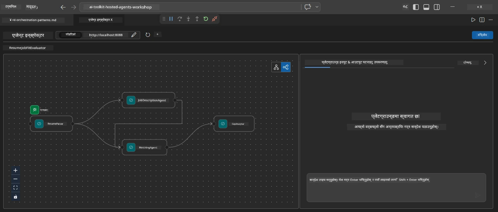
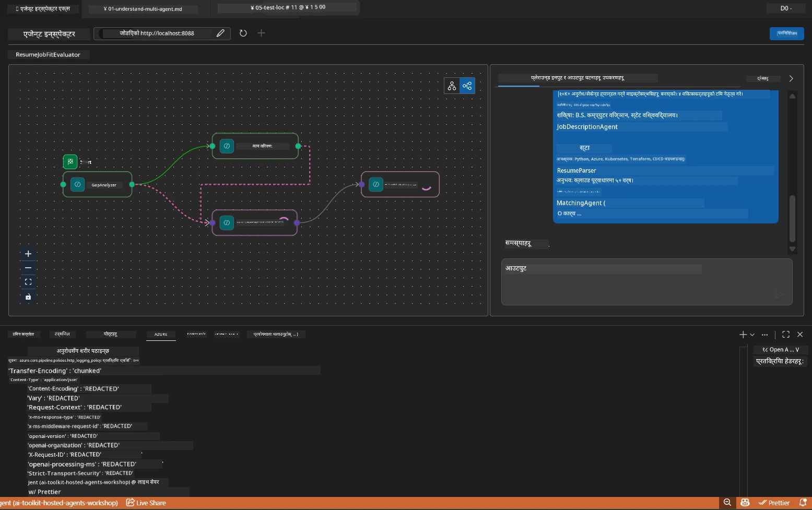
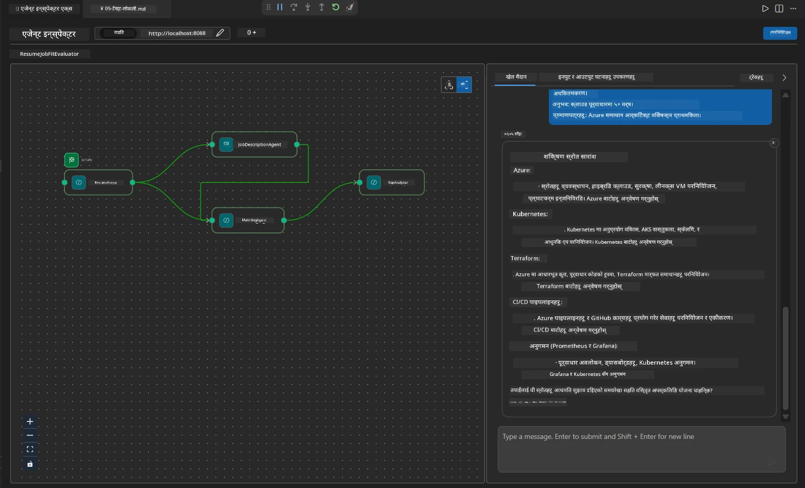

# मोड्युल ५ - स्थानीय रूपमा परीक्षण गर्नुहोस्

⏱️ ~१५ मिनेट

यस मोड्युलमा, तपाईं बहु-एजेन्ट वर्कफ्लो स्थानीय रूपमा चलाउनुहुन्छ, Agent Inspector सँग परीक्षण गर्नुहुन्छ, र सबै चार एजेन्टहरू र MCP उपकरणले ठीकसँग काम गर्छन् भनी पुष्टि गर्नुहुन्छ वितरण गर्नु अघि।

---

## चरण १: एजेन्ट सर्भर सुरु गर्नुहोस्

### विकल्प क: VS Code कार्य प्रयोग गर्दै (सिफारिस गरिएको)

१. `workshop/lab02-multi-agent/PersonalCareerCopilot/` लाई तपाईँको VS Code फोल्डरको रूपमा खोल्नुहोस्।
२. `Ctrl+Shift+P` थिच्नुहोस् → **Tasks: Run Task** टाइप गर्नुहोस् → **Run Agent HTTP Server** छनौट गर्नुहोस्।
३. कार्यले पोर्ट `5679` मा debugpy जडित गरेर र पोर्ट `8088` मा एजेन्टसँग सर्भर सुरु गर्दछ।
४. आउटपुटले देखाउँदासम्म पर्खनुहोस्:

```
INFO:resume-job-fit:Starting Resume -> Job Fit Evaluator HTTP server...
INFO:resume-job-fit:Server running on http://localhost:8088
```

### विकल्प ख: F5 (डिबग मोड) प्रयोग गर्दै

१. `F5` थिच्नुहोस् → **Debug Local Agent HTTP Server** छनौट गर्नुहोस्।
२. सर्भर पूर्ण ब्रेकपोइन्ट समर्थनका साथ सुरु हुन्छ - MCP प्रतिक्रियाहरू वा एजेन्ट आउटपुटहरू जाँच्न उपयोगी।

---

## चरण २: एजेन्ट इन्स्पेक्टर खोल्नुहोस्

१. `Ctrl+Shift+P` थिच्नुहोस् → **Foundry Toolkit: Open Agent Inspector** टाइप गर्नुहोस्।
२. Agent Inspector एउटा VS Code प्यानलको रूपमा खुल्छ जुन `http://localhost:8088` सँग जोडिएको हुन्छ।
३. तपाईँले एजेन्ट इन्टरफेस सन्देश स्वीकार्न तयार देख्नुपर्छ।



> **यदि Agent Inspector खोल्दैन भने:** सुनिश्चित गर्नुहोस् सर्भर पूर्ण रूपमा सुरु भएको छ (तपाईंले "Server running" लग देख्नुहुन्छ)। यदि पोर्ट 5679 ब्यस्त छ भने, हेर्नुहोस् [Module 8 - Troubleshooting](08-troubleshooting.md)।

---

## चरण २ब: (ऐच्छिक) वर्कफ्लो भिजुअलाईजर खोल्नुहोस्

Foundry Toolkit मा एउटा वास्तविक समय **Workflow Visualizer** समावेश छ जसले एजेन्टहरूले कसरी अन्तरक्रिया गर्दछन् भन्ने देखाउँछ जत्तिकै ग्राफ कार्यान्वयन हुन्छ। यो विशेष गरी बहु-एजेन्ट डिबगिङका लागि उपयोगी छ।

१. `Ctrl+Shift+P` थिच्नुहोस् → **Foundry Toolkit: Open Visualizer for Hosted Agents** टाइप गर्नुहोस्।
२. एउटा नयाँ VS Code ट्याब खुल्छ जुन प्रत्यक्ष कार्यान्वयन ग्राफ देखाउँछ।
३. जस्तै तपाईंले Agent Inspector मा सन्देशहरू पठाउनु हुन्छ, भिजुअलाईजर अटोम्याटिक अपडेट हुन्छ - हरियो नोडहरूले पूरै एजेन्टहरुलाई जनाउँछन्, र चलायमान छेउले तिनीहरू बीच डाटा प्रवाह देखाउँछन्।

> **पोर्ट द्वन्द्व:** यदि भिजुअलिएजर पोर्ट पहिलेबाट नै प्रयोगमा छ भने, VS Code सेटिङहरू → **Extensions** → **Microsoft Foundry Configuration** → **Hosted Agents: Visualizer Port** मा परिवर्तन गर्नुहोस्।

---

## चरण ३: स्मोक परीक्षणहरू चलाउनुहोस्

यी तीन परीक्षणहरू क्रमबद्ध रूपमा चलाउनुहोस्। प्रत्येकले वर्कफ्लोको बढी भाग परीक्षण गर्दछ।

### परीक्षण १: आधारभूत रिजुमे + जागिर विवरण

तलको सामग्री Agent Inspector मा पेस्ट गर्नुहोस्:

```
Resume:
Jane Doe
Senior Software Engineer with 5 years of experience in Python, Django, and AWS.
Built microservices handling 10K+ requests/second. Led a team of 4 developers.
Certifications: AWS Solutions Architect Associate.
Education: B.S. Computer Science, State University.

Job Description:
Senior Cloud Engineer at Contoso Ltd.
Required: Python, Azure, Kubernetes, Terraform, CI/CD pipelines.
Preferred: Go, monitoring (Prometheus/Grafana), cost optimization.
Experience: 5+ years in cloud infrastructure.
Certifications: Azure Solutions Architect Expert preferred.
```

**अपेक्षित आउटपुट संरचना:**

प्रतिक्रियाले सबै चार एजेन्टहरूको आउटपुट अनुक्रम अनुसार समावेश गर्नु पर्छ:

१. **रिजुमे पार्सर आउटपुट** - दुई लेबल गरिएका खण्डहरू: `[PARSED RESUME]` (उम्मेदवार प्रोफाइल समूहित सीपहरूसँग) र `[JOB DESCRIPTION PASS-THROUGH]` (ठ्याक्कै JD पाठ जुन JD एजेन्टलाई खान्छ)
२. **JD एजेन्ट आउटपुट** - संरचित आवश्यकताहरू, आवश्यक र प्राथमिकता भएका सीपहरू छुट्टिएको
३. **म्याचिङ एजेन्ट आउटपुट** - फिट स्कोर (०-१००) भंग सहित, मेल खाने सीपहरू, हराइरहेका सीपहरू, अन्तरहरू
४. **ग्याप एनालाइजर आउटपुट** - प्रत्येक हराइरहेका सीपको लागि व्यक्तिगत ग्याप कार्डहरू, प्रत्येकमा Microsoft Learn URL हरू सहित





### परीक्षण १ मा के जाँच गर्ने

| जाँच गर्नुहोस् | अपेक्षित | पास? |
|-------|----------|-------|
| प्रतिक्रियाले फिट स्कोर समावेश गर्दछ | ०-१०० भित्र संख्या भंग सहित | |
| मेल खाने सीपहरू सूचीमा छन् | Python, CI/CD (आंशिक), आदि | |
| हराइरहेका सीपहरू सूचीमा छन् | Azure, Kubernetes, Terraform, आदि | |
| प्रत्येक हराइरहेका सीपको लागि ग्याप कार्डहरू छन् | हरेक सीपका लागि एक कार्ड | |
| Microsoft Learn URL हरू उपलब्ध छन् | वास्तविक `learn.microsoft.com` लिङ्कहरू | |
| प्रतिक्रियामा कुनै त्रुटि सन्देश छैन | सफा संरचित आउटपुट | |

### परीक्षण २: छेउको केस - उच्च फिट उम्मेदवार

त्यस्तो रिजुमे पेस्ट गर्नुहोस् जुन JD सँग नजिकै मेल खान्छ जाँच्न कि GapAnalyzer उच्च-फिट परिदृश्यहरूलाई कसरी ह्यान्डल गर्छ:

```
Resume:
Alex Chen
Senior Cloud Engineer with 7 years of experience.
Skills: Python, Azure (AKS, Functions, DevOps), Kubernetes, Terraform, CI/CD (GitHub Actions, Azure Pipelines), Go, Prometheus, Grafana, cost optimization.
Certifications: Azure Solutions Architect Expert, Azure DevOps Engineer Expert.
Led infrastructure migration to Azure for 3 enterprise clients.
Education: M.S. Computer Science, Tech University.

Job Description:
Senior Cloud Engineer at Contoso Ltd.
Required: Python, Azure, Kubernetes, Terraform, CI/CD pipelines.
Preferred: Go, monitoring (Prometheus/Grafana), cost optimization.
Experience: 5+ years in cloud infrastructure.
Certifications: Azure Solutions Architect Expert preferred.
```

**अपेक्षित व्यवहार:**
- फिट स्कोर हुनु पर्छ **८०+** (अधिकांश सीपहरू मेल खान्छन्)
- ग्याप कार्डहरू पोलिस/इन्टरभ्यू तयारीमा केन्द्रित हुनु पर्छ फाउन्डेशनल सिकाइ भन्दा
- GapAnalyzer को निर्देशन भन्छ: "यदि फिट >= ८०, पोलिस/इन्टरभ्यू तयारीमा ध्यान दिनुहोस्"

---

## चरण ४: आफ्नो डाटा प्रयोग गरी परीक्षण गर्नुहोस् (ऐच्छिक)

आफ्नो रिजुमे र वास्तविक जागिर विवरण पेस्ट गरेर प्रयास गर्नुहोस्। यसले सुनिश्चित गर्न मद्दत गर्दछ:

- एजेन्टहरूले विभिन्न रिजुमे ढाँचाहरू (क्रमिक, कार्यात्मक, हाइब्रिड) ह्यान्डल गर्न सक्छन्
- JD एजेन्टले विभिन्न JD शैलीहरू (बुलेट पोइन्ट, अनुच्छेद, संरचित) ह्यान्डल गर्दछ
- MCP उपकरणले वास्तविक सीपहरूका लागि सम्बन्धित स्रोतहरू फिर्ता गर्छ
- ग्याप कार्डहरू तपाईंको विशिष्ट पृष्ठभूमिमा व्यक्तिगत छन्

> **गोपनीयता - पथ A (Foundry क्लाउड):** रिजुमे र JD पाठ तपाईंको Azure OpenAI तैनाथीमा अनुमानको लागि पठाइन्छ। यसलाई वर्कशप पूर्वाधारले लग वा संग्रह गर्दैन। तपाईं चाहेमा प्लेसहोल्डर नामहरू (जस्तै, "Jane Doe") प्रयोग गर्नुहोस्।
>
> **गोपनीयता - पथ B (Foundry स्थानीय):** सबै चार एजेन्ट अनुमानहरू पूर्ण रूपमा तपाईंको उपकरणमा चल्छन्। तपाईंको रिजुमे र जागिर विवरण पाठ **कहिले पनि तपाईंको मेसिन छोड्दैन**। एउटै बाह्य कल MCP उपकरणले स्रोतहरू ल्याउन `https://learn.microsoft.com/api/mcp` बाट गर्छ; त्यो सोधपुछमा केवल सीप नाम हुन्छ, तपाईंको व्यक्तिगत डेटा होइन।

---

### चेकपोइन्ट

- [ ] पोर्ट `8088` मा सर्भर सफलतापूर्वक सुरु भयो (लगमा "Server running" देखिन्छ)
- [ ] Agent Inspector खुल्यो र एजेन्टसँग जोडियो
- [ ] परीक्षण १: पूर्ण प्रतिक्रिया फिट स्कोर, मेल खाने/हराइरहेका सीपहरू, ग्याप कार्डहरू, र Microsoft Learn URL हरू सहित
- [ ] परीक्षण २: उच्च फिट उम्मेदवारले ८०+ स्कोर पाउँछन् पोलिस-कन्द्रित सिफारिसहरू सहित
- [ ] सबै ग्याप कार्डहरू उपलब्ध छन् (हरेक हराइरहेका सीपको लागि एक, कुनै ट्रंकेसन छैन)
- [ ] सर्भर टर्मिनलमा कुनै त्रुटि वा स्ट्याक ट्रेसहरू छैनन्

---

**अघिल्लो:** [04 - Orchestration Patterns](04-orchestration-patterns.md) · **अर्को:** [06 - Deploy to Foundry →](06-deploy-to-foundry.md)

---

<!-- CO-OP TRANSLATOR DISCLAIMER START -->
**अस्वीकरण**:
यो दस्तावेज़ AI अनुवाद सेवा [Co-op Translator](https://github.com/Azure/co-op-translator) प्रयोग गरेर अनुवाद गरिएको हो। हामी सही हुन प्रयास गर्छौं, तर कृपया जानकार हुनुस् कि स्वचालित अनुवादमा त्रुटिहरू वा अशुद्धताहरू हुन सक्छन्। मूल दस्तावेज़ यसको मूल भाषामा आधिकारिक स्रोत मानिनुपर्छ। महत्वपूर्ण जानकारीका लागि व्यावसायिक मानव अनुवाद सिफारिस गरिन्छ। यस अनुवादको प्रयोगबाट उत्पन्न कुनै पनि गलत बुझाइ वा त्रुटिको लागि हामी जिम्मेवार छैनौं।
<!-- CO-OP TRANSLATOR DISCLAIMER END -->