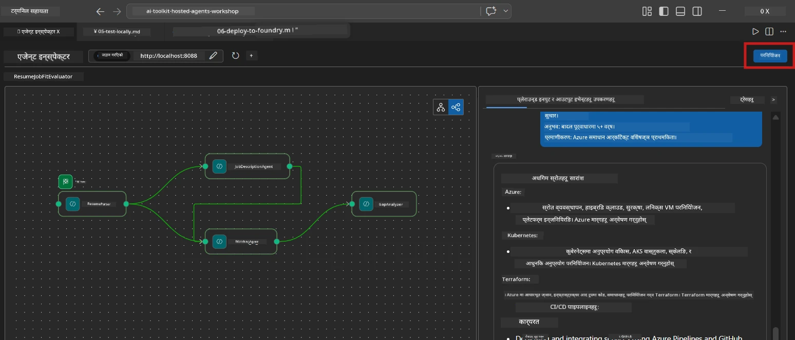
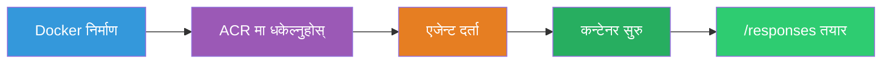
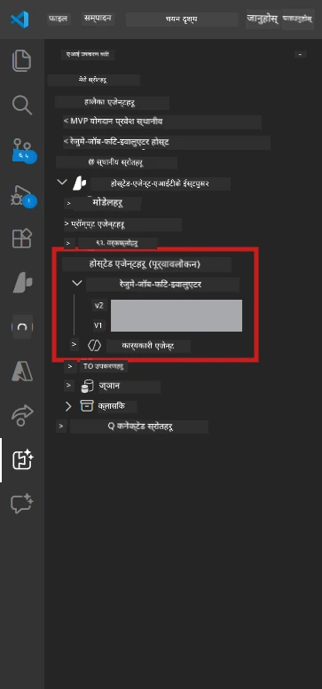

# Module 6 - Foundry Agent सेवा मा डिप्लोय गर्नुहोस्

यस मोड्युलमा, तपाईंले आफ्नो स्थानीय रूपमा परिक्षण गरिएको बहु-एजेन्ट वर्कफ्लोलाई [Microsoft Foundry](https://learn.microsoft.com/azure/foundry/agents/concepts/hosted-agents) मा **Hosted Agent** को रूपमा डिप्लोय गर्नुहुन्छ। डिप्लोयमेन्ट प्रक्रिया डोकर कन्टेनर इमेज निर्माण गर्छ, यसलाई [Azure Container Registry (ACR)](https://learn.microsoft.com/azure/container-registry/container-registry-intro) मा पुश गर्छ, र [Foundry Agent Service](https://learn.microsoft.com/azure/foundry/agents/how-to/publish-agent) मा होस्टेड एजेन्ट संस्करण सिर्जना गर्छ।

> **Lab 01 भन्दा मुख्य फरक:** डिप्लोयमेन्ट प्रक्रिया उस्तै छ। Foundry तपाईंको बहु-एजेन्ट वर्कफ्लोलाई एकल होस्टेड एजेन्टको रूपमा हेरिन्छ - जटिलता कन्टेनर भित्र हुन्छ, तर डिप्लोयमेन्ट सतह उस्तै `/responses` एन्डपोइन्ट हो।

---

## पूर्व आवश्यकताहरू जाँच

डिप्लोय गर्ने अघि, तलका हरेक वस्तु जाँच गर्नुहोस्:

1. **एजेन्टले स्थानीय स्मोक परीक्षण पास गरेको छ:**
   - तपाईंले [Module 5](05-test-locally.md) मा तीनवटै परीक्षण पूरा गर्नुभएको छ र वर्कफ्लोले पूर्ण आउटपुट उत्पादन गरेको छ जसमा ग्याप कार्ड र Microsoft Learn URL हरू छन्।

2. **तपाईंलाई [Azure AI User](https://learn.microsoft.com/azure/foundry/concepts/rbac-foundry) भूमिका दिइएको छ:**
   - यो [Lab 01, Module 2](../../lab01-single-agent/docs/02-create-foundry-project.md) मा प्रदान गरिएको छ। पुष्टि गर्नुहोस्:
   - [Azure Portal](https://portal.azure.com) → तपाईंको Foundry **प्रोजेक्ट** स्रोत → **Access control (IAM)** → **Role assignments** → तपाईंको खाताका लागि **[Azure AI User](https://aka.ms/foundry-ext-project-role)** सूचीबद्ध छ।

3. **तपाईं VS Code मा Azure मा साइन इन हुनुहुन्छ:**
   - VS Code को तल्लो-बायाँ कुनामा Accounts आइकन जाँच गर्नुहोस्। तपाईंको खाता नाम देखिनु पर्छ।

4. **`agent.yaml` मा सही मानहरू छन्:**
   - `PersonalCareerCopilot/agent.yaml` खोल्नुहोस् र जाँच गर्नुहोस्:
     ```yaml
     environment_variables:
       - name: PROJECT_ENDPOINT
         value: ${PROJECT_ENDPOINT}
       - name: MODEL_DEPLOYMENT_NAME
         value: ${MODEL_DEPLOYMENT_NAME}
     ```
   - यी मानहरूले तपाईंको `main.py` ले पढ्ने वातावरण चरहरूसँग मेल खानुपर्छ।

5. **`requirements.txt` मा सही संस्करणहरू छन्:**
   ```
   agent-framework-azure-ai==1.0.0rc3
   agent-framework-core==1.0.0rc3
   azure-ai-agentserver-agentframework==1.0.0b16
   azure-ai-agentserver-core==1.0.0b16
   debugpy
   agent-dev-cli --pre
   ```

---

## चरण १: डिप्लोयमेन्ट सुरु गर्नुहोस्

### विकल्प A: Agent Inspector बाट डिप्लोय गर्नुहोस् (सिफारिस गरिएको)

यदि एजेन्ट F5 संग Agent Inspector खुला अवस्थामा चलिरहेको छ भने:

1. Agent Inspector प्यानलको **माथिल्लो-दक्षिण कोण** हेर्नुहोस्।
2. **Deploy** बटन (बादल आइकन ↑ तीर भएको) मा क्लिक गर्नुहोस्।
3. डिप्लोयमेन्ट विजार्ड खुल्नेछ।



### विकल्प B: Command Palette बाट डिप्लोय गर्नुहोस्

1. `Ctrl+Shift+P` थिचेर **Command Palette** खोल्नुहोस्।
2. टाइप गर्नुहोस्: **Microsoft Foundry: Deploy Hosted Agent** र चयन गर्नुहोस्।
3. डिप्लोयमेन्ट विजार्ड खुल्नेछ।

---

## चरण २: डिप्लोयमेन्ट कन्फिगर गर्नुहोस्

### 2.1 लक्षित प्रोजेक्ट चयन गर्नुहोस्

1. ड्रपडाउनले तपाईंका Foundry प्रोजेक्टहरू देखाउँछ।
2. तपाईंले कार्यशालामा प्रयोग गरेको प्रोजेक्ट छान्नुहोस् (जस्तै, `workshop-agents`)।

### 2.2 कन्टेनर एजेन्ट फाइल चयन गर्नुहोस्

1. तपाईंलाई एजेन्ट इन्ड्री पोइन्ट चयन गर्न भनिनेछ।
2. `workshop/lab02-multi-agent/PersonalCareerCopilot/` मा जानुहोस् र **`main.py`** चयन गर्नुहोस्।

### 2.3 स्रोतहरू कन्फिगर गर्नुहोस्

| सेटिङ | सिफारिस गरिएको मान | नोटहरू |
|---------|------------------|-------|
| **CPU** | `0.25` | डिफल्ट। बहु-एजेन्ट वर्कफ्लोहरूलाई बढी CPU आवश्यक छैन किनभने मोडेल कलहरू I/O-बन्धित हुन्छन् |
| **Memory** | `0.5Gi` | डिफल्ट। ठूलो डाटा प्रशोधन उपकरण थप्दा `1Gi` मा बढाउनुहोस् |

---

## चरण ३: पुष्टि गर्नुहोस् र डिप्लोय गर्नुहोस्

1. विजार्डले डिप्लोयमेन्ट सारांश देखाउँछ।
2. समीक्षा गरी **Confirm and Deploy** क्लिक गर्नुहोस्।
3. VS Code मा प्रगति हेरिरहनुहोस्।

### डिप्लोयमेन्टको समयमा के हुन्छ

VS Code **Output** प्यानल हेरिनुहोस् (ड्रपडाउनबाट "Microsoft Foundry" चयन गर्नुहोस्):


1. **Docker build** - तपाईंको `Dockerfile` बाट कन्टेनर निर्माण गर्छ:
   ```
   Step 1/6 : FROM python:3.14-slim
   Step 2/6 : WORKDIR /app
   ...
   Successfully built abc123def456
   ```

2. **Docker push** - इमेज ACR मा पुश गर्छ (पहिलो डिप्लोयमा १-३ मिनेट लाग्छ)।

3. **एजेन्ट दर्ता** - Foundry `agent.yaml` मेटाडाटा प्रयोग गरेर होस्टेड एजेन्ट सिर्जना गर्छ। एजेन्ट नाम `resume-job-fit-evaluator` हुन्छ।

4. **कन्टेनर सुरु** - Foundry को व्यवस्थापित इन्फ्रास्ट्रक्चरमा कन्टेनर सुरु हुन्छ र सिस्टम-व्यवस्थापित पहिचान हुन्छ।

> **पहिलो डिप्लोयमेन्ट ढिलो हुन्छ** (डोकरले सबै लेयरहरू पुश गर्छ)। पछिल्ला डिप्लोयहरूले क्याच गरिएको लेयरहरू पुनः प्रयोग गर्छन् र छिटो हुन्छन्।

### बहु-एजेन्ट सम्बन्धी नोटहरू

- **सवै चार एजेन्टहरू एउटै कन्टेनर भित्र छन्।** Foundry एकल होस्टेड एजेन्ट देख्छ। WorkflowBuilder ग्राफ भित्री रूपमा चल्छ।
- **MCP कलहरू आउटबाउन्ड जान्छन्।** कन्टेनरलाई `https://learn.microsoft.com/api/mcp` मा पुग्न इन्टरनेट पहुँच चाहिन्छ। Foundry को व्यवस्थापित इन्फ्रास्ट्रक्चरले यो पूर्वनिर्धारित रूपमा दिन्छ।
- **[Managed Identity](https://learn.microsoft.com/python/api/overview/azure/identity-readme#managed-identity-support).** होस्टेड वातावरणमा, `main.py` को `get_credential()` ले `ManagedIdentityCredential()` फर्काउँछ (`MSI_ENDPOINT` सेट भएकोले)। यो स्वतः हुन्छ।

---

## चरण ४: डिप्लोयमेन्ट स्थिति जाँच गर्नुहोस्

1. **Microsoft Foundry** साइडबार खोल्नुहोस् (Activity Bar मा Foundry आइकन क्लिक गर्नुहोस्)।
2. तपाईंको प्रोजेक्ट अन्तर्गत **Hosted Agents (Preview)** विस्तार गर्नुहोस्।
3. **resume-job-fit-evaluator** (वा तपाईंले रोजेको एजेन्ट नाम) खोज्नुहोस्।
4. एजेन्ट नाममा क्लिक गर्नुहोस् → संस्करणहरू विस्तार गर्नुहोस् (जस्तै, `v1`)।
5. संस्करणमा क्लिक गर्नुहोस् → **Container Details** हेर्नुहोस् → **Status**:



| स्थिति | अर्थ |
|--------|---------|
| **Started** / **Running** | कन्टेनर चल्दैछ, एजेन्ट तयार छ |
| **Pending** | कन्टेनर सुरु हुँदैछ (३०-६० सेकेन्ड पर्खनुहोस्) |
| **Failed** | कन्टेनर सुरु हुन सकेन (लगहरू जाँच गर्नुहोस् - तल हेर्नुहोस्) |

> **बहु-एजेन्ट सुरु हुन एकल-एजेन्ट भन्दा बढी समय लाग्छ** किनभने कन्टेनरले सुरुमा ४ एजेन्ट उदाहरणहरू सिर्जना गर्छ। "Pending" २ मिनेटसम्म सामान्य हो।

---

## सामान्य डिप्लोयमेन्ट त्रुटिहरू र समाधानहरू

### त्रुटि १: अनुमति अस्वीकृत - `agents/write`

```
Error: lacks the required data action 
Microsoft.CognitiveServices/accounts/AIServices/agents/write
```

**समाधान:** प्रोजेक्ट स्तरमा **[Azure AI User](https://learn.microsoft.com/azure/foundry/concepts/rbac-foundry)** भूमिका असाइन् गर्नुहोस्। चरण-दर-चरण निर्देशहरूको लागि [Module 8 - Troubleshooting](08-troubleshooting.md) हेर्नुहोस्।

### त्रुटि २: Docker चलिरहेको छैन

```
Error: Docker build failed / Cannot connect to Docker daemon
```

**समाधान:**
1. Docker Desktop सुरु गर्नुहोस्।
2. "Docker Desktop is running" को प्रतीक्षा गर्नुहोस्।
3. जाँच गर्नुहोस्: `docker info`
4. **Windows:** Docker Desktop सेटिङहरूमा WSL 2 ब्याकएन्ड सक्षम छ भनि सुनिश्चित गर्नुहोस्।
5. पुन: प्रयास गर्नुहोस्।

### त्रुटि ३: Docker build समयमा pip install असफल

```
Error: Could not find a version that satisfies the requirement agent-dev-cli
```

**समाधान:** `requirements.txt` मा `--pre` झन्डाको Docker मा फरक व्यवहार हुन्छ। सुनिश्चित गर्नुहोस् कि तपाईंको `requirements.txt` मा:
```
agent-dev-cli --pre
```

यदि Docker अझै असफल हुन्छ भने, `pip.conf` सिर्जना गर्नुहोस् वा --pre build argument बाट पास गर्नुहोस्। [Module 8](08-troubleshooting.md) हेर्नुहोस्।

### त्रुटि ४: होस्टेड एजेन्टमा MCP उपकरण असफल

डिप्लोय पछि Gap Analyzer ले Microsoft Learn URL उत्पादन गर्न छोडेको खण्डमा:

**मूल कारण:** नेटवर्क नीति कन्टेनरबाट आउटबाउन्ड HTTPS लाई अवरुद्ध गरिरहेको हुन सक्छ।

**समाधान:**
1. यो सामान्यतया Foundry को पूर्वनिर्धारित कन्फिगरेसनमा समस्या हुँदैन।
2. भएमा, Foundry प्रोजेक्टको भर्चुअल नेटवर्कमा NSG छ कि छैन जाँच गर्नुहोस् जुन आउटबाउन्ड HTTPS ब्लक गर्छ।
3. MCP टूलले built-in fallback URL हरू राख्दछ, त्यसैले एजेन्ट अझै आउटपुट उत्पादन गर्नेछ (रियल टाइम URL बिना)।

---

### चेकपोइन्ट

- [ ] डिप्लोयमेन्ट आदेश बिना कुनै त्रुटि पूरा भयो VS Code मा
- [ ] Foundry साइडबारमा **Hosted Agents (Preview)** मा एजेन्ट देखा पर्यो
- [ ] एजेन्टको नाम `resume-job-fit-evaluator` वा तपाईंले रोजेको नाम हो
- [ ] कन्टेनर स्थिति **Started** वा **Running** देखाउँदैछ
- [ ] (यदि त्रुटिहरू छन्) तपाईंले त्रुटि पहिचान गर्नुभयो, समाधान लागू गर्नुभयो, र सफलतापूर्वक पुन: डिप्लोय गर्नुभयो

---

**अघिल्लो:** [05 - स्थानीय रूपमा परीक्षण गर्नुहोस्](05-test-locally.md) · **अर्को:** [07 - Playground मा पुष्टि गर्नुहोस् →](07-verify-in-playground.md)

---

<!-- CO-OP TRANSLATOR DISCLAIMER START -->
**अस्वीकरण**:
यो दस्तावेज AI अनुवाद सेवा [Co-op Translator](https://github.com/Azure/co-op-translator) को प्रयोग गरेर अनुवाद गरिएको हो। हामी शुद्धताका लागि प्रयासरत छौं, कृपया बुझ्नुहोस् कि स्वचालित अनुवादमा त्रुटिहरू वा असङ्गतिहरू हुन सक्छन्। मूल भाषा मा रहेको दस्तावेजलाई अधिकारिक स्रोतको रूपमा लिनु पर्छ। महत्वपूर्ण जानकारीका लागि व्यावसायिक मानव अनुवाद सिफारिस गरिन्छ। यस अनुवादको प्रयोगबाट उत्पन्न हुने कुनै पनि गलतफहमी वा गलत व्याख्याका लागि हामी जिम्मेवार छैनौं।
<!-- CO-OP TRANSLATOR DISCLAIMER END -->