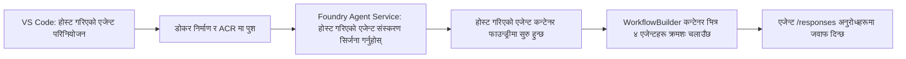
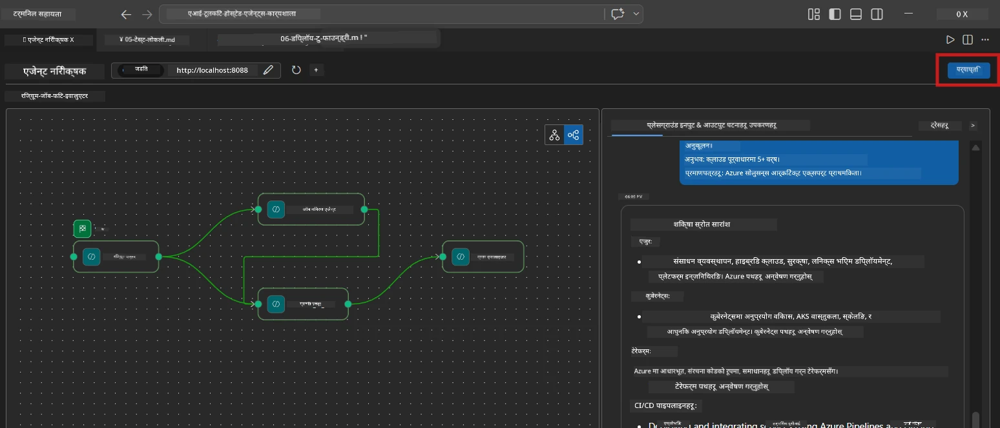

# मोड्युल ६ - Foundry Agent सेवा मा डिप्लोय गर्नुहोस्

⏱️ ~१० मिनेट

यस मोड्युलमा, तपाईंले स्थानिय रूपमा परीक्षण गरिएको बहु-एजेन्ट वर्कफ्लोलाई [Microsoft Foundry](https://learn.microsoft.com/azure/foundry/agents/concepts/hosted-agents) मा **Hosted Agent** को रूपमा डिप्लोय गर्नुहुनेछ। डिप्लोयमेन्ट प्रक्रियाले डोकर कन्टेनर छवि निर्माण गर्छ, यसलाई [Azure Container Registry (ACR)](https://learn.microsoft.com/azure/container-registry/container-registry-intro) मा पुश गर्छ, र [Foundry Agent Service](https://learn.microsoft.com/azure/foundry/agents/how-to/publish-agent) मा एक hosted agent संस्करण बनाउँछ।

> **Lab 01 बाट मुख्य भिन्नता:** डिप्लोयमेन्ट प्रक्रिया उस्तै छ। Foundry तपाईंको बहु-एजेन्ट वर्कफ्लोलाई एकल hosted agent को रूपमा व्यवहार गर्छ - जटिलता कन्टेनरभित्र हुन्छ, तर डिप्लोयमेन्ट सतह उही `/responses` अन्तबिन्दु हो।

### डिप्लोयमेन्ट पाइपलाइन


```mermaid
flowchart LR
    A[VS Code: होस्ट गरिएको एजेन्ट परिनियोजन] --> B[डोकर निर्माण र ACR मा पुश]
    B --> C[Foundry Agent Service: होस्ट गरिएको एजेन्ट संस्करण सिर्जना गर्नुहोस्]
    C --> D[होस्ट गरिएको एजेन्ट कन्टेनर फाउन्ड्रीमा सुरु हुन्छ]
    D --> E[WorkflowBuilder कन्टेनर भित्र ४ एजेन्टहरू क्रमशः चलाउँछ]
    E --> F[एजेन्ट /responses अनुरोधहरूमा जवाफ दिन्छ]
```

---

## पूर्वापेक्षित जाँच

डिप्लोय गर्नु अघि तलको प्रत्येक वस्तु पुष्टि गर्नुहोस्:

1. **एजेन्टले स्थानिय स्मोक परीक्षण पास गरेको छ:**
   - तपाईंले [मोड्युल ५](05-test-locally.md) मा सबै ३ परीक्षणहरू पूरा गर्नुभएको छ र वर्कफ्लोलाले पूर्ण आउटपुट ग्याप कार्डहरू र Microsoft Learn URLs सहित उत्पादन गरेको छ।

2. **तपाईं सँग [Foundry User](https://learn.microsoft.com/azure/foundry/concepts/rbac-foundry) भूमिका छ** (डिप्लोय गर्न, तपाईंलाई न्यूनतम **Foundry Project Manager** परियोजना स्कोपमा आवश्यक छ):

   > **सूचना:** Foundry RBAC भूमिकाहरू भर्खरै नाम परिवर्तन भएका छन् - **Foundry User**, **Foundry Owner**, र **Foundry Project Manager** पहिले Azure AI User, Azure AI Owner, र Azure AI Project Manager का रूपमा चिनिन्थे। भूमिका ID र अनुमतिहरू परिवर्तन भएको छैन।

   - [Azure Portal](https://portal.azure.com) → तपाईंको Foundry **परियोजना** स्रोत → **Access control (IAM)** → **Role assignments** → तपाईंको खाता लागि **Foundry User** (वा माथि) सूचीबद्ध छ कि छैन जाँच्नुहोस्।

3. **तपाईं VS Code मा Azure मा साइन इन हुनुहुन्छ:**
   - VS Code को तल्लो-बायाँतर्फ रहेको Accounts आइकन जाँच्नुहोस्। तपाईंको खाता नाम देखिनु पर्छ।

4. **`agent.yaml` मा सही मानहरू छन्:**
   - `PersonalCareerCopilot/agent.yaml` खोल्नुहोस् र पुष्टि गर्नुहोस्:
     ```yaml
     environment_variables:
       - name: AZURE_AI_MODEL_DEPLOYMENT_NAME
         value: ${AZURE_AI_MODEL_DEPLOYMENT_NAME}
     ```
   - `FOUNDRY_PROJECT_ENDPOINT` यहाँ सूचीबद्ध छैन - Foundry ले यसलाई रनटाइममा इन्जेक्ट गर्छ। केवल `AZURE_AI_MODEL_DEPLOYMENT_NAME` घोषणा गर्न आवश्यक छ।

5. **`requirements.txt` मा सही संस्करणहरू छन्:**
   ```
   agent-framework-foundry
   agent-framework-foundry-hosting
   mcp<2,>=1.24.0
   debugpy
   ```

---

## चरण १: डिप्लोयमेन्ट सुरु गर्नुहोस्

### विकल्प A: Agent Inspector बाट डिप्लोय गर्नुहोस् (सिफारिस गरिएको)

यदि एजेन्ट F5 मार्फत Agent Inspector खोलिएको अवस्थामा चलिरहेको छ भने:

1. Agent Inspector प्यानलको **शीर्ष-दायाँ कुनामा** हेर्नुहोस्।
2. **Deploy** बटन (मेद Cloud आइकन माथि तीर ↑ सहित) मा क्लिक गर्नुहोस्।
3. डिप्लोयमेन्ट विजार्ड खुल्छ।



### विकल्प B: Command Palette बाट डिप्लोय गर्नुहोस्

1. `Ctrl+Shift+P` थिचेर **Command Palette** खोल्नुहोस्।
2. टाइप गर्नुहोस्: **Foundry Toolkit: Deploy Hosted Agent** र चयन गर्नुहोस्।
3. डिप्लोयमेन्ट विजार्ड खुल्छ।

---

## चरण २: डिप्लोयमेन्ट कन्फिगर गर्नुहोस्

### २.१ लक्ष्य परियोजना चयन गर्नुहोस्

1. एउटा ड्रपडाउनमा तपाईंका Foundry परियोजनाहरू देखाइन्छ।
2. तपाईंले कार्यशालाभर प्रयोग गरेको परियोजना चयन गर्नुहोस् (जस्तै, `workshop-agents`)।

### २.२ कन्टेनर एजेन्ट फाइल चयन गर्नुहोस्

1. तपाईंलाई एजेन्ट इन्ट्री पोइन्ट चयन गर्न भनिनेछ।
2. `workshop/lab02-multi-agent/PersonalCareerCopilot/` मा जानुहोस् र **`main.py`** छान्नुहोस्।

### २.३ स्रोतहरू कन्फिगर गर्नुहोस्

| सेटिङ | सिफारिस गरिएको मान | टिप्पणीहरू |
|---------|------------------|-------|
| **Deployment विधि** | **कन्टेनर** (सिफारिस गरिएको) वा **कोड** | कन्टेनरले Docker छवि निर्माण गर्छ; कोडले स्रोतलाई ZIP (पूर्वावलोकन) को रूपमा अपलोड गर्छ |
| **कन्टेनर रजिस्ट्री** | **डिफल्ट ACR** | Foundry एक स्वचालित रूपमा सिर्जना र व्यवस्थापन गर्छ |
| **CPU** | `0.25` | डिफल्ट। बहु-एजेन्ट वर्कफ्लोहरूको लागि अधिक CPU आवश्यक छैन किनभने मोडेल कलहरू I/O-आधारित हुन्छन् |
| **मेमोरी** | `0.5Gi` | डिफल्ट। यदि ठूलो डाटा प्रोसेसिङ उपकरण थप्नुभयो भने `1Gi` मा बढाउनुहोस् |

---

## चरण ३: पुष्टि र डिप्लोय गर्नुहोस्

1. विजार्डले डिप्लोयमेन्ट सारांश देखाउँछ।
2. समीक्षा गर्नुहोस् र **Confirm and Deploy** मा क्लिक गर्नुहोस्।
3. VS Code मा प्रगति हेरिरहनुहोस्।

### डिप्लोयमेन्टको बेला के हुन्छ

VS Code को **Output** प्यानल हेर्नुहोस् ( "Microsoft Foundry" ड्रपडाउन चयन गर्नुहोस्):

1. **Docker निर्माण** - तपाईंको `Dockerfile` बाट कन्टेनर बनाउँछ
   ```
   Step 1/6 : FROM python:3.12-slim
   Step 2/6 : WORKDIR /app
   ...
   Successfully built abc123def456
   ```

2. **Docker पुश** - छवि ACR मा पठाउँछ (पहिलो डिप्लोयमा १-३ मिनेट लाग्छ)।

3. **एजेन्ट दर्ता** - Foundry ले `agent.yaml` मेटाडेटा प्रयोग गरेर hosted एजेन्ट सिर्जना गर्छ। एजेन्ट नाम `resume-job-fit-evaluator` हो।

4. **कन्टेनर सुरु** - Foundry को व्यवस्थापन गरिएको पूर्वाधारमा कन्टेनर सुरु हुन्छ र प्रणाली प्रबन्धित पहिचान छ।

> **पहिलो डिप्लोयमेन्ट ढिलो हुन्छ** (Docker ले सबै तहहरू पुश गर्छ)। पछिल्ला डिप्लोयहरूले क्यास गरिएको तहहरू पुन: प्रयोग गर्छन् र छिटो हुन्छन्।

### बहु-एजेन्ट विशिष्ट नोटहरू

- **सबै चार एजेन्टहरू एउटै कन्टेनरमा छन्।** Foundry ले यसलाई एकल hosted एजेन्टको रूपमा देख्छ। WorkflowBuilder ग्राफ भित्रै चल्छ।
- **MCP कलहरू बाहिर जान्छन्।** कन्टेनरले इन्टरनेट पहुँच आवश्यक छ `https://learn.microsoft.com/api/mcp` पुग्न। Foundry को प्रबन्धित पूर्वाधारले यो स्वचालित रूपमा प्रदान गर्छ।
- **[Managed Identity](https://learn.microsoft.com/azure/foundry/agents/concepts/agent-identity)।** Foundry ले डिप्लोय समयमा प्रत्येक Hosted एजेन्टका लागि **समर्पित प्रति-एजेन्ट Entra पहिचान** स्वचालित रूपमा सिर्जना गर्छ। Hosted वातावरणमा, `DefaultAzureCredential` ले यस एजेन्ट पहिचानलाई स्वत: समाधान गर्छ - कुनै म्यानुअल व्यवस्थापन पहिचान कन्फिगरेसन आवश्यक छैन।

---

## चरण ४: डिप्लोयमेन्ट स्थिति प्रमाणित गर्नुहोस्

1. **Microsoft Foundry** साइडबार खोल्नुहोस् (Activity Bar मा Foundry आइकन क्लिक गर्नुहोस्)।
2. तपाईंको परियोजना अन्तर्गत **Hosted Agents (Preview)** विस्तार गर्नुहोस्।
3. **resume-job-fit-evaluator** (वा तपाईंको एजेन्ट नाम) खोज्नुहोस्।
4. एजेन्ट नाममा क्लिक गर्नुहोस् → संस्करणहरू विस्तार गर्नुहोस् (जस्तै, `v1`)।
5. संस्करणमा क्लिक गर्नुहोस् → **Container Details** → **Status** जाँच गर्नुहोस्:


| स्थिति | अर्थ |
|--------|---------|
| **सक्रिय** | एजेन्ट चलिरहेको छ र अनुरोधहरू स्वीकार गर्न तयार छ |
| **सिर्जना हुँदैछ** | कन्टेनर सुरु हुँदैछ (३०–६० सेकेन्ड प्रतीक्षा गर्नुहोस्) |
| **असफल** | कन्टेनर सुरु हुन सकेन (लॉगहरू जाँच्नुहोस् - तल हेर्नुहोस्) |

> **सूचना:** VS Code साइडबारले "Running" वा "Started" लेबल देखाउन सक्छ जबकि अन्तर्निहित API स्थिति `active`/`creating` प्रयोग गर्छ। दुबै देखावट एउटै अवस्था जनाउँछन्।

> **बहु-एजेन्ट सुरु हुन समय लाग्छ** किनभने कन्टेनरले ४ एजेन्ट उदाहरणहरू सुरु गर्दछ। `creating` २ मिनेटसम्म सामान्य हो।

---

## सामान्य डिप्लोयमेन्ट त्रुटिहरू र समाधानहरू

### त्रुटि १: अनुमति अस्वीकृत - `agents/write`

```
Error: lacks the required data action 
Microsoft.CognitiveServices/accounts/AIServices/agents/write
```

**समाधान:** **[Foundry User](https://learn.microsoft.com/azure/foundry/concepts/rbac-foundry)** भूमिका परियोजना स्तरमा असाइन् गर्नुहोस् (पहिलेको **Azure AI User**)। चरण-द्वारा-चरण निर्देशनको लागि [मोड्युल ८ - समस्या समाधान](08-troubleshooting.md) हेर्नुहोस्।

### त्रुटि २: Docker चलिरहेको छैन

```
Error: Docker build failed / Cannot connect to Docker daemon
```

**समाधान:**
१. Docker Desktop सुरु गर्नुहोस्।
२. "Docker Desktop is running" सम्म पर्खनुहोस्।
३. पुष्टि गर्नुहोस्: `docker info`
४. **Windows:** Docker Desktop settings मा WSL 2 backend सक्षम छ कि छैन जाँच्नुहोस्।
५. पुनः प्रयास गर्नुहोस्।

### त्रुटि ३: pip install Docker निर्माणका क्रममा असफल

```
Error: Could not find a version that satisfies the requirement agent-framework-foundry
```

**समाधान:** `requirements.txt` मिल्छ कि छैन जाँच्नुहोस्:
```
agent-framework-foundry
agent-framework-foundry-hosting
mcp<2,>=1.24.0
debugpy
```

यदि निर्माण अझै असफल भयो भने, तपाईंको Docker नेटवर्कले PyPI ब्लक गर्न सक्छ। `docker info` मा प्रक्सी सेटिङ्हरू जाँच्नुहोस्।

### त्रुटि ४: MCP उपकरण होस्टेड एजेन्टमा असफल

यदि डिप्लोयमेन्ट पछि Gap Analyzer ले Microsoft Learn URLs उत्पादन गर्न छोड्यो भने:

**मूल कारण:** नेटवर्क नीति कन्टेनरबाट आउटबाउन्ड HTTPS ब्लक गर्छ।

**समाधान:**
1. प्रायः Foundry को डिफल्ट कन्फिगरेसनमा यो समस्या हुँदैन।
2. यदि भयो भने, Foundry परियोजनाको भर्चुअल नेटवर्कमा NSG ले आउटबाउन्ड HTTPS ब्लक गरेको छ कि छैन जाँच्नुहोस्।
3. MCP उपकरणमा बिल्ट-इन फालब्याक URLहरू छन्, त्यसैले एजेन्टले अझै पनि आउटपुट उत्पादन गर्नेछ (लाइभ URL बिना)।

---

### चेकपोइन्ट

- [ ] VS Code मा त्रुटि बिना डिप्लोय कमाण्ड पूरा भयो
- [ ] Foundry साइडबारमा **Hosted Agents (Preview)** अन्तर्गत एजेन्ट देखिन्छ
- [ ] एजेन्ट नाम `resume-job-fit-evaluator` (वा तपाईंले चयन गरेको नाम) हो
- [ ] कन्टेनर स्थिति **Started** वा **Running** देखाउँछ
- [ ] (यदि त्रुटि भए) तपाईंले त्रुटि पहिचान गर्नुभयो, समाधान लागू गर्नुभयो, र सफलतापूर्वक पुनः डिप्लोय गर्नुभयो

---

**अघिल्लो:** [०५ - स्थानिय रूपमा परीक्षण गर्नुहोस्](05-test-locally.md) · **अर्को:** [०७ - Playground मा प्रमाणित गर्नुहोस् →](07-verify-in-playground.md)

---

<!-- CO-OP TRANSLATOR DISCLAIMER START -->
**अस्वीकरण**:
यो दस्तावेज़ AI अनुवाद सेवा [Co-op Translator](https://github.com/Azure/co-op-translator) प्रयोग गरेर अनुवाद गरिएको हो। हामी सही हुन प्रयास गर्छौं, तर कृपया जानकार हुनुस् कि स्वचालित अनुवादमा त्रुटिहरू वा अशुद्धताहरू हुन सक्छन्। मूल दस्तावेज़ यसको मूल भाषामा आधिकारिक स्रोत मानिनुपर्छ। महत्वपूर्ण जानकारीका लागि व्यावसायिक मानव अनुवाद सिफारिस गरिन्छ। यस अनुवादको प्रयोगबाट उत्पन्न कुनै पनि गलत बुझाइ वा त्रुटिको लागि हामी जिम्मेवार छैनौं।
<!-- CO-OP TRANSLATOR DISCLAIMER END -->