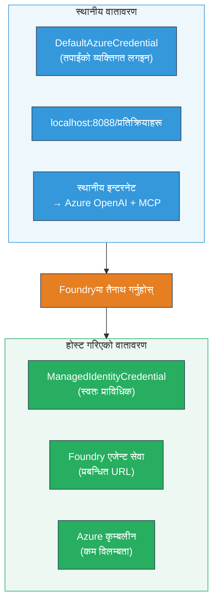

# Module 7 - Playground मा प्रमाणित गर्नुहोस्

यस मोड्युलमा, तपाईंले तपाइँको तैनाथ बहु-एजेन्ट कार्यप्रवाह **VS Code** र **[Foundry Portal](https://ai.azure.com)** दुबैमा परीक्षण गर्नुहुन्छ, एजेन्टले स्थानीय परीक्षणसँग एकदम उस्तै व्यवहार गर्छ भनी पुष्टि गर्दै।

---

## तैनाथ पछि प्रमाणित किन गर्ने?

तपाईंको बहु-एजेन्ट कार्यप्रवाह स्थानीय रूपमा पूर्ण रूपमा चल्यो, त्यसैले फेरि किन परीक्षण गर्ने? होस्ट गरिएको वातावरण विभिन्न तरिकाले फरक छ:


| फरक | स्थानीय | होस्ट गरिएको |
|-----------|-------|--------|
| **पहिचान** | [`DefaultAzureCredential`](https://learn.microsoft.com/azure/developer/python/sdk/authentication/credential-chains#defaultazurecredential-overview) (तपाईंको व्यक्तिगत साइन-इन) | [`ManagedIdentityCredential`](https://learn.microsoft.com/python/api/overview/azure/identity-readme#managed-identity-support) (स्वचालित प्रावधान गरिएको) |
| **एन्डपोइन्ट** | `http://localhost:8088/responses` | [Foundry Agent Service](https://learn.microsoft.com/azure/foundry/agents/concepts/hosted-agents) एन्डपोइन्ट (प्रबन्धित URL) |
| **नेटवर्क** | स्थानीय मेसिन → Azure OpenAI + MCP आउटबाउण्ड | Azure ब्याकबोन (सेवाहरू बीच कम लेटेन्सी) |
| **MCP कनेक्टिविटी** | स्थानीय इन्टरनेट → `learn.microsoft.com/api/mcp` | कन्टेनर आउटबाउण्ड → `learn.microsoft.com/api/mcp` |

यदि कुनै वातावरण भेरिएबल गलत कन्फिगर गरिएको छ, RBAC फरक छ, वा MCP आउटबाउण्ड अवरुद्ध छ भने, यहाँ तपाईंले पत्ता लगाउनुहुनेछ।

---

## विकल्प A: VS Code Playground मा परीक्षण गर्नुहोस् (प्रथम सिफारिस गरिएको)

[Foundry एक्सटेन्सन](https://marketplace.visualstudio.com/items?itemName=TeamsDevApp.vscode-ai-foundry) मा एक एकीकृत Playground समावेश छ जसले तपाईंलाई VS Code छोड्नु नपरी तैनाथ एजेन्टसँग कुराकानी गर्न अनुमति दिन्छ।

### चरण १: तपाईंको होस्ट गरिएको एजेन्टमा जानुहोस्

1. VS Code को **Activity Bar** (बायाँ साइडबार) मा **Microsoft Foundry** आइकन क्लिक गरेर Foundry प्यानल खोल्नुहोस्।
2. तपाईंको जडान गरिएको प्रोजेक्ट विस्तार गर्नुहोस् (जस्तै, `workshop-agents`)।
3. **Hosted Agents (Preview)** विस्तार गर्नुहोस्।
4. तपाईंले आफ्नो एजेन्ट नाम देख्नु पर्नेछ (जस्तै, `resume-job-fit-evaluator`)।

### चरण २: संस्करण छनोट गर्नुहोस्

1. एजेन्टको नाममा क्लिक गरेर यसको संस्करणहरू विस्तार गर्नुहोस्।
2. तपाईंले तैनाथ गरेको संस्करणमा क्लिक गर्नुहोस् (जस्तै, `v1`)।
3. **detail panel** खुल्छ जुन कन्टेनर विवरण देखाउँछ।
4. स्थिति **Started** वा **Running** छ भनि पुष्टि गर्नुहोस्।

### चरण ३: Playground खोल्नुहोस्

1. detail panel मा, **Playground** बटन क्लिक गर्नुहोस् (वा संस्करणमा राइट-क्लिक गरेर → **Open in Playground**)।
2. VS Code ट्याबमा च्याट इन्टरफेस खुल्नेछ।

### चरण ४: तपाईंका स्मोक परीक्षणहरू चलाउनुहोस्

[Module 5](05-test-locally.md) बाट उही ३ परीक्षणहरू प्रयोग गर्नुहोस्। प्रत्येक सन्देश Playground इनपुट बाकसमा टाइप गरी **Send** (वा **Enter**) थिच्नुहोस्।

#### परीक्षण १ - पूर्ण रिजुमे + JD (मानक प्रवाह)

Module 5, Test 1 (Jane Doe + Senior Cloud Engineer at Contoso Ltd) बाट पूर्ण रिजुमे + JD प्रॉम्प्ट पेस्ट गर्नुहोस्।

**अपेक्षित:**
- फिट स्कोर ब्रेकडाउन गणितसहित (१००-बिन्दु स्केल)
- मिलेका सीपहरू खण्ड
- हराएका सीपहरू खण्ड
- **प्रत्येक हराएको सीपको लागि एक ग्याप कार्ड** Microsoft Learn URL सहित
- सिकाइ रोडम्याप समयरेखा सहित

#### परीक्षण २ - छिटो संक्षिप्त परीक्षण (न्यूनतम इनपुट)

```
RESUME: 3 years Python developer, knows Django and PostgreSQL, no cloud experience.

JOB: Cloud DevOps Engineer requiring AWS, Kubernetes, Terraform, CI/CD. 5 years needed.
```

**अपेक्षित:**
- कम फिट स्कोर (< ४०)
- सत्यापनात्मक मूल्यांकन र क्रमबद्ध सिकाइ मार्ग
- धेरै ग्याप कार्डहरू (AWS, Kubernetes, Terraform, CI/CD, अनुभव अन्तर)

#### परीक्षण ३ - उच्च फिट उम्मेदवार

```
RESUME:
10 years Azure Cloud Architect. AZ-305 certified. Expert in AKS, Terraform, Azure DevOps, 
Azure Functions, Helm, Prometheus, Grafana, Python, Go. Led platform team of 8.

JOB:
Senior Cloud Engineer. Required: AKS, Terraform, Azure DevOps, Python. Preferred: Helm, Go.
5+ years experience. AZ-305 preferred.
```

**अपेक्षित:**
- उच्च फिट स्कोर (≥ ८०)
- अन्तर्वार्ता तयारी र पॉलिसिङमा केन्द्रित
- केही वा कुनै पनि ग्याप कार्ड नभएको
- तयारीमा केन्द्रित छोटो समयरेखा

### चरण ५: स्थानीय नतिजाहरूसँग तुलना गर्नुहोस्

Module 5 बाट तपाईंले बचत गर्नुभएको स्थानीय प्रतिक्रियाहरू वा नोटहरू खोल्नुहोस्। प्रत्येक परीक्षणका लागि:

- प्रतिक्रियामा **उही संरचना** छ (फिट स्कोर, ग्याप कार्ड, रोडम्याप)?
- **समान स्कोरिङ नियमावली** पालन भएको छ (१००-बिन्दु ब्रेकडाउन)?
- ग्याप कार्डहरूमा **Microsoft Learn URL हरू** अझै छन्?
- हराएको प्रत्येक सीपको लागि **एक ग्याप कार्ड** छ (कटौती नभएको)?

> **सानो शब्द उपयोग भिन्नता सामान्य हो** - मोडल गैर-निश्चितात्मक हुन्छ। संरचना, स्कोरिङ निरन्तरता, र MCP उपकरण प्रयोगमा ध्यान दिनुहोस्।

---

## विकल्प B: Foundry Portal मा परीक्षण गर्नुहोस्

[Foundry Portal](https://ai.azure.com) वेब-आधारित प्लेग्राउन्ड प्रदान गर्ने जसले सहकर्मी वा सरोकारवालाहरूसँग साझेदारी गर्न उपयोगी छ।

### चरण १: Foundry Portal खोल्नुहोस्

1. आफ्ना ब्राउजर खोल्नुहोस् र [https://ai.azure.com](https://ai.azure.com) मा जानुहोस्।
2. कार्यशालाको क्रममा प्रयोग गरिरहेको उही Azure खाताले साइन इन गर्नुहोस्।

### चरण २: तपाईंको प्रोजेक्टमा जानुहोस्

1. होम पृष्ठमा, बायाँ साइडबारमा **Recent projects** खोज्नुहोस्।
2. तपाईंको प्रोजेक्ट नाममा क्लिक गर्नुहोस् (जस्तै, `workshop-agents`)।
3. यदि देखिन्न भने, **All projects** क्लिक गरेर खोज्नुहोस्।

### चरण ३: तपाईंको तैनाथ एजेन्ट पत्ता लगाउनुहोस्

1. प्रोजेक्ट बायाँ नेभिगेसनमा, **Build** → **Agents** (वा **Agents** खण्ड हेर्नुहोस्) मा क्लिक गर्नुहोस्।
2. तपाईंले एजेन्टहरूको सूची देख्नु पर्नेछ। तपाईंको तैनाथ एजेन्ट फेला पार्नुहोस् (जस्तै, `resume-job-fit-evaluator`)।
3. एजेन्टको नाम क्लिक गरेर यसको विवरण पृष्ठ खोल्नुहोस्।

### चरण ४: Playground खोल्नुहोस्

1. एजेन्ट विवरण पृष्ठमा, माथिल्लो उपकरण पट्टि हेर्नुहोस्।
2. **Open in playground** (वा **Try in playground**) क्लिक गर्नुहोस्।
3. च्याट इन्टरफेस खुल्नेछ।

### चरण ५: उही स्मोक परीक्षणहरू चलाउनुहोस्

VS Code Playground भागबाट माथि उल्लिखित ३ परीक्षणहरू सबै दोहोर्याउनुहोस्। प्रत्येक प्रतिक्रियालाई स्थानीय नतिजा (Module 5) र VS Code Playground नतिजासँग (विकल्प A माथि) तुलना गर्नुहोस्।

---

## बहु-एजेन्ट विशिष्ट प्रमाणिकरण

मूलतः सहि कामकाजी बाहेक, यी बहु-एजेन्ट विशिष्ट व्यवहारहरू पनि प्रमाणित गर्नुहोस्:

### MCP उपकरण कार्यान्वयन

| जाँच | कसरी प्रमाणित गर्ने | पास अवस्था |
|-------|---------------|----------------|
| MCP कल सफल | ग्याप कार्डहरूमा `learn.microsoft.com` URLs छन् | वास्तविक URLs, फ्यालब्याक सन्देश होइन |
| धेरै MCP कलहरू | प्रत्येक उच्च/मध्यम प्राथमिकता ग्यापसँग स्रोतहरू छन् | केवल पहिलो ग्याप कार्ड होइन |
| MCP फ्यालब्याक काम गर्छ | यदि URLs हराइरहेका छन् भने, फ्यालब्याक पाठ जाँच्नुहोस् | एजेन्ट अझै ग्याप कार्डहरू उत्पादन गर्छ (URL सँग वा बिना) |

### एजेन्ट समन्वय

| जाँच | कसरी प्रमाणित गर्ने | पास अवस्था |
|-------|---------------|----------------|
| सबै ४ एजेन्टहरूले चलाए | आउटपुटमा फिट स्कोर र ग्याप कार्डहरू छन् | स्कोर MatchingAgent बाट, कार्डहरू GapAnalyzer बाट |
| समानान्तर फ्यान-आउट | प्रतिक्रिया समय उचित छ (< २ मिनेट) | यदि > ३ मिनेट, समानान्तर कार्यान्वयन काम नगर्न सक्छ |
| डाटा प्रवाह अखण्डता | ग्याप कार्डहरूले मिलान रिपोर्टका सीपहरू सन्दर्भित गर्छन् | JD बाहेक कुनै गलत सीप छैन |

---

## प्रमाणिकरण मापदण्ड

तपाईँको बहु-एजेन्ट कार्यप्रवाहको होस्ट गरिएको व्यवहार मूल्यांकन गर्न यो मापदण्ड प्रयोग गर्नुहोस्:

| # | मापदण्ड | पास अवस्था | पास? |
|---|----------|---------------|-------|
| 1 | **कार्यात्मक सहि काम** | एजेन्टले रिजुमे + JD मा फिट स्कोर र अन्तर विश्लेषणसहित प्रतिक्रिया दिन्छ | |
| 2 | **स्कोरिङ निरन्तरता** | फिट स्कोरले १००-बिन्दुस्केल ब्रेकडाउन गणित प्रयोग गर्छ | |
| 3 | **ग्याप कार्डको पूर्णता** | प्रत्येक हराएको सीपको लागि एक कार्ड (कटौती वा संयोजन नभएको) | |
| 4 | **MCP उपकरण इंटिग्रेशन** | ग्याप कार्डहरूमा वास्तविक Microsoft Learn URLs छन् | |
| 5 | **संरचनात्मक निरन्तरता** | आउटपुट संरचना स्थानीय र होस्ट गरिएको दुवै रनहरू मिल्छन् | |
| 6 | **प्रतिक्रियाको समय** | होस्ट गरिएको एजेन्टले पूर्ण मूल्याङ्कनमा २ मिनेटभित्र प्रतिक्रिया दिन्छ | |
| 7 | **त्रुटि छैन** | HTTP 500 त्रुटि, टाइमआउट, वा खाली प्रतिक्रिया छैन | |

> "पास" को अर्थ हो सबै ७ मापदण्डहरू सबै ३ स्मोक परीक्षणहरूका लागि कम्तिमा एक प्लेग्राउन्ड (VS Code वा पोर्टल) मा पूरा भएको।

---

## प्लेग्राउन्ड समस्याहरू समाधान

| लक्षण | सम्भावित कारण | समाधान |
|---------|-------------|-----|
| प्लेग्राउन्ड लोड हुँदैन | कन्टेनर स्थिति "Started" छैन | [Module 6](06-deploy-to-foundry.md) मा फर्केर, तैनाथ स्थिति पुष्टि गर्ने। यदि "Pending" छ भने पर्खनुहोस् |
| एजेन्टले खाली प्रतिक्रिया दिन्छ | मोडल तैनाथ नाम मिल्दैन | `agent.yaml` → `environment_variables` → `MODEL_DEPLOYMENT_NAME` तपाइँले तैनाथ गरेको मोडलसँग मेल खान्छ कि छैन जाँच्नुहोस् |
| एजेन्टले त्रुटि सन्देश फर्काउँछ | [RBAC](https://learn.microsoft.com/azure/foundry/concepts/rbac-foundry) अनुमति छैन | प्रोजेक्ट स्कोपमा **[Azure AI User](https://aka.ms/foundry-ext-project-role)** असाइन गर्नुहोस् |
| ग्याप कार्डहरूमा Microsoft Learn URL छैन | MCP आउटबाउण्ड अवरुद्ध वा MCP सर्भर अनुपलब्ध | कन्टेनरले `learn.microsoft.com` पहुँच गर्न सक्छ कि छैन जाँच्नुहोस्। [Module 8](08-troubleshooting.md) हेर्नुहोस् |
| केवल १ ग्याप कार्ड (कटौती भएको) | GapAnalyzer निर्देशनहरूमा "CRITICAL" ब्लक छैन | [Module 3, Step 2.4](03-configure-agents.md) पुनरावलोकन गर्नुहोस् |
| फिट स्कोर स्थानीयभन्दा धेरै फरक छ | फरक मोडल वा निर्देशनहरू तैनाथ गरिएको | `agent.yaml` का वातावरण भेरिएबलहरू स्थानीय `.env` सँग तुलना गर्नुहोस्। आवश्यक भए पुन: तैनाथ गर्नुहोस् |
| पोर्टलमा "Agent not found" देखिन्छ | तैनाथ प्रक्रिया अझै जारी छ वा असफल भयो | २ मिनेट पर्खनुहोस्, रिफ्रेश गर्नुहोस्। अझै हराएमा [Module 6](06-deploy-to-foundry.md) बाट पुन: तैनाथ गर्नुहोस् |

---

### जाँच सूची

- [ ] VS Code Playground मा एजेन्ट परीक्षण गरियो - सबै ३ स्मोक परीक्षणहरू पास
- [ ] [Foundry Portal](https://ai.azure.com) Playground मा एजेन्ट परीक्षण गरियो - सबै ३ स्मोक परीक्षणहरू पास
- [ ] प्रतिक्रियाहरू स्थानीय परीक्षणसँग संरचनात्मक रूपले सुसंगत (फिट स्कोर, ग्याप कार्ड, रोडम्याप)
- [ ] ग्याप कार्डहरूमा Microsoft Learn URLs छन् (होस्ट गरिएको वातावरणमा MCP उपकरण काम गर्दैछ)
- [ ] हराएको प्रत्येक सीपको लागि एक ग्याप कार्ड (कुनै कटौती छैन)
- [ ] परीक्षणका क्रममा कुनै त्रुटि वा टाइमआउट छैन
- [ ] प्रमाणिकरण मापदण्ड सम्पन्न (सबै ७ मापदण्ड पास)

---

**अघिल्लो:** [06 - Deploy to Foundry](06-deploy-to-foundry.md) · **अर्को:** [08 - Troubleshooting →](08-troubleshooting.md)

---

<!-- CO-OP TRANSLATOR DISCLAIMER START -->
**अस्वीकरण**:  
यस कागजातलाई AI अनुवाद सेवा [Co-op Translator](https://github.com/Azure/co-op-translator) प्रयोग गरी अनुवाद गरिएको छ। हामी शुद्धताका लागि प्रयासरत छौं, तर कृपया ध्यान दिनुहोस् कि स्वचालित अनुवादमा त्रुटि वा अशुद्धता हुन सक्छ। मूल कागजातलाई यसको मूल भाषामा आधिकारिक स्रोतको रूपमा मानिनुपर्छ। महत्वपूर्ण जानकारीको लागि, व्यावसायिक मानव अनुवाद सिफारिस गरिन्छ। यस अनुवादको प्रयोगबाट उत्पन्न कुनै पनि गलतफहमी वा गलत व्याख्याका लागि हामी जिम्मेवार हुनेछैनौं।
<!-- CO-OP TRANSLATOR DISCLAIMER END -->