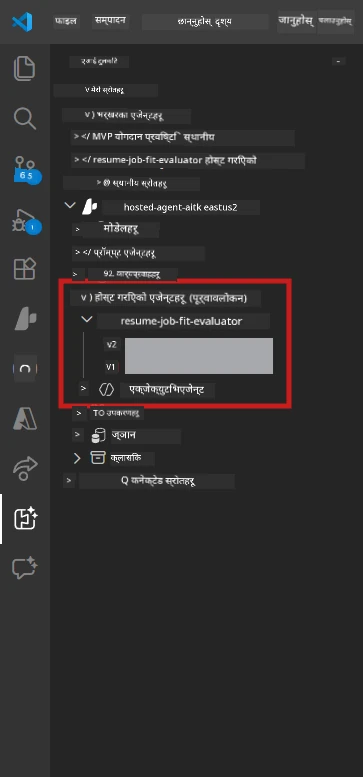

# मोड्युल ७ - प्लेटग्राउण्डमा प्रमाणीकरण गर्नुहोस्

⏱️ ~१० मिनेट

यस मोड्युलमा, तपाईंले आफ्नो तैनात गरिएको बहु-एजेन्ट कार्यप्रवाहलाई VS Code र Foundry पोर्टलमा परीक्षण गर्नुहुन्छ, एजेन्टले स्थानीय परीक्षण जस्तै व्यवहार गर्छ कि गर्दैन भनि पुष्टि गर्दै।

---

## किन तैनाती पछि फेरि परीक्षण गर्ने?

होस्ट गरिएको वातावरण केही महत्वपूर्ण तरिकामा स्थानीय वातावरणबाट फरक हुन्छ:

| | स्थानीय | होस्ट गरिएको |
|--|-------|--------|
| **पहिचान** | तपाईंको व्यक्तिगत साइन-इन (`DefaultAzureCredential`) | प्रति एजेन्ट समर्पित इन्ट्रा पहिचान (तैनातीको समयमा स्वतः प्रावधान गरिएको) |
| **एन्डपोइन्ट** | `http://localhost:8088/responses` | Foundry एजेन्ट सेवा व्यवस्थापित URL |
| **नेटवर्क** | तपाईंको मेसिन → Azure OpenAI + MCP | Azure ब्याकबोन (कम विलम्ब) |

गलत कन्फिगर गरिएको वातावरण चर, RBAC समस्या, वा अवरुद्ध MCP आइसोOutbound कल यहाँ पहिलो पटक देखिँनेछ।

---

## विकल्प A: VS Code प्लेटग्राउण्डमा परीक्षण गर्नुहोस् (सिफारिस गरिएको पहिलो विकल्प)

### चरण १: आफ्नो होस्ट गरिएको एजेन्टमा जानुहोस्

1. Activity बारमा **Foundry Toolkit** आइकन क्लिक गर्नुहोस्।
2. आफ्नो प्रोजेक्ट विस्तार गर्नुहोस् → **Hosted Agents (Preview)** → आफ्नो एजेन्ट खोज्नुहोस्।



### चरण २: एक संस्करण छनौट गर्नुहोस्

1. एजेन्टमा क्लिक गरेर यसको संस्करणहरू फैलाउनुहोस्।
2. `v1` मा क्लिक गर्नुहोस् → स्थिति **active** छ भनि पुष्टि गर्नुहोस् (साइडबारले "Running" वा "Started" देखाउन सक्छ - दुबैले एउटै तयार स्थिति जनाउँछ)।

### चरण ३: प्लेटग्राउण्ड खोल्नुहोस्

1. **Playground** क्लिक गर्नुहोस् (वा संस्करणमा राइट-क्लिक → **Open in Playground**)।
2. एक च्याट विन्डो VS Code ट्याबमा खुल्छ।

### चरण ४: आफ्ना स्मोक परीक्षणहरू चलाउनुहोस्

[मोड्युल ५](05-test-locally.md) बाट त्यही ३ परीक्षणहरू प्रयोग गर्नुहोस्। प्रत्येक सन्देश प्लेटग्राउण्ड इनपुट बक्समा टाइप गरी **Send** (वा **Enter**) थिच्नुहोस्।

#### परीक्षण १ - पूर्ण रिजुमे + JD (मानक प्रवाह)

मोड्युल ५, परीक्षण १ बाट पूर्ण रिजुमे + JD प्रॉम्प्ट टाँस्नुहोस् (Jane Doe + Senior Cloud Engineer at Contoso Ltd)।

**अपेक्षित:**
- फिट स्कोर सहित विश्लेषण (१००-बिन्दु मापन)
- मेल खाने कौशल खण्ड
- हराएका कौशल खण्ड
- **हरेक हराएको कौशलको लागि एक ग्याप कार्ड** Microsoft Learn को URL समेत
- समयरेखा सहित शिक्षण योजना

#### परीक्षण २ - छिटो छोटो परीक्षण (न्यूनतम इनपुट)

```
RESUME: 3 years Python developer, knows Django and PostgreSQL, no cloud experience.

JOB: Cloud DevOps Engineer requiring AWS, Kubernetes, Terraform, CI/CD. 5 years needed.
```

**अपेक्षित:**
- कम फिट स्कोर (< ४०)
- इमानदार मूल्यांकन र चरणबद्ध सिकाइ मार्ग
- विभिन्न ग्याप कार्डहरू (AWS, Kubernetes, Terraform, CI/CD, अनुभव ग्याप)

#### परीक्षण ३ - उच्च फिट उम्मेदवार

```
RESUME:
10 years Azure Cloud Architect. AZ-305 certified. Expert in AKS, Terraform, Azure DevOps, 
Azure Functions, Helm, Prometheus, Grafana, Python, Go. Led platform team of 8.

JOB:
Senior Cloud Engineer. Required: AKS, Terraform, Azure DevOps, Python. Preferred: Helm, Go.
5+ years experience. AZ-305 preferred.
```

**अपेक्षित:**
- उच्च फिट स्कोर (≥ ८०)
- अन्तर्वार्ता तयारी र सुधारमा केन्द्रित
- केही वा कुनै ग्याप कार्ड छैनन्
- छोटो समयरेखा तयारी केन्द्रित

### चरण ५: स्थानीय नतिजासँग तुलना गर्नुहोस्

आफ्नो नोट्स वा मोड्युल ५ बाट ब्राउजर ट्याब खोल्नुहोस् जहाँ तपाईंले स्थानीय प्रतिक्रिया बचत गर्नुभएको थियो। प्रत्येक परीक्षणको लागि:

- के प्रतिक्रियामा **उही संरचना** छ (फिट स्कोर, ग्याप कार्ड, रोडम्याप)?
- के यो **उही स्कोरिङ नियम** अनुसरण गर्दछ (१००-बिन्दु विश्लेषण)?
- के ग्याप कार्डहरूमा **Microsoft Learn URL** अझै छन्?
- के **हरेक हरिएको कौशलको लागि एक ग्याप कार्ड** छ (काटिएको छैन)?

> **सानो शब्द फरकहरू सामान्य हुन्** - मोडल अविश्वसनीय छ। संरचना, स्कोरिङ निरन्तरता, र MCP उपकरण प्रयोगमा ध्यान दिनुहोस्।

---

## विकल्प B: Foundry पोर्टलमा परीक्षण गर्नुहोस्

[Foundry पोर्टल](https://ai.azure.com) वेब-आधारित प्लेटग्राउण्ड प्रदान गर्छ जुन टिम सदस्य वा स्टेकहोल्डरहरूसँग साझा गर्न उपयोगी छ।

### चरण १: Foundry पोर्टल खोल्नुहोस्

1. आफ्नो ब्राउजर खोल्न सक्नुहुन्छ र [https://ai.azure.com](https://ai.azure.com) मा जानुहोस्।
2. कार्यशालामा निरन्तर प्रयोग गरिएको उही Azure खाताबाट साइन इन गर्नुहोस्।

### चरण २: आफ्नो प्रोजेक्टमा जानुहोस्

1. होम पेजमा, बाँया साइडबारमा **हालैका प्रोजेक्टहरू** खोज्नुहोस्।
2. आफ्नो प्रोजेक्ट नाम (जस्तै, `workshop-agents`) मा क्लिक गर्नुहोस्।
3. देखिएन भने, **सबै प्रोजेक्टहरू** क्लिक गरी खोजी गर्नुहोस्।

### चरण ३: आफ्नो तैनात एजेन्ट खोज्नुहोस्

1. प्रोजेक्टको बाँया नेभिगेसनमा, **Build** → **Agents** मा क्लिक गर्नुहोस् (वा **Agents** सेक्सन खोज्नुहोस्)।
2. एजेन्टहरूको सूची देखिनेछ। आफ्नो तैनात एजेन्ट (जस्तै, `resume-job-fit-evaluator`) खोज्नुहोस्।
3. एजेन्ट नाममा क्लिक गरेर यसको विवरण खुलाउनुहोस्।

### चरण ४: प्लेटग्राउण्ड खोल्नुहोस्

1. एजेन्ट विवरण पृष्ठमा, माथिल्लो टूलबारमा हेर्नुहोस्।
2. **Open in playground** (वा **Try in playground**) क्लिक गर्नुहोस्।
3. एक च्याट इन्टरफेस खुल्छ।

### चरण ५: उही स्मोक परीक्षणहरू चलाउनुहोस्

माथि VS Code प्लेटग्राउण्ड सेक्सनबाट सबै ३ परीक्षणहरू दोहोर्याउनुहोस्। प्रत्येक प्रतिक्रियालाई स्थानीय नतिजाहरू (मोड्युल ५) र VS Code प्लेटग्राउण्ड नतिजाहरू (विकल्प A माथि) सँग तुलना गर्नुहोस्।

---

## बहु-एजेन्ट विशेष प्रमाणीकरण

आधारभूत शुद्धताको बाहिर, यी बहु-एजेन्ट-विशेष व्यवहारहरू प्रमाणीकरण गर्नुहोस्:

### MCP उपकरण कार्यान्वयन

| जाँच | कसरी प्रमाणीकरण गर्ने | पास सर्त |
|-------|---------------|----------------|
| MCP कलहरू सफल | ग्याप कार्डहरुमा `learn.microsoft.com` URL छन् | वास्तविक URL, फलब्याक सन्देश होइन |
| धेरै MCP कलहरू | हरेक उच्च/मध्यम प्राथमिकता ग्यापमा स्रोतहरू छन् | केवल पहिलो ग्याप कार्ड होइन |
| MCP फलब्याक काम गर्छ | यदि URL हराइरहेका छन्, फलब्याक टेक्स्ट जाँच्नुहोस् | एजेन्टले अझै पनि ग्याप कार्ड बनाउँछ (URL सँग वा बिना) |

### एजेन्ट समन्वय

| जाँच | कसरी प्रमाणीकरण गर्ने | पास सर्त |
|-------|---------------|----------------|
| सबै ४ एजेन्टहरूले चलाए | परिणाममा फिट स्कोर र ग्याप कार्डहरू छन् | स्कोर MatchingAgent बाट, कार्ड GapAnalyzer बाट आउँछ |
| क्रमिक प्रदर्शन | प्रतिक्रियाको समय उपयुक्त छ (< २ मिनेट) | यदि > ३ मिनेट भयो भने, टर्मिनल लगमा त्रुटि जाँच्नुहोस् |
| डाटा प्रवाह अखण्डता | ग्याप कार्डहरूले मेल खाने रिपोर्टबाट कौशलहरू सन्दर्भ गर्छन् | JD मा नभएका कौशलहरूको कल्पना छैन |

---

## प्रमाणीकरण मापदण्ड

आफ्नो बहु-एजेन्ट कार्यप्रवाहको होस्ट गरिएको व्यवहार मूल्यांकन गर्न यो मापदण्ड प्रयोग गर्नुहोस्:

| # | मापदण्ड | पास सर्त | पास? |
|---|----------|---------------|-------|
| 1 | **कार्यात्मक शुद्धता** | एजेन्टले रिजुमे + JD मा फिट स्कोर र ग्याप विश्लेषण प्रतिक्रिया दिन्छ | |
| 2 | **स्कोरिङ स्थिरता** | फिट स्कोरले १००-बिन्दु मापन उपयोग गर्छ र विश्लेषण गर्छ | |
| 3 | **ग्याप कार्ड पूर्णता** | हरेक हरिएको कौशलको लागि एक कार्ड (काटिएको वा संयुक्त छैन) | |
| 4 | **MCP उपकरण एकीकरण** | ग्याप कार्डहरूमा वास्तविक Microsoft Learn URL हरू छन् | |
| 5 | **संरचनात्मक स्थिरता** | स्थानीय र होस्ट गरिएको रनबीच परिणाम संरचना मेल खान्छ | |
| 6 | **प्रतिक्रिया समय** | होस्ट गरिएको एजेन्ट पूरै मूल्यांकनका लागि २ मिनेट भित्र प्रतिक्रिया दिन्छ | |
| 7 | **त्रुटि छैन** | HTTP ५०० त्रुटि, समय सके, वा खाली प्रतिक्रिया छैन | |

> "पास" भनेको तीनवटै स्मोक परीक्षणहरूको लागि सबै ७ मापदण्डहरू कम्तीमा एउटा प्लेटग्राउण्डमा (VS Code वा पोर्टल) पूरा हुनु हो।

---

## प्लेटग्राउण्ड समस्याहरू समाधान

| लक्षण | सम्भावित कारण | समाधान |
|---------|-------------|-----|
| प्लेटग्राउण्ड लोड हुँदैन | कन्टेनर 'active' अवस्थामा छैन | [मोड्युल ६](06-deploy-to-foundry.md) मा फर्केर तैनाती स्थिति पुष्टि गर्नुहोस्। 'creating' भए पर्खनुहोस् |
| एजेन्टले खाली प्रतिक्रिया दिन्छ | मोडल तैनाती नाम मेल खाँदैन | `agent.yaml` → `environment_variables` → `AZURE_AI_MODEL_DEPLOYMENT_NAME` तैनात मोडलसँग मिल्ने छ कि छैन जाँच्नुहोस् |
| एजेन्टले त्रुटि सन्देश फर्काउँछ | [RBAC](https://learn.microsoft.com/azure/foundry/concepts/rbac-foundry) अनुमति छैन | प्रोजेक्ट स्कोपमा **[Foundry User](https://aka.ms/foundry-ext-project-role)** (अघिल्लो Azure AI User) सुम्पनुहोस् |
| ग्याप कार्डहरूमा Microsoft Learn URL छैन | MCP आउटबाउन्ड अवरुद्ध वा MCP सर्भर अनुपलब्ध | कन्टेनरले `learn.microsoft.com` पुग्न सक्छ कि भनेर जाँच्नुहोस्। हेर्नुहोस् [मोड्युल ८](08-troubleshooting.md) |
| केवल १ ग्याप कार्ड (काटिएको) | GapAnalyzer निर्देशमा "CRITICAL" ब्लक हराएको | [मोड्युल ३, चरण २.४](03-configure-agents.md) समीक्षा गर्नुहोस् |
| फिट स्कोर स्थानीयभन्दा धेरै फरक | फरक मोडल वा निर्देशन तैनात गरिएको | `agent.yaml` वातावरण चरहरू स्थानीय `.env` सँग तुलना गर्नुहोस्। आवश्यक परे पुन:तैनात गर्नुहोस् |
| पोर्टलमा "Agent not found" | तैनाती अझै वितरण हुँदैछ वा असफल भयो | २ मिनेट पर्खनुहोस्, रिफ्रेस गर्नुहोस्। अझै छैन भने, [मोड्युल ६](06-deploy-to-foundry.md) बाट पुनः तैनाती गर्नुहोस् |

---

### जाँच बिन्दु

- [ ] VS Code प्लेटग्राउण्डमा एजेन्ट परीक्षण गरियो - सबै ३ स्मोक परीक्षणहरू पास भयो
- [ ] [Foundry पोर्टल](https://ai.azure.com) प्लेटग्राउण्डमा एजेन्ट परीक्षण गरियो - सबै ३ स्मोक परीक्षणहरू पास भयो
- [ ] प्रतिक्रिया स्थानीय परीक्षणसँग संरचनात्मक रूपमा सुसंगत छन् (फिट स्कोर, ग्याप कार्ड, रोडम्याप)
- [ ] ग्याप कार्डहरूमा Microsoft Learn URL हरू छन् (होस्ट गरिएको वातावरणमा MCP उपकरण काम गरिरहेको छ)
- [ ] हरेक हरिएको कौशलको लागि एक ग्याप कार्ड (कुनै कटौती छैन)
- [ ] परीक्षणको क्रममा कुनै त्रुटि वा समय समाप्ति छैन
- [ ] प्रमाणीकरण मापदण्ड पूरा भयो (सबै ७ सर्तहरू पास)

---

**अघिल्लो:** [०६ - Foundry मा तैनाती](06-deploy-to-foundry.md) · **अर्को:** [०८ - समस्या समाधान →](08-troubleshooting.md)

---

<!-- CO-OP TRANSLATOR DISCLAIMER START -->
**अस्वीकरण**:
यो दस्तावेज़ AI अनुवाद सेवा [Co-op Translator](https://github.com/Azure/co-op-translator) प्रयोग गरेर अनुवाद गरिएको हो। हामी सही हुन प्रयास गर्छौं, तर कृपया जानकार हुनुस् कि स्वचालित अनुवादमा त्रुटिहरू वा अशुद्धताहरू हुन सक्छन्। मूल दस्तावेज़ यसको मूल भाषामा आधिकारिक स्रोत मानिनुपर्छ। महत्वपूर्ण जानकारीका लागि व्यावसायिक मानव अनुवाद सिफारिस गरिन्छ। यस अनुवादको प्रयोगबाट उत्पन्न कुनै पनि गलत बुझाइ वा त्रुटिको लागि हामी जिम्मेवार छैनौं।
<!-- CO-OP TRANSLATOR DISCLAIMER END -->