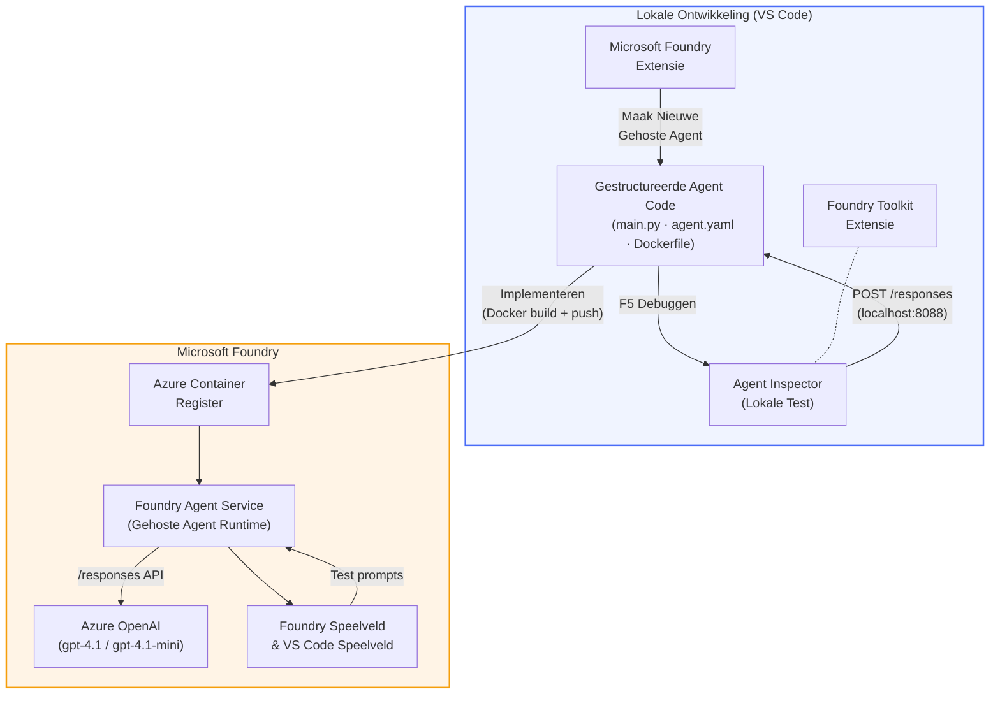

# Foundry Toolkit + Foundry Hosted Agents Workshop

[](https://www.python.org/)
[](https://github.com/microsoft/agents)
[](https://learn.microsoft.com/azure/ai-foundry/agents/concepts/hosted-agents/)
[](https://ai.azure.com/)
[](https://learn.microsoft.com/azure/ai-services/openai/)
[](https://learn.microsoft.com/cli/azure/install-azure-cli)
[](https://learn.microsoft.com/azure/developer/azure-developer-cli/install-azd)
[](https://www.docker.com/)
[](https://marketplace.visualstudio.com/items?itemName=ms-windows-ai-studio.windows-ai-studio)
[](LICENSE)

Bouw, test en zet AI-agenten in bij de **Microsoft Foundry Agent Service** als **Hosted Agents** - volledig vanuit VS Code met behulp van de **Microsoft Foundry-extensie** en **Foundry Toolkit**.

> **Hosted Agents bevinden zich momenteel in preview.** Ondersteunde regio's zijn beperkt - zie [regio beschikbaarheid](https://learn.microsoft.com/azure/foundry/agents/concepts/hosted-agents#region-availability).

> De map `agent/` binnen elke lab wordt **automatisch opgebouwd** door de Foundry-extensie - je past daarna de code aan, test lokaal en zet in productie.

### 🌐 Meertalige ondersteuning

#### Ondersteund via GitHub Action (Geautomatiseerd & Altijd Up-to-Date)

<!-- CO-OP TRANSLATOR LANGUAGES TABLE START -->
[Arabisch](../ar/README.md) | [Bengaals](../bn/README.md) | [Bulgaars](../bg/README.md) | [Birmaans (Myanmar)](../my/README.md) | [Chinees (Vereenvoudigd)](../zh-CN/README.md) | [Chinees (Traditioneel, Hong Kong)](../zh-HK/README.md) | [Chinees (Traditioneel, Macau)](../zh-MO/README.md) | [Chinees (Traditioneel, Taiwan)](../zh-TW/README.md) | [Kroatisch](../hr/README.md) | [Tsjechisch](../cs/README.md) | [Deens](../da/README.md) | [Nederlands](./README.md) | [Estisch](../et/README.md) | [Fins](../fi/README.md) | [Frans](../fr/README.md) | [Duits](../de/README.md) | [Grieks](../el/README.md) | [Hebreeuws](../he/README.md) | [Hindi](../hi/README.md) | [Hongaars](../hu/README.md) | [Indonesisch](../id/README.md) | [Italiaans](../it/README.md) | [Japans](../ja/README.md) | [Kannada](../kn/README.md) | [Khmer](../km/README.md) | [Koreaans](../ko/README.md) | [Litouws](../lt/README.md) | [Maleis](../ms/README.md) | [Malayalam](../ml/README.md) | [Marathi](../mr/README.md) | [Nepalees](../ne/README.md) | [Nigeriaans Pidgin](../pcm/README.md) | [Noors](../no/README.md) | [Perzisch (Farsi)](../fa/README.md) | [Pools](../pl/README.md) | [Portugees (Brazilië)](../pt-BR/README.md) | [Portugees (Portugal)](../pt-PT/README.md) | [Punjabi (Gurmukhi)](../pa/README.md) | [Roemeens](../ro/README.md) | [Russisch](../ru/README.md) | [Servisch (Cyrillisch)](../sr/README.md) | [Slowaaks](../sk/README.md) | [Sloveens](../sl/README.md) | [Spaans](../es/README.md) | [Swahili](../sw/README.md) | [Zweeds](../sv/README.md) | [Tagalog (Filipijns)](../tl/README.md) | [Tamil](../ta/README.md) | [Telugu](../te/README.md) | [Thai](../th/README.md) | [Turks](../tr/README.md) | [Oekraïens](../uk/README.md) | [Urdu](../ur/README.md) | [Vietnamese](../vi/README.md)

> **Liever lokaal klonen?**
>
> Deze repository bevat meer dan 50 taalvertalingen die de downloadgrootte aanzienlijk vergroten. Om te klonen zonder vertalingen, gebruik een sparse checkout:
>
> **Bash / macOS / Linux:**
> ```bash
> git clone --filter=blob:none --sparse https://github.com/microsoft-foundry/Foundry_Toolkit_for_VSCode_Lab.git
> cd Foundry_Toolkit_for_VSCode_Lab
> git sparse-checkout set --no-cone '/*' '!translations' '!translated_images'
> ```
>
> **CMD (Windows):**
> ```cmd
> git clone --filter=blob:none --sparse https://github.com/microsoft-foundry/Foundry_Toolkit_for_VSCode_Lab.git
> cd Foundry_Toolkit_for_VSCode_Lab
> git sparse-checkout set --no-cone "/*" "!translations" "!translated_images"
> ```
>
> Hiermee heb je alles wat je nodig hebt om de cursus te voltooien, met een veel snellere download.
<!-- CO-OP TRANSLATOR LANGUAGES TABLE END -->

---

## Architectuur


**Stroom:** Foundry-extensie bouwt de agent op → je past code & instructies aan → test lokaal met Agent Inspector → zet in bij Foundry (Docker-image wordt naar ACR gepusht) → verifieer in Playground.

---

## Wat je gaat bouwen

| Lab | Beschrijving | Status |
|-----|-------------|--------|
| **Lab 01 - Enkele Agent** | Bouw de **"Leg uit alsof ik een Executive ben" Agent**, test lokaal en zet in bij Foundry | ✅ Beschikbaar |
| **Lab 02 - Multi-Agent Workflow** | Bouw de **"CV → Baanfit Evaluator"** - 4 agenten werken samen om de fit van het CV te scoren en een leerroutekaart te genereren | ✅ Beschikbaar |

---

## Maak kennis met de Executive Agent

In deze workshop bouw je de **"Leg uit alsof ik een Executive ben" Agent** - een AI-agent die ingewikkeld technisch jargon neemt en vertaalt naar kalme, bestuursklare samenvattingen. Want laten we eerlijk zijn, niemand in het C-niveau wil horen over "thread pool-uitputting veroorzaakt door synchrone calls geïntroduceerd in v3.2."

Ik heb deze agent gebouwd na weer een incident waarbij mijn perfect opgestelde post-mortem de reactie kreeg: *"Dus... is de website nu down of niet?"*

### Hoe het werkt

Je voert een technische update in. De agent geeft een executive samenvatting terug - drie kernpunten, geen jargon, geen stack traces, geen existentiële angst. Gewoon **wat er is gebeurd**, **zakelijke impact**, en **volgende stap**.

### Zie het in actie

**Jij zegt:**
> "De API-latentie is toegenomen door thread pool-uitputting veroorzaakt door synchrone calls geïntroduceerd in v3.2."

**De agent antwoordt:**

> **Executive Samenvatting:**
> - **Wat er is gebeurd:** Na de laatste release vertraagde het systeem.
> - **Zakelijke impact:** Sommige gebruikers ervoeren vertragingen bij het gebruik van de dienst.
> - **Volgende stap:** De wijziging is teruggedraaid en er wordt een oplossing voorbereid voor heruitrol.

### Waarom deze agent?

Het is een doodsimpel, enkeldoel-agent - perfect om de hosted agent-workflow van begin tot eind te leren zonder verstrikt te raken in complexe tools. En eerlijk? Elk engineeringteam kan er wel eentje gebruiken.

---

## Workshop structuur

```
📂 Foundry_Toolkit_for_VSCode_Lab/
├── 📄 README.md                      ← You are here
├── 📂 ExecutiveAgent/                ← Standalone hosted agent project
│   ├── agent.yaml
│   ├── Dockerfile
│   ├── main.py
│   └── requirements.txt
└── 📂 workshop/
    ├── 📂 lab01-single-agent/        ← Full lab: docs + agent code
    │   ├── README.md                 ← Hands-on lab instructions
    │   ├── 📂 docs/                  ← Step-by-step tutorial modules
    │   │   ├── 00-prerequisites.md
    │   │   ├── 01-install-foundry-toolkit.md
    │   │   ├── 02-create-foundry-project.md
    │   │   ├── 03-create-hosted-agent.md
    │   │   ├── 04-configure-and-code.md
    │   │   ├── 05-test-locally.md
    │   │   ├── 06-deploy-to-foundry.md
    │   │   ├── 07-verify-in-playground.md
    │   │   └── 08-troubleshooting.md
    │   └── 📂 agent/                 ← Reference solution (auto-scaffolded by Foundry extension)
    │       ├── agent.yaml
    │       ├── Dockerfile
    │       ├── main.py
    │       └── requirements.txt
    └── 📂 lab02-multi-agent/         ← Resume → Job Fit Evaluator
        ├── README.md                 ← Hands-on lab instructions (end-to-end)
        ├── 📂 docs/                  ← Step-by-step tutorial modules
        │   ├── 00-prerequisites.md
        │   ├── 01-understand-multi-agent.md
        │   ├── 02-scaffold-multi-agent.md
        │   ├── 03-configure-agents.md
        │   ├── 04-orchestration-patterns.md
        │   ├── 05-test-locally.md
        │   ├── 06-deploy-to-foundry.md
        │   ├── 07-verify-in-playground.md
        │   └── 08-troubleshooting.md
        └── 📂 PersonalCareerCopilot/ ← Reference solution (multi-agent workflow)
            ├── agent.yaml
            ├── Dockerfile
            ├── main.py
            └── requirements.txt
```

> **Opmerking:** De map `agent/` binnen elke lab is wat de **Microsoft Foundry-extensie** genereert wanneer je `Microsoft Foundry: Create a New Hosted Agent` uitvoert vanuit het Command Palette. De bestanden worden vervolgens aangepast met de instructies, tools en configuratie van jouw agent. Lab 01 leidt je door dit proces van scratch bouwen.

---

## Aan de slag

### 1. Clone de repository

```bash
git clone https://github.com/microsoft-foundry/Foundry_Toolkit_for_VSCode_Lab.git
cd Foundry_Toolkit_for_VSCode_Lab
```

### 2. Zet een Python virtuele omgeving op

```bash
python -m venv venv
```

Activeer deze:

- **Windows (PowerShell):**
  ```powershell
  .\venv\Scripts\Activate.ps1
  ```
- **macOS / Linux:**
  ```bash
  source venv/bin/activate
  ```

### 3. Installeer dependencies

```bash
pip install -r workshop/lab01-single-agent/agent/requirements.txt
```

### 4. Configureer omgevingsvariabelen

Kopieer het voorbeeldbestand `.env` binnen de agentmap en vul je waarden in:

```bash
cp workshop/lab01-single-agent/agent/.env.example workshop/lab01-single-agent/agent/.env
```

Bewerk `workshop/lab01-single-agent/agent/.env`:

```env
AZURE_AI_PROJECT_ENDPOINT=https://<your-account>.services.ai.azure.com/api/projects/<your-project>
MODEL_DEPLOYMENT_NAME=<your-model-deployment-name>
```

### 5. Volg de workshop labs

Elke lab is zelfstandig met eigen modules. Begin met **Lab 01** om de basis te leren, ga daarna door naar **Lab 02** voor multi-agent workflows.

#### Lab 01 - Enkele Agent ([volledige instructies](workshop/lab01-single-agent/README.md))

| # | Module | Link |
|---|--------|------|
| 1 | Lees de vereisten | [00-prerequisites.md](workshop/lab01-single-agent/docs/00-prerequisites.md) |
| 2 | Installeer Foundry Toolkit & Foundry-extensie | [01-install-foundry-toolkit.md](workshop/lab01-single-agent/docs/01-install-foundry-toolkit.md) |
| 3 | Maak een Foundry-project | [02-create-foundry-project.md](workshop/lab01-single-agent/docs/02-create-foundry-project.md) |
| 4 | Maak een hosted agent | [03-create-hosted-agent.md](workshop/lab01-single-agent/docs/03-create-hosted-agent.md) |
| 5 | Configureer instructies & omgeving | [04-configure-and-code.md](workshop/lab01-single-agent/docs/04-configure-and-code.md) |
| 6 | Test lokaal | [05-test-locally.md](workshop/lab01-single-agent/docs/05-test-locally.md) |
| 7 | Zet in productie bij Foundry | [06-deploy-to-foundry.md](workshop/lab01-single-agent/docs/06-deploy-to-foundry.md) |
| 8 | Verifieer in playground | [07-verify-in-playground.md](workshop/lab01-single-agent/docs/07-verify-in-playground.md) |
| 9 | Problemen oplossen | [08-troubleshooting.md](workshop/lab01-single-agent/docs/08-troubleshooting.md) |

#### Lab 02 - Multi-Agent Workflow ([volledige instructies](workshop/lab02-multi-agent/README.md))

| # | Module | Link |
|---|--------|------|
| 1 | Vereisten (Lab 02) | [00-prerequisites.md](workshop/lab02-multi-agent/docs/00-prerequisites.md) |
| 2 | Begrijp multi-agent architectuur | [01-understand-multi-agent.md](workshop/lab02-multi-agent/docs/01-understand-multi-agent.md) |
| 3 | Bouw het multi-agent project op | [02-scaffold-multi-agent.md](workshop/lab02-multi-agent/docs/02-scaffold-multi-agent.md) |
| 4 | Configureer agenten & omgeving | [03-configure-agents.md](workshop/lab02-multi-agent/docs/03-configure-agents.md) |
| 5 | Orkestratiepatronen | [04-orchestration-patterns.md](workshop/lab02-multi-agent/docs/04-orchestration-patterns.md) |
| 6 | Test lokaal (multi-agent) | [05-test-locally.md](workshop/lab02-multi-agent/docs/05-test-locally.md) |
| 7 | Implementeren naar Foundry | [06-deploy-to-foundry.md](workshop/lab02-multi-agent/docs/06-deploy-to-foundry.md) |
| 8 | Verifiëren in playground | [07-verify-in-playground.md](workshop/lab02-multi-agent/docs/07-verify-in-playground.md) |
| 9 | Probleemoplossing (multi-agent) | [08-troubleshooting.md](workshop/lab02-multi-agent/docs/08-troubleshooting.md) |

---

## Beheerder

<table>
<tr>
    <td align="center"><a href="https://github.com/ShivamGoyal03">
        <br />
        <sub><b>Shivam Goyal</b></sub>
    </a><br />
    </td>
</tr>
</table>

---

## Vereiste machtigingen (snelle referentie)

| Scenario | Vereiste rollen |
|----------|-----------------|
| Nieuw Foundry-project aanmaken | **Azure AI Owner** op Foundry resource |
| Implementeren naar bestaand project (nieuwe resources) | **Azure AI Owner** + **Contributor** op abonnement |
| Implementeren naar volledig geconfigureerd project | **Reader** op account + **Azure AI User** op project |

> **Belangrijk:** Azure `Owner` en `Contributor` rollen bevatten alleen *beheer* machtigingen, niet *ontwikkel* (data actie) machtigingen. Je hebt **Azure AI User** of **Azure AI Owner** nodig om agents te bouwen en te implementeren.

---

## Referenties

- [Quickstart: Implementeer je eerste gehoste agent (VS Code)](https://learn.microsoft.com/azure/foundry/agents/quickstarts/quickstart-hosted-agent)
- [Wat zijn gehoste agents?](https://learn.microsoft.com/azure/foundry/agents/concepts/hosted-agents)
- [Maak gehoste agent-workflows in VS Code](https://learn.microsoft.com/azure/foundry/agents/how-to/vs-code-agents-workflow-pro-code)
- [Implementeer een gehoste agent](https://learn.microsoft.com/azure/foundry/agents/how-to/deploy-hosted-agent)
- [RBAC voor Microsoft Foundry](https://learn.microsoft.com/azure/foundry/concepts/rbac-foundry)
- [Architectuur Review Agent Voorbeeld](https://github.com/Azure-Samples/agent-architecture-review-sample) - Praktijkvoorbeeld van een gehoste agent met MCP tools, Excalidraw diagrammen, en dubbele implementatie

---


## Licentie

[MIT](../../LICENSE)

---

<!-- CO-OP TRANSLATOR DISCLAIMER START -->
**Disclaimer**:  
Dit document is vertaald met behulp van de AI-vertalingsdienst [Co-op Translator](https://github.com/Azure/co-op-translator). Hoewel we streven naar nauwkeurigheid, dient u er rekening mee te houden dat geautomatiseerde vertalingen fouten of onnauwkeurigheden kunnen bevatten. Het originele document in de oorspronkelijke taal moet als de gezaghebbende bron worden beschouwd. Voor kritieke informatie wordt een professionele menselijke vertaling aanbevolen. Wij zijn niet aansprakelijk voor eventuele misverstanden of verkeerde interpretaties die voortvloeien uit het gebruik van deze vertaling.
<!-- CO-OP TRANSLATOR DISCLAIMER END -->