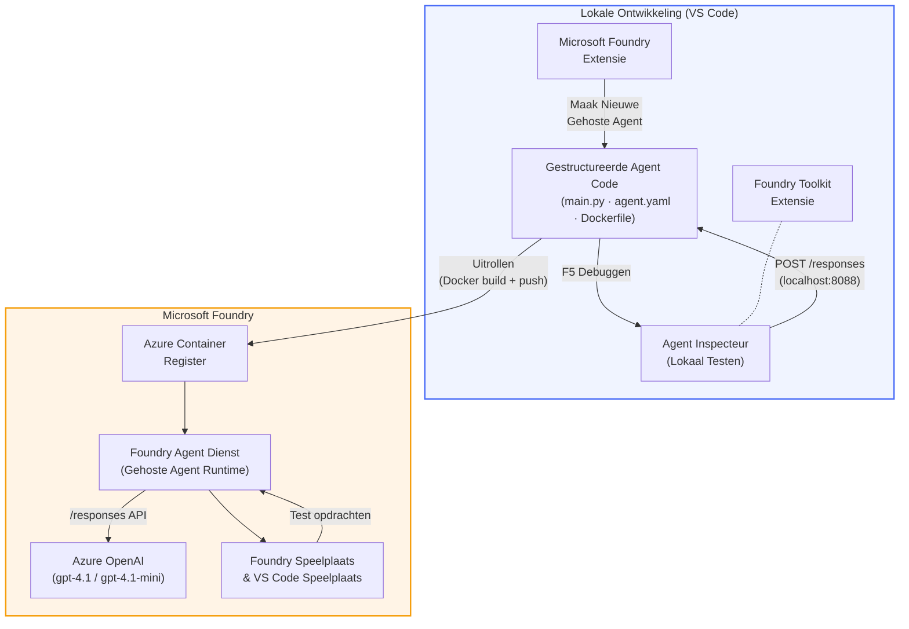

# Foundry Toolkit + Foundry Hosted Agents Workshop

[](https://www.python.org/)
[](https://github.com/microsoft/agents)
[](https://learn.microsoft.com/azure/ai-foundry/agents/concepts/hosted-agents/)
[](https://ai.azure.com/)
[](https://learn.microsoft.com/azure/ai-services/openai/)
[](https://learn.microsoft.com/cli/azure/install-azure-cli)
[](https://learn.microsoft.com/azure/developer/azure-developer-cli/install-azd)
[](https://www.docker.com/)
[](https://marketplace.visualstudio.com/items?itemName=ms-windows-ai-studio.windows-ai-studio)
[](LICENSE)

Bouw, test en deploy AI-agenten naar **Microsoft Foundry Agent Service** als **Hosted Agents** - volledig vanuit VS Code met de **Microsoft Foundry extensie** en **Foundry Toolkit**.

> **Hosted Agents zijn momenteel in preview.** Ondersteunde regio's zijn beperkt - zie [regio beschikbaarheid](https://learn.microsoft.com/azure/foundry/agents/concepts/hosted-agents#region-availability).

> De map `agent/` binnen elke lab wordt **automatisch gegenereerd** door de Foundry extensie - je past daarna de code aan, test lokaal en deployt.

<!-- CO-OP TRANSLATOR LANGUAGES TABLE START -->
[Arabic](../ar/README.md) | [Bengali](../bn/README.md) | [Bulgarian](../bg/README.md) | [Burmese (Myanmar)](../my/README.md) | [Chinese (Simplified)](../zh-CN/README.md) | [Chinese (Traditional, Hong Kong)](../zh-HK/README.md) | [Chinese (Traditional, Macau)](../zh-MO/README.md) | [Chinese (Traditional, Taiwan)](../zh-TW/README.md) | [Croatian](../hr/README.md) | [Czech](../cs/README.md) | [Danish](../da/README.md) | [Dutch](./README.md) | [Estonian](../et/README.md) | [Finnish](../fi/README.md) | [French](../fr/README.md) | [German](../de/README.md) | [Greek](../el/README.md) | [Hebrew](../he/README.md) | [Hindi](../hi/README.md) | [Hungarian](../hu/README.md) | [Indonesian](../id/README.md) | [Italian](../it/README.md) | [Japanese](../ja/README.md) | [Kannada](../kn/README.md) | [Khmer](../km/README.md) | [Korean](../ko/README.md) | [Lithuanian](../lt/README.md) | [Malay](../ms/README.md) | [Malayalam](../ml/README.md) | [Marathi](../mr/README.md) | [Nepali](../ne/README.md) | [Nigerian Pidgin](../pcm/README.md) | [Norwegian](../no/README.md) | [Persian (Farsi)](../fa/README.md) | [Polish](../pl/README.md) | [Portuguese (Brazil)](../pt-BR/README.md) | [Portuguese (Portugal)](../pt-PT/README.md) | [Punjabi (Gurmukhi)](../pa/README.md) | [Romanian](../ro/README.md) | [Russian](../ru/README.md) | [Serbian (Cyrillic)](../sr/README.md) | [Slovak](../sk/README.md) | [Slovenian](../sl/README.md) | [Spanish](../es/README.md) | [Swahili](../sw/README.md) | [Swedish](../sv/README.md) | [Tagalog (Filipino)](../tl/README.md) | [Tamil](../ta/README.md) | [Telugu](../te/README.md) | [Thai](../th/README.md) | [Turkish](../tr/README.md) | [Ukrainian](../uk/README.md) | [Urdu](../ur/README.md) | [Vietnamese](../vi/README.md)

> **Liever lokaal klonen?**
>
> Deze repository bevat meer dan 50 taalvertalingen, wat de downloadgrootte aanzienlijk vergroot. Om zonder vertalingen te klonen, gebruik sparse checkout:
>
> **Bash / macOS / Linux:**
> ```bash
> git clone --filter=blob:none --sparse https://github.com/microsoft-foundry/Foundry_Toolkit_for_VSCode_Lab.git
> cd Foundry_Toolkit_for_VSCode_Lab
> git sparse-checkout set --no-cone '/*' '!translations' '!translated_images'
> ```
>
> **CMD (Windows):**
> ```cmd
> git clone --filter=blob:none --sparse https://github.com/microsoft-foundry/Foundry_Toolkit_for_VSCode_Lab.git
> cd Foundry_Toolkit_for_VSCode_Lab
> git sparse-checkout set --no-cone "/*" "!translations" "!translated_images"
> ```
>
> Dit geeft je alles wat je nodig hebt om de cursus te voltooien met een veel snellere download.
<!-- CO-OP TRANSLATOR LANGUAGES TABLE END -->

---

## Architectuur


**Flow:** Foundry extensie genereert de agent → je past code & instructies aan → test lokaal met Agent Inspector → deploy naar Foundry (Docker image wordt gepusht naar ACR) → verifieer in Playground.

---

## Wat je gaat bouwen

| Lab | Beschrijving | Status |
|-----|--------------|--------|
| **Lab 01 - Single Agent** | Bouw de **"Explain Like I'm an Executive" Agent**, test lokaal en deploy naar Foundry | ✅ Beschikbaar |
| **Lab 02 - Multi-Agent Workflow** | Bouw de **"CV → Job Fit Evaluator"** - 4 agenten werken samen om cv-fit te scoren en een leerroute te genereren | ✅ Beschikbaar |

---

## Maak kennis met de Executive Agent

In deze workshop bouw je de **"Explain Like I'm an Executive" Agent** - een AI-agent die lastige technische jargon omzet naar kalme, direct inzetbare samenvattingen voor de directiekamer. Want laten we eerlijk zijn, niemand in het C-level wil horen over "thread pool exhaustion veroorzaakt door synchrone calls geïntroduceerd in v3.2."

Ik heb deze agent gebouwd na weer een incident waarbij mijn perfect opgestelde post-mortem werd beantwoord met: *"Dus... is de website nou down of niet?"*

### Hoe het werkt

Je voert een technische update in. De agent geeft een executive summary - drie bulletpoints, geen jargon, geen stacktraces, geen existentiële paniek. Alleen **wat er is gebeurd**, **impact op het bedrijf** en **volgende stap**.

### Zie het in actie

**Jij zegt:**
> "De API-latentie nam toe door thread pool exhaustion veroorzaakt door synchrone calls geïntroduceerd in v3.2."

**De agent antwoordt:**

> **Executive Summary:**
> - **Wat is er gebeurd:** Na de laatste release vertraagde het systeem.
> - **Impact op het bedrijf:** Sommige gebruikers ondervonden vertragingen bij het gebruik van de service.
> - **Volgende stap:** De wijziging is teruggedraaid en een oplossing wordt klaargemaakt voor heruitrol.

### Waarom deze agent?

Het is een doodsimpele, enkeldoel-agent - perfect om de hosted agent workflow van begin tot eind te leren zonder verstrikt te raken in complexe toolchains. En eerlijk gezegd? Elk engineeringteam kan hier eentje gebruiken.

---

## Workshop structuur

```
📂 Foundry_Toolkit_for_VSCode_Lab/
├── 📄 README.md                      ← You are here
├── 📂 ExecutiveAgent/                ← Standalone hosted agent project
│   ├── agent.yaml
│   ├── Dockerfile
│   ├── main.py
│   └── requirements.txt
└── 📂 workshop/
    ├── 📂 lab01-single-agent/        ← Full lab: docs + agent code
    │   ├── README.md                 ← Hands-on lab instructions
    │   ├── 📂 docs/                  ← Step-by-step tutorial modules
    │   │   ├── 00-prerequisites.md
    │   │   ├── 01-install-foundry-toolkit.md
    │   │   ├── 02-create-foundry-project.md
    │   │   ├── 03-create-hosted-agent.md
    │   │   ├── 04-configure-and-code.md
    │   │   ├── 05-test-locally.md
    │   │   ├── 06-deploy-to-foundry.md
    │   │   ├── 07-verify-in-playground.md
    │   │   └── 08-troubleshooting.md
    │   └── 📂 agent/                 ← Reference solution (auto-scaffolded by Foundry extension)
    │       ├── agent.yaml
    │       ├── Dockerfile
    │       ├── main.py
    │       └── requirements.txt
    └── 📂 lab02-multi-agent/         ← Resume → Job Fit Evaluator
        ├── README.md                 ← Hands-on lab instructions (end-to-end)
        ├── 📂 docs/                  ← Step-by-step tutorial modules
        │   ├── 00-prerequisites.md
        │   ├── 01-understand-multi-agent.md
        │   ├── 02-scaffold-multi-agent.md
        │   ├── 03-configure-agents.md
        │   ├── 04-orchestration-patterns.md
        │   ├── 05-test-locally.md
        │   ├── 06-deploy-to-foundry.md
        │   ├── 07-verify-in-playground.md
        │   └── 08-troubleshooting.md
        └── 📂 PersonalCareerCopilot/ ← Reference solution (multi-agent workflow)
            ├── agent.yaml
            ├── Dockerfile
            ├── main.py
            └── requirements.txt
```

> **Opmerking:** De map `agent/` in elke lab is wat de **Microsoft Foundry extensie** aanmaakt wanneer je `Microsoft Foundry: Create a New Hosted Agent` uitvoert via de Command Palette. Deze bestanden worden daarna aangepast met jouw agentinstructies, tools en configuratie. Lab 01 begeleidt je stap voor stap bij het zelf opbouwen hiervan.

---

## Aan de slag

### 1. Clone de repository

```bash
git clone https://github.com/microsoft-foundry/Foundry_Toolkit_for_VSCode_Lab.git
cd Foundry_Toolkit_for_VSCode_Lab
```

### 2. Zet een Python virtuele omgeving op

```bash
python -m venv venv
```

Activeer deze:

- **Windows (PowerShell):**
  ```powershell
  .\venv\Scripts\Activate.ps1
  ```
- **macOS / Linux:**
  ```bash
  source venv/bin/activate
  ```

### 3. Installeer afhankelijkheden

```bash
pip install -r workshop/lab01-single-agent/agent/requirements.txt
```

### 4. Configureer omgevingsvariabelen

Kopieer het voorbeeld `.env` bestand in de agent map en vul je eigen waarden in:

```bash
cp workshop/lab01-single-agent/agent/.env.example workshop/lab01-single-agent/agent/.env
```

Bewerk `workshop/lab01-single-agent/agent/.env`:

```env
AZURE_AI_PROJECT_ENDPOINT=https://<your-account>.services.ai.azure.com/api/projects/<your-project>
MODEL_DEPLOYMENT_NAME=<your-model-deployment-name>
```

### 5. Volg de workshop labs

Elke lab is zelfstandig met eigen modules. Begin met **Lab 01** om de basis te leren, daarna door naar **Lab 02** voor multi-agent workflows.

#### Lab 01 - Single Agent ([volledige instructies](workshop/lab01-single-agent/README.md))

| # | Module | Link |
|---|--------|------|
| 1 | Lees de vereisten | [00-prerequisites.md](workshop/lab01-single-agent/docs/00-prerequisites.md) |
| 2 | Installeer Foundry Toolkit & Foundry extensie | [01-install-foundry-toolkit.md](workshop/lab01-single-agent/docs/01-install-foundry-toolkit.md) |
| 3 | Maak een Foundry project aan | [02-create-foundry-project.md](workshop/lab01-single-agent/docs/02-create-foundry-project.md) |
| 4 | Maak een hosted agent aan | [03-create-hosted-agent.md](workshop/lab01-single-agent/docs/03-create-hosted-agent.md) |
| 5 | Configureer instructies & omgeving | [04-configure-and-code.md](workshop/lab01-single-agent/docs/04-configure-and-code.md) |
| 6 | Test lokaal | [05-test-locally.md](workshop/lab01-single-agent/docs/05-test-locally.md) |
| 7 | Deploy naar Foundry | [06-deploy-to-foundry.md](workshop/lab01-single-agent/docs/06-deploy-to-foundry.md) |
| 8 | Verifieer in playground | [07-verify-in-playground.md](workshop/lab01-single-agent/docs/07-verify-in-playground.md) |
| 9 | Problemen oplossen | [08-troubleshooting.md](workshop/lab01-single-agent/docs/08-troubleshooting.md) |

#### Lab 02 - Multi-Agent Workflow ([volledige instructies](workshop/lab02-multi-agent/README.md))

| # | Module | Link |
|---|--------|------|
| 1 | Vereisten (Lab 02) | [00-prerequisites.md](workshop/lab02-multi-agent/docs/00-prerequisites.md) |
| 2 | Begrijp multi-agent architectuur | [01-understand-multi-agent.md](workshop/lab02-multi-agent/docs/01-understand-multi-agent.md) |
| 3 | Scaffold het multi-agent project | [02-scaffold-multi-agent.md](workshop/lab02-multi-agent/docs/02-scaffold-multi-agent.md) |
| 4 | Configureer agenten & omgeving | [03-configure-agents.md](workshop/lab02-multi-agent/docs/03-configure-agents.md) |
| 5 | Orkestratiepatronen | [04-orchestration-patterns.md](workshop/lab02-multi-agent/docs/04-orchestration-patterns.md) |
| 6 | Test lokaal (multi-agent) | [05-test-locally.md](workshop/lab02-multi-agent/docs/05-test-locally.md) |
| 7 | Implementeren naar Foundry | [06-deploy-to-foundry.md](workshop/lab02-multi-agent/docs/06-deploy-to-foundry.md) |
| 8 | Verifiëren in sandbox | [07-verify-in-playground.md](workshop/lab02-multi-agent/docs/07-verify-in-playground.md) |
| 9 | Problemen oplossen (multi-agent) | [08-troubleshooting.md](workshop/lab02-multi-agent/docs/08-troubleshooting.md) |

---

## Beheerder

<table>
<tr>
    <td align="center"><a href="https://github.com/ShivamGoyal03">
        <br />
        <sub><b>Shivam Goyal</b></sub>
    </a><br />
    </td>
</tr>
</table>

---

## Vereiste machtigingen (snelle referentie)

| Scenario | Vereiste rollen |
|----------|-----------------|
| Nieuw Foundry-project aanmaken | **Azure AI-eigenaar** op Foundry-resource |
| Implementeren naar bestaand project (nieuwe resources) | **Azure AI-eigenaar** + **Bijdrager** op abonnement |
| Implementeren naar volledig geconfigureerd project | **Lezer** op account + **Azure AI-gebruiker** op project |

> **Belangrijk:** Azure `Eigenaar` en `Bijdrager` rollen omvatten alleen *beheer* machtigingen, niet *ontwikkel* (data actie) machtigingen. Je hebt **Azure AI-gebruiker** of **Azure AI-eigenaar** nodig om agents te bouwen en implementeren.

---

## Referenties

- [Quickstart: Implementeer je eerste gehoste agent (VS Code)](https://learn.microsoft.com/azure/foundry/agents/quickstarts/quickstart-hosted-agent)
- [Wat zijn gehoste agents?](https://learn.microsoft.com/azure/foundry/agents/concepts/hosted-agents)
- [Maak gehoste agent-workflows in VS Code](https://learn.microsoft.com/azure/foundry/agents/how-to/vs-code-agents-workflow-pro-code)
- [Implementeer een gehoste agent](https://learn.microsoft.com/azure/foundry/agents/how-to/deploy-hosted-agent)
- [RBAC voor Microsoft Foundry](https://learn.microsoft.com/azure/foundry/concepts/rbac-foundry)
- [Agentvoorbeeld Architectuurreview](https://github.com/Azure-Samples/agent-architecture-review-sample) - Realistische gehoste agent met MCP-tools, Excalidraw-diagrammen en dubbele implementatie

---

## Licentie

[MIT](../../LICENSE)

---

<!-- CO-OP TRANSLATOR DISCLAIMER START -->
**Disclaimer**:
Dit document is vertaald met behulp van de AI-vertalingsservice [Co-op Translator](https://github.com/Azure/co-op-translator). Hoewel we streven naar nauwkeurigheid, verzoeken wij u ervan bewust te zijn dat automatische vertalingen fouten of onnauwkeurigheden kunnen bevatten. Het originele document in de oorspronkelijke taal dient als de gezaghebbende bron te worden beschouwd. Voor cruciale informatie wordt professionele menselijke vertaling aanbevolen. Wij zijn niet aansprakelijk voor eventuele misverstanden of verkeerde interpretaties die voortvloeien uit het gebruik van deze vertaling.
<!-- CO-OP TRANSLATOR DISCLAIMER END -->