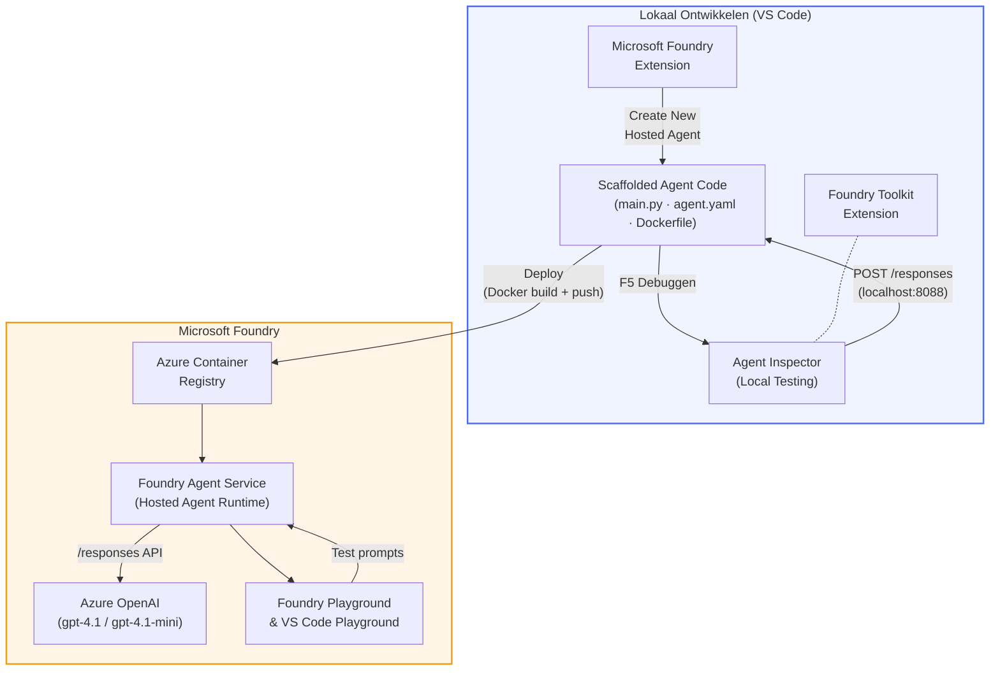

# Foundry Toolkit + Foundry Hosted Agents Workshop

[](https://www.python.org/)
[](https://github.com/microsoft/agents)
[](https://learn.microsoft.com/azure/foundry/agents/concepts/hosted-agents)
[](https://ai.azure.com/)
[](https://learn.microsoft.com/azure/ai-services/openai/)
[](https://learn.microsoft.com/cli/azure/install-azure-cli)
[](https://learn.microsoft.com/azure/developer/azure-developer-cli/install-azd)
[](https://www.docker.com/)
[](https://marketplace.visualstudio.com/items?itemName=ms-windows-ai-studio.windows-ai-studio)
[](LICENSE)

Bouw, test en zet AI-agenten in als **Microsoft Foundry Agent Service** als **Hosted Agents** - volledig vanuit VS Code met behulp van de **Microsoft Foundry-extensie** en **Foundry Toolkit**.

> **Hosted Agents bevinden zich momenteel in preview.** Ondersteunde regio's zijn beperkt - zie [regio beschikbaarheid](https://learn.microsoft.com/azure/foundry/agents/concepts/hosted-agents#region-availability).

> De map `agent/` in elke lab wordt **automatisch gescaffoldeerd** door de Foundry-extensie - je past dan de code aan, test lokaal en zet uit.

### 🌐 Meertalige ondersteuning

#### Ondersteund via GitHub Action (Geautomatiseerd & Altijd Up-to-Date)

<!-- CO-OP TRANSLATOR LANGUAGES TABLE START -->
[Arabisch](../ar/README.md) | [Bengaals](../bn/README.md) | [Bulgaars](../bg/README.md) | [Birmaans (Myanmar)](../my/README.md) | [Chinees (Vereenvoudigd)](../zh-CN/README.md) | [Chinees (Traditioneel, Hong Kong)](../zh-HK/README.md) | [Chinees (Traditioneel, Macau)](../zh-MO/README.md) | [Chinees (Traditioneel, Taiwan)](../zh-TW/README.md) | [Kroatisch](../hr/README.md) | [Tsjechisch](../cs/README.md) | [Deens](../da/README.md) | [Nederlands](./README.md) | [Ests](../et/README.md) | [Fins](../fi/README.md) | [Frans](../fr/README.md) | [Duits](../de/README.md) | [Grieks](../el/README.md) | [Hebreeuws](../he/README.md) | [Hindi](../hi/README.md) | [Hongaars](../hu/README.md) | [Indonesisch](../id/README.md) | [Italiaans](../it/README.md) | [Japans](../ja/README.md) | [Kannada](../kn/README.md) | [Khmer](../km/README.md) | [Koreaans](../ko/README.md) | [Litouws](../lt/README.md) | [Maleis](../ms/README.md) | [Malayalam](../ml/README.md) | [Marathi](../mr/README.md) | [Nepalees](../ne/README.md) | [Nigeriaans Pidgin](../pcm/README.md) | [Noors](../no/README.md) | [Perzisch (Farsi)](../fa/README.md) | [Pools](../pl/README.md) | [Portugees (Brazilië)](../pt-BR/README.md) | [Portugees (Portugal)](../pt-PT/README.md) | [Punjabi (Gurmukhi)](../pa/README.md) | [Roemeens](../ro/README.md) | [Russisch](../ru/README.md) | [Servisch (Cyrillisch)](../sr/README.md) | [Slowaaks](../sk/README.md) | [Sloveens](../sl/README.md) | [Spaans](../es/README.md) | [Swahili](../sw/README.md) | [Zweeds](../sv/README.md) | [Tagalog (Filipijns)](../tl/README.md) | [Tamil](../ta/README.md) | [Telugu](../te/README.md) | [Thais](../th/README.md) | [Turks](../tr/README.md) | [Oekraïens](../uk/README.md) | [Urdu](../ur/README.md) | [Vietnamees](../vi/README.md)

> **Liever lokaal clonen?**
>
> Deze repository bevat meer dan 50 taalvertalingen wat de downloadgrootte aanzienlijk vergroot. Om te clonen zonder vertalingen, gebruik sparse checkout:
>
> **Bash / macOS / Linux:**
> ```bash
> git clone --filter=blob:none --sparse https://github.com/microsoft-foundry/Foundry_Toolkit_for_VSCode_Lab.git
> cd Foundry_Toolkit_for_VSCode_Lab
> git sparse-checkout set --no-cone '/*' '!translations' '!translated_images'
> ```
>
> **CMD (Windows):**
> ```cmd
> git clone --filter=blob:none --sparse https://github.com/microsoft-foundry/Foundry_Toolkit_for_VSCode_Lab.git
> cd Foundry_Toolkit_for_VSCode_Lab
> git sparse-checkout set --no-cone "/*" "!translations" "!translated_images"
> ```
>
> Hiermee krijg je alles wat je nodig hebt om de cursus te voltooien met een veel snellere download.
<!-- CO-OP TRANSLATOR LANGUAGES TABLE END -->

---

## Architectuur


```mermaid
flowchart TB
    subgraph Local["Lokaal Ontwikkelen (VS Code)"]
        direction TB
        FE["Microsoft Foundry
        Extension"]
        FoundryToolkit["Foundry Toolkit
        Extension"]
        Scaffold["Scaffolded Agent Code
        (main.py · agent.yaml · Dockerfile)"]
        Inspector["Agent Inspector
        (Local Testing)"]
        FE -- "Create New
        Hosted Agent" --> Scaffold
        Scaffold -- "F5 Debuggen" --> Inspector
        FoundryToolkit -.- Inspector
    end

    subgraph Cloud["Microsoft Foundry"]
        direction TB
        ACR["Azure Container
        Registry"]
        AgentService["Foundry Agent Service
        (Hosted Agent Runtime)"]
        Model["Azure OpenAI
        (gpt-4.1 / gpt-4.1-mini)"]
        Playground["Foundry Playground
        & VS Code Playground"]
        ACR --> AgentService
        AgentService -- "/responses API" --> Model
        AgentService --> Playground
    end

    Scaffold -- "Deploy
    (Docker build + push)" --> ACR
    Inspector -- "POST /responses
    (localhost:8088)" --> Scaffold
    Playground -- "Test prompts" --> AgentService

    style Local fill:#f0f4ff,stroke:#4a6cf7,stroke-width:2px
    style Cloud fill:#fff4e6,stroke:#f59e0b,stroke-width:2px
```

**Flow:** Foundry-extensie scaffold de agent → jij past code & instructies aan → test lokaal met Agent Inspector → zet in Foundry in productie (Docker-image wordt gepusht naar ACR) → verifieer in Playground.

---

## Wat je gaat bouwen

| Lab | Beschrijving | Status |
|-----|-------------|--------|
| **Lab 01 - Enkele Agent** | Bouw de **"Explain Like I'm an Executive" Agent**, test deze lokaal en zet hem uit in Foundry | ✅ Beschikbaar |
| **Lab 02 - Multi-Agent Workflow** | Bouw de **"Resume → Job Fit Evaluator"** - 4 agenten werken samen om cv-fit te scoren en een leerroute op te stellen | ✅ Beschikbaar |

---

## Maak kennis met de Executive Agent

In deze workshop bouw je de **"Explain Like I'm an Executive" Agent** - een AI-agent die ingewikkeld technisch jargon neemt en vertaalt naar rustige, directiekamer-klare samenvattingen. Want laten we eerlijk zijn, niemand in het C-niveau wil horen over "thread pool-uitputting veroorzaakt door synchrone aanroepen geïntroduceerd in v3.2."

Ik heb deze agent gebouwd na teveel incidenten waarbij mijn perfect uitgewerkte post-mortem de reactie kreeg: *"Dus... ligt de website nu stil of niet?"*

### Hoe het werkt

Je geeft een technische update. Het spuwt een uitvoerende samenvatting terug - drie opsommingstekens, geen jargon, geen stacktraces, geen existentiële angst. Alleen **wat er gebeurde**, **bedrijfseffect**, en **volgende stap**.

### Zie het in actie

**Jij zegt:**
> "De API-latentie nam toe door thread pool-uitputting veroorzaakt door synchrone aanroepen geïntroduceerd in v3.2."

**De agent antwoordt:**

> **Uitvoerende Samenvatting:**
> - **Wat gebeurde:** Na de laatste release vertraagde het systeem.
> - **Bedrijfseffect:** Sommige gebruikers ervaarden vertragingen tijdens het gebruik van de service.
> - **Volgende stap:** De verandering is teruggedraaid en er wordt een fix voorbereid vóór heruitrol.

### Waarom deze agent?

Het is een doodsimpele, eenduidige agent - perfect om de workflow van hosted agents van begin tot eind te leren zonder verstrikt te raken in complexe toolkits. En eerlijk? Elk engineeringteam kan er wel zo één gebruiken.

---

## Workshopstructuur

```
📂 Foundry_Toolkit_for_VSCode_Lab/
├── 📄 README.md                      ← You are here
└── 📂 workshop/
    ├── 📂 lab01-single-agent/        ← Full lab: docs + agent code
    │   ├── README.md                 ← Hands-on lab instructions
    │   ├── 📂 docs/                  ← Step-by-step tutorial modules
    │   │   ├── 00-prerequisites.md
    │   │   ├── 01-setup.md
    │   │   ├── 02-create-hosted-agent.md
    │   │   ├── 03-configure-and-code.md
    │   │   ├── 04-test-locally.md
    │   │   ├── 05-deploy-to-foundry.md
    │   │   ├── 06-verify-in-playground.md
    │   │   ├── 07-summary.md
    │   │   └── 08-troubleshooting.md
    │   └── 📂 agent/                 ← Reference solution (auto-scaffolded by Foundry extension)
    │       ├── agent.yaml
    │       ├── Dockerfile
    │       ├── main.py
    │       └── requirements.txt
    └── 📂 lab02-multi-agent/         ← Resume → Job Fit Evaluator
        ├── README.md                 ← Hands-on lab instructions (end-to-end)
        ├── 📂 docs/                  ← Step-by-step tutorial modules
        │   ├── 00-prerequisites.md
        │   ├── 01-understand-multi-agent.md
        │   ├── 02-scaffold-multi-agent.md
        │   ├── 03-configure-agents.md
        │   ├── 04-orchestration-patterns.md
        │   ├── 05-test-locally.md
        │   ├── 06-deploy-to-foundry.md
        │   ├── 07-verify-in-playground.md
        │   └── 08-troubleshooting.md
        └── 📂 PersonalCareerCopilot/ ← Reference solution (multi-agent workflow)
            ├── agent.yaml
            ├── Dockerfile
            ├── main.py
            └── requirements.txt
```

> **Opmerking:** De map `agent/` in elke lab is wat de **Microsoft Foundry-extensie** genereert als je `Microsoft Foundry: Create a New Hosted Agent` uitvoert vanuit het Command Palette. De bestanden worden dan aangepast met je agentinstructies, tools en configuratie. Lab 01 begeleidt je bij het vanaf nul namaken hiervan.

---

## Aan de slag

### 1. Clone de repository

```bash
git clone https://github.com/microsoft-foundry/Foundry_Toolkit_for_VSCode_Lab.git
cd Foundry_Toolkit_for_VSCode_Lab
```

### 2. Zet een Python virtual environment op

```bash
python -m venv venv
```

Activeer het:

- **Windows (PowerShell):**
  ```powershell
  .\venv\Scripts\Activate.ps1
  ```
- **macOS / Linux:**
  ```bash
  source venv/bin/activate
  ```

### 3. Installeer afhankelijkheden

```bash
pip install -r workshop/lab01-single-agent/agent/requirements.txt
```

### 4. Stel omgevingsvariabelen in

Kopieer het voorbeeld `.env`-bestand in de agentmap en vul je waarden in:

```bash
cp workshop/lab01-single-agent/agent/.env.example workshop/lab01-single-agent/agent/.env
```

Bewerk `workshop/lab01-single-agent/agent/.env`:

```env
AZURE_AI_PROJECT_ENDPOINT=https://<your-account>.services.ai.azure.com/api/projects/<your-project>
AZURE_AI_MODEL_DEPLOYMENT_NAME=<your-model-deployment-name>
```

### 5. Volg de workshop labs

Elke lab is op zichzelf staand met eigen modules. Begin met **Lab 01** om de basis te leren, ga daarna door naar **Lab 02** voor multi-agent workflows.

#### Lab 01 - Enkele Agent ([volledige instructies](workshop/lab01-single-agent/README.md))

| # | Module | Link |
|---|--------|------|
| 1 | Lees de vereisten | [00-prerequisites.md](workshop/lab01-single-agent/docs/00-prerequisites.md) |
| 2 | Installeer Foundry Toolkit & Foundry-extensie | [01-setup.md](workshop/lab01-single-agent/docs/01-setup.md) |
| 3 | Maak een Foundry-project aan | [01-setup.md](workshop/lab01-single-agent/docs/01-setup.md) |
| 4 | Maak een hosted agent | [02-create-hosted-agent.md](workshop/lab01-single-agent/docs/02-create-hosted-agent.md) |
| 5 | Configureer instructies & omgeving | [03-configure-and-code.md](workshop/lab01-single-agent/docs/03-configure-and-code.md) |
| 6 | Test lokaal | [04-test-locally.md](workshop/lab01-single-agent/docs/04-test-locally.md) |
| 7 | Zet uit in Foundry | [05-deploy-to-foundry.md](workshop/lab01-single-agent/docs/05-deploy-to-foundry.md) |
| 8 | Verifieer in playground | [06-verify-in-playground.md](workshop/lab01-single-agent/docs/06-verify-in-playground.md) |
| 9 | Problemen oplossen | [08-troubleshooting.md](workshop/lab01-single-agent/docs/08-troubleshooting.md) |

#### Lab 02 - Multi-Agent Workflow ([volledige instructies](workshop/lab02-multi-agent/README.md))

| # | Module | Link |
|---|--------|------|
| 1 | Vereisten (Lab 02) | [00-prerequisites.md](workshop/lab02-multi-agent/docs/00-prerequisites.md) |
| 2 | Begrijp multi-agent architectuur | [01-understand-multi-agent.md](workshop/lab02-multi-agent/docs/01-understand-multi-agent.md) |
| 3 | Scaffold het multi-agent project | [02-scaffold-multi-agent.md](workshop/lab02-multi-agent/docs/02-scaffold-multi-agent.md) |
| 4 | Configureer agenten & omgeving | [03-configure-agents.md](workshop/lab02-multi-agent/docs/03-configure-agents.md) |
| 5 | Orkestratiepatronen | [04-orchestration-patterns.md](workshop/lab02-multi-agent/docs/04-orchestration-patterns.md) |
| 6 | Test lokaal (multi-agent) | [05-test-locally.md](workshop/lab02-multi-agent/docs/05-test-locally.md) |

| 7 | Implementeer naar Foundry | [06-deploy-to-foundry.md](workshop/lab02-multi-agent/docs/06-deploy-to-foundry.md) |
| 8 | Verifieer in playground | [07-verify-in-playground.md](workshop/lab02-multi-agent/docs/07-verify-in-playground.md) |
| 9 | Probleemoplossing (multi-agent) | [08-troubleshooting.md](workshop/lab02-multi-agent/docs/08-troubleshooting.md) |

---

## Onderhouder

<table>
<tr>
    <td align="center"><a href="https://github.com/ShivamGoyal03">
        <br />
        <sub><b>Shivam Goyal</b></sub>
    </a><br />
    </td>
</tr>
</table>

---

## Vereiste machtigingen (snelle referentie)

| Scenario | Vereiste rollen |
|----------|---------------|
| Nieuw Foundry-project aanmaken | **Azure AI-eigenaar** op Foundry-resource |
| Implementeren naar bestaand project (nieuwe resources) | **Azure AI-eigenaar** + **Bijdrager** op abonnement |
| Implementeren naar volledig geconfigureerd project | **Lezer** op account + **Azure AI-gebruiker** op project |

> **Belangrijk:** Azure `Eigenaar` en `Bijdrager` rollen bevatten alleen *beheer* rechten, niet *ontwikkelings* (data-acties) rechten. Je hebt **Azure AI-gebruiker** of **Azure AI-eigenaar** nodig om agents te bouwen en te implementeren.

---

## Referenties

- [Snelle start: Implementeer je eerste gehoste agent (VS Code)](https://learn.microsoft.com/azure/foundry/agents/quickstarts/quickstart-hosted-agent)
- [Wat zijn gehoste agents?](https://learn.microsoft.com/azure/foundry/agents/concepts/hosted-agents)
- [Maak gehoste agentworkflows aan in VS Code](https://learn.microsoft.com/azure/foundry/agents/how-to/vs-code-agents-workflow-pro-code)
- [Implementeer een gehoste agent](https://learn.microsoft.com/azure/foundry/agents/how-to/deploy-hosted-agent)
- [RBAC voor Microsoft Foundry](https://learn.microsoft.com/azure/foundry/concepts/rbac-foundry)
- [Architectuur Review Agent Voorbeeld](https://github.com/Azure-Samples/agent-architecture-review-sample) - Praktijkvoorbeeld van gehoste agent met MCP-tools, Excalidraw-diagrammen en dubbele implementatie

---


## Licentie

[MIT](../../LICENSE)

---

<!-- CO-OP TRANSLATOR DISCLAIMER START -->
**Disclaimer**:
Dit document is vertaald met behulp van de AI vertaaldienst [Co-op Translator](https://github.com/Azure/co-op-translator). Hoewel we streven naar nauwkeurigheid, dient u er rekening mee te houden dat geautomatiseerde vertalingen fouten of onnauwkeurigheden kunnen bevatten. Het originele document in de oorspronkelijke taal moet worden beschouwd als de gezaghebbende bron. Voor kritieke informatie wordt professionele menselijke vertaling aanbevolen. Wij zijn niet aansprakelijk voor eventuele misverstanden of verkeerde interpretaties die voortvloeien uit het gebruik van deze vertaling.
<!-- CO-OP TRANSLATOR DISCLAIMER END -->