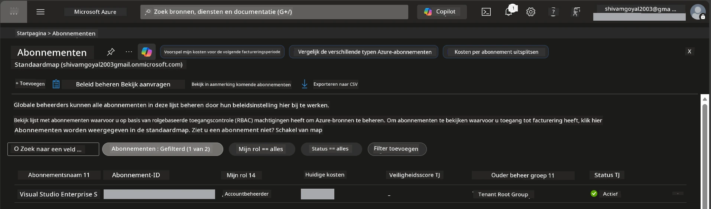

# Module 0 - Vereisten

Voordat je begint met de workshop, bevestig dat je de volgende tools, toegang en omgeving klaar hebt. Volg elke stap hieronder - sla niets over.

---

## 1. Azure-account & abonnement

### 1.1 Maak een Azure-abonnement aan of verifieer het

1. Open een browser en ga naar [https://azure.microsoft.com/free/](https://azure.microsoft.com/free/).
2. Als je nog geen Azure-account hebt, klik dan op **Gratis beginnen** en volg het aanmeldproces. Je hebt een Microsoft-account nodig (of maak er een aan) en een creditcard voor identiteitsverificatie.
3. Als je al een account hebt, meld je dan aan op [https://portal.azure.com](https://portal.azure.com).
4. Klik in de Portal op het blad **Abonnementen** in de linker navigatie (of zoek "Abonnementen" in de zoekbalk bovenaan).
5. Controleer of je minimaal één **Actief** abonnement ziet. Noteer de **Abonnements-ID** - je hebt die later nodig.



### 1.2 Begrijp de vereiste RBAC-rollen

De uitrol van [Hosted Agent](https://learn.microsoft.com/azure/foundry/agents/concepts/hosted-agents) vereist **dataactie** machtigingen die standaard Azure `Owner` en `Contributor` rollen **niet** omvatten. Je hebt een van deze [rolcombinaties](https://learn.microsoft.com/azure/foundry/concepts/rbac-foundry#built-in-roles) nodig:

| Scenario | Vereiste rollen | Waar toe te wijzen |
|----------|-----------------|--------------------|
| Nieuw Foundry-project aanmaken | **Azure AI Owner** op Foundry-resource | Foundry-resource in Azure Portal |
| Uitrollen naar bestaand project (nieuwe resources) | **Azure AI Owner** + **Contributor** op abonnement | Abonnement + Foundry-resource |
| Uitrollen naar volledig geconfigureerd project | **Reader** op account + **Azure AI User** op project | Account + Project in Azure Portal |

> **Belangrijk punt:** Azure `Owner` en `Contributor` rollen dekken alleen *beheer* rechten (ARM-bewerkingen). Je hebt [**Azure AI User**](https://learn.microsoft.com/azure/foundry/concepts/rbac-foundry#built-in-roles) (of hoger) nodig voor *dataacties* zoals `agents/write` die vereist zijn om agents aan te maken en uit te rollen. Je wijst deze rollen toe in [Module 2](02-create-foundry-project.md).

---

## 2. Installeer lokale tools

Installeer elke onderstaande tool. Controleer na installatie of het werkt door het controlerend commando uit te voeren.

### 2.1 Visual Studio Code

1. Ga naar [https://code.visualstudio.com/](https://code.visualstudio.com/).
2. Download de installer voor jouw besturingssysteem (Windows/macOS/Linux).
3. Voer de installer uit met de standaardinstellingen.
4. Open VS Code en bevestig dat het opstart.

### 2.2 Python 3.10+

1. Ga naar [https://www.python.org/downloads/](https://www.python.org/downloads/).
2. Download Python 3.10 of hoger (3.12+ aanbevolen).
3. **Windows:** Vink tijdens de installatie **"Add Python to PATH"** aan op het eerste scherm.
4. Open een terminal en controleer:

   ```powershell
   python --version
   ```

   Verwachte output: `Python 3.10.x` of hoger.

### 2.3 Azure CLI

1. Ga naar [https://learn.microsoft.com/cli/azure/install-azure-cli](https://learn.microsoft.com/cli/azure/install-azure-cli).
2. Volg de installatie-instructies voor jouw besturingssysteem.
3. Controleer:

   ```powershell
   az --version
   ```

   Verwacht: `azure-cli 2.80.0` of hoger.

4. Meld je aan:

   ```powershell
   az login
   ```

### 2.4 Azure Developer CLI (azd)

1. Ga naar [https://learn.microsoft.com/azure/developer/azure-developer-cli/install-azd](https://learn.microsoft.com/azure/developer/azure-developer-cli/install-azd).
2. Volg de installatie-instructies voor jouw OS. Op Windows:

   ```powershell
   winget install microsoft.azd
   ```

3. Controleer:

   ```powershell
   azd version
   ```

   Verwacht: `azd version 1.x.x` of hoger.

4. Meld je aan:

   ```powershell
   azd auth login
   ```

### 2.5 Docker Desktop (optioneel)

Docker is alleen nodig als je het containerimage lokaal wilt bouwen en testen voordat je uitrolt. De Foundry-extensie regelt het containerbouwen tijdens de uitrol automatisch.

1. Ga naar [https://docs.docker.com/get-docker/](https://docs.docker.com/get-docker/).
2. Download en installeer Docker Desktop voor jouw OS.
3. **Windows:** Zorg dat de WSL 2-backend geselecteerd is tijdens de installatie.
4. Start Docker Desktop en wacht tot het pictogram in de systeemvak aangeeft **"Docker Desktop is running"**.
5. Open een terminal en controleer:

   ```powershell
   docker info
   ```

   Dit zou Docker systeeminfo zonder fouten moeten tonen. Als je `Cannot connect to the Docker daemon` ziet, wacht dan nog een paar seconden totdat Docker volledig is gestart.

---

## 3. Installeer VS Code extensies

Je hebt drie extensies nodig. Installeer ze **voor** de workshop begint.

### 3.1 Microsoft Foundry voor VS Code

1. Open VS Code.
2. Druk op `Ctrl+Shift+X` om het Extensiespaneel te openen.
3. Typ in het zoekvak **"Microsoft Foundry"**.
4. Zoek **Microsoft Foundry for Visual Studio Code** (uitgever: Microsoft, ID: `TeamsDevApp.vscode-ai-foundry`).
5. Klik op **Installeren**.
6. Na installatie zou het **Microsoft Foundry**-icoon moeten verschijnen in de Activiteitenbalk (linkerzijbalk).

### 3.2 Foundry Toolkit

1. Zoek in het Extensiespaneel (`Ctrl+Shift+X`) naar **"Foundry Toolkit"**.
2. Zoek **Foundry Toolkit** (uitgever: Microsoft, ID: `ms-windows-ai-studio.windows-ai-studio`).
3. Klik op **Installeren**.
4. Het **Foundry Toolkit**-icoon zou moeten verschijnen in de Activiteitenbalk.

### 3.3 Python

1. Zoek in het Extensiespaneel naar **"Python"**.
2. Zoek **Python** (uitgever: Microsoft, ID: `ms-python.python`).
3. Klik op **Installeren**.

---

## 4. Meld je aan bij Azure vanuit VS Code

Het [Microsoft Agent Framework](https://learn.microsoft.com/agent-framework/overview/) gebruikt [`DefaultAzureCredential`](https://learn.microsoft.com/azure/developer/python/sdk/authentication/credential-chains#defaultazurecredential-overview) voor authenticatie. Je moet ingelogd zijn in Azure in VS Code.

### 4.1 Aanmelden via VS Code

1. Kijk linksonder in VS Code en klik op het **Accounts**-icoon (personen-silhouet).
2. Klik op **Aanmelden om Microsoft Foundry te gebruiken** (of **Aanmelden met Azure**).
3. Er opent een browservenster - meld je aan met het Azure-account met toegang tot je abonnement.
4. Ga terug naar VS Code. Je zou je accountnaam linksonder moeten zien.

### 4.2 (Optioneel) Aanmelden via Azure CLI

Als je de Azure CLI hebt geïnstalleerd en liever CLI-authenticatie gebruikt:

```powershell
az login
```

Dit opent een browser voor aanmelding. Na aanmelding stel je het juiste abonnement in:

```powershell
az account set --subscription "<your-subscription-id>"
```

Controleer:

```powershell
az account show --query "{name:name, id:id, state:state}" --output table
```

Je zou je abonnementsnaam, ID en status = `Enabled` moeten zien.

### 4.3 (Alternatief) Service principal-authenticatie

Voor CI/CD of gedeelde omgevingen stel je in plaats daarvan deze omgevingsvariabelen in:

```powershell
$env:AZURE_TENANT_ID = "<your-tenant-id>"
$env:AZURE_CLIENT_ID = "<your-client-id>"
$env:AZURE_CLIENT_SECRET = "<your-client-secret>"
```

---

## 5. Beperkingen in de preview

Wees je voordat je doorgaat bewust van de huidige beperkingen:

- [**Hosted Agents**](https://learn.microsoft.com/azure/foundry/agents/concepts/hosted-agents) zijn momenteel in **openbare preview** - niet aanbevolen voor productiewerkbelasting.
- **Ondersteunde regio's zijn beperkt** - controleer de [regio-beschikbaarheid](https://learn.microsoft.com/azure/foundry/agents/concepts/hosted-agents#region-availability) voordat je resources aanmaakt. Als je een niet-ondersteunde regio kiest, mislukt de uitrol.
- Het `azure-ai-agentserver-agentframework` pakket is pre-release (`1.0.0b16`) - API’s kunnen veranderen.
- Schaalbeperkingen: hosted agents ondersteunen 0-5 replicas (inclusief schaal-naar-nul).

---

## 6. Preflight checklist

Loop elk item hieronder na. Als een stap faalt, ga terug en los het op voordat je doorgaat.

- [ ] VS Code opent zonder fouten
- [ ] Python 3.10+ staat op je PATH (`python --version` toont `3.10.x` of hoger)
- [ ] Azure CLI is geïnstalleerd (`az --version` toont `2.80.0` of hoger)
- [ ] Azure Developer CLI is geïnstalleerd (`azd version` toont versie-informatie)
- [ ] Microsoft Foundry extensie is geïnstalleerd (icoon zichtbaar in Activiteitenbalk)
- [ ] Foundry Toolkit extensie is geïnstalleerd (icoon zichtbaar in Activiteitenbalk)
- [ ] Python extensie is geïnstalleerd
- [ ] Je bent ingelogd bij Azure in VS Code (controleer Accounts-icoon, linksonder)
- [ ] `az account show` toont jouw abonnement
- [ ] (Optioneel) Docker Desktop draait (`docker info` toont systeeminfo zonder fouten)

### Controlepunt

Open de Activiteitenbalk van VS Code en bevestig dat je zowel de **Foundry Toolkit** als **Microsoft Foundry** zijbalkweergaven ziet. Klik elk aan om te verifiëren dat ze laden zonder fouten.

---

**Volgende:** [01 - Installeer Foundry Toolkit & Foundry Extensie →](01-install-foundry-toolkit.md)

---

<!-- CO-OP TRANSLATOR DISCLAIMER START -->
**Disclaimer**:  
Dit document is vertaald met behulp van de AI-vertalingsservice [Co-op Translator](https://github.com/Azure/co-op-translator). Hoewel wij streven naar nauwkeurigheid, kan het voorkomen dat geautomatiseerde vertalingen fouten of onnauwkeurigheden bevatten. Het originele document in de oorspronkelijke taal dient als de gezaghebbende bron te worden beschouwd. Voor kritieke informatie wordt professionele menselijke vertaling aanbevolen. Wij zijn niet aansprakelijk voor eventuele misverstanden of verkeerde interpretaties die voortvloeien uit het gebruik van deze vertaling.
<!-- CO-OP TRANSLATOR DISCLAIMER END -->