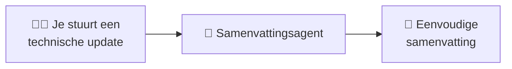

# Module 0 - Introductie

⏱️ ~10 min

> [!WARNING]
> **Preview & Beperkingen:** [Hosted Agents](https://learn.microsoft.com/azure/foundry/agents/concepts/hosted-agents) zijn momenteel in **openbare preview** - niet aanbevolen voor productie-omgevingen. Wees bewust van het volgende:
> - **Ondersteunde regio's zijn beperkt** - controleer de [regioregistratie](https://learn.microsoft.com/azure/foundry/agents/concepts/hosted-agents#region-availability) voordat je resources aanmaakt. Als je een niet-ondersteunde regio kiest, mislukt de implementatie.
> - Het `azure-ai-agentserver-agentframework` pakket is pre-release - API's kunnen tussen versies veranderen.
> - Schaallimieten: hosted agents ondersteunen 0–5 replica's (inclusief scale-to-zero).
> - Sommige functies die in deze workshop worden getoond kunnen veranderen naarmate de dienst naar GA beweegt.

## Wat je gaat bouwen

In deze workshop bouw je een **"Explain Like I'm an Executive"** agent - een gehoste AI-agent die complexe technische updates neemt en ze herschrijft als eenvoudig te begrijpen bestuursrapportages.

```mermaid
flowchart LR
    A["🧑‍💻 Je stuurt een\ntechnische update"] --> B["🤖 Samenvattingsagent"]
    B --> C["📝 Eenvoudige\nsamenvatting"]
```

**De agent gebruikt:**
- **Microsoft Agent Framework** - voor agentlogica en structuur
- **Foundry Toolkit voor VS Code** - om te scaffolden, lokaal te testen en te implementeren
- **Een AI-model** (bijv. `gpt-4.1-mini/gpt-5-mini`) - om de samenvattingen te genereren

Aan het einde van deze lab heb je een werkende agent die je lokaal kunt testen via de Agent Inspector en optioneel naar de cloud kunt implementeren.

---

## Wat zijn hosted agents?

Een **hosted agent** is een AI-agent die draait als een beheerde dienst in Microsoft Foundry. In plaats van zelf infrastructuur te beheren, verpak je je agentcode in een container en Foundry zorgt voor schaalvergroting, hosting en het blootstellen ervan via een standaard HTTP-eindpunt.

| Concept | Wat het betekent |
|---------|--------------|
| **Agent** | Jouw Python-code die een gebruikersbericht ontvangt, een AI-model aanroept en een gestructureerde reactie teruggeeft |
| **Hosted** | Foundry draait jouw container voor je - geen VM's, geen Kubernetes, geen infrastructuur om te beheren |
| **Responsprotocol** | Een standaard HTTP API (`POST /responses`) die elke client kan gebruiken om met je agent te communiceren |
| **Agent Inspector** | Een lokale test-UI (ingebouwd in Foundry Toolkit) waarmee je met je agent kunt chatten voordat je implementeert |

In deze workshop ga je van nul naar een volledig gehoste agent - of stop je bij lokaal testen als je dat liever hebt.

---

## Kies je pad

> ⚠️ **Kies een pad voordat je verdergaat.** Je keuze bepaalt welke tools je installeert en welke modules van toepassing zijn. Je kunt later overschakelen van Pad B → Pad A als je een abonnement krijgt.

<strong>🅰️ Pad A - Azure cloud (vereist Azure-abonnement)</strong>

| | Details |
|---|---|
| **Voor wie is dit?** | Je hebt een actief Azure-abonnement en kunt Foundry-resources aanmaken |
| **Model** | Azure OpenAI via Foundry (bijv. `gpt-4.1-mini/gpt-5-mini`) |
| **Behandelde modules** | Alle modules (00–07) |
| **Implementeren in de cloud?** | ✅ Ja - volledige end-to-end implementatie |

<strong>🅱️ Pad B - Lokaal / free-tier (geen Azure-abonnement nodig)</strong>

| | Details |
|---|---|
| **Voor wie is dit?** | MVP's, studenten, of iedereen zonder Azure-toegang |
| **Model** | **Foundry Local** (gratis, draait op je machine) |
| **Behandelde modules** | Modules 00–04 (sla implementatie & cloudverificatie over) |
| **Implementeren in de cloud?** | ❌ Nee - alleen lokaal testen via Agent Inspector |

---

## Alle paden: Benodigde tools

Installeer elk van de onderstaande tools. Controleer na installatie of het werkt door het controlecommando uit te voeren.

| # | Tool | Versie | Installatie | Controle (Verwachte Uitvoer) |
|---|------|---------|---------|---------------------------|
| 1 | **Visual Studio Code** | Laatste | [code.visualstudio.com](https://code.visualstudio.com/) | Opent zonder fouten |
| 2 | **Python** | 3.12 of hoger| [python.org/downloads](https://www.python.org/downloads/) | `python --version` $\rightarrow$ `Python 3.12.x` |
| 3 | **Foundry Toolkit voor VS Code** | Laatste | Extension ID: `ms-windows-ai-studio.windows-ai-studio` | Foundry-icoon in Activity Bar |
| 4 | **Python-extensie voor VS Code** | Laatste | Extension ID: `ms-python.python` | Geïnstalleerd in Extensies-paneel |

> [!TIP]
> **Pro-tips voor installatie:**
> - **Python PATH (Windows):** Vink altijd **"Add Python to PATH"** aan op het eerste scherm van de Python-installatie. Zonder dit wordt `python` niet herkend in je terminal.
> - **Meerdere Python-versies:** Als je zowel Python 3.10 als 3.12 hebt geïnstalleerd, gebruik dan `python3.12 -m venv .venv` om ervoor te zorgen dat de juiste versie wordt gebruikt voor je virtuele omgeving.
> - **Docker WSL 2 (Windows):** Tijdens de installatie van Docker Desktop zorg je ervoor dat de **WSL 2 backend** is geselecteerd. Docker met Hyper-V is trager en kan problemen veroorzaken bij Foundry container builds.
> - **Docker start niet?** Wacht 30–60 seconden nadat je Docker Desktop hebt geopend. Voer `docker info` uit - als je "Cannot connect to the Docker daemon" ziet, is Docker nog aan het initialiseren.
> - **VS Code-extensies laden niet?** Herlaad het venster na het installeren van extensies: `Ctrl+Shift+P` → `Developer: Reload Window`.

> **Windows-gebruikers:** Vink **"Add Python to PATH"** aan tijdens de Python-installatie.

**Volgende:** [01 - Setup →](01-setup.md)

---

<!-- CO-OP TRANSLATOR DISCLAIMER START -->
**Disclaimer**:
Dit document is vertaald met behulp van de AI vertaaldienst [Co-op Translator](https://github.com/Azure/co-op-translator). Hoewel we streven naar nauwkeurigheid, dient u er rekening mee te houden dat geautomatiseerde vertalingen fouten of onnauwkeurigheden kunnen bevatten. Het originele document in de oorspronkelijke taal moet worden beschouwd als de gezaghebbende bron. Voor kritieke informatie wordt professionele menselijke vertaling aanbevolen. Wij zijn niet aansprakelijk voor eventuele misverstanden of verkeerde interpretaties die voortvloeien uit het gebruik van deze vertaling.
<!-- CO-OP TRANSLATOR DISCLAIMER END -->