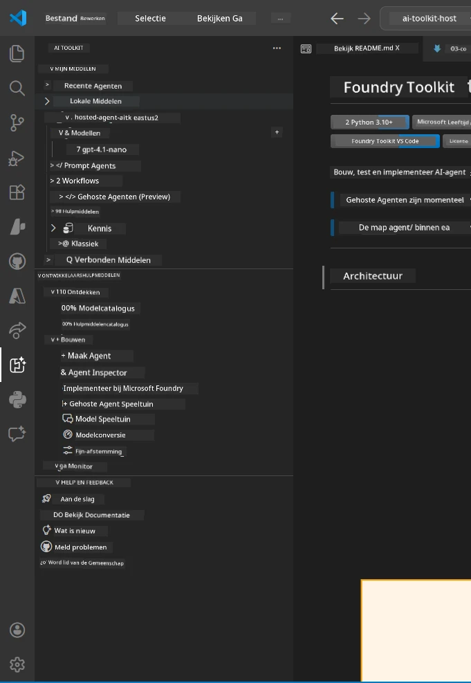
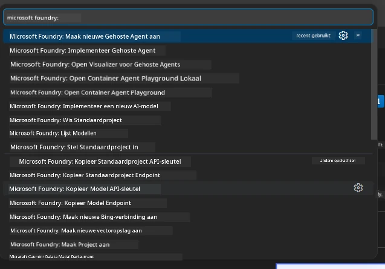

# Module 1 - Installeer Foundry Toolkit & Foundry Extension

Deze module begeleidt je bij het installeren en verifiëren van de twee belangrijkste VS Code-extensies voor deze workshop. Als je ze al hebt geïnstalleerd tijdens [Module 0](00-prerequisites.md), gebruik dan deze module om te controleren of ze correct werken.

---

## Stap 1: Installeer de Microsoft Foundry Extension

De **Microsoft Foundry voor VS Code** extensie is je hoofdhulpmiddel voor het creëren van Foundry-projecten, het implementeren van modellen, het opzetten van hosted agents en direct deployen vanuit VS Code.

1. Open VS Code.
2. Druk op `Ctrl+Shift+X` om het **Extensions** paneel te openen.
3. Typ in het zoekvak bovenin: **Microsoft Foundry**
4. Zoek het resultaat met de titel **Microsoft Foundry for Visual Studio Code**.
   - Uitgever: **Microsoft**
   - Extension ID: `TeamsDevApp.vscode-ai-foundry`
5. Klik op de knop **Install**.
6. Wacht tot de installatie is voltooid (je ziet een kleine voortgangsindicator).
7. Na installatie, kijk naar de **Activity Bar** (de verticale icoonbalk aan de linkerkant van VS Code). Je zou een nieuw **Microsoft Foundry** icoon moeten zien (ziet eruit als een diamant/AI-icoon).
8. Klik op het **Microsoft Foundry** icoon om het zijbalkvenster te openen. Je zou secties moeten zien voor:
   - **Resources** (of Projects)
   - **Agents**
   - **Models**

> **Als het icoon niet verschijnt:** Probeer VS Code te herladen (`Ctrl+Shift+P` → `Developer: Reload Window`).

---

## Stap 2: Installeer de Foundry Toolkit Extension

De **Foundry Toolkit** extensie biedt de [**Agent Inspector**](https://learn.microsoft.com/azure/foundry/agents/how-to/vs-code-agents-workflow-pro-code) - een visuele interface voor het lokaal testen en debuggen van agents - plus playground, modelbeheer en evaluatietools.

1. Verwijder in het Extensions-paneel (`Ctrl+Shift+X`) het zoekvak en typ: **Foundry Toolkit**
2. Zoek **Foundry Toolkit** in de resultaten.
   - Uitgever: **Microsoft**
   - Extension ID: `ms-windows-ai-studio.windows-ai-studio`
3. Klik op **Install**.
4. Na installatie verschijnt het **Foundry Toolkit** icoon in de Activity Bar (ziet eruit als een robot/glinstering icoon).
5. Klik op het **Foundry Toolkit** icoon om het zijbalkvenster te openen. Je zou het welkomstscherm van Foundry Toolkit moeten zien met opties voor:
   - **Models**
   - **Playground**
   - **Agents**

---

## Stap 3: Controleer of beide extensies werken

### 3.1 Controleer Microsoft Foundry Extension

1. Klik op het **Microsoft Foundry** icoon in de Activity Bar.
2. Als je bent aangemeld bij Azure (van Module 0), zou je je projecten onder **Resources** moeten zien.
3. Als gevraagd wordt om in te loggen, klik dan op **Sign in** en volg de authenticatiestroom.
4. Bevestig dat je de zijbalk zonder fouten kunt zien.

### 3.2 Controleer Foundry Toolkit Extension

1. Klik op het **Foundry Toolkit** icoon in de Activity Bar.
2. Bevestig dat het welkomstscherm of het hoofdvenster zonder fouten wordt geladen.
3. Je hoeft nog niets te configureren - we gebruiken de Agent Inspector in [Module 5](05-test-locally.md).

### 3.3 Controleer via Command Palette

1. Druk op `Ctrl+Shift+P` om de Command Palette te openen.
2. Typ **"Microsoft Foundry"** - je zou commando’s moeten zien zoals:
   - `Microsoft Foundry: Create a New Hosted Agent`
   - `Microsoft Foundry: Deploy Hosted Agent`
   - `Microsoft Foundry: Open Model Catalog`
3. Druk op `Escape` om de Command Palette te sluiten.
4. Open de Command Palette opnieuw en typ **"Foundry Toolkit"** - je zou commando’s moeten zien zoals:
   - `Foundry Toolkit: Open Agent Inspector`

> Als je deze commando’s niet ziet, zijn de extensies mogelijk niet correct geïnstalleerd. Probeer ze te verwijderen en opnieuw te installeren.

---

## Wat deze extensies doen in deze workshop

| Extensie | Wat het doet | Wanneer je het gebruikt |
|-----------|-------------|-------------------|
| **Microsoft Foundry for VS Code** | Creëert Foundry-projecten, implementeert modellen, **scaffold [hosted agents](https://learn.microsoft.com/azure/foundry/agents/concepts/hosted-agents)** (genereert automatisch `agent.yaml`, `main.py`, `Dockerfile`, `requirements.txt`), implementeren naar [Foundry Agent Service](https://learn.microsoft.com/azure/foundry/agents/overview) | Modules 2, 3, 6, 7 |
| **Foundry Toolkit** | Agent Inspector voor lokaal testen/debuggen, playground UI, modelbeheer | Modules 5, 7 |

> **De Foundry extensie is het belangrijkste hulpmiddel in deze workshop.** Het behandelt de complete levenscyclus: scaffold → configureren → deployen → verifiëren. De Foundry Toolkit vult dit aan door de visuele Agent Inspector te bieden voor lokaal testen.

---

### Checkpoint

- [ ] Microsoft Foundry icoon is zichtbaar in de Activity Bar
- [ ] Klikken daarop opent de zijbalk zonder fouten
- [ ] Foundry Toolkit icoon is zichtbaar in de Activity Bar
- [ ] Klikken daarop opent de zijbalk zonder fouten
- [ ] `Ctrl+Shift+P` → typen "Microsoft Foundry" toont beschikbare commando’s
- [ ] `Ctrl+Shift+P` → typen "Foundry Toolkit" toont beschikbare commando’s

---

**Vorige:** [00 - Prerequisites](00-prerequisites.md) · **Volgende:** [02 - Create Foundry Project →](02-create-foundry-project.md)

---

<!-- CO-OP TRANSLATOR DISCLAIMER START -->
**Disclaimer**:
Dit document is vertaald met behulp van de AI-vertalingsdienst [Co-op Translator](https://github.com/Azure/co-op-translator). Hoewel we streven naar nauwkeurigheid, dient u er rekening mee te houden dat geautomatiseerde vertalingen fouten of onnauwkeurigheden kunnen bevatten. Het originele document in de oorspronkelijke taal moet worden beschouwd als de gezaghebbende bron. Voor kritieke informatie wordt professionele menselijke vertaling aanbevolen. Wij zijn niet aansprakelijk voor enige misverstanden of verkeerde interpretaties voortvloeiend uit het gebruik van deze vertaling.
<!-- CO-OP TRANSLATOR DISCLAIMER END -->