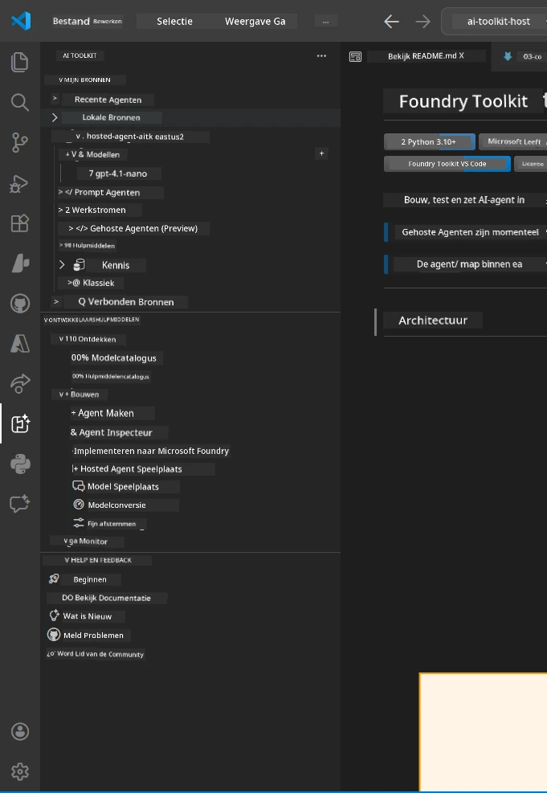
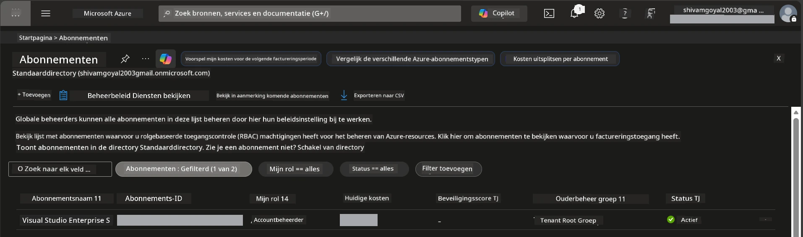
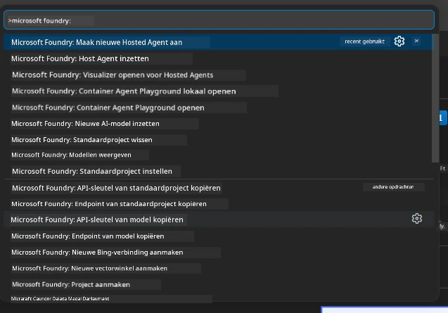
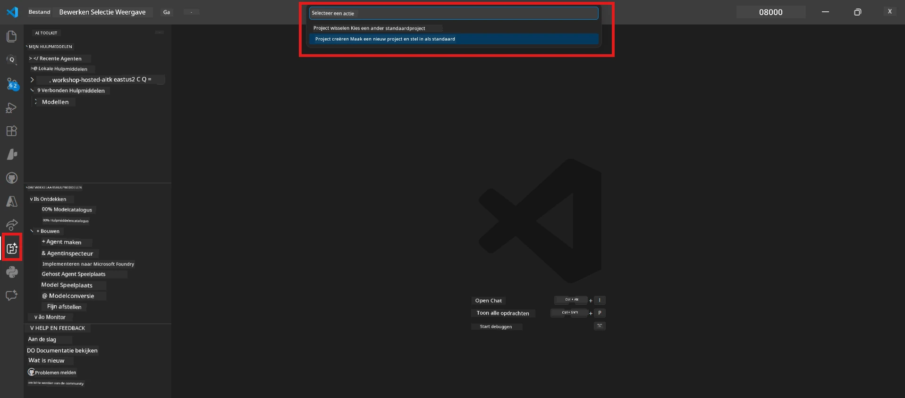
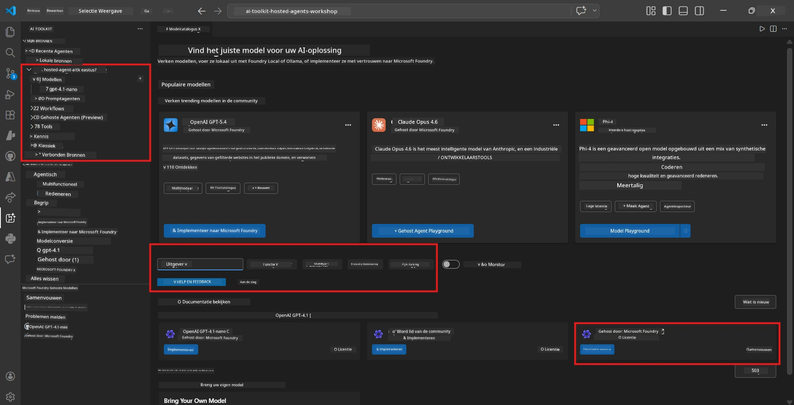
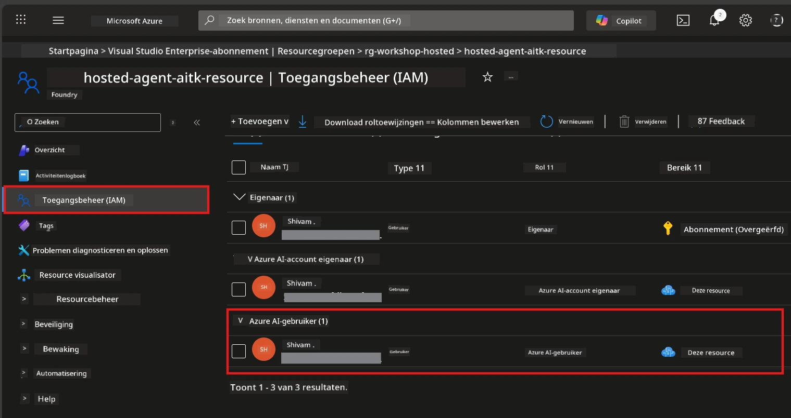

# Setup: Extensie, Project & Model

⏱️ ~15 min

In deze module installeer en verifieer je de Foundry Toolkit-extensie, maak je een Foundry-project aan (of maak je er verbinding mee) en zet je een model uit dat je agent zal gebruiken.

## Stap 1: Installeer Foundry Toolkit

**Foundry Toolkit voor VS Code** is de belangrijkste extensie voor deze workshop. Het biedt projectcreatie, modeluitrol, agent-skeletten, lokaal testen (Agent Inspector) en clouduitrol - allemaal vanuit VS Code.

1. Open VS Code en druk op `Ctrl+Shift+X` om het **Extensies**-paneel te openen.
2. Zoek naar **Foundry Toolkit**.
3. Installeer **Foundry Toolkit voor VS Code** (Uitgever: Microsoft, ID: `ms-windows-ai-studio.windows-ai-studio`).
4. Na installatie verschijnt het **Foundry Toolkit**-pictogram in de Activiteitenbalk (linkerzijbalk).

> *Opmerking: De Activiteitenbalk kan "AI TOOLKIT" weergeven in oudere versies van de extensie. De functionaliteit is identiek.*



## Stap 2: Setup op basis van je toegang

> **Kies je pad:** Vouw de onderstaande sectie uit die overeenkomt met je setup. Je hoeft maar **één** pad te volgen.

<details>
<summary><strong>🅰️ Pad A - Azure cloud (vereist Azure-abonnement)</strong></summary>

### Azure CLI

1. Installeer van [learn.microsoft.com/cli/azure/install-azure-cli](https://learn.microsoft.com/cli/azure/install-azure-cli).
2. Verifieer: `az --version` (verwacht 2.80.0+).
3. Meld aan: `az login`

### Authenticatieopties

Het [Microsoft Agent Framework](https://learn.microsoft.com/agent-framework/overview/) gebruikt [`DefaultAzureCredential`](https://learn.microsoft.com/azure/developer/python/sdk/authentication/credential-chains#defaultazurecredential-overview) dat meerdere authenticatiemethoden in volgorde probeert. Kies degene die bij je omgeving past:

#### Optie 1: VS Code-accounts (aanbevolen voor workshops)
1. Klik op het **Accounts**-pictogram (persoon-silhouet) linksonder in VS Code.
2. Selecteer **Aanmelden om Microsoft Foundry te gebruiken** (of **Aanmelden met Azure**).
3. Er opent een browser - meld je aan met het Azure-account dat toegang heeft tot je abonnement.
4. Keer terug naar VS Code. Je zou je accountnaam linksonder moeten zien.

#### Optie 2: Azure CLI
```bash
az login
az account set --subscription "<your-subscription-id>"
```

#### Optie 3: Service Principal (Enterprise/CI)
Voor streng beveiligde omgevingen of CI/CD-pijplijnen stel je deze omgevingsvariabelen in je `.env`-bestand in:
```env
AZURE_TENANT_ID=<your-tenant-id>
AZURE_CLIENT_ID=<your-client-id>
AZURE_CLIENT_SECRET=<your-client-secret>
```

> **Hoe `DefaultAzureCredential` werkt:** Het probeert eerst omgevingsvariabelen, dan beheerde identiteit, dan VS Code-aanmelding, dan Azure CLI - en gebruikt welke het eerst slaagt. Zie [documentatie over credential chain](https://learn.microsoft.com/azure/developer/python/sdk/authentication/credential-chains#defaultazurecredential-overview).

### Azure Developer CLI (azd)

1. Installeer: `winget install microsoft.azd` (Windows) of zie [installatiedocumentatie](https://learn.microsoft.com/azure/developer/azure-developer-cli/install-azd).
2. Verifieer: `azd version`
3. Meld aan: `azd auth login`

### Docker Desktop (optioneel)

Docker is alleen nodig als je containers lokaal wilt bouwen. De Foundry-extensie behandelt builds automatisch tijdens uitrol.

1. Installeer van [docs.docker.com/get-docker](https://docs.docker.com/get-docker/).
2. Verifieer: `docker info`

### Azure-abonnement & RBAC

1. Meld aan op [portal.azure.com](https://portal.azure.com).
2. Navigeer naar **Abonnementen** en bevestig dat er ten minste één **Actief** is.
3. Noteer je **Abonnements-ID** - je hebt dit nodig in Module 01.



#### RBAC Scenariotabel

[Hosted Agent](https://learn.microsoft.com/azure/foundry/agents/concepts/hosted-agents) uitrol vereist **data-actierechten** die standaard Azure `Owner` en `Contributor` rollen **niet** bevatten. Gebruik onderstaande tabel om te bepalen welke rollen je nodig hebt:

| Scenario | Vereiste rollen | Waar toe te wijzen |
|----------|---------------|----------------------|
| Nieuw Foundry-project maken | **Azure AI Owner** op Foundry resource | Foundry resource in Azure Portal |
| Uitrollen naar bestaand project (nieuwe resources) | **Azure AI Owner** + **Contributor** op abonnement | Abonnement + Foundry resource |
| Uitrollen naar volledig geconfigureerd project | **Reader** op account + **Azure AI User** op project | Account + Project in Azure Portal |
| Alleen lokaal testen (geen uitrol) | **Azure AI User** op project | Project in Azure Portal |

> **Belangrijke opmerking:** Azure `Owner` en `Contributor` rollen dekken alleen *beheer* rechten (ARM-operaties). Je hebt [**Azure AI User**](https://learn.microsoft.com/azure/foundry/concepts/rbac-foundry#built-in-roles) (of hoger) nodig voor *data-acties* zoals `agents/write` die vereist zijn om agents te creëren en uit te rollen.

## Verbind of maak een Foundry-project aan



1. Druk op `Ctrl+Shift+P` → typ **Foundry Toolkit: Create Project** → selecteer het.
2. Selecteer je **Azure-abonnement** uit de dropdown.
3. Selecteer of maak een **resourcegroep** aan (bijv. `rg-hosted-agents-workshop`).
4. Selecteer een **regio** die hosted agents ondersteunt: `East US`, `West US 2`, of `Sweden Central`. Zie [regio beschikbaarheid](https://learn.microsoft.com/azure/foundry/agents/concepts/hosted-agents#region-availability).
5. Voer een projectnaam in (bijv. `workshop-agents`).
6. Wacht 2–5 minuten op provisioning. Er verschijnt een voortgangsmelding in VS Code.
7. Als het klaar is, verschijnt je project in de **Foundry Toolkit** zijbalk onder **MIJN BRONNEN**.



## Zet een model uit & wijs RBAC toe

Je gehoste agent heeft een AI-model nodig om antwoorden te genereren.

#### Model Selectie Matrix
Afhankelijk van je behoeften kun je kiezen uit verschillende modelniveaus:

| Model | Beste voor | Kosten | Opmerkingen |
|-------|----------|------|-------|
| `gpt-4.1` | Hoogwaardige, genuanceerde antwoorden | Hoger | Beste resultaten, aanbevolen voor laatste testfase |
| `gpt-4.1-mini/gpt-5-mini` | Snelle iteratie, lagere kosten | Lager | Goed voor workshopontwikkeling en snelle tests |
| `gpt-4.1-nano` | Lichtgewicht taken | Laagst | Meest kosteneffectief, maar simpelere antwoorden |

1. Druk op `Ctrl+Shift+P` → **Foundry Toolkit: Open Model Catalog** (of klik **Model Catalog** in de zijbalk onder ONTWIKKELINGSTOOLS → Ontdekken).
2. Zoek naar **gpt-4.1** in de catalogus.
3. Zoek **OpenAI GPT-4.1-mini** (of `gpt-5-mini` voor betere kwaliteit) en klik op **Deploy**.



4. In de uitrolconfiguratie:
   - **Uitrolnaam:** Laat de standaard of voer een aangepaste naam in. **Onthoud deze naam.**
   - **Doel:** Selecteer **Deploy to Foundry Toolkit** → kies je project.
5. Klik op **Deploy** en wacht 1–3 minuten.

> **Aanbeveling:** Gebruik `gpt-4.1-mini/gpt-5-mini` voor de workshop - snel, betaalbaar en levert goede resultaten.

### Noteer je waarden

Na uitrol noteer je deze twee waarden (je hebt ze nodig in Module 03):

| Waarde | Waar te vinden |
|-------|-----------------|
| **Project-eindpunt** | Klik je project in de zijbalk → detailweergave toont de URL (bijv. `https://<account>.services.ai.azure.com/api/projects/<project>`) |
| **Modeluitrolnaam** | Vouw project uit → **Modellen** → de naam naast je uitgerolde model (bijv. `gpt-4.1-mini/gpt-5-mini`) |

### Wijs RBAC-rol toe

> ⚠️ **Dit is de vaakst vergeten stap.** Zonder de juiste rol zal de uitrol in Module 05 mislukken.

#### Welke rol heb ik nodig?
Afhankelijk van je scenario heb je de volgende rolcombinaties nodig:

| Scenario | Vereiste rollen | Waar toe te wijzen |
|----------|---------------|----------------------|
| Nieuw Foundry-project maken | **Azure AI Owner** op Foundry resource | Foundry resource in Azure Portal |
| Uitrollen naar bestaand project (nieuwe resources) | **Azure AI Owner** + **Contributor** op abonnement | Abonnement + Foundry resource |
| Uitrollen naar volledig geconfigureerd project | **Reader** op account + **Azure AI User** op project | Account + Project in Azure Portal |

**Belangrijk:** Azure `Owner` en `Contributor` rollen dekken alleen *beheer* rechten. Je hebt **Azure AI User** (of hoger) nodig voor *data-acties* zoals `agents/write` die nodig zijn om agents te maken en uit te rollen.

1. Open [portal.azure.com](https://portal.azure.com).
2. Zoek je **Foundry-project** naam → klik het resultaat van het type **"Foundry Toolkit project"** (NIET het bovenliggende account).
3. Klik op **Toegangscontrole (IAM)** in de linkernavigatie.
4. Klik op **+ Toevoegen** → **Roltoewijzing toevoegen**.
5. **Roltabs:** Zoek naar **Azure AI User**, selecteer het en klik op **Volgende**.
6. **Lidmaattabs:** Selecteer **Gebruiker, groep of serviceprincipal** → klik op **+ Selecteer leden** → zoek en selecteer jezelf → klik op **Selecteren**.
7. Klik op **Controleren + toewijzen** → nogmaals **Controleren + toewijzen**.
8. **Wacht 1–2 minuten** op propagatie.

> **Waarom deze rol?** Azure `Owner`/`Contributor` geven alleen beheerrechten. De rol **Azure AI User** geeft de data-actie `agents/write` die nodig is om agents te maken en uit te rollen. Zie [Foundry RBAC docs](https://learn.microsoft.com/azure/foundry/concepts/rbac-foundry#built-in-roles).



</details>

<details>
<summary><strong>🅱️ Pad B - Lokaal / gratis tier (geen Azure-abonnement nodig)</strong></summary>

### Foundry Local

Foundry Local stelt je in staat AI-modellen op je eigen machine te draaien - geen cloud-account nodig. Je kunt Foundry Local-modellen benaderen via Foundry Toolkit via de modelcatalogus als volgt:

1. Ga naar de Foundry Toolkit-extensie.
2. Ga in de Foundry Toolkit-navigatie naar **Ontwikkelingstools** > en selecteer **Model Catalogus**
3. Selecteer in het nieuwe venster **lokaal** uit de navigatiebalk.
4. Scroll naar beneden naar **Phi 4 Mini,** en klik op de **toevoegknop** er verschijnt een pop-up die aangeeft dat het model wordt gedownload.
5. Zodra het model is gedownload, kun je doorgaan naar de volgende stap.

</details>

### ✅ Checkpunt


- [ ] `Ctrl+Shift+P` → "Foundry Toolkit" toont beschikbare opdrachten
- [ ] Foundry Toolkit-extensie geïnstalleerd en zijbalk laad zonder fouten
- [ ] VS Code opent en werkt correct
- [ ] `python --version` toont 3.10+
- [ ] Foundry Toolkit-pictogram zichtbaar in VS Code Activiteitenbalk
- [ ] **Pad A:** `az login` slaagt, abonnement is Actief
- [ ] **Pad B:** Foundry Local draait (`foundry local status`)
- [ ] **Pad A:** Foundry-project zichtbaar in zijbalk, model uitgerold, Azure AI User-rol toegewezen
- [ ] **Pad B:** Foundry Local draait met een model
- [ ] Je hebt je **eindpunt** en **modeluitrolnaam** genoteerd


**Vorige:** [00 - Vereisten](00-prerequisites.md) · **Volgende:** [02 - Maak Hosted Agent →](02-create-hosted-agent.md)

---

<!-- CO-OP TRANSLATOR DISCLAIMER START -->
**Disclaimer**:
Dit document is vertaald met behulp van de AI vertaaldienst [Co-op Translator](https://github.com/Azure/co-op-translator). Hoewel we streven naar nauwkeurigheid, dient u er rekening mee te houden dat geautomatiseerde vertalingen fouten of onnauwkeurigheden kunnen bevatten. Het originele document in de oorspronkelijke taal moet worden beschouwd als de gezaghebbende bron. Voor kritieke informatie wordt professionele menselijke vertaling aanbevolen. Wij zijn niet aansprakelijk voor eventuele misverstanden of verkeerde interpretaties die voortvloeien uit het gebruik van deze vertaling.
<!-- CO-OP TRANSLATOR DISCLAIMER END -->