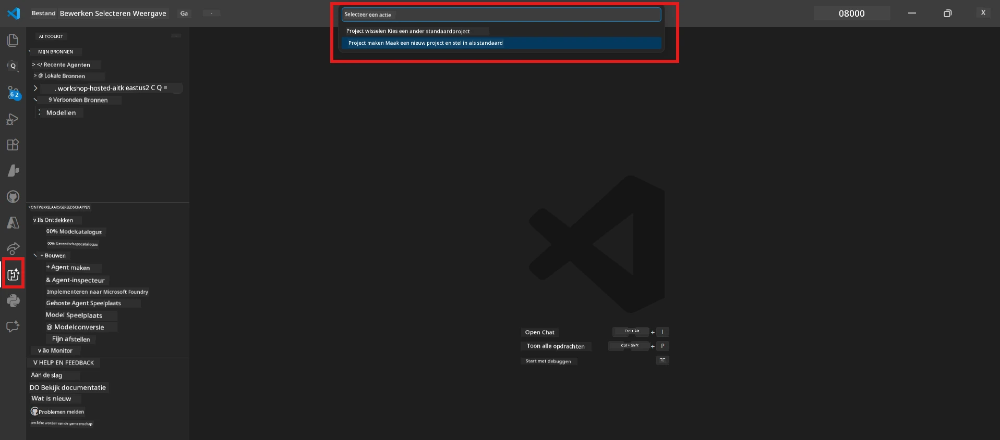
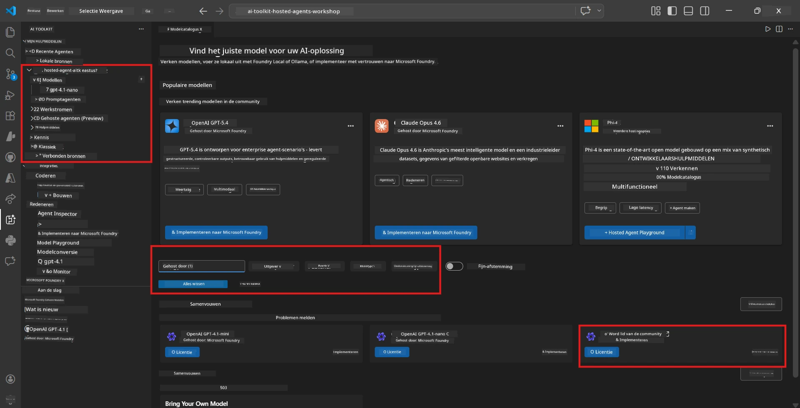
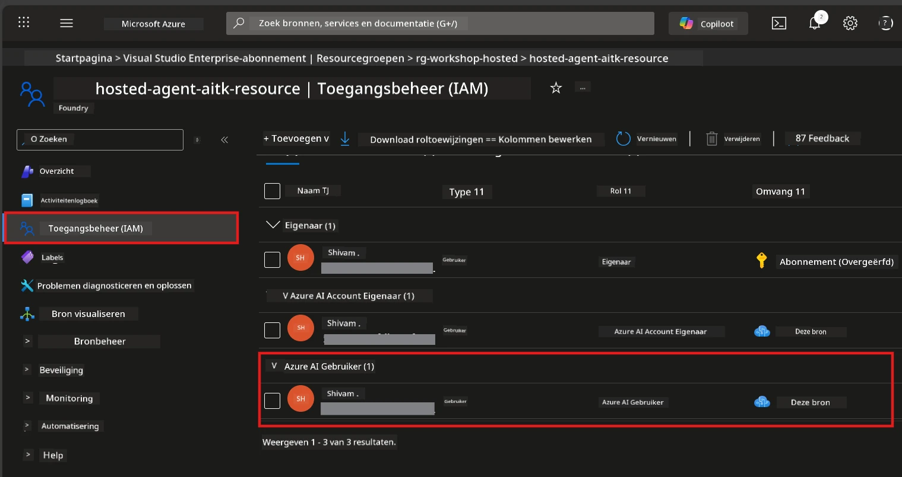

# Module 2 - Maak een Foundry-project aan & implementeer een model

In deze module maak je een Microsoft Foundry-project aan (of selecteer je er een) en implementeer je een model dat je agent zal gebruiken. Elke stap is expliciet uitgeschreven - volg ze in volgorde.

> Als je al een Foundry-project hebt met een geïmplementeerd model, ga dan naar [Module 3](03-create-hosted-agent.md).

---

## Stap 1: Maak een Foundry-project aan vanuit VS Code

Je gebruikt de Microsoft Foundry-extensie om een project aan te maken zonder VS Code te verlaten.

1. Druk op `Ctrl+Shift+P` om de **Command Palette** te openen.
2. Typ: **Microsoft Foundry: Create Project** en selecteer dit.
3. Er verschijnt een dropdown - selecteer je **Azure-abonnement** uit de lijst.
4. Je wordt gevraagd om een **resourcegroep** te selecteren of aan te maken:
   - Om een nieuwe te maken: typ een naam (bijv. `rg-hosted-agents-workshop`) en druk op Enter.
   - Om een bestaande te gebruiken: selecteer deze uit de dropdown.
5. Selecteer een **regio**. **Belangrijk:** Kies een regio die hosted agents ondersteunt. Controleer de [regio-beschikbaarheid](https://learn.microsoft.com/azure/foundry/agents/concepts/hosted-agents#region-availability) - veelgebruikte keuzes zijn `East US`, `West US 2` of `Sweden Central`.
6. Voer een **naam** in voor het Foundry-project (bijv. `workshop-agents`).
7. Druk op Enter en wacht tot de provisioning is voltooid.

> **Provisioning duurt 2-5 minuten.** Je ziet een voortgangsmelding rechtsonder in VS Code. Sluit VS Code niet af tijdens provisioning.

8. Als het is voltooid, toont de **Microsoft Foundry** zijbalk je nieuwe project onder **Resources**.
9. Klik op de projectnaam om deze uit te vouwen en controleer of er secties zijn zoals **Models + endpoints** en **Agents**.



### Alternatief: Maak aan via de Foundry Portal

Als je liever de browser gebruikt:

1. Open [https://ai.azure.com](https://ai.azure.com) en meld je aan.
2. Klik op **Create project** op de startpagina.
3. Voer een projectnaam in, selecteer je abonnement, resourcegroep en regio.
4. Klik op **Create** en wacht tot de provisioning is voltooid.
5. Zodra het project is aangemaakt, ga terug naar VS Code - het project zou in de Foundry-zijbalk moeten verschijnen na een verversing (klik op het verversingspictogram).

---

## Stap 2: Implementeer een model

Je [hosted agent](https://learn.microsoft.com/azure/foundry/agents/concepts/hosted-agents) heeft een Azure OpenAI-model nodig om reacties te genereren. Je zult er nu [een implementeren](https://learn.microsoft.com/azure/ai-foundry/openai/how-to/create-resource#deploy-a-model).

1. Druk op `Ctrl+Shift+P` om de **Command Palette** te openen.
2. Typ: **Microsoft Foundry: Open [Model Catalog](https://learn.microsoft.com/azure/ai-foundry/openai/concepts/models)** en selecteer dit.
3. De Model Catalog-weergave opent in VS Code. Blader of gebruik de zoekbalk om **gpt-4.1** te vinden.
4. Klik op de **gpt-4.1** modelkaart (of `gpt-4.1-mini` als je lagere kosten wenst).
5. Klik op **Deploy**.


6. In de implementatieconfiguratie:
   - **Deployment name**: Laat de standaardnaam (bijv. `gpt-4.1`) staan of voer een eigen naam in. **Onthoud deze naam** - je hebt die nodig in Module 4.
   - **Target**: Selecteer **Deploy to Microsoft Foundry** en kies het zojuist aangemaakte project.
7. Klik op **Deploy** en wacht tot de implementatie voltooid is (1-3 minuten).

### Een model kiezen

| Model | Beste voor | Kosten | Opmerkingen |
|-------|------------|--------|-------------|
| `gpt-4.1` | Hoogwaardige, genuanceerde antwoorden | Hoger | Beste resultaten, aanbevolen voor eindtesten |
| `gpt-4.1-mini` | Snelle iteraties, lagere kosten | Lager | Geschikt voor workshopontwikkeling en snelle tests |
| `gpt-4.1-nano` | Lichtgewicht taken | Laagst | Meest kosteneffectief, maar eenvoudigere antwoorden |

> **Aanbeveling voor deze workshop:** Gebruik `gpt-4.1-mini` voor ontwikkeling en testen. Het is snel, goedkoop en geeft goede resultaten voor de oefeningen.

### Controleer de modelimplementatie

1. Vouw in de **Microsoft Foundry** zijbalk je project uit.
2. Kijk onder **Models + endpoints** (of een vergelijkbare sectie).
3. Je zou je geïmplementeerde model (bijv. `gpt-4.1-mini`) moeten zien met de status **Succeeded** of **Active**.
4. Klik op de modelimplementatie om de details te bekijken.
5. **Noteer** deze twee waarden - je hebt ze nodig in Module 4:

   | Instelling | Waar te vinden | Voorbeeldwaarde |
   |------------|----------------|-----------------|
   | **Project endpoint** | Klik op de projectnaam in de Foundry-zijbalk. De endpoint-URL staat in het detailoverzicht. | `https://<account>.services.ai.azure.com/api/projects/<project>` |
   | **Model deployment name** | De naam die naast het geïmplementeerde model staat. | `gpt-4.1-mini` |

---

## Stap 3: Wijs vereiste RBAC-rollen toe

Dit is de **meest over het hoofd geziene stap**. Zonder de juiste rollen zal implementatie in Module 6 mislukken met een foutmelding vanwege rechten.

### 3.1 Wijs de Azure AI User-rol aan jezelf toe

1. Open een browser en ga naar [https://portal.azure.com](https://portal.azure.com).
2. Typ in de zoekbalk bovenaan de naam van je **Foundry-project** en klik erop in de resultaten.
   - **Belangrijk:** Navigeer naar de **project** resource (type: "Microsoft Foundry project"), **niet** naar het bovenliggende account/hub resource.
3. Klik links in het navigatiemenu op **Access control (IAM)**.
4. Klik op de knop **+ Add** bovenaan → selecteer **Add role assignment**.
5. Zoek in het tabblad **Role** naar [**Azure AI User**](https://learn.microsoft.com/azure/foundry/concepts/rbac-foundry#built-in-roles) en selecteer deze. Klik op **Next**.
6. In het tabblad **Members**:
   - Selecteer **User, group, or service principal**.
   - Klik op **+ Select members**.
   - Zoek naar je naam of e-mail, selecteer jezelf, en klik op **Select**.
7. Klik op **Review + assign** → en klik nogmaals op **Review + assign** om te bevestigen.



### 3.2 (Optioneel) Wijs Azure AI Developer-rol toe

Als je extra resources binnen het project wilt maken of implementaties programmatisch wilt beheren:

1. Herhaal bovenstaande stappen, maar kies in stap 5 voor **Azure AI Developer**.
2. Wijs deze rol toe op het niveau van de **Foundry resource (account)**, niet alleen op projectniveau.

### 3.3 Controleer je roltoewijzingen

1. Ga op de pagina **Access control (IAM)** van het project naar het tabblad **Role assignments**.
2. Zoek naar je naam.
3. Je zou minimaal de rol **Azure AI User** moeten zien bij de reikwijdte van het project.

> **Waarom dit belangrijk is:** De rol [`Azure AI User`](https://learn.microsoft.com/azure/foundry/concepts/rbac-foundry#built-in-roles) verleent de datatoegang `Microsoft.CognitiveServices/accounts/AIServices/agents/write`. Zonder deze rol krijg je deze foutmelding tijdens implementatie:
>
> ```
> Error: lacks the required data action 
> Microsoft.CognitiveServices/accounts/AIServices/agents/write 
> to perform POST /api/projects/{projectName}/assistants operation.
> ```
>
> Kijk voor meer informatie in [Module 8 - Troubleshooting](08-troubleshooting.md).

---

### Checkpoint

- [ ] Foundry-project bestaat en is zichtbaar in de Microsoft Foundry-zijbalk in VS Code
- [ ] Minstens één model is geïmplementeerd (bijv. `gpt-4.1-mini`) met status **Succeeded**
- [ ] Je hebt de **project endpoint** URL en **model deployment name** genoteerd
- [ ] Je hebt de rol **Azure AI User** toegewezen gekregen op **project** niveau (controleer in Azure Portal → IAM → Role assignments)
- [ ] Het project bevindt zich in een [ondersteunde regio](https://learn.microsoft.com/azure/foundry/agents/concepts/hosted-agents#region-availability) voor hosted agents

---

**Vorige:** [01 - Install Foundry Toolkit](01-install-foundry-toolkit.md) · **Volgende:** [03 - Maak een hosted agent aan →](03-create-hosted-agent.md)

---

<!-- CO-OP TRANSLATOR DISCLAIMER START -->
**Disclaimer**:  
Dit document is vertaald met behulp van de AI-vertalingsservice [Co-op Translator](https://github.com/Azure/co-op-translator). Hoewel we streven naar nauwkeurigheid, dient u er rekening mee te houden dat geautomatiseerde vertalingen fouten of onnauwkeurigheden kunnen bevatten. Het originele document in de oorspronkelijke taal moet worden beschouwd als de gezaghebbende bron. Voor kritieke informatie wordt professionele menselijke vertaling aanbevolen. Wij zijn niet aansprakelijk voor eventuele misverstanden of verkeerde interpretaties voortkomend uit het gebruik van deze vertaling.
<!-- CO-OP TRANSLATOR DISCLAIMER END -->